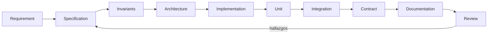

# Documentación de Empires Online

Índice maestro y punto de entrada único a la documentación técnica del MMORTS persistente **Empires Online**.

Este árbol `docs/` es el contrato escrito del proyecto. **Ya existe código**: el game server Go de
`services/game-server`, el paquete de protocolo `packages/protocol` y el cliente `apps/web` están
escritos y con sus tests unitarios en verde. La documentación describe por tanto dos cosas a la vez,
y la sección [5. Estado actual del proyecto](#5-estado-actual-del-proyecto) dice exactamente cuál es
cuál: lo ya implementado y verificado, y el **diseño objetivo** todavía no ejecutado. Cuando un
documento describa algo que aún no está construido, lo hace en presente de especificación ("el servidor
valida…"), y marca explícitamente como `Fuera de MVP` aquello que no entra en el primer vertical slice.

La fuente única de verdad de nombres (tablas, tipos de mensaje, códigos de error, variables de entorno,
constantes y valores por defecto) es el **canon técnico**. Si un documento contradice al canon, el canon
gana y el documento se corrige.

---

## 1. Árbol de documentación

```
docs/
├── README.md                  <- este archivo
├── product/                   Qué construimos y para quién
├── architecture/              Cómo está partido el sistema y por qué
├── specs/                     Contratos funcionales por sistema
├── invariants/                Verdades que nunca pueden romperse
├── database/                  Esquema, migraciones, índices, persistencia
├── operations/                Cómo se despliega, configura y opera
├── testing/                   Cómo se verifica todo lo anterior
├── decisions/                 ADRs: decisiones con fecha y consecuencias
└── roadmap/                   Orden de construcción y backlog
```

---

## 2. Índice por carpeta

### 2.1 `product/` — Producto

Define el juego antes que la máquina. Nadie debería escribir una spec sin haber leído esta carpeta.

| Documento | Contenido |
|---|---|
| [product/vision.md](product/vision.md) | Qué es Empires Online, para quién, qué experiencia entrega y qué explícitamente **no** es. |
| [product/game-pillars.md](product/game-pillars.md) | Los pilares de diseño y el sistema técnico concreto que sostiene cada uno. |
| [product/glossary.md](product/glossary.md) | Glosario canónico: todo término del dominio con definición precisa y enlace a su spec. |
| [product/mvp-scope.md](product/mvp-scope.md) | Scope exacto del primer vertical slice: tabla IN/OUT, flujo end-to-end y criterios de aceptación. |

### 2.2 `architecture/` — Arquitectura

Cómo se descompone el sistema, qué responsabilidad tiene cada pieza y dónde vive el estado.

| Documento | Contenido |
|---|---|
| [architecture/overview.md](architecture/overview.md) | Vista global: componentes, flujos principales y capas de estado (PostgreSQL / Redis / RAM). |
| [architecture/system-context.md](architecture/system-context.md) | Contexto C4 nivel 1: actores externos, sistemas vecinos y fronteras de confianza. |
| [architecture/frontend.md](architecture/frontend.md) | Cliente Next.js 15 + React 19 + PixiJS 8: render isométrico, interpolación visual, estado de UI. |
| [architecture/game-server.md](architecture/game-server.md) | Servicio Go autoritativo: paquetes internos, concurrencia, ciclo de vida del proceso. |
| [architecture/persistence.md](architecture/persistence.md) | Cómo se reparte el estado entre durable, caliente y reconstruible; workers de persistencia. |
| [architecture/networking.md](architecture/networking.md) | Capa WebSocket: sesiones, envelopes, secuencia, rate limiting, interest management por chunk. |
| [architecture/game-loop.md](architecture/game-loop.md) | Tick determinista a 10 Hz y su orden fijo de fases. |
| [architecture/pathfinding.md](architecture/pathfinding.md) | A\* sobre grid de 8 direcciones, heurística octile, límites y desempate determinista. |
| [architecture/scalability.md](architecture/scalability.md) | Límites conocidos del diseño de un solo proceso y las vías de crecimiento previstas. |

### 2.3 `specs/` — Especificaciones funcionales

Cada spec sigue la misma plantilla: Objetivo · Scope y no-scope · Actores · Inputs · Outputs ·
Reglas de negocio · Estados y transiciones · Errores · Invariantes · Persistencia · Eventos ·
Contratos de red · Tests esperados.

| Documento | Contenido |
|---|---|
| [specs/README.md](specs/README.md) | Plantilla obligatoria de spec y estado de cada especificación. |
| [specs/player.md](specs/player.md) | Alta de jugador, identidad, `Civilization` y `Global Faction` como ejes ortogonales. |
| [specs/city.md](specs/city.md) | Ciudad inicial, población, `population_limit` derivado de la era. |
| [specs/presence.md](specs/presence.md) | Máquina `ONLINE → OFFLINE_PENDING → PROTECTED` y protección offline. |
| [specs/unit.md](specs/unit.md) | Unidades, `units.status` y el tipo `VILLAGER` del MVP. |
| [specs/movement.md](specs/movement.md) | `unit.move`, polilínea temporizada, cancelación y recuperación tras crash. |
| [specs/safe-zones.md](specs/safe-zones.md) | `DENSE_FOREST` y `CAVERN`: seguridad calculada y validada por el servidor. |
| [specs/garrison.md](specs/garrison.md) | Guarnición de unidades en ciudad ajena condicionada a tratado `ACTIVE`. |
| [specs/territory.md](specs/territory.md) | Territorios rectangulares y control de territorio como tabla separada. |
| [specs/websocket-protocol.md](specs/websocket-protocol.md) | Protocolo v1 completo: envelopes, mensajes, errores, idempotencia y códigos de cierre. |

### 2.4 `invariants/` — Invariantes

Propiedades que el sistema garantiza en todo momento. Tienen ID estable y test asociado.
Una violación de invariante es un bug de severidad máxima, no una discusión de diseño.

| Documento | Contenido |
|---|---|
| [invariants/README.md](invariants/README.md) | Qué es un invariante aquí, cómo se numera y cómo se verifica. |
| [invariants/world.md](invariants/world.md) | `INV-WORLD-*`: límites del grid, chunks, determinismo del mapa. |
| [invariants/player.md](invariants/player.md) | `INV-PLAYER-*`: identidad, unicidad, civilización y facción. |
| [invariants/city.md](invariants/city.md) | `INV-CITY-*`: población, límite poblacional, estados de presencia. |
| [invariants/units.md](invariants/units.md) | `INV-UNIT-*`: ownership, estados válidos y transiciones legales. |
| [invariants/movement.md](invariants/movement.md) | `INV-MOVE-*`: como máximo un movimiento `ACTIVE` por unidad, monotonía de la polilínea. |
| [invariants/persistence.md](invariants/persistence.md) | `INV-PERSIST-*`: qué es durable, qué es reconstruible y qué nunca se pierde. |
| [invariants/security.md](invariants/security.md) | `INV-SEC-*`: autoridad del servidor, idempotencia, no confianza en el cliente. |
| [invariants/territory.md](invariants/territory.md) | `INV-TERR-*` e `INV-SAFE-*`: geometría de territorios, control de territorio y ocultamiento en zonas seguras. |
| [invariants/diplomacy.md](invariants/diplomacy.md) | `INV-GARR-*`: guarnición de unidades, autorización por tratado y visibilidad de la unidad guarnecida. |

### 2.5 `database/` — Base de datos

| Documento | Contenido |
|---|---|
| [database/schema.md](database/schema.md) | Tablas canónicas, columnas, tipos, `CHECK`s y relaciones. |
| [database/migrations.md](database/migrations.md) | Convención `NNNN_nombre.up.sql` / `.down.sql` y control vía `schema_migrations`. |
| [database/indexing.md](database/indexing.md) | Índices por patrón de acceso real (consultas por chunk, por owner, por estado). |
| [database/persistence-strategy.md](database/persistence-strategy.md) | Write-through inmediato, dirty-flag + flush y estado reconstruible. |

### 2.6 `operations/` — Operación

| Documento | Contenido |
|---|---|
| [operations/deployment.md](operations/deployment.md) | Artefactos, imágenes, orden de arranque y comprobaciones de salud. |
| [operations/local-development.md](operations/local-development.md) | Puesta en marcha en Windows 10 con pnpm scripts y Docker Compose (sin Makefile). |
| [operations/configuration.md](operations/configuration.md) | Todas las variables `EO_*`, su valor por defecto y su efecto. |
| [operations/backups.md](operations/backups.md) | Copias de PostgreSQL, política de retención y prueba de restauración. |
| [operations/monitoring.md](operations/monitoring.md) | Métricas Prometheus `eo_*`, logging estructurado y endpoints `/health` y `/ready`. |
| [operations/disaster-recovery.md](operations/disaster-recovery.md) | Reinicio del mundo tras caída: recuperación de movimientos y consistencia. |

### 2.7 `testing/` — Verificación

| Documento | Contenido |
|---|---|
| [testing/strategy.md](testing/strategy.md) | Pirámide de tests, gates de CI y criterio de "listo para merge". |
| [testing/unit-tests.md](testing/unit-tests.md) | Dominio puro con `Clock` y `RandomSource` falsos. |
| [testing/integration-tests.md](testing/integration-tests.md) | PostgreSQL y Redis reales vía Docker Compose, activados con `EO_INTEGRATION=1`. |
| [testing/contract-tests.md](testing/contract-tests.md) | Validación de mensajes contra el JSON Schema exportado por `@empires-online/protocol`. |
| [testing/simulation-tests.md](testing/simulation-tests.md) | Loop determinista con `FakeClock`: avanzar N segundos y asertar estado exacto. |
| [testing/load-tests.md](testing/load-tests.md) | Carga con k6. **Diferido**: no bloquea el MVP. |

### 2.8 `decisions/` — Registro de decisiones (ADR)

Un ADR es inmutable: no se edita, se supersede. Los títulos autorizados viven en el índice de la carpeta;
si esta tabla y ese índice difieren, manda [decisions/README.md](decisions/README.md). Son doce, del 001
al 012, y el nombre de fichero es siempre `ADR-NNN-slug-en-ingles.md`. No hay ADR para el monorepo pnpm,
para el determinismo con `Clock`/`RandomSource`, para el *interest management* por chunk ni para la
elección de A\*: son decisiones del canon y de `architecture/`, no del registro.

| Documento | Contenido |
|---|---|
| [decisions/README.md](decisions/README.md) | Índice, formato y estado (`Propuesto` / `Aceptado` / `Sustituido por ADR-NNN` / `Rechazado`) de cada ADR. |
| [decisions/ADR-001-game-server-language.md](decisions/ADR-001-game-server-language.md) | Go 1.23 como lenguaje del game server autoritativo, y el coste de mantener dos lenguajes. |
| [decisions/ADR-002-authoritative-server.md](decisions/ADR-002-authoritative-server.md) | Servidor autoritativo: el cliente envía intención, nunca estado, y no hay zonas de confianza. |
| [decisions/ADR-003-postgresql-source-of-truth.md](decisions/ADR-003-postgresql-source-of-truth.md) | PostgreSQL como único almacén durable; sus `CHECK` e índices parciales son parte del dominio. |
| [decisions/ADR-004-redis-hot-state.md](decisions/ADR-004-redis-hot-state.md) | Redis solo para estado caliente y transitorio; perderlo entero nunca pierde estado durable. |
| [decisions/ADR-005-pixijs-renderer.md](decisions/ADR-005-pixijs-renderer.md) | PixiJS 8 como renderer del mundo isométrico, con su ciclo de vida fuera del árbol de React. |
| [decisions/ADR-006-websocket-protocol.md](decisions/ADR-006-websocket-protocol.md) | WSS con JSON UTF-8 y `"v": 1` explícito, más el criterio medible para migrar a binario. |
| [decisions/ADR-007-game-loop-frequency.md](decisions/ADR-007-game-loop-frequency.md) | Game loop de tick fijo a 10 Hz (`EO_TICK_RATE_HZ`) y política ante un tick que se pasa de tiempo. |
| [decisions/ADR-008-grid-coordinate-system.md](decisions/ADR-008-grid-coordinate-system.md) | Grid cartesiano de enteros, chunks de 32×32 y vecindad de 8 sin corner cutting. |
| [decisions/ADR-009-shared-protocol-package.md](decisions/ADR-009-shared-protocol-package.md) | Zod como fuente de verdad del protocolo, JSON Schema exportado y embebido en Go con `go:embed`. |
| [decisions/ADR-010-authentication-game-ticket.md](decisions/ADR-010-authentication-game-ticket.md) | Autenticación por *game ticket* JWT de 60 s consumible una sola vez mediante `jti` en Redis. |
| [decisions/ADR-011-movement-timed-polyline.md](decisions/ADR-011-movement-timed-polyline.md) | Movimiento persistido como polilínea temporizada en lugar de replay de ticks. |
| [decisions/ADR-012-database-migrations.md](decisions/ADR-012-database-migrations.md) | Migraciones SQL versionadas con golang-migrate, embebidas en el binario del game server. |

### 2.9 `roadmap/` — Plan

| Documento | Contenido |
|---|---|
| [roadmap/roadmap.md](roadmap/roadmap.md) | Secuencia M0…M7 y lo que viene después del vertical slice. |
| [roadmap/milestones.md](roadmap/milestones.md) | Cada milestone con su criterio de salida verificable. |
| [roadmap/backlog.md](roadmap/backlog.md) | Ideas aceptadas pero no planificadas, con su razón de espera. |

---

## 3. Cómo leer esta documentación

La documentación está ordenada de intención a implementación. Leerla en orden inverso produce
decisiones sin contexto.

**Ruta corta (primer día, ~60 minutos).**

1. [product/vision.md](product/vision.md) — qué juego es.
2. [product/game-pillars.md](product/game-pillars.md) — qué restricciones impone ese juego a la ingeniería.
3. [product/mvp-scope.md](product/mvp-scope.md) — qué se construye primero y qué no.
4. [architecture/overview.md](architecture/overview.md) — cómo se reparte el trabajo entre procesos.
5. [product/glossary.md](product/glossary.md) — usar como referencia permanente, no como lectura lineal.

**Ruta por rol.**

| Rol | Orden recomendado |
|---|---|
| Backend / gameplay (Go) | `architecture/game-server.md` → `architecture/game-loop.md` → `specs/movement.md` → `architecture/pathfinding.md` → `invariants/movement.md` → `database/persistence-strategy.md` |
| Frontend (Next.js + PixiJS) | `architecture/frontend.md` → `specs/websocket-protocol.md` → `architecture/networking.md` → `product/glossary.md` (entradas *Isometric Projection*, *Render Position*, *Delta*) |
| Base de datos | `database/schema.md` → `database/migrations.md` → `database/indexing.md` → `invariants/persistence.md` |
| Operaciones | `operations/local-development.md` → `operations/configuration.md` → `operations/monitoring.md` → `operations/disaster-recovery.md` |
| Nuevo en el proyecto, sin rol asignado | Ruta corta completa, después `specs/README.md` y `invariants/README.md` |

**Reglas de lectura.**

- Si una spec y un invariante se contradicen, el invariante manda y la spec es un bug documental.
- Si un documento y el canon técnico se contradicen, el canon manda.
- Un documento sin la marca `Fuera de MVP` describe algo que el vertical slice debe entregar.
  No hay tercera categoría implícita.
- Los identificadores (tablas, tipos de mensaje, códigos de error, variables `EO_*`) se escriben
  siempre en inglés y exactamente como figuran en el canon. La prosa va en español.

---

## 4. Metodología: Spec-Driven Development

Ninguna funcionalidad empieza por código. El ciclo es obligatorio y se recorre entero, en orden,
para cada unidad de trabajo (típicamente una spec o una parte acotada de ella).



| Paso | Qué produce | Dónde vive |
|---|---|---|
| **Requirement** | El problema de producto en una frase verificable, atado a un pilar. | `product/`, `roadmap/backlog.md` |
| **Specification** | Objetivo, scope y no-scope, actores, inputs, outputs, reglas, estados, errores, eventos, contratos de red, tests esperados. | `specs/*.md` |
| **Invariants** | Las propiedades que no pueden romperse, con ID estable (`INV-MOVE-001`…). | `invariants/*.md` |
| **Architecture** | Componentes afectados, ubicación del estado, y ADR si la decisión es estructural o difícil de revertir. | `architecture/*.md`, `decisions/ADR-*.md` |
| **Implementation** | Código en `services/game-server`, `apps/web` o `packages/protocol` que respeta lo anterior. | Repositorio |
| **Unit** | Tests de dominio puro, con `Clock` y `RandomSource` inyectados; sin red ni base de datos. | `testing/unit-tests.md` |
| **Integration** | Tests contra PostgreSQL y Redis reales vía Docker Compose (`EO_INTEGRATION=1`). | `testing/integration-tests.md` |
| **Contract** | Mensajes validados contra el JSON Schema exportado desde los esquemas Zod del protocolo. | `testing/contract-tests.md` |
| **Documentation** | Actualización de la spec, del glosario y de los invariantes afectados. | `docs/` |
| **Review** | Revisión humana contra la Definition of Done. Los hallazgos vuelven a *Specification*, no al código directamente. | Pull request |

El paso *Architecture* corresponde al paso *Design* del canon: son el mismo paso con dos nombres.
Los niveles **simulation**, **recovery** y **load** de la estrategia de pruebas se enganchan tras
*Integration*; `load` está diferido y no bloquea el MVP.

### 4.1 Definition of Done

Una unidad de trabajo está terminada solo si cumple **todos** estos puntos. No hay "casi terminado":

- [ ] Spec escrita y actualizada.
- [ ] Invariantes declarados, con ID estable.
- [ ] ADR redactado, si la decisión lo amerita.
- [ ] Implementación completa.
- [ ] Tests **unit**.
- [ ] Tests **integration**.
- [ ] Tests **contract**.
- [ ] Errores testeados (cada código de error alcanzable tiene su test).
- [ ] Documentación actualizada.
- [ ] Logs y métricas emitidos.
- [ ] CI en verde.
- [ ] Sin violaciones de invariantes.

Un pull request con cualquier check obligatorio en rojo no es válido, independientemente de la urgencia.

---

## 5. Estado actual del proyecto

Esta sección existe para que nadie confunda una spec con un hecho. Se actualiza cuando cambia el
código, no cuando cambia la intención. Fecha de la última verificación: **2026-09-09**.

### 5.1 Implementado y con tests en verde

Verificado ejecutando las suites, no por lectura del código.

| Área | Qué hay | Verificación |
|---|---|---|
| `packages/protocol` | Esquemas Zod del protocolo v1, exportación a JSON Schema (`schema/v1/`) y catálogo de códigos de error. | 18 tests Vitest en verde. |
| `services/game-server` — mundo y pathfinding | `internal/game/world` (grid, chunks, costes de terreno, overlay de ocupación, generador determinista) y `internal/pathfinding` (A\* de 8 direcciones sin corner cutting). | `go test ./...` en verde. |
| `services/game-server` — dominio | `internal/domain/movement` (polilínea temporizada, `PositionAt`), `internal/domain/city` (autómata de presencia y protección). | `go test ./...` en verde. |
| `services/game-server` — bordes | `internal/auth` (game ticket), `internal/config` (validaciones cruzadas), `internal/protocol` (contract tests Go ↔ TypeScript), `internal/websocket`, `internal/persistence/memory`. | `go test ./...` en verde. |
| `services/game-server` — simulación | `internal/game/simulation`: vertical slice completo, reemplazo y cancelación de órdenes, rechazos, presencia y protección, recuperación tras caída, reproducibilidad, snapshots. | `go test ./...` en verde. |
| Esquema de datos | Migraciones `000001_initial_schema` y `000002_seed_catalogs`, embebidas con `go:embed` y aplicadas con golang-migrate ([ADR-012](decisions/ADR-012-database-migrations.md)). | Compila y embebe; su aplicación real depende de PostgreSQL (ver 5.2). |
| `apps/web` | Cliente Next.js 15 + React 19 + PixiJS 8: proyección isométrica, interpolación visual, estado del mundo y cliente WebSocket. | 58 tests Vitest en verde. |

`go build ./...` y `go vet ./...` están limpios sobre `services/game-server`. El toolchain instalado
es Go 1.27.0; `go.mod` declara `go 1.23` como versión **mínima**.

Dos matices que conviene no maquillar:

- **El alta de jugador la sirve hoy el game server.** `POST /api/auth/register` y `POST /api/auth/login`
  viven en `internal/httpapi` con bcrypt. Es provisional y explícitamente contrario a la arquitectura
  objetivo de [ADR-010](decisions/ADR-010-authentication-game-ticket.md), que los traslada a Next.js.
- **Hay paquetes sin test propio**: `internal/clock`, `internal/domain/player`, `internal/domain/unit`,
  `internal/game/founding`, `internal/game/loop`, `internal/httpapi` y `internal/observability`.
  Están ejercitados indirectamente desde `internal/game/simulation`, pero eso no es lo mismo que
  estar cubiertos. `internal/persistence/postgres` e `internal/persistence/redis` sí tienen tests,
  pero todos detrás de la etiqueta de compilación `integration` (ver 5.2).

### 5.2 Diseñado y escrito, pero no ejecutado

| Área | Qué falta para poder afirmarlo |
|---|---|
| Tests de integración (`//go:build integration`) contra PostgreSQL y Redis reales | El daemon de Docker Desktop no arrancó en esta máquina. Los tests existen en `internal/persistence/postgres` y `internal/persistence/redis`; **no se han ejecutado nunca**. Ver [testing/integration-tests.md](testing/integration-tests.md). |
| Aplicación real de las migraciones y del bootstrap de jugador | Depende de lo anterior: sin PostgreSQL en marcha no hay prueba de que el DDL y la transacción de alta funcionen contra el motor. |
| Recorrido end-to-end cliente ↔ servidor | `apps/web` y `services/game-server` están probados por separado; nadie ha conectado el uno al otro con un mundo vivo detrás. |
| CI | `.github/workflows/ci.yml` está escrito (docs, protocolo, Go, integración) y `scripts/check-docs.mjs` existe, pero el repositorio no tiene todavía una ejecución observada en verde. |

### 5.3 Entidades creadas y mecánica diferida

Las tablas `territories`, `territory_control`, `safe_zones`, `treaties` y `garrisons` existen desde la
migración `000001`, con sus constraints aplicadas, pero **ninguna ruta de código Go las lee ni las
escribe**. Es deliberado: crear la entidad ahora y diferir la mecánica evita una migración destructiva
más adelante. En el protocolo, `territory.update` y el campo `territories[]` de `world.snapshot` están
declarados y nada los emite todavía. La única parte viva es el estado `GARRISONED` de `units.status`,
que rechaza órdenes de movimiento con `UNIT_GARRISONED`. El detalle, invariante por invariante, está en
[invariants/territory.md](invariants/territory.md) y [invariants/diplomacy.md](invariants/diplomacy.md).

Fuera de MVP y sin código: combate, recursos, construcción, progresión de eras más allá de las semillas
del catálogo, y los tests de carga con k6 de [testing/load-tests.md](testing/load-tests.md).

---

## 6. Entorno de trabajo asumido

La documentación operativa asume el entorno real de desarrollo, no uno ideal:

| Elemento | Estado |
|---|---|
| Sistema operativo | Windows 10 Pro, PowerShell + Git Bash |
| Node.js | v22.17.1 |
| pnpm | 10.25.0 |
| git | 2.38.1 |
| Docker CLI / Compose | 20.10.22 / v2.15.1 (el daemon debe iniciarse manualmente; hoy **no arranca**) |
| Go | **1.27.0 instalado** en `C:\Program Files\Go`. `go.mod` declara `go 1.23` como versión mínima |
| psql, redis-cli, make, gh | **No instalados** |
| Task runner | **pnpm scripts** (`pnpm run db:up`, `pnpm run server:test`…). No hay Makefile |

Consecuencia práctica: el acceso a PostgreSQL y Redis en local se hace mediante
`docker compose exec`, y los tests de integración exigen Docker Desktop iniciado.
Los detalles están en [operations/local-development.md](operations/local-development.md).
