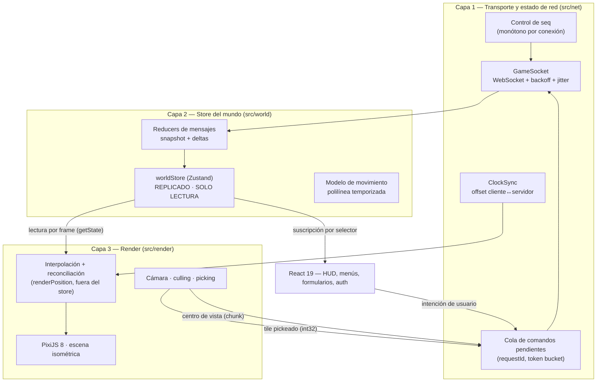

# Arquitectura del cliente (apps/web)

Propósito: definir el diseño objetivo del cliente de **Empires Online** —Next.js 15 (App Router) + React 19 + TypeScript + PixiJS 8— y en particular la separación estricta entre transporte de red, estado replicado del mundo y capa de render, así como el tratamiento del tiempo, la interpolación y las transformaciones de coordenadas.

> **Estado: `apps/web` NO existe todavía.** No hay ni un fichero del cliente escrito: ni el proyecto de
> Next.js, ni `src/net`, ni `src/world`, ni `src/render`. Todo lo que sigue está redactado como diseño
> objetivo —lo que **se implementará**— y queda pendiente del milestone del cliente en
> [`../roadmap/milestones.md`](../roadmap/milestones.md). Nada de este documento debe leerse como
> descripción de código existente.
>
> Lo que sí existe y condiciona este diseño es el otro extremo del cable: el Game Server en Go, con su
> protocolo v1 y su paquete compartido `@empires-online/protocol` (Zod + JSON Schema), ambos
> implementados y con tests en verde.

Documentos relacionados: [`./game-loop.md`](./game-loop.md) · [`./overview.md`](./overview.md) · [`../specs/websocket-protocol.md`](../specs/websocket-protocol.md) · [`../specs/movement.md`](../specs/movement.md) · [`../specs/player.md`](../specs/player.md) · [`../testing/strategy.md`](../testing/strategy.md)

---

## 1. Principio rector

El cliente es un **terminal de observación e intención**. Envía intenciones (`unit.move`, `unit.cancel_move`, `session.view`) y renderiza una réplica de solo lectura de la verdad que emite el Game Server en Go. No calcula posiciones finales, ni HP, ni recursos, ni resultados de combate, ni ETAs, ni paths: *client sends intent, server determines truth*.

La única cosa que el cliente calcula por su cuenta y que el servidor no conoce son **píxeles**. El servidor jamás maneja píxeles; la proyección isométrica es responsabilidad exclusiva del cliente.

Corolario operativo: cualquier función del cliente que produzca un número que después se envíe al servidor debe producir **coordenadas de mundo en tiles enteros** (`int32`), nunca píxeles.

---

## 2. Las tres capas



Reglas de dependencia, verificadas en revisión de código:

| Capa | Puede importar de | **No** puede importar de |
|---|---|---|
| `src/net` | `@empires-online/protocol`, `src/lib` | `src/world`, `src/render`, `src/ui` |
| `src/world` | `src/net` (tipos), `@empires-online/protocol` | `src/render`, `pixi.js`, cualquier API de DOM |
| `src/render` | `src/world` (lectura), `pixi.js` | `src/net` (nunca envía directamente), `src/ui` |
| `src/ui` (React) | `src/world`, `src/net` (fachada de comandos) | internals de `src/render` |

La capa 2 no conoce píxeles. La capa 3 no conoce WebSockets. La capa 1 no conoce ni tiles ni sprites: solo *envelopes*.

---

## 3. Capa 1 — Transporte y estado de red

### 3.1 Envelopes y versión

El cliente habla **protocolo WebSocket v1** sobre WSS, JSON UTF-8, con `"v": 1` explícito en cada mensaje.

- Cliente → servidor: `{ v, type, requestId, payload }`, con `requestId` = UUIDv4 obligatorio en comandos.
- Servidor → cliente: `{ v, type, seq, ts, requestId?, payload }`, con `seq` = uint64 monótono **por conexión** y `ts` = epoch ms del servidor.

Tipos que el cliente **emite** en v1: `session.hello`, `session.ping`, `session.view`, `unit.move`, `unit.cancel_move`. Tipos que el cliente **consume**: `session.welcome`, `session.pong`, `system.error`, `world.snapshot`, `entity.spawn`, `entity.update`, `entity.despawn`, `city.update`, `territory.update`, `unit.move.accepted`, `unit.move.rejected`, `unit.movement.started`, `unit.movement.completed`, `unit.movement.cancelled`. Cualquier `type` desconocido se registra y se descarta sin romper la sesión (compatibilidad hacia adelante).

Los tipos TypeScript y los validadores se importan de `@empires-online/protocol` (Zod es la fuente de verdad del protocolo). El cliente validará con Zod **todo** mensaje entrante en desarrollo (`process.env.NODE_ENV !== 'production'`); en producción validará solo el envelope y confiará en el `type` para el *narrowing*, porque el coste de validar un `world.snapshot` completo por conexión es medible. Las variables `EO_*` son del servidor y **no** llegan al navegador.

Asimetría del protocolo que el cliente debe conocer, porque está implementada así en los esquemas: los mensajes **cliente→servidor son estrictos** (`additionalProperties: false`; un campo de más se rechaza), mientras que los **servidor→cliente no lo son**, para poder añadir campos opcionales sin romper clientes antiguos. Por eso descartar un `type` desconocido es seguro, pero enviar un campo extra no lo es.

### 3.2 Handshake

1. React pide un **game ticket** (JWT HS256, TTL **60 s**, `aud: "game-server"`). El ticket es de un solo uso: su `jti` se consume en Redis del lado servidor.
2. `GameSocket` abre `<ws|wss>://<host>/ws`.
3. Primer mensaje, **antes de 5 s** o el servidor cierra con `4408`: `session.hello { ticket }`.
4. El servidor responde `session.welcome` con `{ sessionId, playerId, serverTimeMs, tickDurationMs, heartbeatIntervalMs, world: { width, height, chunkSize } }`; a partir de ahí llega `world.snapshot` y luego deltas.

Consecuencia de diseño: **el ticket nunca se cachea**. Con TTL de 60 s, cada intento de (re)conexión pide un ticket nuevo. Un reintento de reconexión es siempre `fetch ticket → open socket → session.hello`.

> **De dónde sale hoy el ticket.** [ADR-010](../decisions/ADR-010-authentication-game-ticket.md) sitúa la emisión en una API route de Next.js, y así se describe en el resto de este documento. Pero, aunque `apps/web` ya existe, quien emite el ticket **hoy** sigue siendo el propio Game Server: `POST /api/auth/register` y `POST /api/auth/login` de `internal/httpapi` responden con el ticket ya firmado. Cuando exista el cliente, tendrá que decidirse si esas rutas se trasladan a Next.js (arquitectura objetivo) o si el cliente sigue llamándolas en el Game Server durante el MVP. Hasta entonces, el diseño del cliente es indiferente al emisor: pide un ticket a un endpoint HTTP y lo presenta en `session.hello`.

### 3.3 Reconexión: backoff exponencial con jitter

Los parámetros de reconexión son constantes del cliente en `src/net/backoff.ts`. **No son valores de gameplay** y por tanto no pertenecen a la superficie de configuración `EO_*`; se eligen anclados a constantes reales del servidor:

| Constante | Valor | Justificación |
|---|---|---|
| `RECONNECT_BASE_MS` | 250 | Suficientemente rápido para que varios intentos quepan dentro de la ventana de gracia de presencia. |
| `RECONNECT_FACTOR` | 2 | Backoff exponencial clásico. |
| `RECONNECT_MAX_MS` | 15000 | Igual al intervalo de ping del servidor (15 s): no tiene sentido reintentar más lento que el latido del transporte. |
| `PRESENCE_GRACE_MS` | 30000 | Espejo de `EO_PRESENCE_TTL_SECONDS = 30`. Reconectar dentro de esta ventana evita la transición a `OFFLINE_PENDING`. |

Retardo del intento `n` (0-indexado), **full jitter**:

```ts
const delayMs = Math.random() * Math.min(
  RECONNECT_MAX_MS,
  RECONNECT_BASE_MS * Math.pow(RECONNECT_FACTOR, attempt),
);
```

El jitter completo (uniforme en `[0, cap]`, no `cap/2 + rand`) es deliberado: evita el *thundering herd* de miles de clientes reconectando en fase tras un reinicio del Game Server.

Política por código de cierre:

| Código | Significado | Acción del cliente |
|---|---|---|
| `1000` / `1001` | Cierre normal / navegación | No reconectar si el cierre lo inició el cliente. |
| `1006` | Cierre anómalo (red) | Reconectar con backoff. |
| `4400` | Mensaje inválido | Bug del cliente. Log en `error`, un solo reintento, y reporte en HUD. |
| `4401` | No autenticado | Ticket expirado o inválido: pedir ticket nuevo y reintentar. Dos fallos seguidos → volver al flujo de login. |
| `4403` | No autorizado | **No** reconectar. Estado terminal, mensaje explícito al usuario. |
| `4408` | Timeout de handshake | Reconectar con backoff (probable ticket llegado tarde). |
| `4429` | Rate limited | Reconectar arrancando el backoff ya en `RECONNECT_MAX_MS`. Indica bug de emisión en el cliente: el servidor **cierra en cuanto se agota el bucket**, sin tolerancia progresiva. Log en `warn`. |
| `4500` | Error interno del servidor | Reconectar con backoff. Causa más probable: **la cola de salida de la sesión se llenó** porque el cliente no consumía al ritmo del servidor (`EO_WS_OUTBOUND_QUEUE_SIZE`, 256 mensajes). Si se repite, el problema es de rendimiento del cliente, no de red. |

Al reconectar, `seq` **se reinicia** (es monótono por conexión, no por jugador): `lastSeq` vuelve a `null` y el store se reemplaza íntegramente con el `world.snapshot` de la nueva sesión.

### 3.4 Control de `seq` y detección de huecos

`seq` es monótono creciente por conexión. Como el transporte es TCP/WSS ordenado, un hueco (`seq !== lastSeq + 1n`) no puede deberse a reordenamiento: significa pérdida real de un delta. Un cliente que sigue aplicando deltas sobre un estado con un hueco diverge silenciosamente, que es el peor fallo posible en un sistema autoritativo.

Política MVP: **ante un hueco, resincronizar por reconexión**. El protocolo v1 no define un mensaje de resincronización; el único mecanismo que produce un `world.snapshot` es abrir una sesión. Por tanto el cliente cierra el socket con `1000`, limpia el store y ejecuta el flujo de reconexión inmediatamente (sin backoff en el primer intento, porque no es un fallo de red). El evento se cuenta y se registra: un hueco recurrente es un bug de servidor que debe verse.

Se usa `bigint` para `seq`, no `number`: es `uint64` en el protocolo (`seq` monótono por conexión) y `Number.MAX_SAFE_INTEGER` no lo cubre.

### 3.5 Cola de comandos pendientes y `requestId`

`PendingCommands` cumple tres funciones:

1. **Correlación.** Cada comando se guarda por `requestId` con su `type`, `payload`, `createdAtMs` y `sentAtMs`. Las respuestas correlacionadas (`unit.move.accepted`, `unit.move.rejected`, `system.error` con `requestId`) resuelven la entrada. Las respuestas del servidor sin `requestId` son deltas de mundo y no tocan la cola.
2. **Idempotencia en reintentos.** Un comando reenviado tras una reconexión conserva **el mismo `requestId`**. El servidor reserva ese `requestId` en Redis con `SETNX` y TTL 300 s antes de ejecutar; si ya estaba reservado, **descarta el duplicado en silencio** (lo registra, no lo re-ejecuta y **no reemite la respuesta original**). Generar un `requestId` nuevo al reintentar sería un bug: duplicaría órdenes. La contrapartida que el cliente debe asumir: un reenvío idempotente puede no recibir respuesta alguna, así que la entrada de la cola debe caducar por tiempo, no esperar indefinidamente una confirmación. Y si Redis no responde, el servidor **ejecuta igualmente** el comando: prefiere jugar a bloquear al jugador.
3. **Respeto del rate limit.** El cliente mantiene su propio *token bucket* de **20 msg/s con burst 40**, espejo de `EO_WS_RATE_LIMIT_PER_SECOND` / `EO_WS_RATE_LIMIT_BURST`. Nunca debe provocar un cierre `4429`: si el bucket está vacío, el comando espera en la cola. Igualmente, antes de enviar se comprueba que el JSON serializado no supere **16384 bytes** (`EO_WS_MAX_MESSAGE_BYTES`); un comando que lo supere se rechaza localmente como bug, no se envía.

Reglas de caducidad, distinguiendo dos situaciones:

- **Comandos en vuelo** (ya enviados, sin respuesta cuando cayó el socket): se reenvían tras `session.welcome`, con el mismo `requestId`. Es seguro y necesario: puede que el servidor los ejecutara y perdiéramos la respuesta.
- **Comandos creados con el socket caído**: se encolan y se envían al reconectar **solo si** la reconexión completa dentro de `PRESENCE_GRACE_MS` (30 s). Pasada esa ventana, una orden de movimiento emitida hace medio minuto ya no representa la intención del jugador: se descarta y el HUD lo informa. El invariante "una unidad tiene como máximo un movimiento `ACTIVE`, y una nueva orden cancela la anterior" hace que reproducir órdenes rancias sea semánticamente válido pero jugablemente sorprendente; se prefiere descartar.

Tamaño máximo de la cola: 64 entradas. Al desbordar se descarta la más antigua y se registra en `warn`.

### 3.6 Errores

`system.error` llega con `{ code, message, requestId?, details? }`. **La lógica del cliente conmuta siempre sobre `code`, nunca sobre `message`.** El texto humano es para el log y, traducido, para el HUD.

Mapeo de códigos a comportamiento de UI. Son los **22 códigos** del catálogo cerrado que exporta `@empires-online/protocol` y que un contract test en Go verifica contra `internal/protocol/codes.go`:

| Grupo | Códigos | Tratamiento |
|---|---|---|
| Sesión | `UNAUTHORIZED`, `FORBIDDEN` | Terminal: cerrar sesión de juego, volver a login. |
| Protocolo | `INVALID_MESSAGE`, `UNSUPPORTED_VERSION`, `MESSAGE_TOO_LARGE` | Bug del cliente: log `error`, banner de "versión incompatible" para `UNSUPPORTED_VERSION`. |
| Presión | `RATE_LIMITED` | Frenar emisión, no reintentar en bucle. |
| Orden de movimiento | `UNIT_NOT_FOUND`, `UNIT_NOT_OWNED`, `UNIT_NOT_MOVABLE`, `UNIT_DEAD`, `UNIT_GARRISONED`, `INVALID_TARGET`, `TARGET_OUT_OF_BOUNDS`, `TARGET_NOT_WALKABLE`, `PATH_NOT_FOUND`, `PATH_TOO_LONG` | Feedback puntual sobre el cursor/tile; revertir cualquier indicación optimista de la UI. |
| Dominio | `CITY_NOT_FOUND`, `CITY_PROTECTED`, `TREATY_REQUIRED`, `POPULATION_LIMIT_REACHED` | Mensaje contextual en el panel correspondiente. |
| Genéricos | `INTERNAL_ERROR`, `NOT_IMPLEMENTED` | Toast genérico; `NOT_IMPLEMENTED` además oculta el control que lo provocó. |

### 3.7 Sincronización de reloj

Todo instante del dominio viaja en **epoch milliseconds del servidor**: el `ts` del envelope, el `start_time_ms` y el `arrival_time_ms` de los movimientos, los `tMs` de la polilínea. El reloj de pared del cliente (`Date.now()`) puede estar desviado minutos y además salta (ajustes NTP, suspensión). Interpolar contra él produce unidades que van adelantadas o atrasadas de forma permanente.

`ClockSync` mantiene un **offset estimado** entre el reloj monótono local y el reloj del servidor:

```ts
// t0: monotónico local al enviar session.ping
// t1: envelope.ts del session.pong (epoch ms del servidor)
// t2: monotónico local al recibir
const rttMs    = t2 - t0;
const offsetMs = t1 - (t0 + t2) / 2;   // estimador NTP simple
```

- Base monotónica: `performance.timeOrigin + performance.now()`, no `Date.now()`. Así el offset no salta si el usuario cambia la hora del sistema.
- Se mantiene una ventana deslizante de 8 muestras y se adopta el `offsetMs` de la muestra con **RTT mínimo** (el mínimo RTT es el menos contaminado por encolado). Ese valor se aplica con suavizado exponencial para no producir saltos visuales.
- Frecuencia de muestreo: `session.ping` cada **15 s**, alineado con el ping del transporte; ráfaga de 3 pings al arrancar la sesión para converger rápido.
- Cada mensaje servidor→cliente lleva `ts`, así que además se usa como límite inferior: `serverNow()` nunca puede quedar por detrás del `ts` del último mensaje recibido.

API expuesta a la capa de render:

```ts
interface ClockSync {
  serverNowMs(): number;  // epoch ms del servidor, estimado, monótono
  rttMs(): number;
  offsetMs(): number;
  quality(): 'UNSYNCED' | 'COARSE' | 'GOOD';
}
```

Mientras `quality() === 'UNSYNCED'` (antes del primer `session.pong`), el render dibuja las unidades en su `authoritativePosition` discreta, sin interpolar. Interpolar con un offset desconocido es peor que no interpolar.

---

## 4. Capa 2 — Store del mundo

### 4.1 Naturaleza del store

`worldStore` (Zustand) contiene **estado autoritativo replicado y de solo lectura**. Su única vía de escritura es el reductor que consume mensajes del servidor:

```ts
// src/world/worldStore.ts
export const useWorldStore = create<WorldState>()(/* ... */);

// ÚNICA función que muta el store. No se exportan setters granulares.
export function applyServerMessage(msg: ServerEnvelope): void;
export function resetWorld(reason: ResetReason): void;   // reconexión / hueco de seq
```

No existe `setUnitPosition`, ni `moveUnitLocally`, ni ninguna forma de predicción del lado cliente que escriba estado del mundo. El MVP **no hace predicción de movimiento**: al pulsar sobre un tile no se mueve nada hasta que llega `unit.move.accepted` + `unit.movement.started`. Con `baseMsPerTile = 600 ms` para `VILLAGER` y un tick de 100 ms, la latencia percibida de arranque es aceptable y evita toda la complejidad de rollback. Predicción optimista: **Fuera de MVP**.

El estado *de interfaz* (selección de unidades, panel abierto, hover) vive en un store distinto, `uiStore`. Mezclarlos haría imposible el `resetWorld` limpio de la reconexión.

### 4.2 Forma del estado

Los identificadores siguen los tipos del paquete de protocolo: `EntityId` es un **entero positivo** (`number`, acotado a `Number.MAX_SAFE_INTEGER`) para unidades, ciudades, movimientos y territorios; `Uuid` es un **string** y se usa para `playerId` y `sessionId`. No hay ids de entidad como cadena.

```ts
type UnitStatus = 'IDLE' | 'MOVING' | 'GARRISONED' | 'HIDDEN' | 'DEAD';

type EntityId = number;   // entero >= 1
type Uuid = string;

interface Waypoint { readonly x: number; readonly y: number; readonly tMs: number }

interface ActiveMovement {
  readonly movementId: EntityId;
  readonly startTimeMs: number;    // epoch ms del servidor
  readonly arrivalTimeMs: number;  // epoch ms del servidor
  readonly waypoints: readonly Waypoint[];  // [0] = origen con tMs = 0
}

interface UnitState {
  readonly id: EntityId;
  readonly ownerId: Uuid;
  readonly unitType: 'VILLAGER';
  readonly status: UnitStatus;
  readonly hp: number;
  /** Verdad del servidor: tile entero. Nunca se escribe desde el render. */
  readonly authoritativePosition: { readonly x: number; readonly y: number };
  readonly movement: ActiveMovement | null;
}

interface WorldState {
  readonly connection: {
    status: 'IDLE' | 'AUTHENTICATING' | 'CONNECTING' | 'HANDSHAKING' | 'READY' | 'RECONNECTING' | 'FATAL';
    attempt: number;
    lastSeq: bigint | null;
    lastCloseCode: number | null;
  };
  readonly self: { sessionId: Uuid; playerId: Uuid; cityId: EntityId | null } | null;
  readonly world: { width: number; height: number; chunkSize: number } | null;  // de session.welcome
  readonly units: ReadonlyMap<EntityId, UnitState>;
  readonly cities: ReadonlyMap<EntityId, CityState>;        // incluye presenceState
  readonly territories: ReadonlyMap<EntityId, TerritoryState>;
  readonly chunks: ReadonlyMap<number, ChunkTerrain>;       // clave = chunkId
  readonly view: { centerX: number; centerY: number };      // tiles, no píxeles
}
```

`ChunkTerrain` guarda los **1024 bytes** de un chunk 32×32, con `TerrainType` como `uint8` (`GRASSLAND` 0, `FOREST` 1, `HILL` 2, `MOUNTAIN` 3, `WATER` 4, `ROAD` 5). Disposición fila-mayor; índice dentro del chunk: `(y % chunkSize) * chunkSize + (x % chunkSize)`. Identificación: `chunkX = x / chunkSize`, `chunkY = y / chunkSize`, `chunkId = chunkY * chunksPerRow + chunkX`, con `chunksPerRow = width / chunkSize = 16` en la configuración por defecto (512 / 32), 256 chunks en total. El `chunkSize`, el ancho y el alto llegan en `session.welcome.payload.world`: el cliente **no** los codifica como constantes ni asume desplazamientos de bits sobre 32.

**Cómo llega el terreno, con exactitud.** El protocolo v1 sí transporta terreno: `world.snapshot.payload` es `{ serverTimeMs, tick, chunks[], terrain[], units[], cities[], territories[] }`, y cada entrada de `terrain[]` lleva sus `chunkSize*chunkSize` bytes **codificados en base64**. Dos consecuencias para el cliente:

- El terreno de un chunk se envía **una sola vez por sesión**. El servidor recuerda qué chunks ya lo recibieron (`NeedsTerrain` / `MarkTerrainSent`) y los filtra de los snapshots siguientes, porque el terreno es inmutable. Por tanto un `world.snapshot` posterior puede traer `terrain: []` y eso **no** significa que el terreno haya desaparecido: el reducer debe **conservar** los `ChunkTerrain` ya conocidos y reemplazar solo entidades. Es la única excepción a la regla "un snapshot reemplaza" de §4.3.
- Tras una reconexión el servidor no recuerda nada, así que el primer snapshot de la nueva sesión vuelve a traer todo el terreno del área. Como `resetWorld` vacía los chunks, el cliente queda coherente sin trabajo extra.

Volumen: con `EO_INTEREST_RADIUS_CHUNKS = 2` el área son 5×5 = 25 chunks = 25 600 bytes en crudo, unos 34 KB en base64. Eso excede `EO_WS_MAX_MESSAGE_BYTES` (16384), pero ese límite se aplica a los mensajes **entrantes** al servidor, no a los que él emite, así que el snapshot inicial viaja entero. El diseño del cliente es en cualquier caso independiente del troceado: `ChunkTerrain` se llena chunk a chunk y el render reacciona a cada chunk completo que llega. Ver [`../specs/websocket-protocol.md`](../specs/websocket-protocol.md).

### 4.3 Reducers

Un reducer puro por familia de mensajes, todos con firma `(state, payload, envelope) => state`:

| Mensaje | Efecto sobre el store |
|---|---|
| `session.welcome` | Fija `self` (`sessionId`, `playerId`), guarda `tickDurationMs`, `heartbeatIntervalMs` y las dimensiones del mundo (`width`, `height`, `chunkSize`), pasa `connection.status` a `READY` y resetea `lastSeq`. |
| `world.snapshot` | **Reemplaza** unidades, ciudades y territorios del área de interés: no hace *merge*, un snapshot es una verdad completa del área. Los chunks de terreno son la excepción: se **fusionan**, porque el servidor envía el terreno de cada chunk una sola vez por sesión (§4.2). |
| `entity.spawn` | Inserta la entidad. Si ya existía, la reemplaza (idempotencia). |
| `entity.update` | Aplica campos cambiados. Si la entidad no existe, **se ignora** y se cuenta: es señal de un hueco o de una entidad fuera del área de interés. |
| `entity.despawn` | Elimina la entidad. Elimina también su registro de render (la capa 3 lo detecta por diferencia). El `reason` (`OUT_OF_INTEREST`, `DEAD`, `GARRISONED`, `HIDDEN`, `REMOVED`) distingue "salió de mi vista" de "murió": solo el segundo justifica un efecto visual. |
| `city.update` | Actualiza la ciudad, incluido `presence_state` (`ONLINE` / `OFFLINE_PENDING` / `PROTECTED`). El cliente solo observa; nunca decide el estado. |
| `territory.update` | Actualiza el rectángulo (`min_x`, `min_y`, `max_x`, `max_y`) y su control. |
| `unit.move.accepted` | Resuelve el `requestId` en la cola. **No** cambia posiciones. |
| `unit.move.rejected` | Resuelve el `requestId` con el `code` de error. Revierte feedback optimista de UI. |
| `unit.movement.started` | Fija `unit.movement` con `{ movementId, path, startTimeMs, arrivalTimeMs, target }` y pasa `status` a `MOVING`. |
| `unit.movement.completed` | Fija `authoritativePosition` a `finalPosition`, limpia `movement`, `status` a `IDLE`. |
| `unit.movement.cancelled` | Limpia `movement` y fija `authoritativePosition` a `stoppedAt`. El `reason` (`REPLACED`, `CANCELLED_BY_PLAYER`, `PATH_BLOCKED`, `UNIT_DEAD`, `SERVER`) decide si se avisa al jugador: `REPLACED` es rutina —su propia orden nueva canceló la anterior— y no merece toast. |
| `session.pong` | No toca el mundo: alimenta `ClockSync`. |
| `system.error` | No toca el mundo salvo por la resolución de la cola de comandos. |

Los reducers son funciones puras en módulos sin dependencias de DOM ni de Pixi: son la parte del cliente más barata de testear y la que más se rompe en refactors.

---

## 5. Posición autoritativa frente a posición de render

Esta distinción es el corazón del cliente y no admite atajos.

| | `authoritativePosition` | `renderPosition` |
|---|---|---|
| Tipo | Tile entero (`int32`, `int32`) | Coordenada de mundo continua (`float`, `float`) |
| Origen | Servidor (mensajes) o derivación analítica de la polilínea | Interpolación + suavizado local |
| Dónde vive | `worldStore` | Registro mutable en `src/render`, **fuera del store** |
| Frecuencia de cambio | ≤ 10 Hz (tasa de deltas) | Cada frame (hasta 60 Hz) |
| Uso | Lógica, HUD, destino de comandos, distancias | Únicamente `sprite.position` |
| ¿Se envía al servidor? | Sí (como target de `unit.move`) | **Jamás** |

`renderPosition` no está en Zustand a propósito: escribir 60 veces por segundo en un store al que React está suscrito provoca un torrente de renders. La capa 3 lee el store con `useWorldStore.getState()` dentro del `ticker` de Pixi (lectura sin suscripción) y mantiene sus propios registros mutables por entidad.

### 5.1 Reconstrucción analítica de la posición

El servidor define la posición autoritativa en el instante `T` como *el último waypoint con `tMs <= (T - startTimeMs)`* (`movement.PositionAt`, con búsqueda binaria; antes de 0 → origen, después del último `tMs` → destino). Eso es exactamente reproducible en el cliente, sin replay de ticks:

```ts
/** Tile autoritativo en el instante serverNowMs. Discreto, igual que el servidor. */
export function authoritativeTileAt(m: ActiveMovement, serverNowMs: number): Waypoint {
  const rel = serverNowMs - m.startTimeMs;
  if (rel <= 0) return m.waypoints[0];
  const i = lastIndexWithTMsLTE(m.waypoints, rel);   // búsqueda binaria + cursor cacheado
  return m.waypoints[i];
}
```

### 5.2 Interpolación sub-tile (visual)

La interpolación sub-tile es **exclusivamente visual**. El servidor razona en tiles; el cliente dibuja el tramo intermedio.

```ts
/** Posición continua de mundo hacia la que debe tender el sprite. */
export function interpolatedPositionAt(m: ActiveMovement, serverNowMs: number): Vec2 {
  const wps = m.waypoints;
  const rel = serverNowMs - m.startTimeMs;
  if (rel <= 0) return { x: wps[0].x, y: wps[0].y };

  const last = wps.length - 1;
  const i = lastIndexWithTMsLTE(wps, rel);
  if (i >= last) return { x: wps[last].x, y: wps[last].y };

  const a = wps[i];
  const b = wps[i + 1];
  const span = b.tMs - a.tMs;            // > 0 por construcción del servidor
  const u = span > 0 ? clamp01((rel - a.tMs) / span) : 1;
  return { x: a.x + (b.x - a.x) * u, y: a.y + (b.y - a.y) * u };
}
```

Notas de implementación:

- Los segmentos son siempre entre tiles **adyacentes en 8 direcciones**, así que `b - a` está en `{-1, 0, 1}` por eje. La interpolación lineal es correcta; no hace falta *spline*.
- La duración de segmento la fija el servidor con aritmética entera: `ms = (baseMsPerTile*costUnits + 5) / 10` y, si el paso es diagonal, `ms = (ms*1414214 + 500000) / 1000000` — es decir, **se redondea cada segmento al milisegundo más cercano y solo después se acumula**. El cliente **no recalcula** esa fórmula; lee los `tMs` que vienen en la polilínea. Duplicarla en el cliente crearía una segunda fuente de verdad que se desviaría en el primer cambio de balance. Ver [`../specs/movement.md`](../specs/movement.md).
- `lastIndexWithTMsLTE` usa un cursor por unidad: como `serverNowMs` avanza monótonamente, en régimen normal el avance es O(1) y solo se cae a búsqueda binaria tras un salto (pestaña en segundo plano, reconexión).
- Con `rel > arrivalTimeMs - startTimeMs` la función devuelve el último waypoint. Ese es también el comportamiento correcto tras una recuperación de caída del servidor: si el movimiento venció mientras el servidor estaba abajo, `simulation.Hydrate` coloca la unidad en el destino y cierra el movimiento como `COMPLETED`, y el cliente ya está dibujando ahí.

### 5.3 Reconciliación suave

`renderPosition` no salta a `interpolatedPositionAt` de golpe. Se suaviza, porque el `interpolatedPositionAt` puede desplazarse bruscamente cuando: converge el `ClockSync`, llega un `unit.movement.started` que sustituye a otro cancelado, o la pestaña vuelve del segundo plano.

Constantes de render (`src/render/constants.ts`), ancladas al período de tick de 100 ms (`EO_TICK_RATE_HZ = 10`):

| Constante | Valor | Justificación |
|---|---|---|
| `RECONCILE_TAU_MS` | 60 | Constante de tiempo del suavizado exponencial: ~95 % de convergencia en 180 ms, menos de 2 ticks. |
| `RECONCILE_MAX_MS` | 300 | Cota dura (3 ticks): pasado ese tiempo se hace *snap*. "Suave" nunca significa "indefinido". |
| `RECONCILE_SNAP_TILES` | 2.0 | Por encima de 2 tiles no es un desfase de render: es un spawn, un *snap* de recuperación o una corrección grande. Interpolar ahí produce un deslizamiento antinatural sobre terreno intransitable. |
| `RECONCILE_EPS_TILES` | 0.01 | Sub-píxel a zoom 1 (0.01 tile = 0.64 px en X). Por debajo se iguala y se deja de suavizar. |

```ts
export function reconcile(rec: RenderRecord, target: Vec2, dtMs: number): void {
  const err = Math.hypot(target.x - rec.x, target.y - rec.y);

  if (err > RECONCILE_SNAP_TILES || rec.reconcilingMs > RECONCILE_MAX_MS) {
    rec.x = target.x; rec.y = target.y; rec.reconcilingMs = 0;   // teleport visual, explícito
    return;
  }
  if (err <= RECONCILE_EPS_TILES) {
    rec.x = target.x; rec.y = target.y; rec.reconcilingMs = 0;
    return;
  }
  // Suavizado exponencial independiente de la tasa de frames.
  const k = 1 - Math.exp(-dtMs / RECONCILE_TAU_MS);
  rec.x += (target.x - rec.x) * k;
  rec.y += (target.y - rec.y) * k;
  rec.reconcilingMs += dtMs;
}
```

El uso de `1 - exp(-dt/τ)` en lugar de un factor fijo por frame es deliberado: con un factor fijo, la velocidad de convergencia dependería de los FPS y el juego se vería distinto en un portátil que en una máquina de escritorio.

Casos donde el *teleport* visual es correcto y esperado: `entity.spawn`, primer `world.snapshot`, `unit.movement.completed` tras una recuperación de crash del servidor, y reaparición de una unidad que estuvo `HIDDEN`.

---

## 6. Coordenadas: mundo, isométrico, pantalla

### 6.1 Las tres representaciones

```
 MUNDO (tiles, int32)        ISOMÉTRICO (px de escena)        PANTALLA (px de viewport)
 x: 0..511 este                                                depende de cámara, zoom,
 y: 0..511 sur                origen fijo, sin cámara           tamaño de ventana y DPR
        |                              |                                 |
        |  proyección isométrica       |   cámara + zoom + centrado      |
        +----------------------------->+-------------------------------->+
        <-----------------------------+<--------------------------------+
                inversa (picking)                inversa de cámara
```

### 6.2 Mundo → isométrico

Fórmulas de proyección, con `TILE_W = 64` y `TILE_H = 32` (píxeles CSS, no de dispositivo):

```ts
export const TILE_W = 64;
export const TILE_H = 32;

export function worldToIso(x: number, y: number): Vec2 {
  return {
    x: (x - y) * (TILE_W / 2),   // (x - y) * 32
    y: (x + y) * (TILE_H / 2),   // (x + y) * 16
  };
}
```

Convención de anclaje: `worldToIso(x, y)` devuelve el **vértice superior** del rombo del tile `(x, y)`. El rombo ocupa entonces `[isoX - 32, isoX + 32]` en X y `[isoY, isoY + 32]` en Y. Los sprites de tile se dibujan con `anchor = (0.5, 0)`; los sprites de entidad, con el pie sobre el centro del rombo, es decir con `anchor = (0.5, 1)` y desplazamiento `+TILE_H/2` en Y.

Estas fórmulas aceptan `x`, `y` **continuos**: se aplican tanto a la `authoritativePosition` entera como a la `renderPosition` fraccionaria, sin caso especial.

### 6.3 Isométrico → mundo (inversa, para picking)

Despejando el sistema `isoX = (x - y)·32`, `isoY = (x + y)·16`:

```
x - y = isoX / (TILE_W/2)
x + y = isoY / (TILE_H/2)
=>  x = isoX / TILE_W + isoY / TILE_H
    y = isoY / TILE_H - isoX / TILE_W
```

```ts
export function isoToWorld(isoX: number, isoY: number): Vec2 {
  const a = isoX / TILE_W;   // = (x - y) / 2
  const b = isoY / TILE_H;   // = (x + y) / 2
  return { x: a + b, y: b - a };
}

export function isoToTile(isoX: number, isoY: number): { x: number; y: number } {
  const w = isoToWorld(isoX, isoY);
  return { x: Math.floor(w.x), y: Math.floor(w.y) };
}
```

Verificación rápida (debe estar en los tests): el centro del rombo del tile `(0,0)` está en `iso = (0, 16)`; `isoToWorld(0, 16) = (0.5, 0.5)`, cuyo `floor` es `(0, 0)`. El tile `(1, 0)` ancla en `iso = (32, 16)` y `isoToWorld(32, 16) = (1.0, 0.0)`. La composición `isoToTile(worldToIso(x, y) + (0, TILE_H/2)) === (x, y)` para todo tile del mundo es una propiedad testeable exhaustivamente sobre 512×512.

Tras el `floor`, el tile resultante se **acota al mundo** (`0 <= x < EO_WORLD_WIDTH`, `0 <= y < EO_WORLD_HEIGHT`) antes de usarse. Si el clic cae fuera, no se envía comando: se evita provocar `TARGET_OUT_OF_BOUNDS` desde el cliente cuando es trivialmente detectable en local. El cliente **no** replica las validaciones de transitabilidad más allá de un aviso visual: aunque conozca el terreno, la decisión de rechazar con `TARGET_NOT_WALKABLE` es del servidor.

### 6.4 Cámara: isométrico → pantalla

```ts
interface Camera { isoX: number; isoY: number; zoom: number }   // centro de la cámara en px de escena

function isoToScreen(cam: Camera, vw: number, vh: number, isoX: number, isoY: number): Vec2 {
  return { x: (isoX - cam.isoX) * cam.zoom + vw / 2, y: (isoY - cam.isoY) * cam.zoom + vh / 2 };
}

function screenToIso(cam: Camera, vw: number, vh: number, sx: number, sy: number): Vec2 {
  return { x: (sx - vw / 2) / cam.zoom + cam.isoX, y: (sy - vh / 2) / cam.zoom + cam.isoY };
}
```

En PixiJS esto se implementa como transformación del contenedor raíz del mundo (`position` + `scale`), no recalculando cada sprite. Rango de zoom: 0.5 a 2.0, con paso discreto; fuera de ese rango los atlas se ven mal y el culling deja de compensar.

Pipeline completo de un clic:

```
pointerdown (clientX, clientY)
   → coordenadas locales del canvas (restar bounding rect, dividir por DPR si procede)
   → screenToIso(camera, vw, vh)
   → isoToTile()
   → clamp a [0, EO_WORLD_WIDTH) × [0, EO_WORLD_HEIGHT)
   → tile entero (int32, int32)  ← ÚNICO valor que puede cruzar hacia la capa 1
   → unit.move { unitId, target: { x, y } }
```

### 6.5 Por qué las coordenadas de pantalla nunca son estado

1. **Son derivadas y volátiles.** Dependen de la cámara, el zoom, el tamaño de la ventana y el *device pixel ratio*. Un `resize` o una rueda del ratón las invalida todas a la vez. Guardarlas equivale a mantener una caché sin invalidación.
2. **Crean una segunda fuente de verdad.** Si un panel del HUD dibuja distancias en píxeles y la lógica razona en tiles, las dos divergen en cuanto cambia el zoom.
3. **El servidor no las entiende.** El servidor nunca maneja píxeles: razona en tiles enteros. Un píxel que llegara al servidor sería un error de protocolo, no una unidad válida.
4. **Rompen el determinismo del testeo.** Los tests de coordenadas deben poder ejecutarse sin DOM ni canvas; si los píxeles fueran estado, testear implicaría un navegador.

Regla práctica: los píxeles nacen en la capa 3, viven un frame y mueren en la capa 3. La única excepción es el instante del picking, donde se convierten **inmediatamente** a tiles antes de tocar cualquier otra capa.

---

## 7. Capa 3 — Render con PixiJS 8

### 7.1 Grafo de escena

```
Application (canvas WebGL, resolution = devicePixelRatio, antialias = false)
└── worldRoot          Container   ← cámara: position + scale
    ├── terrainLayer   Container   ← un Sprite por chunk, textura cacheada
    ├── overlayLayer   Container   ← territorios, safe zones, tile resaltado, path previsualizado
    ├── entityLayer    Container   ← sortableChildren = true (unidades, edificios)
    └── fxLayer        Container   ← selección, indicadores de destino
uiRoot (DOM, React)                ← HUD por encima del canvas, fuera de Pixi
```

El terreno se rasteriza **por chunk**: cuando llega un `ChunkTerrain` completo, se compone su rombo 32×32 en una `RenderTexture` y se añade como un único `Sprite` al `terrainLayer`. Redibujar 25 600 tiles individuales cada frame es inviable; con este esquema el terreno cuesta 25 draw calls, no 25 600.

### 7.2 Orden de dibujado (depth sorting)

En proyección isométrica el orden de pintado *es* la profundidad. Un objeto tapa a otro si está "más al frente", y en esta proyección eso se ordena por `x + y` ascendente: cuanto mayor es `x + y`, más abajo/adelante en pantalla y más tarde debe dibujarse.

```ts
const LAYER_BIAS = { DECOR: 0, BUILDING: 1, UNIT: 2, FX: 3 } as const;

/** rx, ry son renderPosition (continuos), no la posición autoritativa. */
function depthIndex(rx: number, ry: number, bias: number): number {
  // 64 sub-pasos por tile: suficiente para que el orden cambie de forma continua
  // durante la interpolación sin producir parpadeos por redondeo.
  return Math.round((rx + ry) * 64) * 4 + bias;
}
sprite.zIndex = depthIndex(rec.x, rec.y, LAYER_BIAS.UNIT);
```

Cota superior: `(511 + 511) * 64 * 4 + 3 = 261 635`, holgadamente dentro de `int32`.

Detalles que importan:

- El sorting usa `renderPosition`, no `authoritativePosition`. Con la posición discreta, una unidad que cruza por delante de un edificio "saltaría" de detrás a delante en el instante del cambio de tile.
- Empates (`x + y` idéntico): el `bias` de capa los resuelve de forma estable; entre unidades de la misma capa y misma profundidad se desempata por `id` para que el orden sea determinista entre frames y no titile.
- `sortableChildren = true` reordena el contenedor cada frame en O(n log n). Con las cantidades del MVP (unas pocas decenas de entidades por área de interés) es irrelevante; si crece, la mitigación es un *bucket sort* por `x + y` incremental, ya que entre frames casi ningún elemento cambia de posición relativa. Optimización: **Fuera de MVP**.

### 7.3 Bucle de frame

```
ticker (hasta 60 fps, dt real en ms)
  1. t = clockSync.serverNowMs()
  2. state = useWorldStore.getState()                 // lectura, SIN suscripción
  3. diff de entidades: altas → crear sprite; bajas → destruir; (solo cuando cambia el mapa)
  4. por cada entidad visible:
       target = unit.movement ? interpolatedPositionAt(unit.movement, t)
                              : unit.authoritativePosition
       reconcile(rec, target, dt)
       iso = worldToIso(rec.x, rec.y)
       sprite.position.set(iso.x, iso.y + TILE_H / 2)
       sprite.zIndex = depthIndex(rec.x, rec.y, LAYER_BIAS.UNIT)
  5. culling por viewport
  6. actualizar cámara (seguimiento / paneo con inercia)
  7. si el centro de vista cambió de chunk → encolar session.view (throttled)
```

El paso 3 es el único que asigna memoria en régimen normal. Los pasos 4–6 trabajan sobre objetos preexistentes: nada de `{ x, y }` nuevos por entidad y frame, porque a 60 fps eso alimenta al GC y produce micro-tirones.

### 7.4 Área de interés, culling y `session.view`

El servidor ya limita lo que envía: suscripción **por chunk**, radio por defecto **2 chunks** (`EO_INTEREST_RADIUS_CHUNKS = 2`), es decir 5×5 chunks = 160×160 tiles alrededor del centro de vista. Eso no basta como culling de render: a zoom 1 en un viewport de 1920×1080 son visibles del orden de 30×34 tiles (unos 1000 tiles), frente a los 25 600 del área de interés. El cliente hace por tanto **su propio culling**:

- Terreno: se calcula el rectángulo de mundo visible a partir de las cuatro esquinas del viewport pasadas por `screenToIso` + `isoToWorld`, se expande un chunk de margen y se marcan `renderable = false` los sprites de chunk fuera de él.
- Entidades: mismo rectángulo con margen de 2 tiles (una unidad cuyo pie está fuera puede tener el sprite dentro).
- El culling se recalcula solo cuando la cámara se mueve o cambia el zoom, no cada frame.

`session.view` está sujeto a rate limit en el servidor. El cliente lo emite **solo cuando el centro de la cámara cruza a otro chunk**, y como máximo una vez por segundo (muy por debajo de los 20 msg/s permitidos). El centro se envía en tiles enteros. Al conectar no se envía nada: el servidor centra la vista en la ciudad del jugador.

### 7.5 Picking

Dos niveles, resueltos en este orden:

1. **Entidad**: `eventMode = 'static'` en los sprites de `entityLayer`, con `hitArea` rectangular ajustada al cuerpo del sprite. Pixi resuelve el impacto respetando el orden de dibujado, de modo que la entidad "más al frente" (mayor `x + y`) gana, que es exactamente lo que espera el jugador.
2. **Tile**: si ningún sprite captura el evento, se aplica el pipeline de la sección 6.4 sobre el `overlayLayer`, que actúa como plano de suelo.

Interacción MVP: clic izquierdo sobre unidad propia = seleccionar; clic derecho (o clic izquierdo con unidad seleccionada) sobre tile = `unit.move { unitId, target: { x, y } }`; tecla de cancelación = `unit.cancel_move { unitId }`. El comando lleva un `requestId` UUIDv4 nuevo generado en la capa 1.

El tile bajo el cursor se resalta continuamente en `overlayLayer` usando la misma función de picking; ese resaltado es el mejor test manual de que la inversa de coordenadas es correcta.

### 7.6 Presupuesto de rendimiento

Objetivo: **60 fps sostenidos**, es decir **16.67 ms por frame**. Presupuesto orientativo:

| Fase | Presupuesto |
|---|---|
| Lectura de store + diff de entidades | ≤ 1 ms |
| Interpolación + reconciliación + escritura de transformaciones | ≤ 3 ms |
| Sorting y culling | ≤ 2 ms |
| Render de Pixi (draw calls) | ≤ 8 ms |
| Margen para React/HUD y GC | ≥ 2 ms |

Con un tick de 100 ms hay **6 frames por tick**: el render tiene que inventar visualmente 5 de cada 6 frames. Esto no es opcional, es la razón de ser de la capa de interpolación.

Medidas concretas:

- **Sprite batching**: un único atlas de texturas para terreno y unidades. Cambiar de textura base rompe el lote; cambiar de `blendMode` o aplicar filtros también. Los filtros por sprite están prohibidos en el camino caliente; el resaltado de selección se hace con un sprite adicional, no con un filtro.
- **Sin re-render de React por frame.** El HUD se suscribe con selectores estrechos y comparación por igualdad; los valores que cambian a ritmo de frame (posición interpolada) no se exponen a React en absoluto. Un contador de FPS, si se muestra, se actualiza como máximo 2 veces por segundo.
- `antialias: false` y `roundPixels: true` en sprites de terreno: el arte isométrico con bordes duros se ve peor con AA y cuesta más.
- `resolution: devicePixelRatio` con `autoDensity: true`; `TILE_W`/`TILE_H` siguen siendo píxeles CSS.
- Pestaña en segundo plano: el `ticker` de Pixi se pausa, pero el WebSocket sigue vivo (la presencia depende de él). Al volver, la reconciliación detecta un error grande y hace *snap*, que es el comportamiento correcto.

---

## 8. React frente a PixiJS: reparto de responsabilidades

| Va en **React** (DOM) | Va en **PixiJS** (canvas) |
|---|---|
| Landing, login, registro, selección de civilización | Terreno, chunks, rejilla |
| HUD: paneles de unidad y de ciudad, recursos, era, límite de población | Unidades, edificios, ciudad |
| Estado de conexión, avisos de reconexión, toasts de `system.error` | Overlays de territorio y safe zones |
| Menús, ajustes, formularios, diálogos de tratados | Resaltado de tile, indicador de destino, selección |
| Minimapa (SVG/canvas 2D separado, datos del store) | Cámara, paneo, zoom, picking |

Frontera técnica: un único componente `GameCanvas.tsx` monta la `Application` de Pixi en un `<div>` y la destruye al desmontar. Se carga con `next/dynamic({ ssr: false })` porque WebGL no existe en el servidor. React **no** renderiza nodos de Pixi: no se usa ningún reconciliador React↔Pixi. La comunicación es:

- React → Pixi: llamadas imperativas a una fachada (`camera.focusOn(tile)`, `selection.set(ids)`).
- Pixi → React: escritura en `uiStore` (selección, hover), a la que React sí se suscribe. Esas escrituras ocurren en respuesta a eventos de puntero, no cada frame.

---

## 9. React Query: dónde sí y dónde no

React Query se usa **solo para datos HTTP que no pertenecen a la simulación en tiempo real**:

| Uso permitido | Naturaleza |
|---|---|
| Alta y login del jugador, que devuelven el game ticket | Mutación, `staleTime: 0`, sin caché (TTL de 60 s, un solo uso) |
| Catálogo de `civilizations` (`ROMAN`, `BYZANTINE`, `PERSIAN`, `NORSE`, con sus `traits`) | Datos de referencia, casi inmutables |
| Catálogo de `factions` (`ORDER` / `CHAOS` / `NEUTRAL`) | Datos de referencia |
| Catálogo de `eras` con su `population_cap` (`STONE_AGE` 20, `BRONZE_AGE` 50, `IRON_AGE` 100, `CASTLE_AGE` 150) | Datos de referencia (las eras se definen en tabla, no en código) |
| Perfil del jugador fuera de partida | Lectura puntual |

Uso **prohibido**: `units`, `unit_movements`, `cities`, `territories`, `territory_control`, `world_chunks`, presencia, y cualquier otro estado que el protocolo WebSocket ya replica. Motivos:

1. Duplicaría la fuente de verdad del cliente: una caché HTTP y un store de deltas divergirían de inmediato.
2. El *refetch* periódico es *polling*, exactamente lo que el diseño de snapshot + deltas existe para evitar.
3. Rompería la ventana de interés: un endpoint HTTP no conoce la suscripción por chunk del jugador.

Regla mnemotécnica: **si el dato cambia por un tick del Game Server, llega por WebSocket; si cambia por una migración o un `INSERT` administrativo, puede llegar por HTTP.**

---

## 10. Por qué la simulación autoritativa jamás vive dentro de Next.js

Es una consecuencia directa del reparto de capas de estado (PostgreSQL durable, Redis transitorio, **RAM del Game Server** para la simulación activa), pero conviene explicitar los motivos técnicos:

1. **La simulación necesita un proceso único, largo y con estado en RAM.** El game loop es un bucle a 10 Hz con fases ordenadas y estado vivo entre ticks. Next.js tiene un modelo de ejecución por petición y despliegues multiinstancia; no hay "el" proceso donde vivan las unidades.
2. **El determinismo es obligatorio.** El dominio Go tiene prohibido llamar a `time.Now()` y a `math/rand`: se inyectan `clock.Clock` y `clock.RandomSource`. Ese contrato ya está implementado y permite tests de simulación con `FakeClock`. Un route handler no puede sostenerlo.
3. **El mundo persiste sin jugadores conectados.** Ningún estado durable depende de un WebSocket vivo ni de que alguien tenga la web abierta. Un mundo que solo avanza cuando hay peticiones HTTP no es un mundo persistente.
4. **El cliente es hostil por definición.** Todo lo que se ejecuta en el navegador es modificable. Si la validación de un movimiento viviera en el cliente, el juego no tendría reglas.
5. **Frontera de secretos.** `EO_POSTGRES_URL`, `EO_REDIS_URL` y `EO_AUTH_JWT_SECRET` nunca cruzan hacia el navegador. Next.js solo toca `EO_AUTH_JWT_SECRET`, y exclusivamente en el servidor, para firmar el ticket.

Lo que Next.js **sí** hace: servir la aplicación, autenticar al usuario, emitir el game ticket y exponer catálogos de referencia. Nada más.

---

## 11. Estructura de carpetas prevista para `apps/web`

**Ninguno de estos ficheros existe.** Es el árbol que se creará cuando arranque el milestone del
cliente; se documenta ahora para que el reparto en capas de §2 tenga una forma concreta y para que la
primera persona que lo implemente no tenga que reinventarlo.

```
apps/web/
├── app/                                  # Next.js 15 App Router
│   ├── layout.tsx
│   ├── page.tsx                          # landing
│   ├── login/page.tsx
│   ├── play/page.tsx                     # monta GameCanvas (dynamic, ssr:false)
│   └── api/
│       ├── auth/ticket/route.ts          # emitirá el game ticket (JWT HS256, TTL 60 s).
│       │                                 # HOY ese papel lo cumplen /api/auth/{register,login}
│       │                                 # del Game Server; ver §3.2.
│       └── catalog/route.ts              # civilizations / factions / eras
├── src/
│   ├── net/                              # CAPA 1 — sin tiles, sin píxeles
│   │   ├── GameSocket.ts                 # ciclo de vida, handshake, cierres
│   │   ├── backoff.ts                    # exponencial + full jitter
│   │   ├── pendingCommands.ts            # requestId, reintento idempotente, token bucket
│   │   ├── rateLimiter.ts                # 20 msg/s, burst 40
│   │   ├── clockSync.ts                  # offset cliente ↔ ts del servidor
│   │   ├── seqTracker.ts                 # seq uint64, detección de huecos
│   │   └── commands.ts                   # fachada: moveUnit(), cancelMove(), setView()
│   ├── world/                            # CAPA 2 — puro, sin DOM, sin Pixi
│   │   ├── worldStore.ts                 # Zustand, escritura solo vía applyServerMessage
│   │   ├── uiStore.ts                    # selección, hover, paneles (NO replicado)
│   │   ├── reducers/
│   │   │   ├── session.ts  entity.ts  city.ts  territory.ts  movement.ts  snapshot.ts
│   │   ├── movement/
│   │   │   ├── polyline.ts               # authoritativeTileAt, lastIndexWithTMsLTE
│   │   │   └── interpolate.ts            # interpolatedPositionAt
│   │   ├── chunks.ts                     # chunkId, índice de tile, TerrainType
│   │   └── selectors.ts
│   ├── render/                           # CAPA 3
│   │   ├── PixiApp.ts                    # Application, layers, ticker
│   │   ├── constants.ts                  # TILE_W, TILE_H, RECONCILE_*
│   │   ├── coords.ts                     # worldToIso, isoToWorld, isoToTile
│   │   ├── camera.ts                     # isoToScreen, screenToIso, paneo, zoom
│   │   ├── depth.ts                      # depthIndex, LAYER_BIAS
│   │   ├── reconcile.ts                  # renderPosition, suavizado y snap
│   │   ├── picking.ts                    # pointer → tile, pointer → entidad
│   │   ├── culling.ts                    # rectángulo visible + margen
│   │   ├── layers/
│   │   │   ├── TerrainLayer.ts           # RenderTexture por chunk
│   │   │   ├── EntityLayer.ts            # sprites de unidad, sorting
│   │   │   └── OverlayLayer.ts           # territorios, safe zones, resaltado
│   │   └── assets/atlas.ts
│   ├── ui/                               # React
│   │   ├── GameCanvas.tsx
│   │   ├── hud/{UnitPanel,CityPanel,EraPanel,ConnectionBadge,ErrorToasts}.tsx
│   │   ├── minimap/Minimap.tsx
│   │   └── query/{client.ts,hooks/}      # React Query, solo HTTP no realtime
│   └── lib/{uuid.ts,log.ts,assert.ts}
├── tests/                                # Vitest
│   ├── unit/{coords,interpolate,reconcile,reducers,backoff,clockSync,depth}.test.ts
│   └── integration/{socketLifecycle,commandQueue}.test.ts
├── public/assets/
├── next.config.ts
├── tsconfig.json
├── vitest.config.ts
└── package.json
```

`pnpm-workspace.yaml` ya incluye `apps/*`, así que el paquete encajará en el workspace en cuanto se cree. Scripts previstos (task runner = **pnpm scripts**, no Makefile: `make` no está instalado en el entorno Windows de desarrollo):

```bash
pnpm --filter "./apps/web" dev          # servidor de desarrollo de Next.js
pnpm --filter "./apps/web" build
pnpm --filter "./apps/web" test         # Vitest
pnpm --filter "./apps/web" typecheck
```

Entorno real de desarrollo: Windows 10, Node v22.17.1, pnpm 10.25.0. Los tests de integración cliente↔servidor requerirán Docker Desktop iniciado y el Game Server en marcha; el daemon de Docker **no arrancó** en esta máquina, por lo que ni siquiera los tests de integración del servidor han llegado a ejecutarse.

> El único paquete del workspace con nombre npm fijado hoy es `@empires-online/protocol`; el de `apps/web` está **TBD (fuera de MVP)**. Hasta que se decida, los scripts filtran por ruta.

---

## 12. Tests previstos del cliente

Runner: **Vitest**, el mismo que ya usa `packages/protocol` (donde 18 tests están en verde). **Ninguno de estos tests existe todavía**: son la batería que debe acompañar a la implementación del cliente. Todo lo que sigue es *unit* salvo indicación contraria; nada de esto necesita navegador, canvas ni servidor, que es precisamente el objetivo de la separación en capas.

### 12.1 Transformaciones de coordenadas (`coords.test.ts`)

- Valores conocidos: `worldToIso(0,0) = (0,0)`, `worldToIso(1,0) = (32,16)`, `worldToIso(0,1) = (-32,16)`, `worldToIso(1,1) = (0,32)`.
- **Round-trip exhaustivo**: para los 262 144 tiles del mundo 512×512, `isoToTile(worldToIso(x,y).x, worldToIso(x,y).y + TILE_H/2) === (x,y)`.
- Round-trip de propiedades con coordenadas continuas aleatorias: `isoToWorld(worldToIso(p))` ≈ `p` dentro de 1e-9.
- Puntos frontera del rombo: los cuatro vértices del tile `(x,y)` caen en el tile esperado tras el `floor`, sin ambigüedad de ±1.
- `camera`: `screenToIso(isoToScreen(p))` ≈ `p` para zoom en `{0.5, 1, 2}` y viewports asimétricos.
- Clamping: un clic fuera del mundo produce un tile acotado y **no** genera comando.

### 12.2 Interpolación y polilínea (`interpolate.test.ts`)

- Polilínea de un solo waypoint (`tMs = 0`): la posición es constante para cualquier `t`.
- `t <= startTimeMs` → primer waypoint; `t >= arrivalTimeMs` → último waypoint; `t` muy posterior (simulando pestaña en segundo plano) → último waypoint, sin extrapolación.
- Punto medio exacto de un segmento ortogonal y de uno diagonal: posición continua esperada.
- **El ejemplo numérico canónico**, el mismo que verifica el test de `internal/domain/movement` en Go, escrito como fixture del cliente. Con `VILLAGER` (`baseMsPerTile = 600`): `(0,0)→(1,0)` GRASSLAND ortogonal 600 ms; `(1,0)→(2,1)` GRASSLAND diagonal 849 ms; `(2,1)→(3,1)` FOREST ortogonal 960 ms; `(3,1)→(4,1)` ROAD ortogonal 360 ms, con la polilínea acumulada `[{0,0,0}, {1,0,600}, {2,1,1449}, {3,1,2409}, {4,1,2769}]`. La posición en cada `tMs` clave debe coincidir exactamente. Compartir el mismo ejemplo entre cliente y servidor es lo que hace que una desviación de redondeo se detecte en un test, no en el juego.
- `authoritativeTileAt` coincide siempre con la definición del servidor (último waypoint con `tMs <= rel`) y **nunca** devuelve un tile fraccionario.
- Coherencia: `floor(interpolatedPositionAt)` está en el tile de `authoritativeTileAt` o en el siguiente del path, nunca en otro.
- Monotonía del cursor: llamadas con `t` creciente no reevalúan la búsqueda binaria (test de rendimiento con contador de comparaciones).

### 12.3 Reconciliación (`reconcile.test.ts`)

- Error por debajo de `RECONCILE_EPS_TILES` → igualación inmediata, `reconcilingMs = 0`.
- Error por encima de `RECONCILE_SNAP_TILES` → *snap* en un solo frame.
- Error intermedio → convergencia por debajo de `EPS` antes de `RECONCILE_MAX_MS`, verificada simulando frames de 16.67 ms.
- **Independencia de la tasa de frames**: convergencia a 30, 60 y 144 fps; la posición tras 200 ms simulados coincide dentro de tolerancia en los tres casos.
- Cota dura: un `target` que se aleja continuamente fuerza el *snap* al superar `RECONCILE_MAX_MS`.

### 12.4 Reducers de deltas (`reducers.test.ts`)

- `world.snapshot` **reemplaza**: entidades presentes antes del snapshot y ausentes en él desaparecen.
- `entity.spawn` duplicado es idempotente.
- `entity.update` sobre entidad inexistente no crea la entidad y sí incrementa el contador de anomalías.
- `entity.despawn` de una entidad con movimiento activo limpia el movimiento.
- `unit.movement.started` → `status = MOVING` y polilínea instalada; `unit.movement.completed` → `status = IDLE`, `authoritativePosition` = último waypoint, `movement = null`; `unit.movement.cancelled` → `movement = null` y posición la del mensaje.
- Un `unit.movement.started` que llega para una unidad que ya tenía movimiento activo lo sustituye (invariante: **un solo movimiento `ACTIVE` por unidad**).
- `city.update` propaga `presence_state` en las tres transiciones (`ONLINE`, `OFFLINE_PENDING`, `PROTECTED`) sin que el cliente las derive por su cuenta.
- `resetWorld` deja el store vacío y no arrastra entidades entre sesiones.
- Los reducers no mutan el estado de entrada (comprobación con objetos congelados).

### 12.5 Conexión y cola de comandos (`socketLifecycle.test.ts`, `commandQueue.test.ts`)

Con `WebSocket` falso y temporizadores falsos de Vitest:

- Handshake feliz: `session.hello` sale como primer mensaje; `session.welcome` pasa `connection.status` a `READY`.
- `session.hello` no enviado a tiempo → cierre `4408` → reconexión.
- Secuencia de backoff: los retardos generados están en `[0, min(MAX, BASE·2^n)]` y el cap se alcanza donde toca; con `Math.random` fijado, la secuencia es exactamente la esperada.
- Cada intento de reconexión pide un **ticket nuevo** (el de 60 s no se reutiliza).
- Cierre `4403` → estado `FATAL`, cero reintentos. Cierre `4429` → primer retardo ya en el cap.
- Hueco de `seq` (`lastSeq + 2n`) → cierre limpio, `resetWorld` y reconexión inmediata.
- `seq` se maneja como `bigint` y soporta valores por encima de `Number.MAX_SAFE_INTEGER`.
- Comando en vuelo durante una caída → se reenvía con **el mismo `requestId`**.
- Comando creado con el socket caído y reconexión posterior a 30 s → se descarta y se notifica.
- El limitador nunca deja superar 20 msg/s con burst 40, aunque la UI encole 100 comandos de golpe.
- Un comando serializado que superara 16384 bytes se rechaza localmente y no se envía.
- Respuestas correlacionadas: `unit.move.accepted` y `unit.move.rejected` resuelven la entrada correcta por `requestId`; `system.error` sin `requestId` no toca la cola.

### 12.6 Reloj (`clockSync.test.ts`)

- Con RTT simétrico simulado de 120 ms y un desfase de reloj de +5 000 ms, el offset estimado converge dentro de ±10 ms.
- Una muestra con RTT anómalo (2 s) no desplaza la estimación (se elige la de RTT mínimo).
- `serverNowMs()` es monótona incluso si el reloj de pared del sistema retrocede.
- Antes de la primera muestra, `quality() === 'UNSYNCED'` y el render usa posiciones discretas.

### 12.7 Depth sorting (`depth.test.ts`)

- Para dos entidades con `x + y` distinto, el `zIndex` respeta el orden isométrico.
- Con `x + y` igual, el `bias` de capa ordena edificio antes que unidad.
- El `zIndex` máximo del mundo 512×512 cabe en `int32`.
- Durante la interpolación de un cruce delante de un edificio, el `zIndex` cambia de forma monótona (sin oscilaciones que produzcan parpadeo).

### 12.8 Contract tests

Los tipos y validadores vienen de `@empires-online/protocol`. Los reducers se ejercitan con *fixtures* de mensaje validadas contra el **JSON Schema exportado** por ese paquete, de modo que un cambio de protocolo rompa el test del cliente en compilación o en validación, nunca en producción. Ver [`../testing/strategy.md`](../testing/strategy.md).

---

## 13. Fuera de MVP (no documentar como existente)

- Predicción del lado cliente y rollback de movimiento.
- Mensaje de resincronización parcial sin reconectar.
- Sorting incremental por buckets, *instancing* y LOD de sprites.
- Minimapa con datos del mundo completo (el cliente solo conoce su área de interés).
- Render de combate, animaciones de ataque, efectos de asedio.
- Chat, ranking, marketplace, clanes, rutas comerciales, naval.
- Modo espectador y repetición de partidas.
