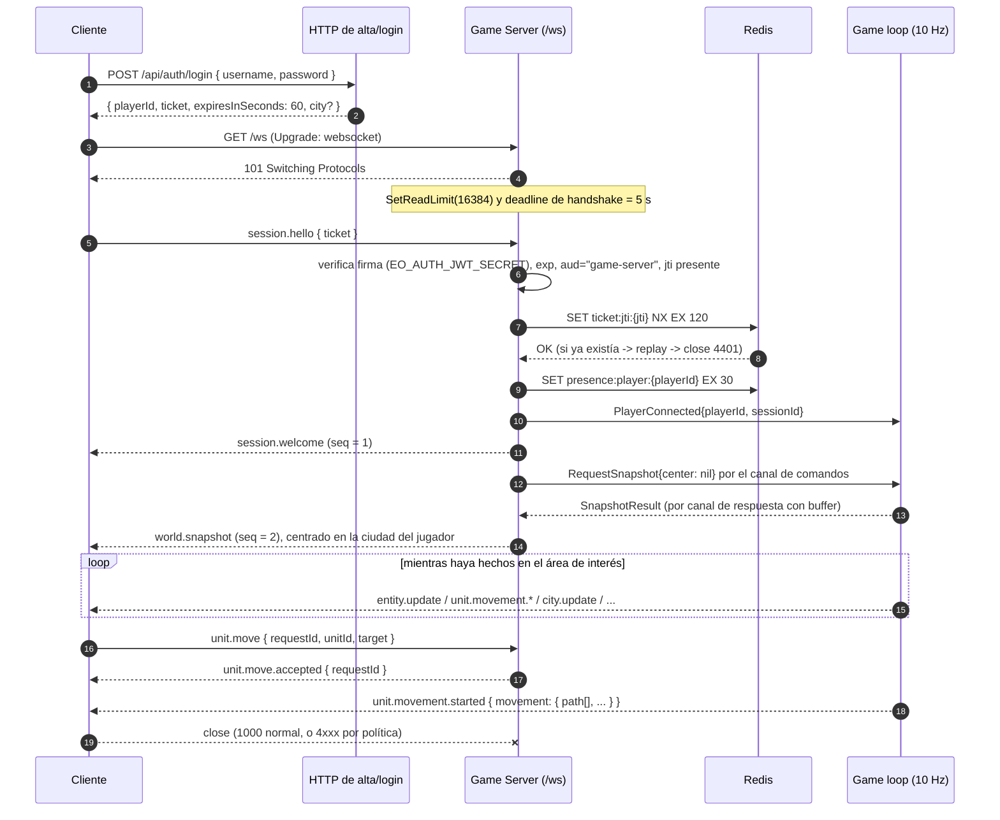

# Networking y sincronización

Arquitectura de la capa de red de Empires Online: ciclo de vida de la conexión WebSocket, modelo de sincronización *snapshot + delta*, interest management por chunks, reconexión, backpressure y límites operativos.

> Estado: **implementado** en `services/game-server/internal/websocket/` (`hub.go`, `session.go`, `server.go`).
> Documentos relacionados: [visión general](./overview.md) · [game loop](./game-loop.md) · [protocolo WebSocket v1](../specs/websocket-protocol.md) · [movimiento](../specs/movement.md) · [esquema de base de datos](../database/schema.md) · [monitorización](../operations/monitoring.md).

---

## 1. Principios que gobiernan esta capa

1. **Servidor autoritativo.** El cliente envía *intención*; el servidor determina la verdad. Ningún mensaje entrante aporta posición, HP, recursos, ownership, cooldowns, ETA ni paths. La capa de red no es un canal de escritura de estado: es un canal de comandos validables y un canal de difusión de hechos consumados.
2. **El WebSocket no es durable.** Ningún estado persistente depende de una conexión viva. Una caída de socket no altera el mundo salvo por las reglas explícitas de presencia (ver [presencia y protección](../specs/presence.md)).
3. **El estado se sincroniza, no se replica.** El cliente mantiene una réplica *parcial* (su área de interés) y *derivada* (reconstruible desde el servidor en cualquier momento). Nunca se intenta convergencia bidireccional.
4. **Determinismo del orden.** Todo lo que sale de la simulación se emite desde la goroutine del game loop, en el momento en que el hecho ocurre, dentro de la fase que lo produce. El orden que ve el cliente es por tanto el orden de las fases, y es el mismo en cada ejecución del mismo escenario.
5. **Un solo escritor por socket.** `gorilla/websocket` admite un único escritor concurrente. Todo lo que sale pasa por el canal `out` de la sesión y lo escribe exclusivamente su `writePump`.

---

## 2. Transporte y envelopes

| Aspecto | Valor |
|---|---|
| Protocolo | **WSS** (WebSocket sobre TLS) |
| Endpoint | `GET /ws` sobre `EO_HTTP_ADDR` (`:8080` por defecto, TLS terminado por el reverse proxy) |
| Codificación | JSON UTF-8, un mensaje lógico por frame de texto |
| Versión | `"v": 1` explícito en **todos** los mensajes |
| Fuente de verdad del esquema | Zod en `packages/protocol/src/v1/`, exportado a JSON Schema en `packages/protocol/schema/v1/*.json` |

Envelope **cliente → servidor**:

```json
{ "v": 1, "type": "unit.move", "requestId": "6f9d1c0e-...-uuidv4", "payload": { "unitId": 4211, "target": { "x": 130, "y": 88 } } }
```

Envelope **servidor → cliente**:

```json
{ "v": 1, "type": "entity.update", "seq": 1487, "ts": 1789453210123, "payload": { "...": "..." } }
```

- `requestId` es UUIDv4 y es **obligatorio en los comandos que mutan el mundo**: `unit.move` y `unit.cancel_move`. Sin él, el servidor responde `system.error{INVALID_MESSAGE}` («requestId obligatorio») y no ejecuta nada, porque sin `requestId` no hay barrera de idempotencia. En `session.hello`, `session.ping` y `session.view` es **opcional**: si viene, se refleja en la respuesta correlacionada (`session.welcome`, `session.pong`, `world.snapshot`); si no, la respuesta sale sin campo `requestId`.
- `seq` es un **uint64 monótono por conexión** que empieza en `1` con `session.welcome`. `ts` es epoch ms del reloj del servidor.
- Los identificadores numéricos (`unitId`, `movementId`, `cityId`) viajan como **números JSON**, no como cadenas: en Go son `int64` y así los serializa `encoding/json`. Los identificadores UUID (`sessionId`, `playerId`) viajan como cadenas.
- El Game Server valida los mensajes entrantes **a mano en Go** por rendimiento; el JSON Schema exportado por `packages/protocol` se embebe con `go:embed` en `internal/protocol/schema/v1/` y se usa en los *contract tests*, no en el hot path. Ambas rutas deben coincidir o el contract test falla.

**Tipos de mensaje v1** (lista cerrada; cualquier `type` fuera de ella produce `INVALID_MESSAGE`):

- Cliente → servidor: `session.hello`, `session.ping`, `session.view`, `unit.move`, `unit.cancel_move`.
- Servidor → cliente: `session.welcome`, `session.pong`, `system.error`, `world.snapshot`, `entity.spawn`, `entity.update`, `entity.despawn`, `city.update`, `territory.update`, `unit.move.accepted`, `unit.move.rejected`, `unit.movement.started`, `unit.movement.completed`, `unit.movement.cancelled`.

---

## 3. Ciclo de vida de la conexión

### 3.1 Diagrama de secuencia



**El endpoint que emite el game ticket es hoy del propio game server.** `internal/httpapi` sirve dos rutas, y ésta es su ficha:

| | `POST /api/auth/register` | `POST /api/auth/login` |
|---|---|---|
| Autenticación previa | Ninguna | Ninguna |
| Request body | `{ "username": string, "password": string }` | `{ "username": string, "password": string }` |
| Validación | `username` de 3 a 24 caracteres `[A-Za-z0-9_-]`; `password` de 8 o más | — |
| Response 200/201 | `201` `{ playerId, ticket, expiresInSeconds: 60, city: { id, name, centerX, centerY } }` | `200` con el mismo cuerpo; `city` sólo si el jugador ya la tiene |
| Errores | `400 INVALID_MESSAGE` / `INVALID_USERNAME` / `WEAK_PASSWORD`, `409 USERNAME_TAKEN` / `NO_SITE_AVAILABLE`, `405 METHOD_NOT_ALLOWED`, `500 INTERNAL_ERROR` | `400 INVALID_MESSAGE`, `401 UNAUTHORIZED` (mismo error y mismo coste aproximado para usuario inexistente y contraseña incorrecta), `405`, `500` |

Es **explícitamente provisional**: la arquitectura objetivo de [ADR-010](../decisions/ADR-010-authentication-game-ticket.md) traslada la emisión del ticket a `apps/web` (Next.js), que todavía no existe. El contrato del ticket —JWT HS256, `aud = "game-server"`, TTL 60 s, `jti` de un solo uso— no cambia con el traslado.

### 3.2 Fases y su contrato

| Fase | Quién actúa | Contrato | Fallo |
|---|---|---|---|
| **Ticket** | `internal/httpapi` (hoy); `apps/web` (objetivo) | JWT HS256 firmado con `EO_AUTH_JWT_SECRET`, TTL **60 s**, claims `{ sub: playerId, jti, iat, exp, aud: "game-server" }`. Un ticket sin `jti` se rechaza: sin él no hay anti-replay | 401 HTTP; no se abre socket |
| **Upgrade HTTP** | Game Server | `GET /ws` sin credenciales en URL ni cookies. `CheckOrigin` contra `AllowedOrigins` (vacío = cualquiera, sólo aceptable en desarrollo). Se acepta el upgrade y **la conexión queda no autenticada** | Rechazo HTTP estándar |
| **Handshake de aplicación** | Cliente | El **primer** mensaje debe ser `session.hello { ticket }`, dentro de **5 s** | Cierre `4408` si no llega nada; `4400` si el frame es indescifrable o `v != 1`; `4401` si el primer mensaje no es `session.hello` |
| **Verificación** | Game Server | Firma + `exp` + `aud` + consumo de `jti` en Redis (`ticket:jti:{jti}`, TTL **120 s**, `SET NX`) | Cierre `4401`. Todos los fallos de credenciales se traducen al **mismo** código: distinguirlos ayudaría a afinar un ataque |
| **Sesión** | Game Server | Registro en el `Hub`, arranque del `writePump`, presencia en `presence:player:{playerId}` (TTL **30 s**) y comando `PlayerConnected` al loop. Si Redis falla al marcar presencia, **la sesión sigue siendo válida**: la presencia caliente es una optimización, no la verdad | — |
| **Bienvenida** | Game Server | `session.welcome` con `seq = 1` y payload `{ sessionId, playerId, serverTimeMs, tickDurationMs, heartbeatIntervalMs, world: { width, height, chunkSize } }` | — |
| **Snapshot** | Game loop | `world.snapshot` del área de interés inicial, centrada en la ciudad del jugador | `system.error{INTERNAL_ERROR}` si la cola de comandos está llena o el loop no responde en 2 s |
| **Streaming** | Game loop | Deltas mientras la conexión viva | Ver §7 y §8 |
| **Cierre** | Ambos | `1000`/`1001` limpio, o código de política `44xx`/`4500` | — |

Nótese que la fila de `sessions` **todavía no se escribe**: la tabla existe en el esquema pero en el MVP actual la sesión vive sólo en RAM (`Hub` + `Session`) y su rastro en Redis.

El ticket **no viaja en la query string**: iría a logs de proxies y a historiales. Viaja en el payload del primer mensaje, sobre un canal ya cifrado. Esto además evita depender de cabeceras personalizadas, que la API `WebSocket` del navegador no permite fijar.

### 3.3 Estados de la conexión

```
                 upgrade 101
   [CONNECTING] ------------> [AWAITING_HELLO]
                                   |  session.hello válido
                                   v
                              [AUTHENTICATED] --welcome+snapshot--> [SYNCED]
                                   |                                   |
                                   | 4401/4408/4400                    | 4400/4429/4500/close
                                   v                                   v
                                [CLOSED] <-------------------------- [CLOSING]
```

- En `AWAITING_HELLO` la única entrada aceptada es `session.hello`. Cualquier otro `type` cierra con `4401` **sin `system.error` previo**: la conexión aún no tiene sesión a la que enviarlo.
- En `SYNCED` un `session.hello` repetido no re-autentica nada: el tipo se acepta como conocido pero no tiene manejador, así que se ignora. Una conexión no se re-autentica: se reconecta.

### 3.4 Códigos de cierre y su mapeo a errores

| Close code | Constante | Significado | `system.error` previo |
|---|---|---|---|
| `4400` | `CloseInvalidMessage` | Mensaje de handshake inválido o versión no soportada | No (aún no hay sesión) |
| `4401` | `CloseUnauthenticated` | Handshake sin autenticar: ticket inválido, caducado, replicado, sin `jti`, o primer mensaje que no es `session.hello` | No |
| `4403` | `CloseForbidden` | Reservado. Definido en `internal/protocol/codes.go` pero **ningún camino del MVP lo usa** | — |
| `4408` | `CloseHandshakeTimeout` | El `session.hello` no llegó en 5 s | No (se cierra sin ceremonia) |
| `4429` | `CloseRateLimited` | Cubo de fichas agotado | Sí: `system.error{RATE_LIMITED}` inmediatamente antes |
| `4500` | `CloseInternalError` | Cola de salida saturada, error de escritura o ping fallido | No en el caso de saturación: precisamente no cabe |

Precisión importante frente a la lectura habitual: **el cierre `4429` no exige un abuso "sostenido"**. Al primer mensaje que no encuentra ficha disponible se envía `system.error{RATE_LIMITED}` y se cierra la conexión. Es una política deliberadamente dura: un cliente correcto nunca agota un burst de 40 con recarga de 20/s, y distinguir "abuso puntual" de "abuso sostenido" exigiría estado adicional por conexión sin beneficio real.

La lógica del cliente se decide por el **close code**, y dentro del stream por el campo `code`, nunca por el texto humano de `message`.

---

## 4. Modelo snapshot + delta

### 4.1 Por qué no se retransmite el mundo

El mundo MVP es 512 × 512 tiles = 262 144 tiles y 256 chunks. Serializar el mundo entero a 10 Hz sería del orden de decenas de MB/s por jugador: inviable y, sobre todo, inútil, porque el jugador solo puede observar una fracción diminuta. El contrato es:

> **Una vez, todo lo que veo; después, solo lo que cambia dentro de lo que veo.**

El estado del cliente es una función pura de `snapshot ⊕ deltas aplicados en orden`. Como el estado es siempre reconstruible por el servidor (ver [estrategia de persistencia](./persistence.md)), la respuesta correcta a *cualquier* duda de consistencia es re-sincronizar con un snapshot nuevo, nunca reparar el delta stream.

### 4.2 Contenido del `world.snapshot` inicial

El snapshot es el **estado completo del área de interés en el instante `serverTimeMs`**, no un resumen. El payload real es exactamente éste:

```
world.snapshot.payload = {
  serverTimeMs, tick,
  chunks:      [{ cx, cy }],
  terrain:     [{ cx, cy, size, terrain }],       // terrain = base64 de size*size bytes
  units:       [ UnitView ],
  cities:      [ CityView ],
  territories: [ TerritoryView ]                  // vacío en el MVP
}
```

| Bloque | Contenido | Origen |
|---|---|---|
| Cabecera | `serverTimeMs` y `tick` | `Clock` + `State.Tick()` |
| Conjunto de interés | `chunks[]` con las coordenadas `(cx, cy)` suscritas | `World.ChunksInRadius(centro, EO_INTEREST_RADIUS_CHUNKS)` |
| Terreno | `terrain[]` con `size` y los `size*size` bytes del chunk en **base64**, un byte por tile con el valor de `TerrainType` | Grid en RAM (`World.ChunkTerrain`) |
| Unidades | `UnitView`: `id`, `playerId`, `cityId`, `unitType`, `x`, `y`, `hp`, `maxHp`, `status` y, si se está moviendo, `movement` con la polilínea completa | RAM del game server |
| Ciudades | `CityView`: `id`, `ownerPlayerId`, `name`, `centerX`, `centerY`, `era`, `population`, `populationLimit`, `presenceState`, `protectionUntilMs` | RAM (respaldado en `cities`) |

Detalles de diseño:

- **El terreno se envía una sola vez por sesión y por chunk.** Es inmutable, así que reenviarlo en cada movimiento de cámara sería malgastar ancho de banda. La sesión recuerda qué chunks ya lo recibieron (`NeedsTerrain` / `MarkTerrainSent`) y el servidor filtra el array `terrain[]` antes de enviar; el array `chunks[]` sí va completo siempre.
- **El terreno es cacheable indefinidamente en el cliente**: se genera determinísticamente desde `EO_WORLD_SEED` en cada arranque. Lo que cambia es el overlay de ocupación, no el terreno base.
- **La posición de una unidad en movimiento se resuelve en el instante del snapshot** (`PositionAt`), y su polilínea activa completa viaja en `movement`. Ver §9.
- **El overlay de ocupación no se transporta.** El cliente no recibe la lista de tiles bloqueados; la deduce de las ciudades visibles. Un canal explícito para el overlay es **TBD (fuera de MVP)**.
- **Cota de tamaño del snapshot.** `EO_WS_MAX_MESSAGE_BYTES` (16 384) se aplica hoy **sólo al sentido entrante**, como `SetReadLimit` del socket; no hay ninguna cota impuesta al mensaje saliente. Consecuencia honesta: el primer snapshot de una sesión con 25 chunks de terreno ronda los 34 KB una vez codificado en base64 y **excede** esa cifra. No se rompe nada —el límite entrante no se aplica de vuelta— pero conviene no documentarlo como si cupiera. Una cota real de salida, con paginación o *spill* a `entity.spawn`, es **TBD (fuera de MVP)**; el mitigante que ya existe es que el terreno sólo viaja la primera vez.

### 4.3 Generación de deltas por tick

Los deltas se emiten **desde la goroutine del game loop, en el punto exacto en que el hecho ocurre**, dentro de la fase que lo produce. No hay una pasada de volcado al final del tick: `Broadcaster.BroadcastChunk` y `Broadcaster.SendToPlayer` depositan el mensaje en la cola de salida de cada sesión destino y el tick sigue.

La regla de enrutado es directa:

```
hecho de la simulación  --(mapeo)-->  tipo de mensaje v1  --(chunk o jugador)-->  sesiones destino
```

| Cambio observado | Mensaje emitido | Destino |
|---|---|---|
| Comando de movimiento aceptado / rechazado | `unit.move.accepted` / `unit.move.rejected` | Todas las sesiones del emisor, con su `requestId` |
| Movimiento iniciado | `unit.movement.started` | Chunk del tile de **origen** |
| Posición nueva de una unidad en tránsito | `entity.update` (con `x`, `y`) | Chunk del tile **nuevo** |
| Movimiento completado / cancelado | `unit.movement.completed` / `.cancelled` | Chunk del tile final |
| Transición de presencia de la ciudad | `city.update` (con `presenceState`) | Chunk del centro de la ciudad |
| Entidad entra o sale del área de interés | `entity.spawn` / `entity.despawn` | La sesión afectada |

**Orden de emisión dentro de un tick.** Es fijo y determinista, y se deriva del orden de las fases, no de una regla de ordenación aparte:

1. Respuestas a comandos (fase 2): `unit.move.accepted` / `unit.move.rejected`, y el `unit.movement.cancelled` del movimiento reemplazado, que se emite **antes** que el `accepted` porque la cancelación ocurre antes en el código.
2. Deltas de movimiento (fase 3): `entity.update` de cada avance y `unit.movement.completed` de las llegadas.
3. Temporizadores (fase 5): `city.update` de las transiciones de presencia.

**Sin coalescencia y sin batching en v1.** Cada hecho produce su mensaje: una unidad que cambia de tile en un tick genera exactamente un `entity.update`, y no se fusionan varios cambios de la misma entidad ni se agrupan mensajes de un mismo tick en un solo frame. Es la consecuencia de emitir en el punto del hecho, y es aceptable a 10 Hz con movimiento por tiles: una unidad de `VILLAGER` cambia de tile como mucho cada 360 ms. Coalescencia por entidad y un mensaje contenedor de deltas son **decisiones futuras, fuera de MVP** (§6.1).

**Ticks silenciosos**: si en el chunk de una sesión no ocurrió ningún hecho, no se emite ningún mensaje. A 10 Hz, la mayoría de los ticks de una sesión típica son silenciosos. El keepalive lo aporta el ping de control (§8.3), no un delta vacío.

**`entity.spawn` y `entity.despawn` todavía no se emiten por cruce de frontera.** `Hub.Subscribe` ya devuelve los chunks que entran y los que salen —es la información necesaria—, pero en el MVP actual la resincronización del área de interés se hace reenviando un `world.snapshot` completo tras cada `session.view`. Emitir `spawn`/`despawn` incrementales a partir de ese diff es trabajo **pendiente**, no una funcionalidad existente.

### 4.4 `seq` y detección de pérdida de orden

`seq` es un **uint64 monótono por conexión** que empieza en `1` con `session.welcome` e **incrementa exactamente en 1** por cada mensaje servidor→cliente. La contigüidad es un requisito de diseño: sin ella el hueco no sería detectable.

```ts
// Cliente: verificación de continuidad
if (msg.seq !== expectedSeq) {
  // Hueco o reordenamiento: el estado local ya no es confiable.
  // NO se intenta reparar el stream: se descarta la réplica y se reconecta (§7).
  resyncFromScratch();
}
expectedSeq = msg.seq + 1n;
```

Precisión de ingeniería: WebSocket corre sobre TCP, de modo que **el transporte no reordena ni pierde mensajes de una conexión viva**. `seq` no existe para corregir a TCP. Existe para detectar tres cosas reales:

1. **Descartes del servidor por backpressure.** Si la cola de salida se desborda, el servidor cierra con `4500`; pero cualquier política futura de descarte selectivo sería invisible sin `seq`.
2. **Errores de aplicación**, del cliente (mensajes ignorados, orden alterado por el manejo asíncrono) o del servidor (bug en el emisor). En tests de contrato y simulación, un hueco de `seq` es un fallo duro.
3. **Confusión entre conexiones.** Tras una reconexión el `seq` reinicia en `1`; un cliente que mezclara mensajes de dos sockets lo detecta de inmediato.

`seq` **no** se usa para pedir retransmisiones. No existe un mecanismo de *replay* de deltas (§7.3).

---

## 5. Interest management por chunks

### 5.1 Cálculo del conjunto suscrito

Todo se apoya en la geometría de chunks del canon: chunk de `EO_CHUNK_SIZE` = **32 × 32** tiles, `chunkX = x / EO_CHUNK_SIZE`, `chunkY = y / EO_CHUNK_SIZE`. Con mundo 512 × 512, `chunksPerRow = 16` y hay 256 chunks.

**El chunk se identifica en el protocolo por el par `(cx, cy)`, no por un índice lineal.** Existe además `World.ChunkIndex(cx, cy) = cy*chunksPerRow + cx` como `uint32` para usos internos, pero ningún mensaje v1 lo transporta.

La división es **entera y explícita, no un desplazamiento de bits**. `x >> 5` sólo equivale a `x / chunk_size` cuando `chunk_size` es exactamente 32, y nada obliga a que lo sea: `EO_CHUNK_SIZE` acepta de 1 a 256, y la única restricción que valida el arranque es que `EO_WORLD_WIDTH` y `EO_WORLD_HEIGHT` sean múltiplos exactos suyos. Con `EO_CHUNK_SIZE=48` un `>>5` daría chunks equivocados en todo el servidor; con la división, no.

El conjunto suscrito es un **cuadrado de Chebyshev** de radio `EO_INTEREST_RADIUS_CHUNKS` (**2** por defecto) alrededor del chunk del centro de vista, recortado a los límites del mundo (`World.ChunksInRadius`):

```go
// R = EO_INTEREST_RADIUS_CHUNKS (2). El centro se recorta al mundo ANTES de dividir.
ccx, ccy := w.ChunkOf(clamp(center.X, 0, w.Width()-1), clamp(center.Y, 0, w.Height()-1))
minCX, maxCX := max(0, ccx-R), min(w.ChunksPerRow()-1, ccx+R)
minCY, maxCY := max(0, ccy-R), min(w.ChunksPerColumn()-1, ccy+R)
// recorrido en orden estable (cy, cx); sin wrap-around: el mundo no es un toro
```

Consecuencias numéricas del MVP:

| Magnitud | Valor |
|---|---|
| Chunks suscritos en el interior del mundo | (2·2+1)² = **25** |
| Chunks suscritos en un borde / esquina | 15 / **9** |
| Ventana visible | 25 · 32 · 32 = **25 600 tiles** (160 × 160) |
| Fracción del mundo por jugador | 25 / 256 ≈ **9,8 %** |
| Terreno crudo del área de interés | 25 · 1024 = **25 600 bytes**, que en base64 son ~34 100 caracteres. Sólo viaja la primera vez que la sesión ve cada chunk |

El radio se mide en **chunks, no en tiles**: la unidad de suscripción es el chunk completo. Es deliberado. La granularidad de tile daría un conjunto mínimo pero obligaría a recalcular pertenencia por entidad y por observador en cada tick; la granularidad de chunk convierte la pregunta "¿quién ve esto?" en una consulta a un índice invertido `chunkId → sesiones`.

### 5.2 Estructuras en RAM

En el `Hub`, protegidas por un único `sync.RWMutex`:

```
sessions : map[sessionID] -> *Session                    // todas las conexiones vivas
byPlayer : map[playerID]  -> map[sessionID]*Session      // varias pestañas del mismo jugador
byChunk  : map[chunkKey]  -> map[sessionID]*Session      // índice invertido: quién observa el chunk
```

y, en cada `Session`:

```
chunks      : map[chunkKey] -> ChunkCoord    // qué observa (25 elementos típicos); sólo el Hub la toca
terrainSent : set[chunkKey]                  // chunks cuyo terreno ya recibió esta sesión
```

`chunkKey` es un `uint64` que empaqueta `(cx, cy)`. En la simulación existe además el índice `chunk → entidades` que responde a "qué hay en este chunk" para construir snapshots.

Nada de esto se persiste: son datos **reconstruibles** (conjuntos de interés y suscripciones). Tras un reinicio se reconstruyen al reconectar cada sesión.

### 5.3 Movimiento del centro de vista (`session.view`)

Al conectar, el centro de vista se fija en la **ciudad del jugador** (`RequestSnapshot` con `Center: nil`; si el jugador no tuviera ciudad, se cae al centro del mundo y el resultado se marca `Found: false`). El cliente lo mueve con `session.view` (sujeto al rate limit global, §8.1). El servidor no confía en el cliente para nada más que esto: `session.view` declara *dónde mira*, no *qué recibe*; el conjunto lo calcula el servidor.

**Un centro fuera de los límites no se rechaza: se recorta.** `ChunksInRadius` aplica un `clamp` del centro al mundo antes de calcular los chunks, de modo que un `session.view` con coordenadas absurdas devuelve el área de interés del borde más cercano en lugar de un error. Es deliberado: mover la cámara no es una orden de gameplay y fallar aquí no protegería nada.

**La goroutine de la conexión NO lee el estado del mundo.** Ni para `session.view` ni para el
snapshot inicial: envía el comando `RequestSnapshot` por el mismo canal de comandos que todo lo
demás, con un **canal de respuesta con buffer**, y es el game loop quien construye el snapshot
(`Simulation.BuildSnapshot`) desde su propia goroutine. Ese rodeo es exactamente lo que impide una
carrera de datos contra la simulación; leer el mundo desde la conexión sería la forma más rápida de
introducir una.

```
conexión ──RequestSnapshot{center, radiusChunks, reply}──► canal de comandos ──► game loop
                                                                                 construye el snapshot
conexión ◄──────────── canal de respuesta con BUFFER (cap. 1) ◄──────────────────┘
   entered, left := Hub.Subscribe(session, result.Chunks)
   terrain[] filtrado por NeedsTerrain  +  MarkTerrainSent
   session.Send(world.snapshot)
```

Detalles del contrato de ese ida y vuelta:

- El canal de respuesta **debe tener buffer**: el loop entrega el resultado con un `select`/`default`
  y, si la conexión ya se fue, **descarta el snapshot** en lugar de bloquearse. El tick nunca espera
  a nadie.
- La conexión espera como máximo **2 s**; al vencer responde `system.error{INTERNAL_ERROR}`.
- Sólo `Hub.Subscribe`, el filtrado de terreno y el envío ocurren en la goroutine de la conexión, y
  ninguno de los tres toca el estado del mundo.

`Hub.Subscribe` reemplaza el conjunto suscrito y devuelve el diff:

```
entered = new \ old
left    = old \ new
kept    = old ∩ new    ->  el cliente ya tiene esas entidades
```

Con un desplazamiento de un chunk en horizontal, `entered` y `left` tienen 5 chunks cada uno de los 25: **el 80 % de la suscripción se conserva**. Esa es la propiedad que justifica el diseño; el aprovechamiento pleno del diff —emitir `entity.spawn`/`entity.despawn` incrementales en lugar de un snapshot completo— es trabajo pendiente (§4.3).

La regla objetivo para el cruce de fronteras, cuando se implemente, es simétrica:

- Entidad que pasa de un chunk **no suscrito** a uno **suscrito** por el observador O → `entity.spawn` para O.
- Entidad que pasa de **suscrito** a **no suscrito** → `entity.despawn` para O.
- Entidad que se mueve dentro del conjunto suscrito → `entity.update`.

Nótese que `spawn`/`despawn` son eventos **relativos al observador**, no al mundo: una unidad que sale de tu vista no ha muerto, solo dejó de ser observable. La muerte de una entidad es `units.status = DEAD` y se comunica con `entity.update` seguido de `entity.despawn`. El cliente **no debe** inferir nada de gameplay a partir de un `despawn`.

### 5.4 Por qué esto escala

Sin interest management, difundir un cambio cuesta O(jugadores) y el estado replicado por jugador crece con el tamaño del mundo. Con suscripción por chunk:

| Propiedad | Efecto |
|---|---|
| Coste de difusión por evento | O(observadores del chunk afectado), no O(jugadores conectados) |
| Coste de emisión por tick | O(Σ sobre los chunks donde ocurrió algo de sus observadores) — proporcional a la **actividad**, no a la población |
| Ancho de banda por jugador | Acotado por su ventana de 160 × 160 tiles, **independiente del tamaño del mundo** |
| Escalado del mundo | Ampliar a 1024 × 1024 no cambia el tráfico por jugador; solo multiplica los chunks vacíos |
| Escalado de jugadores | Lineal en **densidad local**, no en población total. Dos jugadores en extremos opuestos del mapa no se cuestan nada mutuamente |
| Sharding futuro | El chunk es la unidad natural de partición si un día el mundo no cabe en un proceso — **Fuera de MVP** |

El caso patológico conocido es la **concentración**: N jugadores en el mismo chunk implican O(N²) de tráfico agregado. En el MVP se acepta y se observa vía `eo_ws_messages_total` y `eo_connected_players`. Mitigaciones (límite de entidades reportadas por chunk, nivel de detalle degradado con la distancia): **Fuera de MVP**.

---

## 6. Batching de deltas y límites de tamaño

### 6.1 Qué significa "batching" en v1

El protocolo v1 **no define un mensaje contenedor** de múltiples eventos; cada delta es un mensaje independiente de la lista cerrada de §2. Y en el MVP **tampoco hay batching en el escritor**: la simulación llama a `Session.Send`, que encola un mensaje ya numerado (`seq`, `ts`) en el canal `out`, y el `writePump` de esa conexión lo serializa y escribe cuando lo recibe. Un hecho, un frame.

Lo que sí está garantizado y es lo que importa para la corrección:

1. La lógica de simulación **nunca escribe al socket**: sólo encola.
2. `Session.Send` **nunca bloquea**. Si la cola está llena, cierra la sesión (§8.4).
3. Una **única** goroutine (`writePump`) escribe en cada socket, incluidos los frames de control (`ping`) y con `SetWriteDeadline` en cada escritura. Escrituras concurrentes sobre una conexión WebSocket son un error de programación.

Agrupar los frames de un mismo tick en una sola pasada de escritura, coalescer varios `entity.update` de la misma entidad, o introducir un tipo contenedor (`world.delta` con un array de eventos) reducirían el número de syscalls y el overhead de envelope JSON. Son **decisiones futuras, fuera de MVP**: la última, además, rompería la lista cerrada de tipos v1 y exigiría versionar el protocolo.

### 6.2 Límites de tamaño

| Límite | Valor | Aplicación |
|---|---|---|
| Tamaño máximo de mensaje **entrante** | `EO_WS_MAX_MESSAGE_BYTES` = **16384** (16 KiB) | `conn.SetReadLimit`, fijado **antes** del handshake, de modo que un `session.hello` sobredimensionado también se corta |
| Mensaje entrante excedido | — | `gorilla/websocket` corta la lectura y la conexión termina; **no** se emite `system.error{MESSAGE_TOO_LARGE}` (el código existe en el catálogo pero ningún camino lo usa hoy) |
| Tamaño máximo de mensaje **saliente** | **Sin límite aplicado** | No hay cota impuesta en el escritor. Es una asimetría real y consciente: la cota de salida es **TBD (fuera de MVP)** |

Dos mensajes salientes merecen atención por tamaño:

- **`world.snapshot`**, que en su primera emisión lleva el terreno de hasta 25 chunks en base64: ~34 KB. Excede los 16 KiB nominales, aunque el límite entrante no se le aplica. El terreno sólo viaja la primera vez que la sesión ve cada chunk.
- **`unit.movement.started`**, que transporta la polilínea completa `[{x, y, tMs}, ...]`. `EO_PATHFINDING_MAX_DISTANCE` = 256 acota la **distancia Chebyshev** entre origen y destino, no la longitud del camino: un rodeo por terreno laberíntico puede producir bastantes más waypoints que la distancia en línea recta. La cota dura de waypoints es **TBD (fuera de MVP)**; hoy el límite efectivo lo pone `EO_PATHFINDING_MAX_NODES` = 20000.

---

## 7. Reconexión

### 7.1 Qué hace el cliente

1. Detecta la caída (evento `close`/`error` del socket, o `seq` discontinuo, o timeout de pong).
2. **Descarta por completo su réplica del mundo.** No conserva entidades, no conserva el `seq`, no intenta continuar.
3. Pide un **ticket nuevo** al endpoint de login (hoy `POST /api/auth/login` del game server; `apps/web` cuando exista). El anterior no sirve: su TTL es de 60 s y su `jti` ya fue consumido en `ticket:jti:{jti}`; reutilizarlo produce cierre `4401`.
4. Reabre el WebSocket y repite el handshake completo (§3).
5. Recibe `session.welcome` + `world.snapshot` y **reconstruye la escena desde cero**.
6. Reintenta con **backoff exponencial con jitter** para no producir una tormenta de reconexiones tras una caída del servidor. Los valores concretos de la curva de backoff son **TBD (fuera de MVP)**.
7. Los comandos emitidos y no confirmados antes de la caída se reintentan **con el mismo `requestId`** (§10), o se descartan. Nunca se reintentan con un `requestId` nuevo.

Durante la reconexión la UI debe indicar el estado degradado y **dejar de animar** las unidades (§9): seguir interpolando sin servidor sería inventar estado.

### 7.2 Qué hace el servidor

En el cierre de una conexión:

1. `Hub.Unregister` retira la sesión y **todas** sus suscripciones por chunk. Los deltas dejan de encolarse para ella de inmediato.
2. Cierra el socket (`CloseWith`, idempotente vía `sync.Once`) y termina el `writePump`.
3. Retira la presencia con `ClearIfSession`, un script Lua que borra `presence:player:{playerId}` **sólo si la ostenta esta sesión**. Sin esa comprobación atómica, cerrar una pestaña vieja marcaría offline a un jugador que acaba de reconectar desde otra.
4. Emite `PlayerDisconnected{playerId, sessionId}` al game loop.
5. **No modifica nada del mundo.** Ni unidades, ni movimientos activos, ni recursos. Un movimiento `ACTIVE` sigue avanzando en el tick exactamente igual con el jugador desconectado: el mundo es persistente y no se detiene.

Qué hace el loop con `PlayerDisconnected`, que es donde suele estar el malentendido:

- Lleva un **contador de sesiones vivas por jugador** en RAM. Si al jugador le quedan otras sesiones abiertas, no ocurre nada: sigue `ONLINE`.
- Si era la última, se anota el instante de desconexión. La ciudad **no** cambia de estado todavía.
- En la fase 5 de cada tick, si han pasado más de `DisconnectGrace` (= `EO_PRESENCE_TTL_SECONDS`, **30 s**) desde esa anotación y el jugador sigue sin sesiones, la ciudad transiciona a `OFFLINE_PENDING`. Tras `EO_CITY_OFFLINE_PROTECTION_COOLDOWN_SECONDS` (**300 s**) pasa a `PROTECTED`.
- **La decisión es aritmética sobre RAM, no una lectura de la expiración de la clave de Redis.** Redis mantiene la presencia para observadores externos y para el futuro multiproceso, pero el estado del mundo no depende de que su TTL venza en el instante exacto.

Si el jugador reconecta dentro de esos 30 s, `PlayerConnected` borra la anotación y no hubo, a efectos de gameplay, ninguna desconexión. El heartbeat de presencia (`session.ping`, con refresco de la clave cada **10 s** según `EO_PRESENCE_HEARTBEAT_SECONDS`) mantiene además la visión externa al día.

### 7.3 Por qué snapshot y no replay de deltas

Un mecanismo de replay exigiría un búfer por sesión con todos los deltas desde el último `seq` confirmado, con retención acotada, invalidación y una ruta de código de reconstrucción distinta a la normal. Se rechaza por cuatro razones:

1. **El estado ya es reconstruible sin él.** La posición autoritativa de una unidad en movimiento es analíticamente calculable desde la polilínea temporizada (`último waypoint con tMs <= T - start_time_ms`). No hace falta replay de ticks ni de deltas para conocer la verdad en cualquier instante.
2. **Coste desproporcionado.** Retener deltas por sesión desconectada es memoria proporcional a (jugadores × duración de la ventana × actividad), justo cuando el servidor puede estar bajo estrés.
3. **Superficie de bugs.** El replay crea un segundo camino de sincronización que se ejerce poco y falla en producción. El snapshot se ejerce en cada conexión: si está roto, se sabe de inmediato.
4. **El snapshot es barato.** El terreno (~34 KB en base64) más las entidades del área de interés. Reenviarlo es trivial comparado con mantener un log por sesión. Matiz honesto: `terrainSent` vive en la `Session`, así que una **reconexión vuelve a recibir el terreno**; que el cliente lo tenga cacheado no evita el reenvío. Un mecanismo para que el cliente declare qué chunks ya tiene es **TBD (fuera de MVP)**.

**Regla operativa:** ante cualquier duda de consistencia — hueco de `seq`, error de decodificación, desincronía detectada — el cliente **reconecta y re-sincroniza**. No existe una ruta de reparación parcial.

---

## 8. Control de flujo, límites y salud

### 8.1 Rate limiting

- **Cubo de fichas por conexión**: `EO_WS_RATE_LIMIT_PER_SECOND` = **20** fichas/s de recarga, `EO_WS_RATE_LIMIT_BURST` = **40** de capacidad. El burst absorbe ráfagas legítimas (una salva de órdenes) sin penalizar. El arranque valida que `BURST >= PER_SECOND`.
- Se rellena **sin temporizadores**: cada consulta calcula cuántas fichas se han acumulado desde la anterior a partir del tiempo transcurrido. No hay goroutine ni ticker por conexión.
- El límite se aplica **antes de decodificar el mensaje**, de modo que un atacante no puede forzar trabajo de parseo con frames basura.
- Un mensaje sin ficha disponible produce `system.error{RATE_LIMITED}` y **cierra la conexión con `4429`** de inmediato. No hay descarte silencioso ni ventana de tolerancia sostenida (§3.4).
- **`session.view` está sujeto exactamente al mismo cubo global y a ningún otro.** No existe ningún sub-límite específico para `session.view` en el código ni ninguna variable `EO_` que lo defina; documentarlo como si existiera crearía clientes que respetan el contrato publicado y aun así reciben `RATE_LIMITED`. Un sub-límite dedicado es **TBD (fuera de MVP)**: el rate limit global ya acota el churn de interest management, y el diff de conjuntos (§5.3) lo hace barato aunque llegue a 20 Hz.

### 8.2 Tamaño de mensaje

Cubierto en §6.2. El `ReadLimit` se fija en el socket **antes** del handshake de aplicación, de modo que un `session.hello` sobredimensionado también se rechaza. No hay cota equivalente en el sentido saliente.

### 8.3 Ping/pong y timeouts

Hay tres relojes distintos y no deben confundirse:

| Mecanismo | Capa | Periodo / límite | Propietario | Propósito |
|---|---|---|---|---|
| Ping/pong de control WebSocket | Protocolo (RFC 6455) | ping cada **15 s** (`WSPingInterval`), deadline de lectura **45 s** (`WSReadTimeout`), deadline de escritura **10 s** (`WSWriteTimeout`) | Servidor (`writePump`) | Detectar conexiones muertas (*half-open*) y mantener vivos los intermediarios |
| `session.ping` / `session.pong` | Aplicación | A criterio del cliente | Cliente | Medir RTT, estimar el offset de reloj (§9) **y refrescar la presencia** |
| Heartbeat de presencia | Estado del jugador | TTL **30 s** (`EO_PRESENCE_TTL_SECONDS`), refresco recomendado cada **10 s** (`EO_PRESENCE_HEARTBEAT_SECONDS`, anunciado en `session.welcome.heartbeatIntervalMs`) | **Cliente**, vía `session.ping` | Mantener `presence:player:{playerId}` vivo en Redis |

`WSHandshakeTimeout` (5 s), `WSPingInterval` (15 s), `WSReadTimeout` (45 s) y `WSWriteTimeout` (10 s) son **constantes de código, no variables de entorno**: no hay ninguna `EO_` que las gobierne.

La deadline de lectura de **45 s** cubre tres ping perdidos antes de dar la conexión por muerta. Cada frame recibido —de control o de datos— la reinicia, incluido el `pong` gracias al `PongHandler`. Al vencer, la lectura falla y se aplica §7.2.

**Corrección importante sobre la presencia**: el refresco de `presence:player:{playerId}` lo dispara el `session.ping` del cliente, **no** un temporizador del servidor. Un cliente que mantenga el socket abierto pero deje de enviar `session.ping` conserva la conexión (el ping de control es de otra capa) pero deja expirar su clave de presencia a los 30 s. Esto no le cambia el estado de la ciudad —esa decisión la toma el loop contando sesiones vivas, §7.2— pero sí lo hace desaparecer de la visión externa de presencia. Que el servidor refresque la presencia por su cuenta mientras la sesión viva es una mejora **pendiente**.

### 8.4 Backpressure por conexión

Cada sesión tiene una **cola de salida acotada** entre el game loop y la goroutine escritora del socket:

```
[game loop] --Session.Send--> [canal out: EO_WS_OUTBOUND_QUEUE_SIZE] --writePump--> [socket]
     |                                  |
     | nunca bloquea                    | si está lleno al encolar:
     v                                  v
 el tick continúa               CloseWith(4500) y el cliente reconecta
```

Reglas duras:

1. **El game loop jamás se bloquea escribiendo a un socket.** Un cliente lento no puede degradar el tick de todos los demás. Es una extensión directa del principio de que el tick no ejecuta I/O bloqueante.
2. `Session.Send` es **no bloqueante** (`select` con `default`). Si el canal está lleno, la sesión se considera irrecuperable: se registra un `warn` y se **cierra con `4500`**; el cliente reconecta según §7.
3. No se descartan mensajes selectivamente. Descartar deltas dejaría al cliente con una réplica silenciosamente incorrecta — exactamente lo que `seq` existe para no tolerar. Cerrar y re-sincronizar es la única política consistente.
4. Una sola goroutine (`writePump`) escribe en cada socket, y también es la que emite los `ping` de control. Escrituras concurrentes sobre una conexión WebSocket son un error de programación, no una condición de carrera tolerable.
5. Simétricamente, la cola de **comandos** hacia el loop (capacidad 8192) también se escribe sin bloquear: si está llena, el comando se descarta y se registra como error; para `RequestSnapshot`, que sí espera respuesta, se contesta `system.error{INTERNAL_ERROR}`.

El tamaño de la cola de salida **sí es configurable**: `EO_WS_OUTBOUND_QUEUE_SIZE`, por defecto **256**, rango admitido 8–65536. El dimensionado razonable es "varios ticks de deltas del peor caso": suficiente para absorber una pausa de GC o un hipo de red, insuficiente para acumular segundos de estado obsoleto.

---

## 9. Interpolación en el cliente: visual, nunca autoritativa

Esta es la frontera más importante del sistema y debe quedar sin ambigüedad:

> **El cliente interpola para dibujar. El cliente nunca determina posición.**

Cómo funciona:

1. El servidor razona en **tiles** y en **milisegundos**. Nunca en píxeles. La proyección isométrica (`screenX = (x - y) * 32`, `screenY = (x + y) * 16`, con `TILE_W = 64`, `TILE_H = 32`) es responsabilidad exclusiva del cliente.
2. Al iniciarse un movimiento, `unit.movement.started` entrega la **polilínea temporizada completa** en su payload `{ unitId, movement: { movementId, path[], startTimeMs, arrivalTimeMs, target } }`, donde cada waypoint es `{x, y, tMs}` y `tMs` es el offset desde `startTimeMs` en el que la unidad **alcanza** ese tile. El primer waypoint es el origen con `tMs = 0`. El mismo objeto `movement` viaja dentro de cada `UnitView` del `world.snapshot` para las unidades que ya se estaban moviendo.
3. El cliente estima el offset entre su reloj y el del servidor usando el campo `ts` de los mensajes y el RTT medido con `session.ping`/`session.pong`. Con ese offset calcula el tiempo de servidor actual `T`.
4. Para dibujar, interpola linealmente **entre el waypoint alcanzado y el siguiente**, y proyecta a píxeles.
5. Cuando llega `unit.movement.completed` o cualquier `entity.update` con posición, el cliente **acepta el valor del servidor sin discusión**. Si difiere de lo que estaba dibujando, corrige (idealmente suavizando el error residual; si el error es grande, *snap* directo).

Propiedad valiosa de este diseño: como el cliente conoce **toda la trayectoria futura**, no necesita el clásico búfer de interpolación de ~100 ms que introducen los esquemas de *entity interpolation* basados en muestreo de posiciones. No interpola *entre snapshots pasados*: evalúa una función analítica que el servidor ya le dio. El movimiento se ve fluido a la tasa de refresco del monitor aunque el tick sea de 10 Hz, y sin latencia añadida deliberadamente.

Lo que el cliente **no** hace, en ningún caso:

| Prohibido | Por qué |
|---|---|
| Enviar posiciones o secuencias de posiciones | El comando es `unit.move { unitId, target }`. Solo intención |
| Predecir el resultado de un comando antes de `unit.move.accepted` | El servidor puede rechazar con `TARGET_NOT_WALKABLE`, `PATH_TOO_LONG`, `UNIT_NOT_OWNED`… |
| Calcular su propio path para moverse | El A\* autoritativo corre en el servidor |
| Continuar la extrapolación más allá del último waypoint | Al llegar a `arrival_time_ms` sin `completed`, se detiene y se espera al servidor |
| Decidir visibilidad, seguridad de SafeZone o estado de protección | Lo calcula y valida siempre el servidor |

*Client-side prediction* del propio jugador (dibujar el primer paso antes de la confirmación) es una **decisión futura, fuera de MVP**. No cambiaría nada del modelo autoritativo, pero añade reconciliación y no es necesaria con `baseMsPerTile` de 600 ms para `VILLAGER`.

---

## 10. Idempotencia de comandos

Una reconexión o un reintento no deben ejecutar dos veces la misma orden. El mecanismo es el `requestId`:

1. `unit.move` y `unit.cancel_move` llevan `requestId` UUIDv4 **generado por el cliente**. Sin él, el servidor responde `system.error{INVALID_MESSAGE}` y no ejecuta nada.
2. Al recibirlo, el servidor **reserva** `idem:{playerId}:{requestId}` en Redis con `SETNX` y TTL **300 s**, **antes** de encolar el comando. Si dos copias del mismo comando llegan a la vez, sólo una gana la reserva.
3. Si la clave **ya existía**, el comando **no se re-ejecuta**: se descarta silenciosamente, sin respuesta nueva. El cliente reconcilia con el siguiente `world.snapshot` o con los deltas que ya recibió del intento original.
4. Si **Redis no responde**, el comando **se ejecuta igualmente** y se registra un `warn`. Es una elección explícita de fail-open en esta puerta concreta: se prefiere arriesgar un duplicado a dejar al jugador sin poder jugar. Contrasta a propósito con el handshake, que es fail-closed (§3.2): una identidad no verificable es un riesgo de seguridad; un movimiento duplicado, no.
5. El `requestId` está **namespaced por `playerId`**: un jugador no puede colisionar ni sondear los requestId de otro.

```
cliente ──unit.move{requestId=R}──> servidor
                                      │
                       SETNX idem:{player}:{R} EX 300
                            │ ya existía            │ reservado
                            v                       v
              descartar sin re-ejecutar      encolar el comando al loop
              y sin respuesta nueva          (validación, mutación, deltas)
```

**Estado real de la doble barrera.** El diseño objetivo duplica el registro en la tabla `idempotency_keys` de PostgreSQL, dentro de la misma transacción que el efecto, para que un vaciado de Redis no abra una ventana de doble ejecución. La tabla existe en el esquema pero **todavía no se escribe**: hoy la deduplicación es exclusivamente de Redis. Cerrar esa brecha es trabajo pendiente y así debe leerse este documento.

Dos matices sobre lo que el código hace y el diseño objetivo no:

- `IdempotencyStore` sabe guardar y devolver la respuesta original (`Complete`), pero el borde WebSocket **no la usa**: ante un duplicado no reenvía nada. Reenviar la respuesta original es una mejora pendiente, no una funcionalidad existente.
- La reserva se hace con el marcador `"pending"` **antes** de ejecutar. Un comando que falle de forma transitoria deja la clave reservada durante 300 s salvo que se libere explícitamente (`Release`).

Regla para el cliente: **al reintentar, conservar el `requestId`.** Generar uno nuevo convierte un reintento seguro en una orden distinta. La ventana de 300 s cubre con holgura cualquier reconexión razonable; pasado ese plazo el reintento se considera una orden nueva, lo cual es aceptable porque un movimiento repetido es idempotente en su efecto observable (la unidad ya está en el destino o vuelve a él).

---

## 11. Compresión

**Decisión futura, fuera de MVP.** `permessage-deflate` (RFC 7692) es la opción natural: el tráfico es JSON, altamente repetitivo (nombres de campo repetidos en cada envelope, terreno con largas rachas del mismo `TerrainType`), y ratios de 5–10× son esperables sobre el snapshot.

No se activa en el MVP por tres motivos concretos:

1. **Coste de memoria por conexión.** El contexto de deflate con ventana de 32 KiB puede rondar los cientos de KiB por conexión entre ambos sentidos; con contexto compartido entre mensajes (`context takeover`) el coste se multiplica por el número de sockets. Es una decisión de capacidad que debe tomarse con datos de carga reales, no a priori.
2. **CPU en el hot path.** Comprimir en la fase 7 del tick compite con la simulación. Habría que comprimir en la goroutine escritora, no en el loop.
3. **Interacción con el límite de tamaño.** `EO_WS_MAX_MESSAGE_BYTES` se aplica al mensaje **descomprimido**; habilitar deflate sin cuidado abre la puerta a bombas de descompresión en el sentido entrante.

Cuando se evalúe, la decisión se registrará como ADR en [`docs/decisions/`](../decisions/) con datos de las pruebas de carga (k6, también diferidas). Alternativas a considerar entonces: activar deflate solo para `world.snapshot`, o migrar el envelope a un formato binario.

---

## 12. Observabilidad de la capa de red

Métricas Prometheus expuestas en `EO_METRICS_ADDR/metrics` (`:9090`) relevantes aquí:

| Métrica | Uso en red |
|---|---|
| `eo_connected_websockets` | Sockets abiertos (tamaño de `Hub.sessions`). Que supere a `eo_connected_players` es normal —varias pestañas del mismo jugador—; lo que delata sesiones zombis es que no baje al cerrarse las conexiones |
| `eo_connected_players` | Jugadores **distintos** con al menos una conexión abierta (tamaño de `Hub.byPlayer`), no una lectura de la presencia en Redis |
| `eo_ws_messages_total{direction,type}` | Volumen de mensajes; `direction` es `inbound`/`outbound`. Segmentar por tipo permite detectar tormentas de `world.snapshot` por churn de `session.view` |
| `eo_protocol_errors_total{code}` | Errores de protocolo por código estable; es la señal directa de clientes mal implementados o de un contrato que se rompió |
| `eo_game_tick_duration_seconds` | Si la emisión de deltas se vuelve dominante, el interest management es el sospechoso |
| `eo_game_tick_overruns_total` | Un tick que excede los 100 ms retrasa todos los deltas |

Logging estructurado JSON (`log/slog`) con los campos estándar del canon: `ts`, `level`, `msg`, `player_id`, `session_id`, `request_id`, `tick`. Toda conexión debe poder rastrearse por `session_id` desde el `session.hello` hasta el close code, y todo comando por `request_id` desde la recepción hasta el delta resultante.

Endpoints de salud: `GET /health` (liveness, sin dependencias) y `GET /ready` (readiness: Postgres + Redis + loop vivo). El balanceador no debe enrutar WebSockets nuevos a una instancia que no esté `ready`.

---

## 13. Garantías que esta capa debe cumplir

Se enuncian aquí para su verificación en los tests de contrato e integración; los invariantes de dominio con ID estable viven en [`docs/invariants/`](../invariants/).

| # | Garantía | Verificación |
|---|---|---|
| G-1 | Ningún mensaje entrante modifica estado sin pasar por validación de ownership y de reglas de dominio (`INV-SEC-001`) | Integration: comandos sobre unidades ajenas → `UNIT_NOT_OWNED` |
| G-2 | `seq` es contiguo y creciente durante toda la vida de una conexión | Contract: verificar continuidad en una sesión completa |
| G-3 | Un observador nunca recibe `entity.update` de una entidad para la que no recibió `entity.spawn` (o que no venía en el snapshot) | Simulation: mover el centro de vista y auditar el stream |
| G-4 | Un `requestId` repetido no produce un segundo efecto en el mundo (`INV-SEC-007`) | Integration: reenviar `unit.move` y comprobar un único `unit_movements` `ACTIVE` |
| G-5 | La desconexión no altera movimientos `ACTIVE` | Simulation: movimiento con el jugador desconectado; recovery: desconectar a mitad de trayecto y verificar la llegada |
| G-6 | Un ticket con `jti` ya consumido es rechazado con cierre `4401` | Unit contra un doble; integration contra Redis real |
| G-7 | Un cliente que no lee provoca cierre `4500` y nunca degrada el tick | Load (diferido, k6) |
| G-8 | Ningún mensaje entrante supera `EO_WS_MAX_MESSAGE_BYTES` | Contract: frame sobredimensionado. La garantía **no** aplica al sentido saliente hoy (§6.2) |
| G-9 | El terreno de un chunk se envía como máximo una vez por sesión | Integration: dos `session.view` sobre chunks solapados y comprobación de `terrain[]` |

---

## 14. Resumen de lo que está fuera del MVP

- Mensaje contenedor de deltas (`world.delta` con array de eventos), batching por tick, coalescencia por entidad y cualquier formato binario.
- `permessage-deflate` u otra compresión.
- Replay de deltas, ACK del cliente y retransmisión selectiva.
- *Client-side prediction* y reconciliación del jugador local.
- Hysteresis y nivel de detalle degradado en el interest management; límite de entidades reportadas por chunk.
- Sharding del mundo por chunks entre múltiples procesos de Game Server.
- Sub-límite de rate dedicado a `session.view`; cota de tamaño del mensaje **saliente**; curva concreta de backoff de reconexión — todos **TBD (fuera de MVP)**.
- Pruebas de carga (k6).

Y, por separado, lo que **está diseñado y todavía no implementado** (distinto de lo anterior: aquí sí hay compromiso):

- `entity.spawn` / `entity.despawn` incrementales a partir del diff que ya devuelve `Hub.Subscribe`, en lugar de un `world.snapshot` completo por cada `session.view`.
- Escritura de la fila de `sessions` en PostgreSQL.
- Registro de idempotencia en `idempotency_keys` y reenvío de la respuesta original ante un `requestId` duplicado.
- Refresco de la presencia desde el servidor, sin depender de que el cliente envíe `session.ping`.
