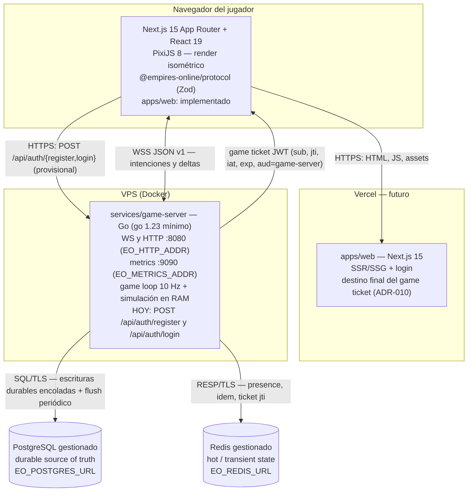
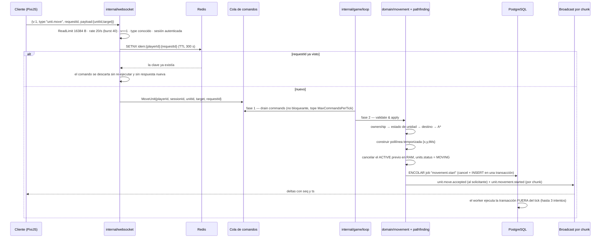

# Arquitectura — Vista general

Vista arquitectónica canónica de Empires Online: principios, componentes, capas de estado, layout del repositorio, reglas de dependencia y el recorrido completo de un comando a través del sistema.

Este documento es el punto de entrada técnico del proyecto. El **game server Go y el paquete `packages/protocol` ya existen, compilan y tienen su suite de tests en verde**; lo que existe desde hace poco es `apps/web/` (el cliente Next.js), que aquí se describe en futuro y como pendiente de su milestone. Cuando un detalle pertenece a otro documento se enlaza en lugar de duplicarlo.

---

## 1. Principios no negociables y su consecuencia de diseño

Los cuatro principios que determinan la forma del sistema. Cada uno tiene una consecuencia estructural concreta y verificable; si una propuesta de diseño viola uno de ellos, la propuesta se descarta, no el principio.

### P1 — Servidor autoritativo

> *"Client sends intent, server determines truth."*

El cliente nunca aporta estado autoritativo: ni posición final, ni HP, ni recursos, ni resultados de combate, ni ownership, ni cooldowns, ni ETA, ni paths.

**Consecuencia de diseño.** El protocolo cliente→servidor solo transporta **intenciones** (`unit.move { unitId, target }`), nunca resultados. Un comando de movimiento no incluye la ruta: la calcula el servidor. El cliente no tiene camino alguno para escribir en PostgreSQL ni en Redis; su única superficie de escritura es el conjunto cerrado de cinco mensajes cliente→servidor de la v1. Toda entrada se valida en el borde WebSocket (tamaño, versión, tipo conocido, rate limit) y otra vez en el dominio (ownership, estado, reglas). Ver [protocolo WebSocket v1](../specs/websocket-protocol.md).

### P2 — Mundo persistente

El mundo evoluciona sin jugadores conectados. **Ningún estado durable depende de un WebSocket vivo.**

**Consecuencia de diseño.** El game loop es un proceso independiente del transporte: corre a 10 Hz aunque haya cero conexiones. La sesión WebSocket es un *observador con permisos de escritura de intención*, no el propietario del estado. Un movimiento iniciado sobrevive a la desconexión de su dueño, al reinicio del proceso y al despliegue de una versión nueva, porque está persistido como polilínea temporizada en `unit_movements` y es analíticamente reconstruible. Ver [game loop](./game-loop.md) y [modelo de movimiento](../specs/movement.md).

### P3 — Offline ≠ mundo detenido

Desconectarse solo altera las reglas ligadas a la **presencia** del jugador; no congela sus entidades ni el mundo a su alrededor.

**Consecuencia de diseño.** La desconexión no es un evento de borrado ni de pausa: es una transición de estado explícita y persistida en `cities.presence_state` (`ONLINE → OFFLINE_PENDING → PROTECTED`) gobernada por los temporizadores del tick (fase 5). La transición la decide el game loop **en RAM**, comparando el tiempo transcurrido desde que el jugador se quedó sin sesiones contra `DisconnectGrace` (= `EO_PRESENCE_TTL_SECONDS`, 30 s); **no** se deriva de leer la expiración de la clave `presence:player:{playerId}` en Redis, que existe para observadores externos y para el futuro multiproceso. Un jugador con varias sesiones abiertas sigue `ONLINE` mientras le quede una. La protección de ciudad es una regla de gameplay declarada por el servidor, no un efecto colateral del cierre del socket. Ver [presencia y protección](../specs/presence.md).

### P4 — Capas de estado

**PostgreSQL = durable source of truth. Redis = hot/transient state. RAM del Game Server = simulación activa. Redis NUNCA sustituye a PostgreSQL.**

**Consecuencia de diseño.** Cada dato del sistema tiene exactamente **una** capa autoritativa, y esa asignación se documenta (sección 4). Perder Redis por completo debe costar sesiones, cachés y presencia, jamás una ciudad, una unidad o un movimiento. Perder la RAM (crash) debe costar como mucho el intervalo de flush diferido, nunca un hecho consumado. Ver [estrategia de persistencia](./persistence.md).

### Principios de proceso

Los otros dos principios del canon no describen la topología pero sí condicionan cada paquete del game server:

| # | Principio | Consecuencia de diseño |
|---|---|---|
| P5 | **Determinismo.** Nada de `time.Now()` ni `rand` dentro del dominio. | Interfaces `Clock` (`Now() time.Time`, `NowMs() int64`) y `RandomSource` **inyectadas** desde fuera. `FakeClock` en tests. Prohibido iterar mapas de Go sin ordenar: el desempate de A\* es estable por `(fCost, hCost, y, x)`. El mundo se genera determinísticamente desde `EO_WORLD_SEED`. Una simulación con las mismas entradas produce byte a byte el mismo estado. |
| P6 | **Spec-Driven Development.** | Flujo obligatorio: Requirement → Specification → Invariants → Design → Implementation → Unit → Integration → Contract → Docs → Review. Ningún cambio de comportamiento entra sin spec e invariantes con ID estable (`INV-MOVE-001`, `INV-CITY-001`, …). Ver [invariantes](../invariants/README.md) y [estrategia de testing](../testing/strategy.md). |

---

## 2. Diagrama de componentes

Cuatro piezas desplegables y ninguna más en el MVP: el cliente web en Vercel, el game server Go en un VPS, PostgreSQL gestionado y Redis gestionado. **Hoy sólo existen las tres últimas**: `apps/web/` ya tiene contenido: cliente WebSocket, store del mundo, transformaciones isométricas y escena PixiJS, con sus tests.



Notas de despliegue y frontera:

- El game server **no** se despliega en Vercel: necesita un proceso de larga vida con estado en RAM y un loop de 10 Hz. Vercel servirá el cliente cuando exista.
- **Alta y login son hoy del game server, no de Next.js.** `internal/httpapi` sirve `POST /api/auth/register` y `POST /api/auth/login` con bcrypt y emite el game ticket. Es explícitamente **provisional**: la arquitectura objetivo de [ADR-010](../decisions/ADR-010-authentication-game-ticket.md) los traslada a `apps/web`. Cuando eso ocurra, el único acoplamiento obligatorio entre `apps/web` y `services/game-server` será el secreto compartido `EO_AUTH_JWT_SECRET` con el que se firma y verifica el game ticket, más el contrato de mensajes de `@empires-online/protocol`.
- El navegador **nunca** ve credenciales de PostgreSQL ni de Redis. Los secretos viajan por variables de entorno y jamás al repositorio.
- El servidor **nunca** maneja píxeles. La proyección isométrica (`TILE_W = 64`, `TILE_H = 32`) es responsabilidad exclusiva del cliente.
- El detalle de fronteras, autenticación y modos degradados está en [system-context.md](./system-context.md).

---

## 3. Las tres capas de estado

```
┌──────────────────────────────────────────────────────────────────────┐
│  RAM del Game Server — SIMULACIÓN ACTIVA                             │
│  Grid del mundo, entidades vivas, conjuntos de interés, cola de       │
│  comandos, cola de persistencia. Volátil. Reconstruible desde         │
│  PostgreSQL en el arranque. Latencia: ns.                             │
└───────────────┬──────────────────────────────────────────────────────┘
                │ lee al arrancar / escribe asíncrono (fase 8 del tick)
                ▼
┌──────────────────────────────────────────────────────────────────────┐
│  PostgreSQL — DURABLE SOURCE OF TRUTH                                 │
│  Todo hecho consumado. Si no está aquí, no ocurrió. Latencia: ms.     │
└──────────────────────────────────────────────────────────────────────┘
                ▲
                │ nunca sustituye ni respalda a Postgres
┌───────────────┴──────────────────────────────────────────────────────┐
│  Redis — HOT / TRANSIENT STATE                                        │
│  Presencia, `jti` de tickets consumidos e idempotencia de corto       │
│  plazo. Todo con TTL. Pérdida tolerable: degrada disponibilidad,      │
│  nunca durabilidad.                                                   │
└──────────────────────────────────────────────────────────────────────┘
```

Regla operativa: **un dato pertenece a la capa más barata que preserve su garantía**, y solo a una. Cada documento de spec debe poder responder las cuatro preguntas del canon: *¿qué es autoritativo en RAM? ¿qué se persiste inmediatamente? ¿qué se persiste eventualmente? ¿qué es reconstruible?*

### 3.1 Clasificación de cada dato del MVP

| Dato | Capa autoritativa | Ubicación concreta | Estrategia de persistencia | Si se pierde |
|---|---|---|---|---|
| Terreno del mundo (`TerrainType` por tile) | Semilla + RAM | `world_chunks` (bytea de `chunk_size²` = 1024 B por chunk) guarda una **copia** | El mapa se **regenera desde `EO_WORLD_SEED` en cada arranque**; `world_chunks` se conserva para auditoría y para mapas editados en el futuro, no como fuente primaria | Regenerable desde la semilla |
| Grid del mundo cargado para consultas | RAM | Estructura de chunks del `world` | No se persiste | Recargable desde `world_chunks` |
| Capa de ocupación (`blocked overlay`) | RAM | Derivada de `cities` y edificios | No se persiste (no muta el terreno base) | Recomputable al arrancar |
| `epoch_ms`, semilla y dimensiones del mundo | PostgreSQL | `world_state` (`epoch_ms`, `seed`, `width`, `height`, `chunk_size`, `current_tick`) | Escrito en el bootstrap del mundo | Se pierde el origen temporal del mundo: crítico |
| `tickNumber` actual | RAM | `Loop.tick`, contador monótono | Se reanuda desde `world_state.current_tick` al arrancar y avanza en **exactamente 1 por tick ejecutado** | Se reanuda desde `world_state.current_tick` |
| Jugadores, civilizaciones, facciones, eras | PostgreSQL | `players`, `civilizations`, `factions`, `eras` | Write-through en creación | Pérdida inaceptable |
| Ciudades y su `presence_state` / `protection_until` | PostgreSQL | `cities` | Write-through en cada transición de presencia | Pérdida inaceptable |
| Unidades: ownership, tipo, `status` | PostgreSQL | `units` | Write-through en creación y en cambios de ownership/estado relevantes | Pérdida inaceptable |
| Posición consolidada de unidad, HP | PostgreSQL (diferido) | `units` (`x`, `y`, `status`, `chunk_x`, `chunk_y`) | Dirty-flag + flush cada `EO_PERSISTENCE_FLUSH_INTERVAL_TICKS=50` (5 s), en un único `UPDATE ... FROM unnest(...)` | Se pierde ≤ 5 s de consolidación; recuperable desde el movimiento activo |
| Posición **durante** un movimiento activo | RAM | Simulación | Autoritativa por derivación desde la polilínea; el flush puede escribir una posición intermedia, pero en la recuperación **prevalece** la derivada de `unit_movements` | Recomputable |
| Movimientos (polilínea temporizada, estado, `arrival_time_ms`) | PostgreSQL | `unit_movements` | Escritura durable **encolada** al iniciar, cancelar y finalizar; la ejecuta un worker fuera del tick | Pérdida inaceptable: rompe P2 |
| Sesión de juego establecida | PostgreSQL | `sessions` (tabla creada, **sin escritura en el MVP actual**) | Pendiente: hoy la sesión vive sólo en RAM (`internal/websocket`) y su presencia en Redis | Degradación de auditoría |
| Idempotencia de comandos (`unit.move`, `unit.cancel_move`) | Redis (hoy) | `idem:{playerId}:{requestId}`, TTL 300 s, marcador `"pending"` fijado con `SETNX` **antes** de ejecutar | El respaldo durable en `idempotency_keys` está **pendiente**: la tabla existe pero todavía no se escribe. Si Redis no responde, el comando **se ejecuta igualmente** (fail-open deliberado) | Riesgo de doble ejecución mientras Redis no responda o tras vaciarse |
| Versión de esquema aplicada | PostgreSQL | `schema_migrations` | Write-through por el migrador embebido | Arranque bloqueado |
| Territorios y control | PostgreSQL | `territories`, `territory_control` | Write-through (lógica mínima en MVP) | Pérdida inaceptable |
| Zonas seguras | PostgreSQL | `safe_zones` | Write-through (lógica mínima en MVP) | Pérdida inaceptable |
| Tratados y guarniciones | PostgreSQL | `treaties`, `garrisons` | Write-through (lógica diferida en MVP) | Pérdida inaceptable |
| Eventos de mundo | PostgreSQL | `world_events` | Write-through | Pérdida de historial |
| Presencia del jugador | Redis | `presence:player:{playerId}`, TTL `EO_PRESENCE_TTL_SECONDS=30`, heartbeat cada `EO_PRESENCE_HEARTBEAT_SECONDS=10` | Solo Redis | Los jugadores se consideran offline antes de tiempo; el estado de ciudad se recalcula |
| Consumo de game ticket (anti-replay) | Redis | `ticket:jti:{jti}`, TTL 120 s | Solo Redis | Un ticket podría reutilizarse dentro de sus 60 s de TTL |
| Locks distribuidos | — | — | **No se usan en el MVP**: el game server es un proceso único y su loop es el único escritor. Reservados a Redis para el futuro multiproceso: **TBD (fuera de MVP)** | — |
| Conjuntos de interés y suscripciones por chunk | RAM | Registro de sesiones | No se persiste | Se reconstruyen al reconectar |
| `seq` monótono por conexión | RAM | Conexión WS | No se persiste | Muere con la conexión (por diseño) |
| Contadores de rate limit por conexión | RAM | Conexión WS | No se persiste | Muere con la conexión |
| Cola de comandos y cola de persistencia | RAM | Loop y workers | No se persiste | Comandos en vuelo perdidos; los hechos consumados no |

Detalle completo de columnas y tipos en [esquema de base de datos](../database/schema.md); detalle de flush, workers y recuperación en [estrategia de persistencia](./persistence.md).

---

## 4. Layout del monorepo

Monorepo pnpm con un módulo Go dentro. Task runner: **pnpm scripts** (`pnpm run db:up`, `pnpm run server:test`…). **No hay Makefile**: `make` no está instalado en la máquina de desarrollo Windows.

```text
empires-online/
├── apps/web/                     # Next.js 15 + React 19 + PixiJS 8 — TODAVÍA VACÍO (milestone pendiente)
├── services/game-server/         # módulo Go — proceso independiente, autoritativo
│   ├── go.mod                    # module github.com/empires-online/empires-online/services/game-server
│   │                             # `go 1.23` es la versión MÍNIMA; el toolchain instalado es Go 1.27.0
│   ├── cmd/server/main.go
│   ├── internal/
│   │   ├── game/{loop,world,simulation,founding}
│   │   ├── domain/{player,city,unit,movement}
│   │   ├── pathfinding            # pathfinding.go + astar.go
│   │   ├── websocket              # hub.go, session.go, server.go
│   │   ├── protocol               # protocol.go, codes.go, schema.go + schema/v1/*.json embebidos
│   │   ├── persistence            # gamestore.go, queue.go, pgxalias.go
│   │   │   ├── postgres           # store, db, migrate, players, cities, units, movements, world, bootstrap, events
│   │   │   └── redis              # redis.go, presence.go, idempotency.go
│   │   ├── httpapi                # auth.go — /api/auth/register y /api/auth/login (provisional)
│   │   ├── auth                   # ticket.go — Verifier, Authenticator, Issuer, Claims
│   │   ├── clock                  # clock.go, random.go
│   │   ├── config
│   │   └── observability          # logging.go, metrics.go, health.go
│   └── migrations/               # 000001_initial_schema.{up,down}.sql, 000002_seed_catalogs.{up,down}.sql
│                                 # + embed.go (//go:embed *.sql)
├── packages/protocol/            # Zod = fuente de verdad del protocolo; exporta JSON Schema
├── infra/docker/                 # game-server.Dockerfile
├── scripts/                      # tareas (NO Makefile: make no está disponible en Windows)
├── docs/
├── docker-compose.yml            # postgres:16-alpine + redis:7-alpine con healthchecks
├── .env.example
├── pnpm-workspace.yaml           # apps/*, packages/*
└── .github/workflows/ci.yml
```

No existen (todavía) `internal/presence`, `internal/events`, `internal/domain/territory` ni `internal/domain/diplomacy`: la presencia vive en `internal/game/simulation` (fase 5 del tick) y en `internal/persistence/redis`, y los eventos de dominio se emiten directamente como mensajes de protocolo desde la simulación. Territorio y diplomacia existen sólo como tablas (`territories`, `territory_control`, `safe_zones`, `treaties`, `garrisons`) y como vistas del protocolo, sin lógica de dominio en el MVP.

| Ruta | Propósito |
|---|---|
| `apps/web/` | Cliente web **pendiente**. Renderizará el mundo isométrico con PixiJS 8 y consumirá `@empires-online/protocol` para tipar los mensajes. Será el **único** componente que conozca píxeles. |
| `services/game-server/` | Módulo Go `github.com/empires-online/empires-online/services/game-server`. Proceso autoritativo de larga vida: loop, simulación, WebSocket, persistencia. |
| `services/game-server/cmd/server/` | Punto de entrada ejecutable: lee configuración, aplica migraciones, abre pools, rehidrata el mundo, arranca loop, WS, métricas y apagado ordenado. Sin lógica de negocio. |
| `internal/game/loop` | `Loop.Run` (driver con calendario absoluto) y `Loop.Step` (un tick, ocho fases). Nunca hace I/O bloqueante contra PostgreSQL. |
| `internal/game/world` | Grid, chunks (`EO_CHUNK_SIZE=32`), capa de ocupación (`blocked overlay`) y generación determinista desde `EO_WORLD_SEED`. |
| `internal/game/simulation` | Estado en RAM, comandos, avance de movimiento, temporizadores, snapshots, interest management e hidratación tras reinicio. |
| `internal/game/founding` | `FindSite`: emplazamiento determinista de la ciudad inicial (espiral desde una semilla derivada del nombre de usuario). |
| `internal/domain/player` | Identidad del jugador, `Civilization` (con `Traits`) y `Faction` como ejes ortogonales. |
| `internal/domain/city` | `City`, `PresenceState`, `CanTransition`, `ShouldEngageProtection`, era y `population_limit`. |
| `internal/domain/unit` | `Unit`, `Status` (`IDLE`, `MOVING`, `GARRISONED`, `HIDDEN`, `DEAD`), `Type`, `Definition` y catálogo. |
| `internal/domain/movement` | `Waypoint`, `TimedPath`, `Movement`, `BuildTimedPath` y `Validate`: construcción y evaluación de la polilínea temporizada. |
| `internal/pathfinding` | A\* sobre grid, 8 direcciones sin corner cutting, costes enteros (`costScaleOrtho = 1000`, `costScaleDiag = 1414`) y heurística octile ponderada por `MinTerrainCostUnits` = **6** (ROAD). Desempate determinista `(f, h, y, x)`. Detrás de la interfaz `Pathfinder`. |
| `internal/websocket` | Upgrade, handshake, envelopes, `seq`, límite de lectura y rate limit, ping/timeout, códigos de cierre, difusión por chunk. |
| `internal/protocol` | Envelopes, payloads, catálogo de 22 códigos de error, códigos de cierre y espejo embebido de los JSON Schema de `packages/protocol`. |
| `internal/persistence` | `GameStore` (implementa `simulation.Repositories`) y `Queue`: la cola de escrituras durables con workers, reintentos y compensación. |
| `internal/persistence/postgres` | Repositorios, transacciones, migrador embebido, bootstrap de jugador. |
| `internal/persistence/redis` | Presencia, `jti` de tickets consumidos e idempotencia de corto plazo. |
| `internal/httpapi` | `POST /api/auth/register` y `POST /api/auth/login` con bcrypt. **Provisional**: ADR-010 los traslada a `apps/web`. |
| `internal/auth` | Verificación del game ticket: firma HS256, `exp`, `aud`, consumo de `jti`. Incluye un `Issuer` para desarrollo y tests. |
| `internal/clock` | `Clock`, `SystemClock`, `FakeClock` y `RandomSource`: los puertos que hacen determinista la simulación. |
| `internal/config` | Carga y validación agregada de todas las variables `EO_*`. Punto único de valores de gameplay. |
| `internal/observability` | `log/slog` en JSON, métricas Prometheus, `/health` y `/ready`. |
| `services/game-server/migrations/` | Migraciones SQL versionadas `NNNN_nombre.up.sql` / `.down.sql`, embebidas con `//go:embed` y aplicadas con golang-migrate. |
| `packages/protocol/` | Paquete npm `@empires-online/protocol`. Esquemas Zod en `src/v1/` y JSON Schema exportado a `schema/v1/*.json`. |
| `infra/docker/` | Dockerfiles e imágenes de servicio. |
| `scripts/` | Tareas invocadas por pnpm scripts (arranque de dependencias, migraciones, generación de esquemas, utilidades de desarrollo). |
| `docs/` | Esta documentación. |
| `docker-compose.yml` | PostgreSQL y Redis locales para desarrollo e integración. Requiere Docker Desktop iniciado. |
| `pnpm-workspace.yaml` | Declaración del workspace (`apps/*`, `packages/*`). |
| `.github/workflows/ci.yml` | Pipeline `format → lint → typecheck → unit → integration → build → docker build`. |

---

## 5. Reglas de dependencia

El dominio es el centro y no depende de nada de infraestructura. La inversión de dependencias apunta **hacia adentro**: las capas externas implementan interfaces declaradas por las internas.

```
        ┌──────────────────────────────────────────────────────────────┐
        │  ADAPTADORES (borde, sucios, reemplazables)                  │
        │  websocket · persistence/postgres · persistence/redis        │
        │  observability · config · cmd/server                         │
        └───────────────┬──────────────────────────────────────────────┘
                        │ implementan puertos declarados adentro
                        ▼
        ┌──────────────────────────────────────────────────────────────┐
        │  APLICACIÓN / SIMULACIÓN                                     │
        │  game/loop · game/world · game/simulation · game/founding    │
        │  auth · protocol                                             │
        │  Orquesta: drena comandos, invoca dominio, emite eventos,    │
        │  encola persistencia. No sabe qué es SQL ni un socket.       │
        └───────────────┬──────────────────────────────────────────────┘
                        │ usa tipos y reglas puras
                        ▼
        ┌──────────────────────────────────────────────────────────────┐
        │  DOMINIO (puro, determinista, testeable sin Docker)          │
        │  player · city · unit · movement                             │
        │  + pathfinding (algoritmo puro) + clock (Clock, RandomSource)│
        │  Los puertos de escritura durable los declara el consumidor: │
        │  simulation.Repositories, simulation.Persister,              │
        │  simulation.Broadcaster.                                     │
        └──────────────────────────────────────────────────────────────┘

        Las flechas de import van SIEMPRE de arriba hacia abajo.
        Un import de abajo hacia arriba es un defecto de arquitectura.
```

Reglas concretas y verificables:

1. **`internal/domain/**` no importa** `database/sql`, ningún driver de PostgreSQL, ningún cliente de Redis, `net/http`, ninguna librería de WebSocket, ni `internal/config`. Es un test de arquitectura ejecutable en CI: inspeccionar los imports del árbol de dominio.
2. **`internal/domain/**` no llama a `time.Now()` ni a `math/rand`.** Recibe `Clock` y `RandomSource`. Esto es lo que hace posible el nivel de test *simulation* ("avanza 10 s con `FakeClock`, asserta estado exacto") y el nivel *recovery*.
3. **Los puertos de persistencia los declara el consumidor**, no el paquete que los implementa: `simulation.Repositories` (`PersistMovementStart`, `PersistMovementFinish`, `PersistUnitPositions`, `PersistCityPresence`) vive en `internal/game/simulation` y lo implementa `internal/persistence.GameStore` sobre PostgreSQL. La simulación ve la interfaz, nunca `*pgxpool.Pool`.
4. **El pathfinder se consume por interfaz**: `FindPath(ctx, grid Grid, from, to world.Tile, opts Options) ([]world.Tile, error)`. La ruta devuelta **incluye el tile de origen** y `from == to` devuelve una ruta de un solo tile sin error. Sustituir A\* por Hierarchical A\* no toca ni el protocolo ni el dominio.
5. **El protocolo no entra al dominio.** `internal/websocket` traduce envelopes JSON a comandos de dominio y eventos de dominio a mensajes salientes. Un cambio de nombre de mensaje no puede propagarse a `internal/domain`.
6. **Los valores de gameplay se leen una sola vez** en `internal/config` y se inyectan. Ningún valor de gameplay se hardcodea en más de un lugar.
7. **La composición ocurre solo en `cmd/server`**: es el único punto que conoce simultáneamente PostgreSQL, Redis, WebSocket y dominio.

---

## 6. Recorrido completo de un comando `unit.move`

Trazado de una intención desde el clic hasta el delta de red, atravesando las cuatro capas. Los números de fase corresponden al orden fijo del tick descrito en [game-loop.md](./game-loop.md).



> **Nota de honestidad sobre el orden.** La confirmación al cliente se emite **antes** del `COMMIT`, no después: el tick no puede esperar a PostgreSQL sin violar la regla de "cero I/O bloqueante en el tick". La ventana de riesgo es real y está documentada en [estrategia de persistencia](./persistence.md): si el proceso muere entre la aceptación y el `COMMIT` —típicamente pocas decenas de milisegundos— ese movimiento se pierde y la unidad queda en su última posición consolidada. Es un RPO documentado, no un descuido.

### 6.1 Paso a paso

**1. Cliente.** El jugador hace clic en un tile. El cliente convierte de píxeles a coordenadas lógicas (inversa de la proyección isométrica) y emite el envelope `{ v: 1, type: "unit.move", requestId, payload: { unitId, target: { x, y } } }` con `requestId` UUIDv4. **No envía ruta ni posiciones intermedias.** Opcionalmente muestra un *feedback* optimista puramente visual, que se descarta en cuanto llega la verdad del servidor.

**2. Borde WebSocket (`internal/websocket`).** En orden: `SetReadLimit(EO_WS_MAX_MESSAGE_BYTES=16384)` sobre el socket, aplicado **antes** del handshake, de modo que un frame mayor corta la conexión; rate limit `EO_WS_RATE_LIMIT_PER_SECOND=20` con burst `EO_WS_RATE_LIMIT_BURST=40` en un cubo de fichas por conexión (al agotarse: `system.error{RATE_LIMITED}` y cierre `4429`); `v == 1` (si no, `UNSUPPORTED_VERSION`); `type` dentro de la lista cerrada y payload decodificable (si no, `INVALID_MESSAGE`); la sesión ya está autenticada porque el handshake exige `session.hello` como primer mensaje (si no, cierre `4401`). La validación en runtime se hace en Go a mano por rendimiento; el JSON Schema exportado por `packages/protocol` se embebe con `go:embed` y se usa en los *contract tests*.

**3. Barrera de idempotencia.** Se reserva `idem:{playerId}:{requestId}` en Redis con `SETNX` y TTL 300 s **antes** de ejecutar. Un `requestId` repetido **no se re-ejecuta**: el comando se descarta silenciosamente y el cliente reconcilia con el siguiente snapshot. Si Redis no responde, el comando **se ejecuta igualmente**: se prefiere jugar a bloquear al jugador. El respaldo durable en `idempotency_keys` está pendiente; hoy la deduplicación es exclusivamente de Redis.

**4. Encolado.** Se construye el comando de dominio `MoveUnit` y se deposita en la cola no bloqueante del loop (capacidad 8192). El borde WebSocket **no** ejecuta lógica de juego ni toca PostgreSQL. Si la cola está saturada el comando se descarta y se registra como error; para el snapshot, que sí espera respuesta, el servidor responde `system.error { code: "INTERNAL_ERROR" }` (no existe código específico de backpressure en la v1).

**5. Fases 1–2 del tick (`drain commands`, `validate & apply`).** El dominio valida en orden estricto y corta en el primer fallo. La propiedad se comprueba antes que cualquier otra cosa, para que un jugador no pueda deducir el estado de unidades ajenas a partir de qué error recibe:

| Comprobación | Código de error |
|---|---|
| La unidad existe | `UNIT_NOT_FOUND` |
| La unidad pertenece al jugador de la sesión | `UNIT_NOT_OWNED` |
| La unidad no está `DEAD` | `UNIT_DEAD` |
| La unidad no está `GARRISONED` | `UNIT_GARRISONED` |
| El estado admite movimiento (resto de casos) | `UNIT_NOT_MOVABLE` |
| `0 ≤ x < EO_WORLD_WIDTH` y `0 ≤ y < EO_WORLD_HEIGHT` | `TARGET_OUT_OF_BOUNDS` |
| El tile destino es transitable (terreno + capa de ocupación) | `TARGET_NOT_WALKABLE` |
| Distancia Chebyshev ≤ `EO_PATHFINDING_MAX_DISTANCE=256`, comprobada dentro del A\* **antes** de expandir nodos | `PATH_TOO_LONG` |
| El A\* no agota el presupuesto `EO_PATHFINDING_MAX_NODES=20000` | `PATH_TOO_LONG` |
| El A\* alcanza el destino (el conjunto abierto no se vacía antes) | `PATH_NOT_FOUND` |

Detalles que el código fija y que conviene no idealizar:

- Si el origen autoritativo ya coincide con el destino, el comando **se acepta sin crear movimiento**: se cancela el movimiento en curso, se responde `unit.move.accepted` con `movementId = 0` y no se emite `unit.movement.started`. Evita polilíneas degeneradas de un solo punto.
- El origen del camino es la posición **autoritativa en este instante** (derivada de la polilínea si la unidad ya se movía), no la posición consolidada en `units`.
- El rechazo produce **únicamente** `unit.move.rejected { unitId, code, message }`. No se emite además un `system.error`: los errores de dominio de este comando son su respuesta tipada.
- `INVALID_TARGET` existe en el catálogo de códigos, pero el flujo de `unit.move` no lo emite: un payload sin destino válido se rechaza antes, en el borde WebSocket, con `INVALID_MESSAGE`.

El MVP **rechaza** un destino intransitable en lugar de buscar un tile cercano. El movimiento diagonal solo se permite si ambos tiles ortogonales adyacentes son transitables (prohibido el *corner cutting*).

**6. Construcción de la polilínea y escritura durable.** A\* devuelve la secuencia de tiles (incluido el origen); el dominio la convierte en waypoints `{x, y, tMs}`, siendo el primero el origen con `tMs = 0`. La duración de cada segmento es aritmética entera exacta, **redondeada al milisegundo más cercano segmento a segmento y sólo después acumulada**:

```go
ms := (baseMsPerTile*costUnits + 5) / 10          // world.CostBase = 10
if diagonal { ms = (ms*1414214 + 500000) / 1000000 }   // √2 en punto fijo
if ms < 1 { ms = 1 }
```

Con `VILLAGER` (`baseMsPerTile = 600`): GRASSLAND 600 / 849 ms, FOREST 960 / 1358, HILL 1080 / 1527, ROAD 360 / 509 (ortogonal / diagonal).

En RAM se cancela el movimiento `ACTIVE` anterior de esa unidad, se registra el nuevo y `units.status` pasa a `MOVING`. La transacción equivalente (`UPDATE ... SET status='CANCELLED'` + `INSERT INTO unit_movements ... 'ACTIVE'`) **se encola** como trabajo durable (`movement.start`) y la ejecuta un worker fuera del tick, con hasta 3 intentos y backoff; si se agotan, se registra como error y se invoca `OnPermanentFailure`, que hoy **sólo registra**: la compensación real —detener la unidad en RAM— sigue pendiente. El índice único parcial `unit_movements_one_active_per_unit` es la última línea de defensa del invariante en la propia base de datos.

**7. Fase 3 en ticks sucesivos (`advance movement`).** La posición autoritativa en el instante `T` es el último waypoint con `tMs <= (T - start_time_ms)`. Es **analíticamente reconstruible**: no requiere replay de ticks y no se persiste por tick. La interpolación sub-tile es exclusivamente visual, en el cliente; el servidor razona en tiles.

**8. Emisión de deltas (fases 6–7).** Al solicitante se le envía `unit.move.accepted` con su `requestId`; a los suscriptores del chunk de origen, `unit.movement.started` con la polilínea completa. Durante el trayecto se emiten `entity.update` al chunk de la posición nueva. Al alcanzar el último waypoint: `unit.movement.completed` y `units.status = IDLE`. Los deltas **se emiten en el momento en que el hecho ocurre**, dentro de la fase que lo produce, no en una fase de volcado separada; el orden que ve el cliente es por tanto el orden de las fases. La suscripción por chunk se recalcula en `Hub.Subscribe` cuando llega un `session.view` (`EO_INTEREST_RADIUS_CHUNKS=2` alrededor del centro de vista), que devuelve los chunks que entran y los que salen. Si el comando fue rechazado, el solicitante recibe `unit.move.rejected` con el `code` correspondiente; los errores de transporte o de protocolo viajan como `system.error { code, message, details? }`. La lógica de control del cliente usa **siempre** `code`, jamás el texto humano.

**9. Fase 8 (`enqueue persistence`).** Cada `EO_PERSISTENCE_FLUSH_INTERVAL_TICKS=50` ticks (5 s) se drena el *dirty-set* de unidades y se encola un único trabajo de volcado por lote. El tick **nunca** ejecuta I/O bloqueante contra PostgreSQL: encola y sigue. `eo_persistence_queue_depth` vigila la contrapresión y `eo_game_tick_overruns_total` detecta ticks que exceden los 100 ms.

**10. Recuperación tras crash.** Al arrancar, `simulation.Hydrate` carga los movimientos `ACTIVE` y resuelve cada uno en O(1): si `arrival_time_ms <= now`, la unidad aparece en el destino y el movimiento se cierra como `COMPLETED`; si sigue en curso, se reanuda desde la polilínea; y si la polilínea ya no es válida contra el mundo actual, el movimiento se cierra como `FAILED` y la unidad se queda en su última posición consolidada — nunca se teletransporta a nadie por un dato dudoso. Ningún jugador necesita estar conectado para que esto ocurra: es P2 en funcionamiento.

Especificación normativa completa en [../specs/movement.md](../specs/movement.md) y [pathfinding](./pathfinding.md).

---

## 7. Decisiones arquitectónicas clave

Cada decisión estructural vive en su propio ADR con contexto, alternativas descartadas y consecuencias. Índice en [../decisions/README.md](../decisions/README.md).

| ADR | Decisión | Resumen |
|---|---|---|
| [ADR-001](../decisions/ADR-001-game-server-language.md) | Lenguaje del game server: **Go** (`go 1.23` mínimo en `go.mod`; toolchain instalado 1.27.0) | Un proceso de larga vida con loop de 10 Hz, miles de conexiones y estado en RAM; Go da goroutines, GC de baja pausa, binario único y despliegue trivial en contenedor. Requiere instalar Go en la máquina de desarrollo (`winget install --id GoLang.Go`). |
| [ADR-002](../decisions/ADR-002-authoritative-server.md) | **Servidor autoritativo** | El cliente envía intención; el servidor determina la verdad. Elimina por construcción una clase entera de trampas y hace del cliente una vista reemplazable. |
| [ADR-003](../decisions/ADR-003-postgresql-source-of-truth.md) | **PostgreSQL como source of truth** | Todo hecho consumado se persiste transaccionalmente. Transacciones, constraints y concurrencia optimista (`version`) por encima de rendimiento bruto. |
| [ADR-004](../decisions/ADR-004-redis-hot-state.md) | **Redis como hot state** | Presencia con TTL, `jti` de tickets, idempotencia de corto plazo, locks y caché. Redis nunca sustituye a PostgreSQL: su pérdida degrada disponibilidad, no durabilidad. |
| [ADR-005](../decisions/ADR-005-pixijs-renderer.md) | **PixiJS 8 como renderer** | Render WebGL 2D con batching para la vista isométrica; el cliente es la única capa que conoce píxeles (`TILE_W = 64`, `TILE_H = 32`). |
| [ADR-006](../decisions/ADR-006-websocket-protocol.md) | **Protocolo WebSocket JSON versionado** | WSS + JSON UTF-8 con `"v": 1` explícito en cada mensaje y envelopes fijos. Legibilidad y velocidad de iteración por encima de un formato binario; la versión permite romper sin romper. |
| [ADR-007](../decisions/ADR-007-game-loop-frequency.md) | **Game loop a 10 Hz** | `EO_TICK_RATE_HZ=10`, período 100 ms, ocho fases en orden fijo. Suficiente para un MMORTS de movimiento por tiles y barato en CPU; el determinismo importa más que la frecuencia. |
| [ADR-008](../decisions/ADR-008-grid-coordinate-system.md) | **Coordenadas y chunks** | Grid 512×512 de tiles `int32`, chunks de 32×32 (`chunkX = x / EO_CHUNK_SIZE`), 256 chunks en MVP. El chunk es la unidad de interés, de difusión y de persistencia del terreno. |
| [ADR-009](../decisions/ADR-009-shared-protocol-package.md) | **Zod como fuente del protocolo, JSON Schema exportado** | Los esquemas viven en `packages/protocol/src/v1/`; el build exporta JSON Schema a `schema/v1/*.json` y el game server los embebe con `go:embed` para *contract tests*. Un solo lugar donde cambiar un mensaje. |
| [ADR-010](../decisions/ADR-010-authentication-game-ticket.md) | **Autenticación por game ticket JWT efímero** | JWT HS256 de 60 s, consumido una sola vez vía `ticket:jti:{jti}` en Redis. La sesión de usuario no cruza la frontera del game server. |
| [ADR-011](../decisions/ADR-011-movement-timed-polyline.md) | **Movimiento como polilínea temporizada persistida** | Waypoints `{x, y, tMs}` en `unit_movements`. La posición es una función analítica del tiempo: sobrevive a crashes, no requiere replay y no exige persistir cada tick. |
| [ADR-012](../decisions/ADR-012-database-migrations.md) | **Migraciones SQL versionadas embebidas** | `NNNN_nombre.up.sql` / `.down.sql` embebidas en el binario y aplicadas al arrancar contra `schema_migrations`. El esquema viaja con la versión que lo necesita, sin depender de `psql` (no instalado en la máquina de desarrollo). |

---

## 8. Alcance: lo que este diseño NO incluye

**Fuera de MVP**, y por tanto no diseñado como si existiera: combate completo, economía completa, árbol tecnológico completo, cientos de tipos de unidad, crafting, quests, NPCs complejos, marketplace, chat avanzado, ranking, IA avanzada, unidades navales (`WATER` está bloqueado) y clanes. La fase 4 del tick (`resolve simulation`) queda reservada para combate pero vacía en el MVP. Las tablas `technologies`, `civilization_technologies`, `trade_routes`, `caravans`, `markets`, `trade_transactions` y `clans` existen solo como diseño, sin migración.

Secuencia de entrega en [../roadmap/milestones.md](../roadmap/milestones.md): M0 Foundation · M1 World · M2 Player & City · M3 Realtime · M4 Movement · M5 Offline protection & Safe Zones · M6 Territories · M7 Diplomacy foundation.

---

## 9. Documentos relacionados

- [Contexto de sistema y fronteras](./system-context.md)
- [Game loop y fases del tick](./game-loop.md)
- [Estrategia de persistencia](./persistence.md)
- [Protocolo WebSocket v1](../specs/websocket-protocol.md)
- [Pathfinding](./pathfinding.md)
- [Esquema de base de datos](../database/schema.md)
- [Invariantes](../invariants/README.md)
- [Spec de movimiento](../specs/movement.md) · [Spec de presencia y protección](../specs/presence.md)
- [Estrategia de testing](../testing/strategy.md)
- [Desarrollo local](../operations/local-development.md) · [Despliegue](../operations/deployment.md) · [Monitorización](../operations/monitoring.md)
