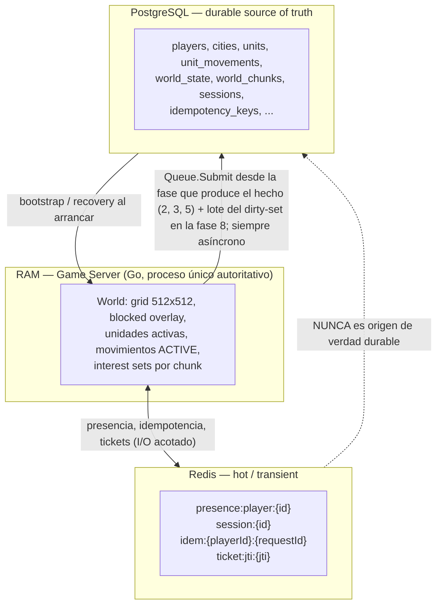

# Persistencia — Visión arquitectónica

Propósito: definir las tres capas de estado de Empires Online, el contrato de cada una, qué dato del MVP vive en cada capa, cómo el dominio accede a ellas mediante repositorios y qué operaciones exigen atomicidad transaccional.

---

## 1. Alcance y principio rector

Este documento describe la **arquitectura** de la persistencia: capas, contratos, límites de módulo y unidades de trabajo transaccionales. La **operativa** (dirty-set, flush por lotes, cola, backpressure, recuperación tras crash, RPO) vive en [../database/persistence-strategy.md](../database/persistence-strategy.md). El DDL concreto (columnas, índices, constraints) vive en [../database/schema.md](../database/schema.md).

El principio no negociable del que se deriva todo lo demás:

> **PostgreSQL = durable source of truth. Redis = hot/transient state. RAM del Game Server = simulación activa. Redis NUNCA sustituye a PostgreSQL.**

Este documento describe **lo que existe** en `services/game-server/internal/persistence/` (`gamestore.go`, `queue.go`, `postgres/`, `redis/`) y marca explícitamente lo que todavía es diseño objetivo. Donde el código y el diseño no coinciden, se dice cuál es cuál en lugar de escribir el diseño como si estuviera hecho.

---

## 2. Las tres capas



### 2.1 Contrato de cada capa

| Capa | Es autoritativa para | Latencia objetivo | Puede perderse | Quién escribe |
|---|---|---|---|---|
| **RAM (Game Server)** | El estado del mundo **durante el tick actual**: posición derivada de la polilínea, ocupación, interest sets, colas de comandos | ns–µs | Sí, al reiniciar el proceso | Únicamente la goroutine del game loop (single-writer, sin mutexes: el aislamiento es por diseño) |
| **Redis** | Nada durable. Estado *derivable* o *de corta vida*: presencia, idempotencia de corto plazo, `jti` consumidos | < 1 ms | Sí, por diseño (todo tiene TTL) | Game Server; en la arquitectura objetivo, también el emisor del ticket en `apps/web` |
| **PostgreSQL** | Todo estado durable: jugadores, ciudades, unidades, movimientos, mundo, catálogos | ms | **No.** Es la línea de recuperación | Los **workers de la cola de persistencia** (`persistence.Queue`, 4 workers), siempre fuera del tick; y, fuera del camino del tick, el handler HTTP de alta (`internal/httpapi`), que ejecuta la transacción de bootstrap de forma **síncrona** en su propia goroutine antes de tocar el mundo en RAM |

Reglas de frontera:

1. El tick **nunca** ejecuta I/O bloqueante contra PostgreSQL: encola, y unos workers escriben a su ritmo. `Queue.Submit` no bloquea jamás; si la cola está llena, descarta el trabajo, lo registra como error e invoca la compensación.
2. Ninguna decisión de gameplay se toma leyendo Redis dentro del tick. En particular, la máquina de presencia de la fase 5 es **enteramente aritmética sobre RAM**: cuenta sesiones vivas y compara marcas temporales; no consulta la expiración de ninguna clave.
3. El estado de RAM **debe** poder reconstruirse enteramente desde PostgreSQL —y, para el terreno, desde `EO_WORLD_SEED`— en el arranque. Si un dato no es reconstruible y no está persistido, es un bug de diseño.
4. **La confirmación al cliente precede al `COMMIT`.** Es la contrapartida honesta de la regla 1: no se puede tener a la vez "cero I/O en el tick" y "commit antes de responder" con un único hilo autoritativo. La ventana de riesgo —si el proceso muere entre la aceptación y el `COMMIT`, típicamente pocas decenas de milisegundos, ese movimiento se pierde y la unidad queda en su última posición consolidada— es un **RPO documentado**, no un descuido. Ver §8.3, §9 y [../database/persistence-strategy.md](../database/persistence-strategy.md).

---

## 3. Por qué Redis no reemplaza a PostgreSQL

La tentación es evidente: Redis es rápido, tiene TTL nativo, y el estado del mundo cabría en memoria. Se rechaza por razones concretas, no estéticas:

| Motivo | Consecuencia si se usara Redis como SoT |
|---|---|
| **Durabilidad probabilística** | `appendfsync everysec` pierde hasta ~1 s de escrituras confirmadas; RDB pierde el intervalo entre snapshots. Un movimiento aceptado y confirmado al cliente podría desaparecer: viola el principio de servidor autoritativo (canon §1.1), porque el cliente habría observado una verdad que el servidor luego niega. |
| **Sin transacciones multi-entidad reales** | `MULTI/EXEC` no permite leer-decidir-escribir con aislamiento; Lua es atómico pero no compone con validaciones de dominio. Operaciones como *crear jugador + ciudad + 3 aldeanos* o *cancelar el movimiento anterior + crear el nuevo* dejarían de ser atómicas (§6 de este documento). |
| **Sin integridad referencial ni CHECK** | Los enums de dominio son `text` + `CHECK` (canon §11). Sin ellos, un `units.status` inválido se detectaría meses después, en producción. |
| **Sin consultas relacionales** | Recuperación tras crash, auditoría, analítica de mundo y migraciones (`schema_migrations`) requieren `JOIN`, índices compuestos y planificador. |
| **Sin esquema versionado** | La evolución del mundo depende de migraciones `NNNN_nombre.up.sql/.down.sql`. Redis no tiene equivalente auditable. |
| **Coste de memoria** | El mundo persistente crece indefinidamente (mundo 512×512, historial de movimientos, `world_events`). Un SoT que debe caber en RAM es un techo de producto. |

Inversamente, **PostgreSQL tampoco reemplaza a Redis**: escribir un heartbeat de presencia cada 10 s por jugador, o un `jti` consumido con TTL de 120 s, generaría tuplas muertas y presión de autovacuum sin aportar durabilidad útil — son datos cuya pérdida es aceptable y cuya expiración automática es la funcionalidad deseada.

Esta sección es el razonamiento que sostiene [`INV-PERSIST-003`](../invariants/persistence.md) — *Ningún dato durable existe solo en Redis* —, no un invariante propio: el enunciado y su ID viven en el registro de `docs/invariants/`, que es la única numeración válida.

---

## 4. Qué vive en cada capa — dato por dato del MVP

Tabla exhaustiva del vertical slice. `SoT` = source of truth.

| Dato del MVP | RAM | Redis | PostgreSQL | SoT | Notas |
|---|---|---|---|---|---|
| **Posición de unidad (en reposo, `IDLE`)** | sí (`x`, `y` int32) | no | `units.x`, `units.y`, `chunk_x`, `chunk_y` | PostgreSQL | Consolidada por dirty-set + flush cada `EO_PERSISTENCE_FLUSH_INTERVAL_TICKS`=50 ticks, en un único `UPDATE ... FROM unnest(...)`. |
| **Posición de unidad durante un movimiento `ACTIVE`** | sí (derivada) | no | se escribe en el flush, pero **no es la fuente** | Reconstruible | Se deriva analíticamente de la polilínea: último waypoint con `tMs <= (T - start_time_ms)`. Ver la nota sobre `INV-PERSIST-004` en §9. |
| **Movimiento activo (polilínea, `start_time_ms`, `arrival_time_ms`, `status`)** | sí (copia caliente) | no | `unit_movements` (`path jsonb`, `target_x`, `target_y`, `start_time_ms`, `arrival_time_ms`, `status`, `finished_at`) | PostgreSQL | Escritura durable **encolada** al crear, cancelar y completar; la transacción la ejecuta un worker fuera del tick. |
| **Estado de unidad (`units.status`: IDLE / MOVING / GARRISONED / HIDDEN / DEAD)** | sí | no | `units.status` | PostgreSQL | Se consolida con el mismo flush por lotes que la posición, no con la transacción del movimiento. |
| **HP de unidad** | sí | no | `units.hp` | PostgreSQL | Dirty-set + flush. Sin combate en MVP: cambia poco, por eso es candidato natural al flush diferido. |
| **Presencia del jugador** | sí (contador de sesiones vivas y marca de desconexión) | `presence:player:{playerId}` (TTL 30 s) | no (derivada) | RAM para la decisión; Redis para la visión externa | La máquina de presencia del tick **no lee Redis**. La consecuencia durable —la transición de estado de la ciudad— sí se persiste. |
| **Sesión (conexión WS viva, `seq`, chunks suscritos)** | sí (`seq`, `chunks`, `terrainSent`) | no | `sessions` (**tabla creada, sin escritura hoy**) | RAM | `seq` es monótono **por conexión**: se reinicia con la conexión y no se persiste. Escribir la fila de `sessions` es trabajo pendiente. |
| **Ownership de ciudad (`cities.owner_player_id`)** | cacheado | no | `cities` | PostgreSQL | Se escribe en el bootstrap del jugador, dentro de su transacción atómica. No hay cambio de ownership en el MVP. |
| **Estado de protección (`cities.presence_state`, `last_online_at`, `last_offline_at`, `protection_until`)** | sí (máquina de estados en fase 5) | no | `cities` | PostgreSQL | Cada transición `ONLINE → OFFLINE_PENDING → PROTECTED` encola su escritura durable. |
| **Chunks del mapa (terreno)** | sí (grid completo en memoria) | no | `world_chunks` (bytea de `chunk_size²` = 1024 B/chunk, 256 chunks) | **La semilla**: el mapa se regenera desde `EO_WORLD_SEED` en cada arranque | `world_chunks` guarda una copia para auditoría y para permitir mapas editados en el futuro; **no** es la fuente primaria. |
| **Blocked overlay (ocupación por ciudades/edificios)** | sí | no | derivado de `cities` | Reconstruible | Se recalcula al arrancar desde las entidades que ocupan tiles; no se persiste como capa propia. Fundar una ciudad **no muta el terreno de debajo**. |
| **Idempotencia de comandos** | no | `idem:{playerId}:{requestId}` (TTL 300 s) | `idempotency_keys` (**tabla creada, sin escritura hoy**) | Redis en el MVP actual | El doble registro es el diseño objetivo y sigue siendo el destino; hoy vaciar Redis abre una ventana de doble ejecución de 0 s a 300 s. Si Redis **no responde**, el comando se ejecuta igualmente (fail-open deliberado, §8.2). |
| **`jti` de game ticket consumido** | no | `ticket:jti:{jti}` (TTL 120 s) | no | Redis | Anti-replay del handshake. Ver §8.2 para la degradación. |
| **Interest sets / suscripciones por chunk** | sí | no | no | Reconstruible | Se recalculan desde `session.view` y la posición de la ciudad al reconectar. |
| **`tickNumber` / `epoch_ms`** | sí (`tickNumber` en RAM) | no | `world_state.current_tick`, `world_state.epoch_ms` | PostgreSQL | El loop **reanuda** el contador desde `current_tick`; el instante de simulación lo aporta el `Clock`, no una fórmula sobre el contador. |
| **Eventos de dominio emitidos** | no se bufferizan | no | `world_events` (**tabla creada, sin escritura hoy**) | — | La simulación emite mensajes de protocolo directamente; no hay bus de eventos de dominio separado en el MVP. |

Tablas creadas en MVP con lógica mínima o diferida (`territories`, `territory_control`, `safe_zones`, `treaties`, `garrisons`, `world_events`): su contrato de persistencia será write-through cuando se activen; **no** participan del dirty-set.

---

## 5. Patrón de repositorios

### 5.1 Regla de dependencias

```
internal/domain/{player,city,unit,movement}   internal/clock
        │  tipos y reglas puras; Clock y RandomSource
        │  NO importa pgx, NO importa redis, NO importa net/http
        ▼
internal/game/simulation
        │  declara EN EL CONSUMIDOR lo que necesita:
        │  Repositories, Persister, Broadcaster
        ▼
internal/persistence (GameStore, Queue) · internal/persistence/{postgres,redis} · internal/websocket
        implementan esas interfaces
```

La interfaz de persistencia **se declara donde se consume**, no donde se implementa. Es una decisión deliberada de Go: el paquete que necesita algo dice exactamente qué necesita, y la infraestructura se adapta.

```go
// internal/game/simulation/simulation.go
type Repositories interface {
    PersistMovementStart(ctx context.Context, m *movement.Movement) error
    PersistMovementFinish(ctx context.Context, movementID int64, status movement.Status) error
    PersistUnitPositions(ctx context.Context, units []*unit.Unit) error
    PersistCityPresence(ctx context.Context, cityID int64, state city.PresenceState, at time.Time) error
}
```

`internal/persistence.GameStore` la implementa sobre PostgreSQL componiendo `postgres.UnitRepo`, `postgres.CityRepo` y `postgres.MovementRepo` sobre un `postgres.Store` que expone `InTx` para las operaciones que deben ser atómicas.

El dominio y la simulación **sólo conocen interfaces**, por cuatro razones concretas:

1. **Determinismo y testabilidad.** El canon prohíbe `time.Now()` y `rand` dentro del dominio (canon §1.5). La misma lógica aplica a la E/S: un test unitario de movimiento debe correr con `FakeClock` y repositorios en memoria, sin Docker. Los tests `integration` (gated por `EO_INTEGRATION=1`) ejercitan las implementaciones reales.
2. **Sustituibilidad.** Igual que `Pathfinder` permite pasar de A\* a Hierarchical A\* sin tocar el dominio (canon §8), `movement.Repository` permite cambiar el layout físico de `unit_movements` sin tocar la simulación.
3. **Frontera de errores.** El dominio no ve `pgconn.PgError` ni `redis.Nil`; ve errores de dominio que el adaptador traduce a los códigos estables del canon §16 (`UNIT_NOT_FOUND`, `INTERNAL_ERROR`, ...).
4. **Prohibición de I/O en el tick.** Si el dominio importase el driver, sería trivial (y silencioso) llamar a la base de datos dentro de una fase del tick. Con interfaces, las que se exponen al loop son explícitamente no bloqueantes.

### 5.2 Forma de las interfaces

Además, la simulación declara los dos puertos que garantizan la regla de "cero I/O en el tick":

```go
// internal/game/simulation/commands.go

// Job es una escritura durable diferida.
type Job struct {
    Name string                          // identifica el trabajo en logs y métricas
    Run  func(ctx context.Context) error // debe ser IDEMPOTENTE: puede reintentarse
    // OnPermanentFailure compensa el fallo definitivo tras agotar los reintentos.
    OnPermanentFailure func(err error)
}

// Persister acepta escrituras durables sin bloquear al game loop.
type Persister interface {
    Submit(job Job)
    Depth() int          // profundidad de la cola: métrica y contrapresión
}
```

Notas de implementación:

- Los repositorios de `internal/persistence/postgres` reciben el ejecutor (`DB`) como parámetro: el mismo método sirve sobre el pool o sobre una `pgx.Tx` dentro de `Store.InTx`. No hay dos juegos de repositorios.
- **La concurrencia optimista con `version` sólo existe donde la tabla tiene esa columna**, y en el esquema real es únicamente `cities`. `units` y `unit_movements` **no** tienen `version`: su consistencia la garantizan el escritor único del loop y, para `unit_movements`, el índice único parcial `unit_movements_one_active_per_unit`.
- Las implementaciones Redis viven en `internal/persistence/redis` y se exponen como tipos separados (`PresenceStore`, `TicketStore`, `IdempotencyStore`), nunca mezcladas con los repositorios durables. Que un dato esté en Redis debe ser visible en el tipo.
- El contexto de una escritura durable **no hereda la cancelación del proceso**: `Queue.run` usa `context.WithoutCancel` más un timeout propio de 10 s, para que un apagado no aborte una transacción a medias.

---

## 6. Transacciones: qué debe ser atómico

Regla: **una transacción por hecho durable**, abierta y cerrada fuera del tick y nunca abarcando varios ticks. Los hechos que nacen en el tick los ejecuta un worker de la cola de persistencia; el bootstrap de jugador es la excepción, porque no nace en el tick sino en el handler HTTP de alta, que lo ejecuta de forma síncrona en su propia goroutine (§6.1). Nivel de aislamiento por defecto de PostgreSQL (`READ COMMITTED`); no se usa `SERIALIZABLE` en MVP porque el game loop es single-writer sobre el estado de simulación y las constraints de la base cubren el resto.

### 6.1 Bootstrap de jugador — una sola transacción

Crear un jugador implica crear su ciudad inicial y sus 3 aldeanos (canon §10). Un jugador sin ciudad, o una ciudad sin aldeanos, es un estado imposible del dominio; por tanto no puede existir ni siquiera transitoriamente en disco.

```sql
BEGIN;
  INSERT INTO players (id, username, password_hash, ...) VALUES ($1, ...);
  INSERT INTO cities (owner_player_id, name, center_x, center_y, era, population_limit, ...)
       VALUES ($1, ...) RETURNING id;                                     -- centro + zona urbana
  INSERT INTO units (player_id, city_id, unit_type, status, x, y, chunk_x, chunk_y, hp, max_hp)
       VALUES ($1, $2, 'VILLAGER', 'IDLE', ...),
              ($1, $2, 'VILLAGER', 'IDLE', ...),
              ($1, $2, 'VILLAGER', 'IDLE', ...);
COMMIT;
```

La ejecuta `postgres.Bootstrapper.Create` desde `internal/httpapi` (`POST /api/auth/register`), **no** un worker de la cola. Fallo en cualquier paso ⇒ `ROLLBACK` ⇒ el jugador no existe ⇒ el cliente recibe `500 INTERNAL_ERROR` (o `409 USERNAME_TAKEN` si el conflicto es de unicidad) y puede volver a intentar el alta; no se crea nada a medias.

**Orden obligatorio**: primero la transacción y sólo **después** el comando `IntroducePlayer`, que incorpora al jugador al mundo en RAM. Nunca al revés: el mundo en RAM no conoce a nadie que la base de datos no haya confirmado antes.

### 6.2 Nueva orden de movimiento — una sola transacción

**INV-MOVE-001** (canon §7): una unidad tiene como máximo un movimiento `ACTIVE`. La cancelación del anterior y la creación del nuevo ocurren en la **misma** transacción; de lo contrario existiría una ventana con cero o dos movimientos activos.

Es exactamente lo que hace `postgres.MovementRepo.Start`, invocado dentro de `Store.InTx` desde `GameStore.PersistMovementStart`:

```sql
BEGIN;
  UPDATE unit_movements
     SET status = 'CANCELLED', finished_at = now()
   WHERE unit_id = $1 AND status = 'ACTIVE'
   RETURNING id;                                              -- 0 o 1 filas
  INSERT INTO unit_movements
         (unit_id, path, target_x, target_y, start_time_ms, arrival_time_ms, status)
       VALUES ($1, $2::jsonb, $3, $4, $5, $6, 'ACTIVE')
   RETURNING id;
COMMIT;
```

Tres precisiones que el código fija:

- **La transacción toca `unit_movements` y sólo `unit_movements`.** El `snap` de la unidad a su posición derivada en el instante de la cancelación, y su `status = 'MOVING'`, se aplican en RAM y se consolidan con el volcado por lotes del *dirty-set* (§4), no dentro de esta transacción.
- **`units` no tiene columna `version`**: no hay concurrencia optimista aquí, ni hace falta, porque el único escritor lógico del estado de simulación es el game loop (§5.2). La única tabla con `version` en el esquema real es `cities`.
- El `INSERT` se apoya en `unit_movements_one_active_per_unit` como red de seguridad **física**: dos inserciones concurrentes para la misma unidad hacen fallar la segunda con `23505`, que la cola reintenta y, agotados los intentos, registra como error.

### 6.3 Catálogo de unidades de trabajo atómicas del MVP

La columna **Hoy** distingue lo implementado de lo que sigue siendo diseño objetivo; documentarlo al revés haría que un ingeniero contase con garantías que la base no da.

| Operación | Filas tocadas | Por qué debe ser atómica | Hoy |
|---|---|---|---|
| Bootstrap de jugador | `players` + `cities` + 3×`units` | Un jugador sin ciudad o sin aldeanos es un estado inválido. | Implementado, en una sola transacción (`postgres.Bootstrapper`) |
| `unit.move` aceptado | `unit_movements` (cancel + insert) | INV-MOVE-001: cero o dos movimientos `ACTIVE` es corrupción. | Implementado (`MovementRepo.Start` dentro de `InTx`); la fila de `units` va por el flush |
| `unit.cancel_move` | `unit_movements` | El movimiento debe quedar `CANCELLED` de una vez. | Implementado como `UPDATE` de una sola fila (`MovementRepo.Finish`); la posición y el `IDLE` de la unidad se consolidan en el flush siguiente |
| Movimiento completado | `unit_movements` | El cierre del movimiento es un hecho propio. | Igual que el anterior: `Finish` con `COMPLETED`; la posición final llega con el flush |
| Transición de presencia de ciudad | `cities` (+ `world_events`) | El estado y su evento auditable no pueden divergir. | Sólo `cities` (`CityRepo.SetPresence`); `world_events` **no se escribe todavía** |
| Cambio de ownership de ciudad | `cities` (+ `world_events`) | Ownership es el dato con mayor coste de inconsistencia. | **Fuera de MVP**: no hay cambio de ownership |
| Registro de comando durable | tabla de negocio + `idempotency_keys` | Si la clave se registra sin el efecto (o al revés), el reintento produce duplicado o pérdida. | **Diseño objetivo**: `idempotency_keys` existe pero no se escribe; hoy la barrera es sólo Redis |
| Flush del dirty-set | `units` (lote) | Atomicidad por lote, no por fila: ver [../database/persistence-strategy.md](../database/persistence-strategy.md). | Implementado: un único `UPDATE ... FROM unnest(...)` que escribe `x`, `y`, `status`, `chunk_x`, `chunk_y` |

Consecuencia honesta de las filas 3 y 4: entre el `COMMIT` que cierra un movimiento y el flush siguiente (hasta `EO_PERSISTENCE_FLUSH_INTERVAL_TICKS` = 50 ticks ≈ 5 s) la base puede mostrar un movimiento `COMPLETED` junto a una `units.(x,y)` anterior. No es corrupción y la recuperación lo resuelve —`simulation.Hydrate` no encuentra movimiento `ACTIVE` y deja la unidad donde figura—, pero **sí supone perder ese último desplazamiento** si el proceso muere en esa ventana. Es parte del RPO documentado en [../database/persistence-strategy.md](../database/persistence-strategy.md), no una garantía de RPO 0.

---

## 7. Claves de Redis del MVP

| Clave | Contenido | TTL | Refresco | Origen canónico |
|---|---|---|---|---|
| `presence:player:{playerId}` | Marca de presencia del jugador conectado | **30 s** (`EO_PRESENCE_TTL_SECONDS`) | Heartbeat cada **10 s** (`EO_PRESENCE_HEARTBEAT_SECONDS`) | Canon §9 |
| `session:{id}` | Metadatos de la sesión WS viva (referencia al registro durable en `sessions`) | **TBD (fuera de MVP)** — el canon no fija un TTL para esta clave | **No se escribe todavía**: hoy la sesión vive sólo en RAM (`Hub` + `Session`) y en `presence:player:{playerId}` | Canon §1.4, §11 |
| `idem:{playerId}:{requestId}` | Marcador de reserva `"pending"`, fijado con `SETNX` **antes** de ejecutar. `IdempotencyStore` sabe además guardar y devolver la respuesta original (`Complete`), pero el borde WebSocket **no la usa**: ante un duplicado no reenvía nada | **300 s** | No se refresca: se fija al reservar | Canon §13 |
| `ticket:jti:{jti}` | Marca de game ticket ya consumido (anti-replay) | **120 s** | No se refresca | Canon §14 |

Notas:

- El `jti` se consume de forma atómica (`SET NX` con TTL). Un `SET NX` que devuelve "ya existía" ⇒ replay ⇒ `UNAUTHORIZED` y cierre `4401`.
- `idem:{playerId}:{requestId}` incluye el `playerId` en la clave: un `requestId` de un jugador jamás puede colisionar con el de otro. Ver [../specs/websocket-protocol.md](../specs/websocket-protocol.md) y [./networking.md](./networking.md).
- El TTL de idempotencia (300 s) es holgadamente mayor que el TTL del ticket (60 s de vida + 120 s de marca), de modo que un reintento tras reconexión sigue encontrando la reserva.

### 7.1 Locks distribuidos

En el MVP **no se usan locks distribuidos**. El Game Server es un proceso único y su game loop es el único escritor del estado de simulación (single-writer): la exclusión mutua se resuelve con la propia serialización del loop y, para el estado durable, con transacciones y concurrencia optimista (`version`).

El canon reserva Redis como sede de locks para cuando existan varias instancias de Game Server (sharding por región del mundo). Nomenclatura y semántica de esos locks: **TBD (fuera de MVP)**.

---

## 8. Reconexión y degradación

### 8.1 Política de reconexión

- Cliente Postgres: pool con `pgxpool`; reconexión gestionada por el pool. Los errores de conexión se traducen a `INTERNAL_ERROR` hacia el cliente WS.
- Cliente Redis: reconexión con **backoff exponencial con jitter y techo**; los parámetros concretos no están fijados por el canon: **TBD (fuera de MVP)**, parametrizados en `internal/config`.
- Ambos clientes alimentan `eo_database_latency_seconds` y `eo_redis_latency_seconds`.
- `GET /health` (liveness) **no** depende de Postgres ni de Redis y sigue respondiendo 200 mientras el proceso viva. `GET /ready` (readiness) exige Postgres + Redis + loop vivo, por lo que devuelve *not ready* durante una caída de cualquiera de los dos (canon §18).

### 8.2 Si Redis cae

El mundo **no se detiene**: el game loop sigue ticando y PostgreSQL sigue siendo la fuente de verdad. La degradación es por función:

| Función | Comportamiento degradado | Justificación |
|---|---|---|
| **Presencia** | **No se degrada.** La máquina de estados sigue funcionando igual. | La decisión `ONLINE → OFFLINE_PENDING → PROTECTED` es **enteramente aritmética sobre RAM**: el loop cuenta sesiones vivas por jugador y compara la marca de desconexión contra `DisconnectGrace` (= `EO_PRESENCE_TTL_SECONDS`, 30 s) y `EO_CITY_OFFLINE_PROTECTION_COOLDOWN_SECONDS` (300 s). En ningún momento lee la expiración de `presence:player:{playerId}`. Lo único que se pierde es la **visión externa** de la presencia. |
| **Handshake / `session.hello`** | Se **rechazan** las nuevas sesiones: cierre `4401`. | `Authenticator.Authenticate` propaga el error de `TicketStore.Consume`: sin `ticket:jti:{jti}` no hay garantía anti-replay. Fail-closed deliberado: la seguridad no se degrada (`INV-SEC-001`). |
| **Sesiones ya establecidas** | Siguen funcionando con normalidad. | Su estado vive en RAM (`Hub` + `Session`); Redis sólo guardaba la presencia. |
| **Idempotencia de comandos** | **Fail-open**: `claimRequest` registra un `warn` y **ejecuta el comando igualmente**. | Elección explícita y contraria a la del handshake: se prefiere arriesgar un duplicado a dejar al jugador sin poder jugar. Un movimiento duplicado es idempotente en su efecto observable; una identidad no verificable, no. `idempotency_keys` **todavía no se escribe**, así que durante la caída no hay ninguna otra barrera. |
| **`unit.move`, `unit.cancel_move`** | Funcionan: no dependen de Redis salvo por esa ruta de idempotencia. | — |

Al recuperarse Redis, los `session.ping` de los clientes vuelven a escribir `presence:player:{playerId}` en el siguiente ciclo de 10 s y la visión externa se pone al día sola. No hace falta ningún periodo de gracia, porque el estado del mundo nunca dependió de esas claves.

### 8.3 Si PostgreSQL cae

| Función | Comportamiento degradado |
|---|---|
| Game loop | Sigue ticando. La simulación en RAM es autoritativa para el tick en curso. |
| Movimientos ya `ACTIVE` | Continúan y se completan en RAM; su persistencia queda encolada. |
| `unit.move` y `unit.cancel_move` | **Se siguen aceptando.** La validación y la mutación ocurren en RAM y la confirmación al cliente precede al `COMMIT` (§2.1, regla 4), así que la caída de PostgreSQL no llega a la fase 2. El trabajo durable se encola, se reintenta hasta 3 veces con backoff y, agotados los intentos, se registra como error. **Ése es el riesgo real**: el jugador ve un mundo que la base de datos no confirmó. |
| Bootstrap de jugador (`POST /api/auth/register`) | **Se rechaza**: su transacción sí es síncrona y en el camino de la petición. Respuesta `500 INTERNAL_ERROR`; no se crea nada. |
| Cola de persistencia | Crece; `eo_persistence_queue_depth` sube. Si llega a su capacidad (4096), `Submit` **descarta** el trabajo y lo registra como error: descartar escrituras nunca es normal y por eso se grita. Política de saturación en [../database/persistence-strategy.md](../database/persistence-strategy.md). |
| `/ready` | *not ready* (se retira de balanceo si aplica). `GET /health` sigue respondiendo 200: el proceso está vivo. |

---

## 9. Invariantes de persistencia

**Este documento no define invariantes: los cita.** El único registro de numeración es
[`docs/invariants/`](../invariants/README.md), y los enunciados de abajo son los suyos, no una
reformulación. Reasignar un ID estable a otro enunciado es exactamente lo que el canon §22 prohíbe.

| ID | Enunciado (según [`../invariants/persistence.md`](../invariants/persistence.md)) | Cómo lo sostiene esta arquitectura |
|---|---|---|
| `INV-PERSIST-001` | Lo confirmado sobrevive a la desconexión. | Ningún estado durable depende de un WebSocket vivo: la caída del socket sólo mueve la máquina de presencia (§4). |
| `INV-PERSIST-002` | Tras reinicio el estado es consistente con lo confirmado. | `simulation.Hydrate` reconstruye el mundo desde `unit_movements` y `units`; el terreno, desde `EO_WORLD_SEED` (§2.1, regla 3). |
| `INV-PERSIST-003` | Ningún dato durable existe solo en Redis. | Es el razonamiento entero de §3 y la asignación capa a capa de §4. |
| `INV-PERSIST-004` | El flush no contradice un movimiento activo. | El volcado por lotes puede escribir una posición intermedia, pero en la recuperación **prevalece** la derivada de la polilínea (§4, fila «Posición de unidad durante un movimiento `ACTIVE`»). |
| `INV-PERSIST-005` | Migraciones ordenadas, idempotentes e inmutables. | `NNNN_nombre.up.sql`/`.down.sql` embebidas con `go:embed` y aplicadas con golang-migrate contra `schema_migrations` ([ADR-012](../decisions/ADR-012-database-migrations.md)). |
| `INV-MOVE-001` | Una unidad tiene como máximo un movimiento `ACTIVE`. | Cancelar y crear van en la misma transacción (§6.2), y el índice único parcial `unit_movements_one_active_per_unit` lo garantiza físicamente. |

**Lo que esta arquitectura NO garantiza, y conviene no confundir con un invariante**: *"todo comando
durable confirmado al cliente ha sido committeado antes de emitir la confirmación"* es **falso** en la
implementación actual y a propósito (§2.1, regla 4). La confirmación precede al `COMMIT`; la ventana
de riesgo es el RPO documentado en [../database/persistence-strategy.md](../database/persistence-strategy.md).

---

## 10. Documentos relacionados

- [../database/persistence-strategy.md](../database/persistence-strategy.md) — dirty-set, flush, cola, recuperación, RPO.
- [../database/schema.md](../database/schema.md) — DDL, columnas, índices, migraciones.
- [../architecture/game-loop.md](../architecture/game-loop.md) — fases del tick y fase 8 `enqueue persistence`.
- [../architecture/overview.md](../architecture/overview.md) — visión general de servicios.
- [../specs/movement.md](../specs/movement.md) — modelo de movimiento y polilínea temporizada.
- [../invariants/persistence.md](../invariants/persistence.md) — enunciados normativos de `INV-PERSIST-001..005`.
- [../operations/disaster-recovery.md](../operations/disaster-recovery.md) — procedimientos operativos y recuperación.
- [../operations/backups.md](../operations/backups.md) — copias de seguridad y restauración.
