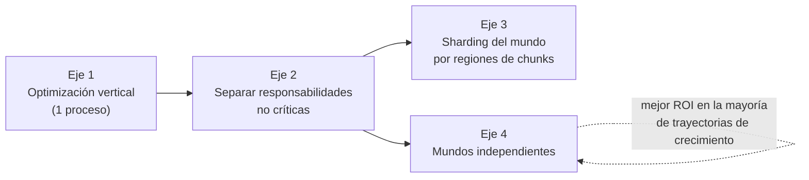
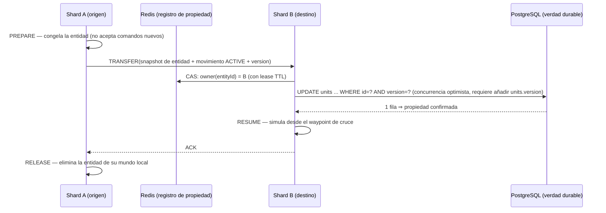

# Escalabilidad

Propósito: definir cómo crece Empires Online desde un único proceso de game server con el mundo entero en RAM, qué números concretos marcan cada límite, en qué orden se adoptan los ejes de escalado y qué decisiones de diseño actuales mantienen esas puertas abiertas o las cerrarían.

Este documento describe un diseño **objetivo**. `services/game-server` ya está implementado (compila, pasa `go vet` y su suite unitaria está en verde), pero **no se ha ejecutado ni un benchmark ni una prueba de carga**: todas las cifras de coste de CPU de §3 son estimaciones de orden de magnitud pensadas para ser **sustituidas por mediciones reales**. Las cifras de memoria de §2, en cambio, sí se derivan de las estructuras que existen en el código. Lo que es firme es el orden de adopción de los ejes y la lista de decisiones que preservan o destruyen opciones.

---

## 1. Punto de partida: un proceso, un mundo, una RAM

El MVP es deliberadamente un único proceso `services/game-server` (módulo Go con `go 1.23` como versión **mínima**; el toolchain instalado en la máquina de desarrollo es Go 1.27.0) que:

- Carga el mundo completo (512 × 512 tiles, 256 chunks de 32 × 32) en memoria al arrancar.
- Ejecuta un game loop **single-threaded** a 10 Hz con el orden de fases fijo del canon (ver [`./game-loop.md`](./game-loop.md)).
- Mantiene todas las conexiones WebSocket y sus conjuntos de interés en el mismo binario.
- Usa PostgreSQL como *durable source of truth* y Redis para estado caliente (presencia, `jti` de tickets, idempotencia).

El single-threading del loop **no es una limitación accidental, es un requisito**: el determinismo del canon (§5, §6, §8) exige un orden de ejecución reproducible. Cualquier paralelismo dentro del tick debe ser determinista o quedar fuera del tick. Esto significa que **el techo duro de un proceso es un núcleo de CPU para la simulación**, y todo el resto (I/O de red, serialización, persistencia) debe salir del hilo del tick.

```
┌─────────────────────────────────────────── game-server (1 proceso) ──────────────┐
│                                                                                  │
│  goroutines WS (N)      ┌── cmdCh ──►  ┌──────────────────┐                      │
│  read loop + rate limit │              │  GAME LOOP 10 Hz │  (1 goroutine,       │
│  parse + validate       │              │  fases 1..8      │   determinista)      │
│                         │              └────────┬─────────┘                      │
│  write loop (N)  ◄── outCh (bounded) ───────────┤                                │
│                                                 ├──► persistCh ──► workers PG    │
│  WORLD EN RAM: terrain[262144] + blocked overlay + units + movements + chunks    │
└──────────────────────────────────────────────────────────────────────────────────┘
        │                                   │                        │
        ▼                                   ▼                        ▼
    PostgreSQL (durable)              Redis (hot)            /metrics (Prometheus)
```

---

## 2. Huella de memoria: números concretos

### 2.1 Estado estático del mundo

| Estructura | Fórmula | 512 × 512 | Nota |
|---|---|---|---|
| `terrain` (`[]byte`, un `TerrainType` uint8 por tile) | `W*H` bytes | **256 KiB** | Coincide con `world_chunks`: 256 chunks × 1024 B |
| `blocked overlay` (`[]bool`, **1 byte/tile**, no un bitset) | `W*H` bytes | **256 KiB** | Capa de ocupación separada del terreno, bajo `sync.RWMutex`. Fundar una ciudad no muta el terreno de debajo |
| Índice de chunks (256 entradas, metadatos + listas de entidades) | `chunks * ~256 B` | **64 KiB** | |
| **Total estático** | | **≈ 576 KiB** | Irrelevante |

El `blocked overlay` es un `[]bool` y no un bitset a propósito: 224 KiB de más a cambio de indexación directa sin desplazamientos de bits en el camino caliente de `IsWalkable`. Comprimirlo a bitset es una optimización disponible, no una necesidad.

El mapa estático es tan pequeño que **cabe entero en caché de último nivel y puede replicarse en todos los procesos sin coste**. Esto es decisivo para el eje 3 (sharding): ningún shard necesita pedir terreno a otro. Un mundo de 4096 × 4096 seguiría siendo 16 MiB de terreno + 16 MiB de overlay.

### 2.2 Estado dinámico

Derivadas de las structs reales de `internal/domain/*` e `internal/websocket`, más el overhead de mapas y del allocator de Go:

| Estructura | Coste unitario estimado | Desglose |
|---|---|---|
| `unit.Unit` en RAM | **≈ 150 B** | struct ~80 B (`ID int64`, `PlayerID uuid.UUID` [16]B, `CityID *int64`, `Type`/`Status` como `string`, `X`/`Y` int32, `HP`/`MaxHP` int32) + entrada de `map[int64]*unit.Unit` (~50 B) + fragmentación. La struct **no** lleva `version` ni `chunkId`: `version` solo existe en la tabla `cities`, y `chunk_x`/`chunk_y` están desnormalizados en la tabla `units`, no en la entidad de RAM |
| `movement.Movement` `ACTIVE` | **≈ 750 B típico** | Cabecera ~72 B (`ID`, `UnitID`, `Target`, `StartTimeMs`, `ArrivalTimeMs`, `Status`) + polilínea de `movement.Waypoint{X int32, Y int32, TMs int64}` = **16 B** cada uno. Path medio de 40 tiles → 640 B. `EO_PATHFINDING_MAX_DISTANCE=256` acota la distancia **Chebyshev** origen→destino, no el número de waypoints, así que el peor caso de longitud de polilínea es `TBD (fuera de MVP)`; el límite operativo real es `EO_PATHFINDING_MAX_NODES=20000` |
| Sesión WS | **≈ 40 KiB** | Buffers de lectura/escritura de `gorilla/websocket`, cola de salida `out chan protocol.Outbound` de `EO_WS_OUTBOUND_QUEUE_SIZE` (256 por defecto) entradas, `chunks` (25 suscripciones), `terrainSent` y bookkeeping (`seq atomic.Uint64`, `closed`, `done`) |

### 2.3 Escenarios

| Escenario | Unidades | En movimiento | CCU | RAM simulación | RAM sesiones | Total aprox. (+ runtime Go) |
|---|---|---|---|---|---|---|
| MVP objetivo | 2 000 | 200 | 100 | 0.5 MB | 4 MB | **< 40 MB** |
| Carga media | 20 000 | 4 000 | 1 000 | 6 MB | 40 MB | **≈ 100 MB** |
| Carga alta | 100 000 | 20 000 | 5 000 | 30 MB | 200 MB | **≈ 330 MB** |
| Ruptura teórica | 1 000 000 | 200 000 | — | 300 MB | — | **≈ 1 GB** |

**Conclusión honesta: la memoria nunca es el muro.** Un servidor modesto (4 GB) aloja el mundo MVP dos órdenes de magnitud por encima de la carga esperada. Lo que se rompe primero es la CPU del tick y, antes que eso, la **densidad geográfica del mundo** (§4).

---

## 3. Coste de CPU por tick: números concretos

Período de tick a `EO_TICK_RATE_HZ=10` = **100 ms**. Presupuesto operativo objetivo: **p99 ≤ 20 ms** (20 % del período), dejando margen para pausas del GC, jitter del scheduler y picos de A\*. `eo_game_tick_overruns_total` se incrementa a partir de 100 ms; llegar a ese punto ya es tarde.

### 3.1 Costes unitarios estimados (a sustituir por benchmarks)

| Fase (canon §6) | Coste unitario estimado | Escala con |
|---|---|---|
| 1. `drain commands` | ~0.5 µs / comando | comandos/tick |
| 2. `validate & apply` — A\* típico (~1 500 nodos expandidos) | **~0.5 ms / path** | peticiones `unit.move`/tick |
| 2. `validate & apply` — A\* peor caso (`EO_PATHFINDING_MAX_NODES=20000`) | **~6–8 ms / path** | picos |
| 3. `advance movement` | ~40 ns / unidad en movimiento | unidades `MOVING` |
| 4. `resolve simulation` | 0 (reservado, fuera de MVP) | — |
| 5. `timers/scheduled events` | ~1 µs / evento vencido (heap) | eventos vencidos |
| 6. `interest sets` | O(25 chunks) solo al recibir `session.view` | tasa de `session.view` |
| 7. `emit deltas` — serialización JSON | ~1.5 µs / mensaje **serializado una vez por chunk** | chunks con cambios |
| 7. `emit deltas` — encolado por suscriptor | ~0.8 µs / (suscriptor × chunk con delta) | **fan-out** |
| 8. `enqueue persistence` | ~0.3 µs / registro sucio | entidades sucias |

### 3.2 Tick típico a 1 000 CCU

Supuestos: 20 000 unidades, 4 000 en movimiento, 20 comandos `unit.move` por tick, 60 chunks con al menos un delta, distribución uniforme de jugadores (⇒ 1000 × 25/256 ≈ **98 suscriptores por chunk**).

| Fase | Cálculo | Coste |
|---|---|---|
| drain + validate (sin A\*) | 20 × 0.5 µs | 0.01 ms |
| **A\*** | 20 × 0.5 ms | **10.0 ms** |
| advance movement | 4 000 × 40 ns | 0.16 ms |
| timers | ~100 × 1 µs | 0.10 ms |
| serialización de deltas | 60 × 1.5 µs | 0.09 ms |
| **fan-out (encolado)** | 60 × 98 × 0.8 µs | **4.70 ms** |
| enqueue persistencia (amortizado) | 20 000 / 50 × 0.3 µs | 0.12 ms |
| **Total** | | **≈ 15 ms (15 % del período)** |

### 3.3 Dónde deja de servir

Dos costes dominan y ninguno es lineal en "número de unidades":

1. **A\* es el coste espinoso, no el volumen de entidades.** 20 peticiones típicas por tick ya consumen 10 ms. Una ráfaga de 15 peticiones en el peor caso (paths largos contra terreno con `MOUNTAIN`/`WATER` que fuerzan exploración masiva antes de devolver `PATH_TOO_LONG` o `PATH_NOT_FOUND`) son ~100 ms: **overrun garantizado en un solo tick**. El límite práctico del MVP es del orden de **150–200 peticiones de path por segundo** en caso medio, mucho menos en caso adverso.
2. **El fan-out crece como `CCU × chunks_con_delta`**, no como `CCU × entidades`. Con distribución uniforme escala suavemente; con *clustering* (todos los jugadores en la misma batalla) degenera a `CCU × eventos`, que es exactamente el caso que el interest management **no** resuelve (§6.2).

| Magnitud | Estado del proceso único |
|---|---|
| ≤ 200 CCU, ≤ 20 000 unidades | Holgado. Tick p50 ~2 ms, p99 ~6 ms. |
| ~1 000 CCU, ~20 000 unidades | Sano si el fan-out serializa una vez por chunk y las escrituras de socket están fuera del tick. p99 ~15–25 ms. |
| ~5 000 CCU | Fan-out y presión de GC dominan. Requiere eje 1 completo y probablemente eje 2 (gateway separado). |
| > 5 000 CCU en un mundo continuo | El núcleo del loop se satura. Eje 3 o eje 4. |
| Cualquier CCU con clustering extremo en 5 × 5 chunks | Se rompe antes que todo lo anterior. Mitigación: §7 (contrapresión) y reducir `EO_INTEREST_RADIUS_CHUNKS`. |

---

## 4. El muro que llega primero no es técnico: densidad del mundo

512 × 512 = **262 144 tiles**. Descontando `MOUNTAIN` y `WATER` (intransitables) queda del orden de la mitad como terreno útil. El emplazamiento lo decide `internal/game/founding.FindSite`, por búsqueda determinista en espiral desde una semilla derivada del nombre de usuario, con estas constantes de código:

| Constante | Valor | Efecto |
|---|---|---|
| `townCenterRadius` | 1 | La muralla es el rectángulo **3 × 3** bloqueado alrededor del centro (`SetBlocked`) |
| `clearRadius` | 3 | Exige un entorno despejado de radio 3 alrededor del candidato |
| `spawnRadius` | 2 | Los **3 `VILLAGER`** iniciales nacen a radio 2, justo fuera de la muralla |
| `minCityDistance` | **24** | Separación mínima entre centros de ciudad, en tiles |

La separación mínima de 24 tiles es la que fija el techo geográfico: un empaquetado ideal daría `(512/24)² ≈ 455` ciudades, y el terreno intransitable y la irregularidad del empaquetado real lo bajan.

Eso sitúa la capacidad del mundo MVP en el orden de **300–450 ciudades**, es decir unos pocos cientos de jugadores registrados y del orden de **100–200 concurrentes** antes de que el mundo se sienta lleno.

Consecuencia arquitectónica de primer orden: **con el tamaño de mundo del MVP, el proceso único nunca será el cuello de botella**. El crecimiento realista es "más jugadores", y para eso el eje 4 (mundos independientes) es varias veces más barato que el eje 3 (sharding). El eje 3 solo se paga si el producto exige **un único mundo continuo más grande que un núcleo de CPU**.

---

## 5. Ejes de escalado, en orden de adopción



### Eje 1 — Optimización vertical dentro del proceso

Se agota **entero** antes de tocar los demás. Palancas, en orden de rentabilidad:

| # | Palanca | Efecto esperado |
|---|---|---|
| 1.1 | **Serializar el delta una vez por chunk** y escribir los mismos bytes a cada suscriptor | Divide el coste de emisión por el nº medio de suscriptores por chunk (≈98 en el escenario de 1 000 CCU) |
| 1.2 | **Sacar toda escritura de socket del hilo del tick** — **ya implementada**: `Session.Send` solo encola en `out` y el `writePump` de cada conexión hace el I/O | Elimina la varianza de red del tick |
| 1.3 | **Presupuesto de nodos de A\* por tick** (además del límite por petición `EO_PATHFINDING_MAX_NODES`): las peticiones que no caben se resuelven en el tick siguiente | Convierte el pico de pathfinding en latencia acotada en lugar de overrun |
| 1.4 | **Amortizar el flush de persistencia**: `EO_PERSISTENCE_FLUSH_INTERVAL_TICKS=50` significa "ninguna entidad sucia lleva más de 5 s sin persistirse", no "un vaciado gigante cada 50 ticks". Repartir el conjunto sucio entre los 50 ticks del ciclo preserva la semántica y elimina el pico | Aplana el tick de flush |
| 1.5 | **Reducir asignaciones por tick**: buffers reutilizados, `sync.Pool` para envelopes y slices de waypoints, evitar interfaces en el hot path | Menos presión de GC, menos jitter en p99 |
| 1.6 | **Estructuras por chunk**: listas de entidades y conjuntos sucios indexados por `chunkId` (`chunkY*chunksPerRow + chunkX`, uint32), nunca barridos globales de 512 × 512 | Coste proporcional a lo que cambia |
| 1.7 | **Codificación más barata que JSON** (binaria, con el mismo esquema versionado `v:1`) | Solo tras medir. El canon fija JSON UTF-8 para v1; cambiar codificación es un cambio de protocolo y requiere ADR |
| 1.8 | Bajar `EO_INTEREST_RADIUS_CHUNKS` de 2 a 1 | Palanca de emergencia en caliente, ×2.78 menos fan-out (§6.1) |

Coste: cero complejidad operativa. Es donde debe vivir el proyecto todo el tiempo que se pueda.

### Eje 2 — Separar responsabilidades no críticas

Sacar del proceso de simulación lo que **no** necesita el estado autoritativo en RAM. Ya está mayoritariamente separado por diseño:

| Responsabilidad | Estado en MVP | Separación |
|---|---|---|
| Autenticación de usuario y emisión del *game ticket* | **Todavía NO separada.** `apps/web` ya existe, pero no emite tickets: hoy sigue siendo el propio game server quien registra y autentica (`internal/httpapi`, `POST /api/auth/register` y `POST /api/auth/login`, con bcrypt) y quien firma el ticket con `auth.NewIssuer`. Verificar el JWT HS256 y consumir el `jti` en Redis sí vive ya donde debe | Trasladar la emisión a Next.js, como fija [ADR-010](../decisions/ADR-010-authentication-game-ticket.md). Es el trabajo más barato del eje 2: el verificador ya está escrito y aislado |
| API de lectura (perfiles, rankings, historial) | Fuera de MVP | Servicio de solo-lectura contra réplica de PostgreSQL. No toca el loop |
| Persistencia | Ya asíncrona: `persistence.Queue` (capacidad 4096, 4 workers, 3 intentos, 200 ms de espera) detrás de la interfaz `Persister`. El tick nunca hace I/O de Postgres | Los workers pueden pasar a proceso aparte consumiendo una cola durable. Hay que llevarse consigo el **RPO documentado**: el estado se muta en RAM y *después* se encola, así que `unit.move.accepted` sale antes del COMMIT y un proceso que muera en esa ventana (decenas de ms) pierde ese movimiento. Sacar la cola de proceso alarga esa ventana, y esa es la decisión a evaluar |
| Terminación WebSocket (gateway) | En el mismo proceso | Split viable pero es **camino crítico**, no "no crítico": añade un salto de red por mensaje y desplaza el problema de fan-out al gateway. Solo tiene sentido cuando `eo_connected_websockets` satura la CPU de red con el tick sano |

Señal de adopción: `eo_persistence_queue_depth` creciente de forma sostenida, o `eo_database_latency_seconds` p99 degradado, con `eo_game_tick_duration_seconds` sano. Es decir, cuando el problema **no** es la simulación.

### Eje 3 — Sharding del mundo por regiones de chunks

Un proceso por región contigua de chunks. Ejemplo natural en el mundo MVP: 4 shards de 8 × 8 chunks (256 × 256 tiles cada uno).

```
        chunkX 0..7        chunkX 8..15
      ┌───────────────┬───────────────┐
 0..7 │   SHARD  A    │   SHARD  B    │   Cada shard:
      │  64 chunks    │  64 chunks    │   - terreno COMPLETO (256 KiB, replicado)
      ├───────────────┼───────────────┤   - autoridad SOLO sobre entidades
8..15 │   SHARD  C    │   SHARD  D    │     cuyo chunk actual le pertenece
      │               │               │
      └───────────────┴───────────────┘
              ▲  frontera: el problema real
```

Se detalla en §8. **No se adopta hasta que el eje 1 esté agotado y el producto exija un mundo continuo mayor que un núcleo.**

### Eje 4 — Mundos independientes

Varias instancias completas del stack (game server + esquema/base de datos propios), sin comunicación entre ellas. Un jugador pertenece a un mundo.

- Coste de ingeniería: **casi nulo**. El binario es el mismo; cambian `EO_POSTGRES_URL`, `EO_REDIS_URL`, `EO_WORLD_SEED`, `EO_HTTP_ADDR`. La configuración por `internal/config` (canon §17) ya lo permite.
- Coste de producto: fragmenta la comunidad; requiere selector de mundo en el cliente y, eventualmente, transferencia de personaje (**TBD (fuera de MVP)**).
- Capacidad: lineal y perfecta. Sin fronteras, sin handoff, sin coordinación.

Está listado en cuarto lugar por **orden de adopción**, pero dado §4 es el eje con mejor relación capacidad/complejidad para casi cualquier trayectoria de crecimiento realista de este proyecto.

---

## 6. Fan-out de mensajes: el interest management es la palanca principal

### 6.1 La aritmética

Sin interest management, cada evento va a todas las conexiones: `mensajes = CCU × eventos`. Con 1 000 CCU y 500 eventos por tick son **500 000 escrituras por tick** a 10 Hz. Inviable.

Con suscripción por chunk y `EO_INTEREST_RADIUS_CHUNKS=2` (canon §13), cada jugador ve **5 × 5 = 25 chunks** de los 256 del mundo:

| Radio | Chunks suscritos | Tiles visibles | Fracción del mundo | Fan-out medio a 1 000 CCU |
|---|---|---|---|---|
| 1 | 9 | 96 × 96 = 9 216 | 3.5 % | 35 suscriptores/chunk |
| **2 (MVP)** | **25** | **160 × 160 = 25 600** | **9.8 %** | **98 suscriptores/chunk** |
| 3 | 49 | 224 × 224 = 50 176 | 19.1 % | 191 suscriptores/chunk |

Un viewport de 1920 × 1080 en proyección isométrica (`TILE_W=64`, `TILE_H=32`) muestra del orden de **2 000 tiles**. Radio 1 ya entrega ~4.5× lo visible y radio 2 entrega ~12×. El radio 2 no existe por necesidad visual sino como **margen de prefetch contra el *pop-in* al desplazar la vista**. Por eso bajarlo a 1 es una palanca de emergencia legítima: multiplica por 2.78 la capacidad de fan-out con degradación de experiencia acotada (más `world.snapshot` al panear rápido).

### 6.2 Lo que el interest management NO resuelve

El interest management amortigua la **dispersión**, no la **aglomeración**. Si 1 000 jugadores convergen en la misma región de 5 × 5 chunks, cada evento allí tiene 1 000 suscriptores y el factor de reducción desaparece. Mitigaciones, en orden:

1. **Coalescer por entidad y por tick**: como máximo un `entity.update` por entidad por tick, fusionando cambios.
2. **No emitir posición por tick durante un movimiento.** Ésta es la mitigación más potente y es gratuita por diseño: la polilínea temporizada (`{x, y, tMs}`, canon §7) se envía **una sola vez** en `unit.movement.started`, y el cliente reconstruye la posición analíticamente. En estado estacionario, una unidad en movimiento genera **0 mensajes por tick**, no 10 por segundo. Comparación: emitir posición cada tick para 50 entidades visibles a ~120 B/mensaje son ~480 kbps por jugador; con la polilínea son picos de eventos, no un caudal continuo.
3. **Contrapresión y resincronización** por conexión (§7).
4. **Reducir dinámicamente `EO_INTEREST_RADIUS_CHUNKS`** bajo carga.
5. **Niveles de detalle por distancia** (chunks lejanos con actualizaciones agregadas o de menor frecuencia): **TBD (fuera de MVP)**.

### 6.3 Reglas de implementación que hacen escalable el fan-out

- Un delta se serializa **una vez por chunk y por tick**; a cada suscriptor se le encola el mismo buffer inmutable (referencia contada o `[]byte` compartido de solo lectura).
- El `seq` monótono por conexión (canon §13) lo genera **la capa de conexión al escribir**, nunca el simulador. Si el `seq` se generase en la simulación, un futuro gateway o un segundo shard escribiendo a la misma conexión produciría colisiones. Es una regla barata hoy que preserva los ejes 2 y 3.
- `world.snapshot` se construye como **unión de snapshots por chunk**, nunca como un recorrido del mundo global. Así puede ensamblarse desde varias fuentes en el eje 3.
- Los conjuntos de interés viven en la capa de sesión, **no** dentro de las estructuras de simulación. Son reconstruibles (canon §12) y no se persisten.

---

## 7. Contrapresión y límites por conexión

El principio invariable: **el tick jamás se bloquea por un cliente lento**. Un solo socket congestionado no puede degradar la simulación de todo el mundo.

### 7.1 Entrada (cliente → servidor)

| Límite | Valor | Acción al excederse |
|---|---|---|
| Tamaño de mensaje | `EO_WS_MAX_MESSAGE_BYTES=16384` | `MESSAGE_TOO_LARGE` |
| Tasa | `EO_WS_RATE_LIMIT_PER_SECOND=20`, `EO_WS_RATE_LIMIT_BURST=40` (el burst nunca puede ser menor que la tasa: lo valida `config.Load`) | `system.error` con `RATE_LIMITED` **y cierre inmediato con `4429`**. No hay tolerancia progresiva |
| Handshake `session.hello` | 5 s (`WSHandshakeTimeout`, constante de código, no variable `EO_*`) | cierre `4408` |
| Timeout de lectura | 45 s (`WSReadTimeout`; ping cada 15 s, `WSPingInterval`) | cierre de conexión |
| `session.view` | **el mismo bucket global**; un sub-límite dedicado para `session.view` es `TBD (fuera de MVP)` | Cada cambio de vista puede forzar snapshots de chunks nuevos; es el comando más caro por byte |

El *token bucket* se evalúa en la goroutine de lectura (`readPump`), **antes** de encolar hacia el loop. Los mensajes descartados nunca llegan al canal de comandos.

### 7.2 Salida (servidor → cliente)

Cada conexión tiene una cola de salida **acotada** en número de mensajes: `Session.out`, de capacidad `EO_WS_OUTBOUND_QUEUE_SIZE` (**256** por defecto, rango 8–65536). Es una variable de entorno real, no una constante ni un TBD.

Encolado no bloqueante desde la goroutine del loop (`Hub.BroadcastChunk` / `Hub.SendToPlayer` → `Session.Send`):

```go
select {
case s.out <- frame:
    // ok
default:
    // NO se descarta "un" delta: se invalida la sesión entera.
    s.Close(protocol.CloseInternalError, "cola de salida saturada")
}
```

Política de consumidor lento — el punto sutil: **un stream de deltas no admite pérdidas parciales**. Descartar un `entity.spawn` y entregar el `entity.update` siguiente deja al cliente en un estado inconsistente y silenciosamente incorrecto. Por eso la política implementada es la más simple que es correcta:

1. Al desbordar, la sesión se **cierra inmediatamente con `4500`** (`CloseInternalError`). No hay vaciado de cola, ni marca `needs_resnapshot`, ni contador de reincidencias: nada de eso existe en el código y no debe documentarse como si existiera.
2. El cliente reconecta por el flujo normal (`session.hello` → `session.welcome` → `world.snapshot`) y recibe un snapshot limpio de su área de interés.
3. Un mecanismo de resincronización sin reconectar (vaciar y remitir snapshot sobre la misma conexión) es **TBD (fuera de MVP)**.

Esto es correcto porque el mundo es persistente (canon §2, §3): cerrar un WebSocket **no** pierde estado durable. El tick, mientras tanto, nunca se bloquea: `Session.Send` no espera jamás.

### 7.3 Contrapresión de persistencia

Hay dos colas acotadas en este camino, y se comportan distinto:

| Cola | Capacidad | Al saturarse |
|---|---|---|
| Canal de comandos (`commands`, constante `commandQueueSize` de `cmd/server/main.go`) | 8192 | El productor **no bloquea**: `Server.dispatch` descarta el comando con `select`/`default` y registra `level=error`. La ruta de `session.view` lo convierte en `system.error` con `INTERNAL_ERROR`; `unit.move` y `unit.cancel_move` hoy **ignoran** el valor de retorno y el cliente no recibe rechazo — carencia conocida, no diseño |
| Cola de persistencia (`persistence.Queue`, `DefaultQueueConfig()`) | 4096, 4 workers, 3 intentos, 200 ms entre reintentos | El trabajo se **descarta**, se registra `level=error` y se invoca su `OnPermanentFailure` como compensación. Observable en `eo_persistence_queue_depth` |

Nótese que **no existe control de admisión**: el loop no deja de aceptar comandos durables cuando la cola de persistencia crece. Añadirlo es una palanca disponible, no una propiedad actual.

El catálogo de códigos de error es cerrado (22 códigos, verificados por un contract test Go ↔ TypeScript) y no contiene un código de sobrecarga. El rechazo por saturación usa **`INTERNAL_ERROR`**. Añadir un código específico de sobrecarga es un cambio de protocolo: **TBD (fuera de MVP)**.

---

## 8. Sharding: el cruce de fronteras es el problema real

Todo lo demás del eje 3 es fácil. Lo difícil es la frontera. Cuatro problemas distintos, con soluciones distintas:

### 8.1 Terreno más allá de la frontera (resuelto por diseño)

A\* necesita explorar tiles que pertenecen a otra región. Como el mapa se genera determinísticamente desde `EO_WORLD_SEED` y ocupa 256 KiB (576 KiB contando el `blocked overlay` y el índice de chunks), **todos los shards cargan el mundo estático completo** y solo son autoritativos sobre las **entidades dinámicas** de su región. El problema desaparece.

Queda el `blocked overlay` dinámico (edificios). Cambia con muy baja frecuencia: se replica en modo solo-lectura con consistencia eventual vía pub/sub, y la validación autoritativa de transitabilidad se rehace en el shard destino al llegar. Un path calculado contra un overlay obsoleto puede fallar en destino y terminar como movimiento `FAILED`, que ya es un estado previsto (canon §7).

### 8.2 Conjuntos de interés que cruzan fronteras

Un jugador con la vista cerca de una frontera suscribe 25 chunks que pertenecen a 2 o 4 shards. Por eso **la suscripción es por chunk y no por shard**: el identificador de suscripción es un `chunkId` uint32, ruteable a quien lo posea. La capa de sesión multiplexa deltas de varias fuentes hacia una única conexión, ordenando por su propio `seq` (§6.3).

### 8.3 Propiedad autoritativa de la entidad

Regla no negociable: **en todo instante, exactamente un shard es autoritativo sobre una entidad.** Nunca dos, nunca cero. La propiedad se deriva del chunk que ocupa la entidad; el registro de propiedad de chunks y de entidades en tránsito vive en Redis (nombres de clave concretos: **TBD (fuera de MVP)**, a fijar en el ADR de sharding).

Migración transaccional, en cinco pasos:



Detalles que hacen que esto funcione:

- **La concurrencia optimista con una columna `version integer` es la herramienta anti-doble-propiedad.** El shard destino incrementa `version`; cualquier escritura tardía del origen falla con 0 filas afectadas y se descarta. Sin `version`, la migración no puede hacerse segura. **Estado real: la migración 000001 declara `version integer NOT NULL DEFAULT 0` solo en `cities`; `units` NO la tiene.** El eje 3 exigiría por tanto añadirla a `units` en una migración nueva; el patrón ya está probado en `cities` y no hay que inventarlo.
- **El handoff es programable, no reactivo.** Como la polilínea temporizada da la posición analíticamente para cualquier instante T, el shard origen sabe *de antemano* el `tMs` exacto en que la unidad cruza la frontera. Puede enviar el `TRANSFER` con antelación y el destino toma propiedad **en el tick exacto del cruce**, sin congelar visiblemente a la unidad ni perder ticks. Este es un beneficio directo del modelo de movimiento del canon §7: no hay "estado de interpolación" que transferir.
- **Crash a mitad de handoff.** El *lease* en Redis expira; al arrancar, un shard recupera la propiedad de sus chunks y reconcilia contra PostgreSQL, que es la verdad durable. Los movimientos `ACTIVE` se recuperan con el procedimiento ya definido en el canon §7 (si `arrival_time_ms <= now`, snap al tile final).
- **Spawn/despawn espurios.** Si la entidad migra pero sigue dentro del conjunto de interés del jugador, la capa de sesión debe **deduplicar**: no emitir `entity.despawn` seguido de `entity.spawn` por un cambio de propietario interno. El cambio de shard es invisible para el protocolo v1.

### 8.4 Opciones descartadas para la frontera

| Opción | Por qué no |
|---|---|
| **Regiones solapadas** (cada shard simula un borde compartido y se reconcilia) | Dos autoridades sobre el mismo tile. Rompe el principio 1 del canon (servidor autoritativo, verdad única) y exige resolución de conflictos no determinista |
| **Bloqueo distribuido por tile en cada movimiento** | Un round-trip a Redis dentro del tick. Prohibido: el tick no hace I/O bloqueante |
| **Shard "árbitro" global para fronteras** | Reintroduce un punto único que es exactamente lo que el sharding pretendía eliminar |
| **Propiedad autoritativa por región + migración transaccional (elegida)** | Autoridad única en todo momento, coste amortizado (solo en el cruce), programable gracias a la polilínea temporizada |

Nota de diseño de fronteras: conviene alinear los límites de shard con **agua o montaña** cuando la generación del mapa lo permita, porque `WATER` y `MOUNTAIN` no son transitables (canon §5) y por tanto **no generan cruces**. Un borde sobre `MOUNTAIN` tiene coste de migración cero.

---

## 9. Papel de Redis y por qué el MVP no lo necesita para coordinar

Redis es *hot/transient state*, **nunca** sustituto de PostgreSQL (canon §4). En MVP se usa para tres cosas, ninguna de ellas coordinación entre procesos de simulación:

| Uso en MVP | Clave | Por qué está en Redis |
|---|---|---|
| Presencia de jugador | `presence:player:{playerId}`, TTL 30 s (`EO_PRESENCE_TTL_SECONDS`), heartbeat 10 s (`EO_PRESENCE_HEARTBEAT_SECONDS`) | TTL nativo; sobrevive al reinicio del proceso. **La transición a `OFFLINE_PENDING` NO la decide esta clave**: la decide el game loop en RAM comparando contra `DisconnectGrace`. Redis mantiene la presencia para observadores externos y para el futuro multiproceso |
| Anti-replay de tickets | `ticket:jti:{jti}`, TTL 120 s | Se compartirá con `apps/web` cuando exista; **hoy lo escribe y lo consume el mismo proceso**, porque el ticket lo emite `internal/httpapi` |
| Idempotencia de comandos | `idem:{playerId}:{requestId}`, TTL 300 s, reservado con `SETNX` antes de ejecutar | Expiración automática. La tabla `idempotency_keys` existe en la migración 000001 pero **hoy ningún código la escribe**: la deduplicación es solo Redis, y si Redis no responde el comando **se ejecuta igualmente** |

Con **un solo** proceso de simulación, toda la coordinación interna la da el runtime de Go: canales, mutexes y el propio orden de fases del tick. Pedirle a Redis lo que un canal resuelve en nanosegundos sería introducir una dependencia de red en el camino crítico a cambio de nada.

Dicho de otro modo: **el MVP ya usa Redis para lo que debe (estado que cruza procesos y debe sobrevivir reinicios), y no lo usa para lo que no debe (coordinar un único proceso consigo mismo).**

Papel de Redis a partir del eje 3 (todo **fuera de MVP**):

- Mapa de propiedad `chunkId → shard` con *leases* y renovación.
- Propiedad y locks de entidades en migración (§8.3).
- Pub/sub de deltas por chunk hacia gateways o shards vecinos.
- Locks de singleton para tareas globales periódicas (recálculo de `territory_control`, `world_events` programados).
- Replicación del `blocked overlay` entre shards.

Advertencia permanente: nada de esto puede convertirse en I/O síncrono dentro del tick. Todo acceso a Redis desde el loop es asíncrono o está fuera del hilo del tick, igual que PostgreSQL.

---

## 10. Decisiones actuales que preservan opciones

Estas propiedades del diseño no cuestan nada hoy y son las que hacen viables los ejes 2, 3 y 4 mañana:

| Decisión (canon) | Opción que preserva |
|---|---|
| Terreno determinista desde `EO_WORLD_SEED`, 256 KiB, **regenerado en cada arranque** (`world_chunks` es copia de auditoría, no fuente primaria) | Replicación gratuita del mundo estático en N procesos (§8.1) |
| Movimiento como **polilínea temporizada** analíticamente reconstruible (§7) | Handoff programado sin transferir estado de interpolación; recuperación tras crash sin replay; fan-out casi nulo en estado estacionario |
| Interest management **por chunk** con IDs uint32 | Suscripciones ruteables; snapshot ensamblable desde varias fuentes |
| `seq` monótono **por conexión**, generado en la capa de conexión | Un gateway o varios shards pueden escribir a la misma conexión sin colisionar |
| Columna `version integer` + concurrencia optimista, ya presente en `cities` | Migración transaccional de entidades sin doble propiedad. Falta replicar el patrón en `units` (§8.3) |
| PostgreSQL como única verdad durable; Redis nunca lo sustituye | Reconciliación tras crash de shard; ningún estado vive solo en RAM |
| Persistencia asíncrona **detrás de una interfaz** | Sacarla de proceso es cambiar una implementación, no rediseñar |
| `Clock` y `RandomSource` inyectados; prohibido iterar mapas sin ordenar (§5, §8) | Reproducibilidad entre procesos; tests de simulación deterministas |
| Comandos autocontenidos por valor hacia el loop y payloads de protocolo por valor hacia fuera (no hay `internal/events`: la simulación emite mensajes de protocolo directamente y el historial va a `world_events`) | Nada que cruce la frontera del loop es un puntero, así que puede cruzar también la frontera de un proceso |
| Protocolo versionado `v:1` con esquemas Zod → JSON Schema | El gateway y los contract tests pueden evolucionar sin tocar el dominio |
| Toda la configuración por `EO_*` en `internal/config` | Un shard o un mundo nuevo es el mismo binario con otro entorno |
| Emisión y verificación del ticket **ya separadas entre sí**: `auth.Issuer` firma, `auth.Verifier` + `auth.Authenticator` verifican y consumen el `jti`, y ningún otro paquete conoce el secreto | Mover el emisor a Next.js (ADR-010) es cambiar quién construye un `Issuer`, no rediseñar la autenticación. Hoy ambos lados viven en el game server (`internal/httpapi`) |

## 11. Decisiones que cerrarían esas opciones

Lista de cosas a **rechazar en code review** desde el primer commit:

| Antipatrón | Qué rompe |
|---|---|
| **Punteros directos entre entidades de distintos chunks** (`unit.Target *Unit`, `city.Units []*Unit` guardado entre ticks) | Un puntero no cruza un proceso. Es el error que hace imposible el eje 3 sin reescribir el dominio. **Regla: entre agregados y entre chunks se referencia siempre por ID; la resolución a puntero es local al tick y no se guarda** |
| Estado global mutable a nivel de paquete (singletons, `var world *World`) | Impide dos mundos en un proceso (útil en tests) y dos procesos con configuraciones distintas |
| Generar el `seq` de salida dentro del simulador | Colisiones en cuanto haya más de un emisor por conexión |
| Construir `world.snapshot` recorriendo el mundo global | El snapshot deja de ser ensamblable desde varias fuentes |
| Guardar los conjuntos de interés dentro de las estructuras de simulación | Acopla sesión y mundo; impide separar el gateway |
| Iterar mapas de Go sin orden estable (ya prohibido en el canon §8) | Destruye el determinismo, y con él la reproducibilidad entre shards y los tests de simulación |
| Llamadas síncronas de una entidad al agregado de otro jugador (leer la ciudad ajena en mitad del tick) | Cada una de esas llamadas es una futura llamada de red bloqueante |
| I/O de PostgreSQL o Redis dentro del hilo del tick | Ya prohibido (canon §6). Además, convierte cualquier latencia externa en overrun |
| Asumir que `unit_movements` se puede reconstruir replicando ticks | Rompe la recuperación tras crash y el handoff programado |
| Colas de salida no acotadas | Un cliente lento consume la RAM del servidor entero |

---

## 12. Anti-objetivos explícitos

Lo que este proyecto **no** va a hacer, y por qué:

| Anti-objetivo | Razón |
|---|---|
| **Microservicios prematuros** | El vertical slice no tiene aún fronteras de dominio validadas. Trocear ahora fija fronteras equivocadas y convierte llamadas de función en llamadas de red con modos de fallo nuevos. Un binario con paquetes bien separados (`internal/domain/*`) da la misma modularidad con cero coste operativo |
| **Kubernetes en el MVP** | El `docker-compose.yml` del repositorio levanta **solo las dependencias con estado** (`postgres:16-alpine` y `redis:7-alpine`, con healthchecks); el game server se ejecuta en la máquina anfitriona durante el desarrollo. En la máquina de desarrollo (Windows 10) ni siquiera hay `make`, `psql`, `redis-cli` ni `gh`; el acceso a las bases es vía `docker compose exec` y las tareas son **pnpm scripts**. Además el daemon de Docker Desktop **no arrancó** en esa máquina, así que los tests de integración están escritos pero sin ejecutar. Introducir orquestación antes de tener un servicio que escalar es coste puro |
| **ECS complejo antes del vertical slice** | Con `VILLAGER` como único `unit_type` y sin combate, un ECS genérico resuelve un problema de cardinalidad que no existe. Structs por tipo y colecciones indexadas por chunk son más simples y más rápidas hoy. El ECS se reconsidera cuando haya decenas de tipos de unidad y sistemas de combate, no antes |
| **Sharding del mundo en el MVP** | §4: el mundo de 512 × 512 se llena geográficamente mucho antes de saturar un núcleo |
| **Broker de mensajes (Kafka/NATS) o event sourcing como infraestructura** | `world_events` en PostgreSQL cubre la auditoría del MVP. Un broker es una dependencia operativa permanente a cambio de un problema que aún no se tiene |
| **Réplicas de lectura, CDN de estado, multi-región** | Sin métricas que las justifiquen |
| **Protocolo binario propio antes de medir JSON** | El canon fija JSON UTF-8 para v1. La optimización 1.7 solo se activa con datos de `eo_ws_messages_total` y perfiles de CPU en mano |
| **Autoescalado** | Un proceso de simulación con estado en RAM no es *stateless*: no se autoescala horizontalmente sin resolver antes el eje 3 |

---

## 13. Señales de disparo: qué métrica activa qué eje

Todas las métricas existen hoy en `internal/observability/metrics.go` y se exponen en `EO_METRICS_ADDR/metrics` (`:9090`).

| Señal observada | Umbral sugerido | Eje / acción |
|---|---|---|
| `eo_game_tick_duration_seconds` p99 | > 0.020 s sostenido (20 % del período) | Eje 1: perfilar y aplicar palancas 1.1–1.6 |
| `eo_game_tick_overruns_total` | cualquier incremento sostenido | Incidente. Eje 1 urgente + palanca 1.8 en caliente |
| `eo_pathfinding_duration_seconds` p99 y `eo_pathfinding_requests_total` | p99 > 5 ms o > 150 req/s | Palanca 1.3 (presupuesto de nodos por tick) |
| `eo_persistence_queue_depth` | creciente y sin volver a la línea base | Eje 2: escalar workers de persistencia; si persiste, sacarlos de proceso |
| `eo_database_latency_seconds` p99 | degradado con tick sano | Eje 2 (índices, pool, réplica) — no es problema de simulación |
| `eo_connected_websockets` con CPU de red saturada y tick sano | > ~2 000 | Eje 2, variante gateway |
| Eje 1 agotado **y** tick p99 > 50 ms | — | Eje 3 (sharding) o eje 4, según sea requisito el mundo continuo |
| Densidad de ciudades cerca del límite del mundo (§4) | > ~350 ciudades | Eje 4 (mundo nuevo) o ampliar `EO_WORLD_WIDTH`/`EO_WORLD_HEIGHT` — recordando que ambas deben ser múltiplos exactos de `EO_CHUNK_SIZE` |

---

## 14. Documentos relacionados

- [`./game-loop.md`](./game-loop.md) — fases del tick, presupuesto temporal y determinismo.
- [`./game-server.md`](./game-server.md) — estructura de paquetes real, modelo de concurrencia y colas.
- [`./pathfinding.md`](./pathfinding.md) — límites y presupuesto del A\*, que es el coste dominante de §3.
- [`./networking.md`](./networking.md) — fan-out, interest management y presupuesto de mensajes.
- ADRs en [`../decisions/`](../decisions/README.md) — el sharding (eje 3), el cambio de codificación del protocolo (palanca 1.7) y la separación del gateway (eje 2) requieren cada uno su ADR antes de implementarse. Ninguno existe todavía: los doce ADR actuales van de [ADR-001](../decisions/ADR-001-game-server-language.md) a [ADR-012](../decisions/ADR-012-database-migrations.md).

Referencias al canon técnico usadas en este documento: §2 (principios), §4 (coordenadas y chunks), §5 (terreno), §6 (game loop), §7 (movimiento), §8 (pathfinding), §11 (esquema), §12 (persistencia), §13 (protocolo), §14 (autenticación), §16 (códigos de error), §17 (configuración), §18 (observabilidad).
