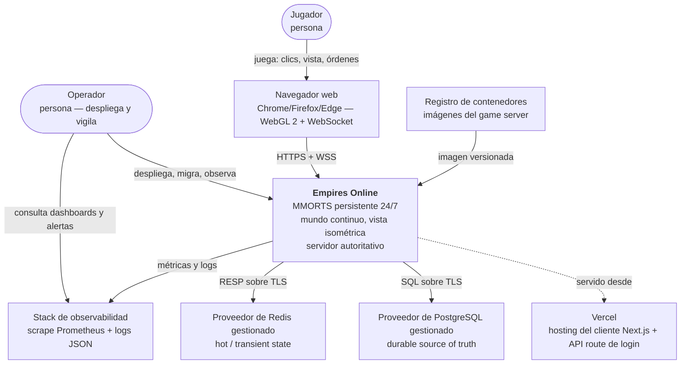
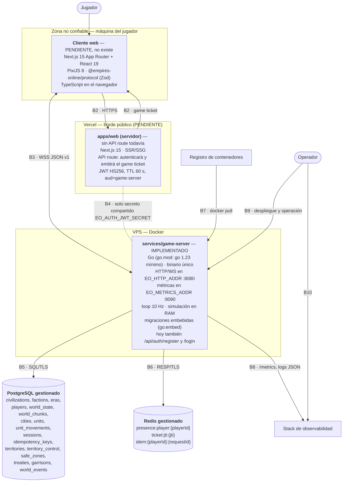

# Contexto de sistema (C4 niveles 1 y 2)

Define quién usa Empires Online, con qué sistemas externos habla, qué cruza cada frontera, cómo se autentica ese cruce y qué ocurre cuando una frontera cae.

Complementa a [overview.md](./overview.md): allí está la estructura interna; aquí, los bordes.

> **Qué existe y qué no.** El contenedor `services/game-server` está **implementado**: compila, pasa
> `go vet` y su suite unitaria está en verde, con el protocolo v1, la persistencia, Redis y la
> observabilidad descritos aquí. El contenedor `apps/web` (cliente Next.js) **no existe todavía**: ni
> el proyecto ni el despliegue en Vercel. Todo lo que este documento dice de `apps/web` y de Vercel es
> diseño objetivo, y así se marca en cada frontera afectada. En consecuencia, hoy **el propio game
> server emite el game ticket** por `POST /api/auth/register` y `POST /api/auth/login`
> (`internal/httpapi`, con bcrypt); es provisional y [ADR-010](../decisions/ADR-010-authentication-game-ticket.md)
> lo traslada a Next.js.

---

## 1. Nivel 1 — Contexto

### Actores

| Actor | Descripción | Qué puede hacer | Qué NO puede hacer |
|---|---|---|---|
| **Jugador** | Persona con una cuenta y un `players.id` (uuid). Todos los jugadores son humanos; la variedad viene de la **Civilization** (Roman, Byzantine, Persian, Norse…), no de razas. `Civilization` y `Global Faction` (`ORDER` / `CHAOS` / `NEUTRAL`) son ejes ortogonales. | Autenticarse, abrir una sesión de juego, observar su área de interés y enviar las cinco intenciones de la v1: `session.hello`, `session.ping`, `session.view`, `unit.move`, `unit.cancel_move`. | Aportar estado autoritativo de ningún tipo (posición final, HP, recursos, resultados de combate, ownership, cooldowns, ETA, paths). Acceder a PostgreSQL o Redis. Ver entidades fuera de su área de interés. |
| **Operador** | Persona responsable del despliegue y la operación del game server y sus dependencias. | Desplegar imágenes, ejecutar migraciones (aplicadas por el propio binario al arrancar), leer `/health`, `/ready` y `/metrics`, ajustar variables `EO_*`, rotar secretos. | Modificar estado de juego por vías fuera del dominio: no existe una herramienta de administración en el MVP — **TBD (fuera de MVP)**. |

### Sistemas externos

| Sistema | Rol | Propiedad |
|---|---|---|
| **Navegador web** | Ejecutará el cliente Next.js + PixiJS 8. Único lugar donde existen píxeles y la proyección isométrica. `apps/web` ya existe; lo pendiente es que asuma la emisión del game ticket (ADR-010). | Del jugador; entorno no confiable por definición. |
| **Vercel** | Alojará `apps/web`: SSR/SSG del cliente y la API route que emitirá el **game ticket**. **Pendiente**: hoy el ticket lo emite el game server. | Proveedor externo. |
| **Proveedor de PostgreSQL gestionado** | Base de datos durable. Backups, alta disponibilidad y parcheo delegados. | Proveedor externo. |
| **Proveedor de Redis gestionado** | Almacén en memoria para presencia, anti-replay de tickets e idempotencia. | Proveedor externo. |
| **Registro de contenedores** | Guarda las imágenes del game server construidas por CI (`docker build` es un paso obligatorio del pipeline). | Proveedor externo. |
| **Stack de observabilidad** | Scrapea `EO_METRICS_ADDR/metrics` y recoge los logs JSON de `log/slog`. Producto concreto: **TBD (fuera de MVP)**; el contrato es Prometheus + logs estructurados en stdout. | Proveedor externo o autoalojado. |

---

## 2. Nivel 2 — Contenedores

---

## 3. Fronteras, una por una

### B1 · Jugador ↔ Navegador

| | |
|---|---|
| **Protocolo** | Interacción humana: ratón, teclado, pantalla. |
| **Dirección** | Bidireccional. |
| **Autenticación** | Ninguna a este nivel; la sesión del navegador es la que autentica más adelante. |
| **Datos que cruzan** | Clics sobre tiles, desplazamiento de la vista, render isométrico del área de interés. |
| **Si cae** | Sin efecto sobre el mundo: **P3, offline ≠ mundo detenido**. Las unidades del jugador siguen ejecutando el movimiento `ACTIVE` que tuvieran; su ciudad transita `ONLINE → OFFLINE_PENDING → PROTECTED` según [presencia y protección](../specs/presence.md). |

### B2 · Navegador ↔ Vercel (`apps/web`)

> **Frontera pendiente.** Ni `apps/web` ni su despliegue en Vercel existen. Lo que sigue es el diseño
> objetivo. Hoy el equivalente funcional lo cubre el propio game server: `POST /api/auth/register` y
> `POST /api/auth/login`, con contraseña y bcrypt, devolviendo el ticket ya firmado.

| | |
|---|---|
| **Protocolo** | HTTPS. HTML/JS/CSS/assets y una llamada a la API route de login. |
| **Dirección** | Cliente → Vercel (petición), Vercel → cliente (documento y ticket). |
| **Autenticación** | La sesión de usuario de la aplicación web. El mecanismo definitivo (contraseña propia, OAuth, magic link) es **TBD (fuera de MVP)**. La implementación provisional del game server usa usuario y contraseña con bcrypt, con `username` restringido por un `CHECK` de PostgreSQL a `^[A-Za-z0-9_-]{3,24}$`. |
| **Datos que cruzan** | Bundle del cliente, assets del render, y el **game ticket**: JWT HS256 firmado con `EO_AUTH_JWT_SECRET`, TTL **60 s**, claims `{ sub: playerId, jti, iat, exp, aud: "game-server" }`. |
| **Si cae** | No se pueden emitir tickets nuevos: **no entran jugadores nuevos**. Las sesiones WSS ya establecidas continúan sin degradación y el mundo sigue simulando (P2). Un jugador que se desconecte no podrá volver a entrar hasta que Vercel se restablezca. Modo degradado aceptable: pérdida de acceso, nunca de estado. |

### B3 · Navegador ↔ Game Server (WebSocket)

La frontera crítica del sistema: es la única superficie por la que entra intención de un actor no confiable.

| | |
|---|---|
| **Protocolo** | WebSocket (**WSS** en despliegue), JSON UTF-8, versionado explícito `"v": 1` en cada mensaje. Envelope cliente→servidor `{ v, type, requestId, payload }`; servidor→cliente `{ v, type, seq, ts, requestId?, payload }` con `seq` uint64 monótono por conexión y `ts` en epoch ms del servidor. Los esquemas cliente→servidor son **estrictos** (`additionalProperties: false`); los de servidor→cliente **no**, para poder añadir campos opcionales sin romper clientes antiguos. |
| **Dirección** | Bidireccional y asimétrica: el cliente solo envía intenciones, el servidor solo envía hechos. |
| **Autenticación** | `session.hello { ticket }` debe ser el **primer** mensaje y llegar antes de 5 s, o el servidor cierra con `4408`. El servidor verifica firma HS256, `exp`, `aud: "game-server"` y **consume** `jti` en Redis (`ticket:jti:{jti}`, TTL 120 s) para impedir replay. Después crea la sesión y responde `session.welcome`. |
| **Datos que cruzan** | Cliente→servidor (5): `session.hello`, `session.ping`, `session.view`, `unit.move`, `unit.cancel_move`. Servidor→cliente (14): `session.welcome`, `session.pong`, `system.error`, `world.snapshot`, `entity.spawn`, `entity.update`, `entity.despawn`, `city.update`, `territory.update`, `unit.move.accepted`, `unit.move.rejected`, `unit.movement.started`, `unit.movement.completed`, `unit.movement.cancelled`. Nunca se retransmite el mundo completo: `world.snapshot` al conectar (área de interés) y después deltas por chunk. El terreno de un chunk viaja **una sola vez por sesión**, en base64 dentro del snapshot: la sesión recuerda cuáles ya envió, porque el terreno es inmutable. |
| **Límites** | Mensaje entrante ≤ `EO_WS_MAX_MESSAGE_BYTES=16384`; rate limit `EO_WS_RATE_LIMIT_PER_SECOND=20` con burst `EO_WS_RATE_LIMIT_BURST=40`; cola de salida por conexión `EO_WS_OUTBOUND_QUEUE_SIZE=256`. Constantes no configurables: handshake 5 s, ping 15 s, lectura 45 s, escritura 10 s. Interés por chunk con radio `EO_INTEREST_RADIUS_CHUNKS=2`. |
| **Códigos de cierre** | `4400` mensaje inválido · `4401` no autenticado · `4403` no autorizado · `4408` timeout de handshake · `4429` rate limited · `4500` error interno (incluida la cola de salida saturada). |
| **Si cae** | Para el jugador: pierde la vista, no pierde el mundo. Las unidades continúan su movimiento porque este está persistido en `unit_movements` y es analíticamente reconstruible. La degradación a `OFFLINE_PENDING` **la decide el game loop en RAM**, comparando el tiempo sin sesiones contra `DisconnectGrace` (= `EO_PRESENCE_TTL_SECONDS`, 30 s); Redis mantiene la presencia para observadores externos y para el futuro multiproceso, pero el loop **no** lee la expiración de su clave. Un jugador con varias sesiones abiertas sigue `ONLINE` mientras le quede una. Cumplido `EO_CITY_OFFLINE_PROTECTION_COOLDOWN_SECONDS=300`, la ciudad pasa a `PROTECTED`. Al reconectar: nuevo ticket, nuevo `session.hello`, nuevo `world.snapshot`. |

### B4 · Vercel ↔ Game Server (acoplamiento por secreto compartido)

| | |
|---|---|
| **Protocolo** | Ninguno en tiempo de ejecución en el MVP: no hay llamada directa entre ambos. El acoplamiento es **criptográfico**, no de red. |
| **Dirección** | N/A. |
| **Autenticación** | Ambos lados conocen `EO_AUTH_JWT_SECRET`. Vercel firma; el game server verifica. |
| **Datos que cruzan** | Solo el contenido del JWT, transportado por el cliente. Y, fuera de ejecución, el contrato de mensajes de `@empires-online/protocol` compartido en tiempo de build. |
| **Detalle no definido** | Cómo resuelve la API route el `playerId` que pone en `sub` (lectura directa de `players` desde Next.js frente a un endpoint dedicado del game server): **TBD (fuera de MVP)**. |
| **Si cae** | Una rotación descoordinada del secreto invalida todos los tickets: los jugadores conectados siguen jugando (su sesión ya está establecida), pero ninguno nuevo puede entrar. Procedimiento de rotación en [despliegue](../operations/deployment.md). |

### B5 · Game Server ↔ PostgreSQL gestionado

| | |
|---|---|
| **Protocolo** | Protocolo nativo de PostgreSQL sobre TCP con TLS. Conexión desde `EO_POSTGRES_URL`. |
| **Dirección** | Game server → base de datos (pool de conexiones). |
| **Autenticación** | Usuario y contraseña embebidos en `EO_POSTGRES_URL`, provistos por variable de entorno. **Nunca en el repositorio y nunca expuestos al cliente.** Acceso restringido por red a la IP del VPS. |
| **Datos que cruzan** | Escrituras write-through transaccionales (creación de player/city/unit, inicio y finalización de movimiento, cambios de ownership, transiciones de presencia, treaties, garrisons, world_events); flush diferido cada `EO_PERSISTENCE_FLUSH_INTERVAL_TICKS=50` ticks (posiciones consolidadas, HP); lecturas de arranque (mundo, entidades, movimientos `ACTIVE`); y las migraciones embebidas contra `schema_migrations`. |
| **Si cae** | `GET /ready` falla (comprueba PostgreSQL + Redis + loop vivo) y el balanceador deja de enviar tráfico nuevo; `GET /health` sigue respondiendo porque es liveness sin dependencias. El loop **sigue aceptando comandos y simulando en RAM**, porque la escritura durable es diferida: `applyMove` muta el estado y luego encola el trabajo en `persistence.Queue`. La cola crece y `eo_persistence_queue_depth` lo delata; al llenarse (capacidad 4096), cada trabajo nuevo se descarta y se ejecuta su `OnPermanentFailure` como compensación, y lo mismo ocurre con los trabajos que agotan sus 3 intentos. Modo degradado honesto: **el mundo se ve y se juega, pero los hechos nuevos pueden no sobrevivir a un reinicio**. Al restablecerse, se drena la cola; lo que no llegó a commitear no ocurrió. |

### B6 · Game Server ↔ Redis gestionado

| | |
|---|---|
| **Protocolo** | RESP sobre TCP con TLS. Conexión desde `EO_REDIS_URL`. |
| **Dirección** | Game server → Redis. |
| **Autenticación** | Credenciales en `EO_REDIS_URL`, por variable de entorno. Acceso restringido por red. |
| **Datos que cruzan** | `presence:player:{playerId}` (TTL 30 s, heartbeat cada 10 s), `ticket:jti:{jti}` (TTL 120 s, anti-replay), `idem:{playerId}:{requestId}` (TTL 300 s), locks y cooldowns operativos, caché. |
| **Si cae** | No se pueden **consumir** `jti`: se pierde la garantía anti-replay, de modo que se rechazan handshakes nuevos (`UNAUTHORIZED`, cierre `4401`) en vez de aceptar tickets sin protección. Las sesiones ya establecidas continúan. La idempotencia **queda sin red**: `claimRequest` registra un `level=warn` y **ejecuta el comando igualmente**, porque se prefiere jugar a bloquear al jugador. La tabla `idempotency_keys` existe en la migración 000001, pero **hoy ningún código la escribe**: la deduplicación es exclusivamente Redis. La presencia deja de expirar por TTL, lo cual no afecta a la simulación: la transición a `OFFLINE_PENDING` la decide el game loop en RAM contra `DisconnectGrace`, no leyendo la expiración de la clave. **Nada durable se pierde: Redis nunca sustituye a PostgreSQL (P4).** |

### B7 · Registro de contenedores → VPS

| | |
|---|---|
| **Protocolo** | HTTPS (Docker Registry API v2), `docker pull`. |
| **Dirección** | Registro → VPS. CI empuja la imagen tras `build` y `docker build`. |
| **Autenticación** | Credenciales de registro en el VPS y token de CI en GitHub Actions. |
| **Datos que cruzan** | Imágenes versionadas del game server. **Nunca secretos**: la configuración `EO_*` se inyecta en tiempo de ejecución. |
| **Si cae** | No hay despliegues ni rollbacks por imagen nueva. El servicio en ejecución no se ve afectado. Modo degradado: congelar versión hasta el restablecimiento. |

### B8 · Game Server → Stack de observabilidad

| | |
|---|---|
| **Protocolo** | HTTP de scrape sobre `EO_METRICS_ADDR/metrics` (formato Prometheus) y logs JSON por stdout recogidos por el runtime de contenedores. |
| **Dirección** | Servidor → observabilidad (pull de métricas, push de logs). |
| **Autenticación** | El puerto `EO_METRICS_ADDR` (`:9090`) **no** se expone a Internet: solo a la red de operación. |
| **Datos que cruzan** | `eo_connected_players`, `eo_connected_websockets`, `eo_game_tick_duration_seconds`, `eo_game_tick_overruns_total`, `eo_commands_total`, `eo_pathfinding_requests_total`, `eo_pathfinding_duration_seconds`, `eo_database_latency_seconds`, `eo_redis_latency_seconds`, `eo_active_units`, `eo_persistence_queue_depth`, `eo_ws_messages_total`. Logs con campos estándar `ts`, `level`, `msg`, `player_id`, `session_id`, `request_id`, `tick`. |
| **Si cae** | El juego no se ve afectado; se pierde visibilidad y alertas. Riesgo operativo, no funcional. Detalle en [monitorización](../operations/monitoring.md). |

### B9 · Operador ↔ Game Server / VPS

| | |
|---|---|
| **Protocolo** | Acceso administrativo al VPS y `docker compose` para levantar el servicio; HTTP interno para `/health` y `/ready`. |
| **Dirección** | Operador → VPS. |
| **Autenticación** | Credenciales de administración del VPS. **TBD (fuera de MVP)** el mecanismo concreto y su política de rotación. |
| **Datos que cruzan** | Imágenes desplegadas, variables `EO_*`, secretos inyectados en tiempo de ejecución. Las migraciones **no** se aplican a mano: las ejecuta el binario al arrancar, embebidas con `go:embed`, contra `schema_migrations`. En la máquina de desarrollo Windows no hay `psql`, `redis-cli`, `make` ni `gh`: el acceso a las bases se hace vía `docker compose exec`. |
| **Si cae** | Sin capacidad de operar ni desplegar; el servicio en ejecución continúa. |

### B10 · Operador ↔ Stack de observabilidad

| | |
|---|---|
| **Protocolo** | HTTPS (dashboards, alertas). |
| **Dirección** | Bidireccional (consulta y notificación). |
| **Autenticación** | La del propio stack. **TBD (fuera de MVP)**. |
| **Datos que cruzan** | Series temporales y logs; ningún dato de juego autoritativo. |
| **Si cae** | Pérdida de alertas. Sin impacto funcional. |

---

## 4. Trust boundaries

Una *trust boundary* es una línea que un dato cruza cambiando de nivel de confianza. En cada una hay que declarar explícitamente **qué se valida** y **qué se asume**.

| # | Frontera | De → a | Confianza | Qué se valida al cruzar | Qué se asume (riesgo aceptado) |
|---|---|---|---|---|---|
| TB-1 | Navegador → Vercel | No confiable → semi-confiable | El cliente es código controlado por el jugador y puede ser modificado. | Validación de la petición de login en la API route; emisión del ticket solo tras autenticar. | Que Vercel ejecuta el código publicado por CI. |
| TB-2 | Navegador → Game Server (handshake) | **No confiable → confiable** | Máxima criticidad. | Que `session.hello` es el primer mensaje y llega antes de 5 s (`4408`); firma HS256 con `EO_AUTH_JWT_SECRET`; `exp` (TTL 60 s); `aud: "game-server"`; `jti` no consumido en `ticket:jti:{jti}`. Fallo → `UNAUTHORIZED` y cierre `4401`. | Que el secreto no ha sido filtrado y que el reloj del servidor es correcto. |
| TB-3 | Navegador → Game Server (cada mensaje) | **No confiable → confiable** | Cada frame se trata como hostil. | Tamaño ≤ 16384 B (`MESSAGE_TOO_LARGE`); rate 20/s burst 40 (`RATE_LIMITED` **y cierre inmediato con `4429`** en cuanto se agota el bucket: no hay tolerancia progresiva); `v == 1` (`UNSUPPORTED_VERSION`); `type` dentro del conjunto cerrado de la v1 y payload conforme al esquema (`INVALID_MESSAGE`, cierre `4400`); `requestId` UUIDv4 presente en comandos; sesión autenticada (`UNAUTHORIZED`). | Nada. Todo lo que viene del cliente es intención sin valor probatorio. |
| TB-4 | Borde WebSocket → Dominio | Confiable → confiable, pero con reglas de negocio | El mensaje ya es sintácticamente válido; falta que sea **legítimo**. | Ownership (`UNIT_NOT_OWNED`), existencia (`UNIT_NOT_FOUND`), estado (`UNIT_DEAD`, `UNIT_GARRISONED`, `UNIT_NOT_MOVABLE`), destino (`INVALID_TARGET`, `TARGET_OUT_OF_BOUNDS`, `TARGET_NOT_WALKABLE`), límites de pathfinding (`PATH_TOO_LONG`, `PATH_NOT_FOUND`), reglas de ciudad y tratado (`CITY_PROTECTED`, `TREATY_REQUIRED`, `POPULATION_LIMIT_REACHED`). La autorización **nunca** se delega al cliente. | Que el dominio es determinista y no consulta el reloj del sistema directamente (P5). |
| TB-5 | Dominio → PostgreSQL | Confiable → confiable | Última red de seguridad de la integridad. | Consultas parametrizadas (jamás concatenación de SQL); `CHECK` sobre los enums de dominio guardados como `text` (no hay tipos `ENUM` de PostgreSQL); claves foráneas; concurrencia optimista con la columna `version` de `cities`; el índice único parcial `unit_movements_one_active_per_unit` sobre `(unit_id) WHERE status = 'ACTIVE'`; una transacción propia por trabajo durable de la cola. | Que el proveedor gestionado cifra en reposo y ejecuta backups. |
| TB-6 | Dominio → Redis | Confiable → confiable, dato perecedero | Redis es acelerador, no fuente de verdad. | TTL explícito en toda clave; claves con prefijo y `playerId` incluido para evitar colisiones entre jugadores; ningún dato que no pueda perderse. | Que una pérdida total de Redis solo degrada disponibilidad (P4). Si Redis no responde, la idempotencia se salta y el comando se ejecuta igualmente: es una decisión consciente, no un descuido. |
| TB-7 | Registro → VPS | Semi-confiable → confiable | La imagen se ejecuta con acceso a las bases. | Que la imagen procede del pipeline de CI y de un tag versionado; ausencia de secretos dentro de la imagen. | Integridad del registro y de la cadena de build. |
| TB-8 | Game Server → Observabilidad | Confiable → semi-confiable | Salida de datos operativos. | Que los logs y métricas no contienen secretos ni PII más allá de `player_id` y `session_id`; el puerto de métricas no se publica a Internet. | Confidencialidad del stack de observabilidad. |

### Reglas transversales de seguridad

1. **`INV-SEC-001`**: ninguna credencial de PostgreSQL o Redis alcanza jamás el navegador. Los secretos viajan por variables de entorno y nunca al repositorio.
2. La autorización se resuelve **siempre** en el servidor y **siempre** contra el `playerId` del claim `sub` de la sesión, nunca contra un identificador enviado en el payload.
3. La lógica de control —cliente y servidor— usa el `code` estable de `system.error` (`{ code, message, requestId?, details? }`), jamás el texto humano.
4. Un `requestId` repetido **no se re-ejecuta**: `IdempotencyStore.Claim` lo reserva en Redis con `SETNX` (`idem:{playerId}:{requestId}`, TTL 300 s) antes de ejecutar, y un duplicado se descarta en silencio con un `level=debug`; hoy **no se reemite la respuesta original**. La doble entrega de la red no puede convertirse en doble efecto.
5. El servidor no maneja píxeles: cualquier coordenada que llegue en píxeles es, por definición, un mensaje inválido.

---

## 5. Resumen de modos degradados

| Frontera caída | ¿Se puede entrar? | ¿Sesiones vivas siguen? | ¿El mundo simula? | ¿Se persisten hechos? | Señal de detección |
|---|---|---|---|---|---|
| B2 Vercel | No | Sí | Sí | Sí | Errores en el login; caída de sesiones nuevas |
| B3 WSS de un jugador | Ese jugador no | El resto sí | Sí | Sí | `eo_connected_websockets`, transición a `OFFLINE_PENDING` |
| B5 PostgreSQL | No (el alta necesita la transacción) | Sí | Sí, en RAM, y los comandos se siguen aceptando | **No**: la cola crece y acaba descartando con `OnPermanentFailure` | `/ready` en rojo, `eo_database_latency_seconds`, `eo_persistence_queue_depth` |
| B6 Redis | No | Sí | Sí | Sí | `/ready` en rojo, `eo_redis_latency_seconds` |
| Game server completo | No | No | **No** | No (se reanuda al arrancar) | `/health` inalcanzable |
| B7 Registro | Sí | Sí | Sí | Sí | Fallos de despliegue en CI |
| B8/B10 Observabilidad | Sí | Sí | Sí | Sí | Ausencia de scrape |

Tras un reinicio del game server: se aplican migraciones pendientes, se carga el mundo, se cargan los movimientos `ACTIVE`, los que ya cumplieron `arrival_time_ms <= now` se completan con snap al tile final y el resto se reanuda desde su polilínea. Ningún jugador necesita estar conectado para que esto ocurra.

---

## 6. Documentos relacionados

- [Vista general de arquitectura](./overview.md)
- [Game loop y fases del tick](./game-loop.md)
- [Game Server (proceso Go)](./game-server.md)
- [Protocolo WebSocket v1](../specs/websocket-protocol.md)
- [Estrategia de persistencia](./persistence.md)
- [Spec de presencia y protección](../specs/presence.md)
- [ADR-010 — Autenticación por game ticket JWT efímero](../decisions/ADR-010-authentication-game-ticket.md)
- [Despliegue](../operations/deployment.md) · [Monitorización](../operations/monitoring.md) · [Desarrollo local](../operations/local-development.md)
