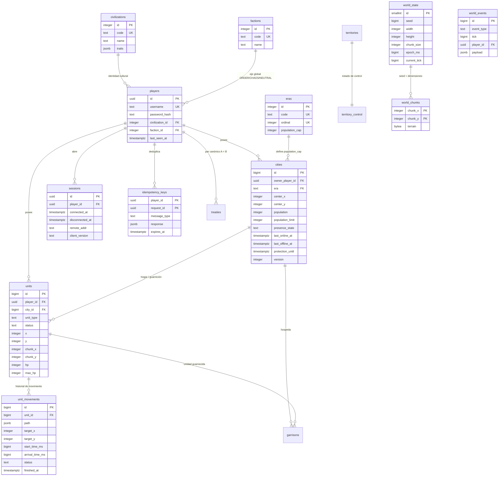

# Esquema de base de datos

Modelo de datos normativo de Empires Online sobre PostgreSQL: el *durable source of truth* del mundo persistente, con DDL completo, semántica de cada columna y el diseño previsto de las tablas fuera de MVP.

Este documento es la referencia autoritativa del esquema. Las migraciones que lo materializan están descritas en [migrations.md](./migrations.md); los índices que sostienen las consultas calientes, en [indexing.md](./indexing.md). El reparto entre RAM, PostgreSQL y Redis se explica en [../architecture/persistence.md](../architecture/persistence.md).

Todo el DDL de este documento es **transcripción literal** de las migraciones aplicadas, `services/game-server/migrations/000001_initial_schema.up.sql` y `000002_seed_catalogs.up.sql`. Si una consulta de este documento y el fichero de migración difieren, manda el fichero.

---

## 1. Alcance y clasificación de tablas

Las diecisiete tablas del MVP existen y las crea la migración `000001`. Lo que sigue describe qué escribe cada una **hoy**.

| Tabla | Clasificación | Escrito por |
|---|---|---|
| `players` | MVP: activa | Alta de cuenta (`POST /api/auth/register`), `TouchLastSeen` en login |
| `civilizations` | MVP: activa (catálogo) | Migración de semilla `000002` |
| `factions` | MVP: activa (catálogo) | Migración de semilla `000002` |
| `eras` | MVP: activa (catálogo) | Migración de semilla `000002` |
| `cities` | MVP: activa | Alta transaccional (incluido el recálculo de `population`) + `UPDATE` encolado por cada transición de presencia |
| `units` | MVP: activa | Alta transaccional + dirty-set y flush por lotes |
| `unit_movements` | MVP: activa | Escritura durable encolada (inicio, cancelación, finalización) |
| `world_state` | MVP: activa (fila única) | `WorldRepo.LoadOrInit` en el bootstrap + `SaveTick` de `current_tick` en el apagado ordenado |
| `world_chunks` | MVP: activa | Generación determinista del mundo (`COPY`, una sola vez) |
| `sessions` | MVP: creada; **el servidor aún no la escribe** | La sesión viva está en RAM y en Redis (`presence:player:{playerId}`) |
| `idempotency_keys` | MVP: creada; **el servidor aún no la escribe** | La deduplicación del MVP es Redis (`idem:{playerId}:{requestId}`, `SETNX`) |
| `schema_migrations` | MVP: activa (infraestructura) | golang-migrate |
| `territories` | MVP: creada con lógica diferida | — |
| `territory_control` | MVP: creada con lógica diferida | — |
| `safe_zones` | MVP: creada con lógica diferida | — |
| `treaties` | MVP: creada con lógica diferida | — |
| `garrisons` | MVP: creada con lógica diferida | — |
| `world_events` | MVP: creada con lógica diferida | Append-only, escritura mínima |
| `technologies` | Fuera de MVP: solo diseño | — |
| `civilization_technologies` | Fuera de MVP: solo diseño | — |
| `trade_routes` | Fuera de MVP: solo diseño | — |
| `caravans` | Fuera de MVP: solo diseño | — |
| `markets` | Fuera de MVP: solo diseño | — |
| `trade_transactions` | Fuera de MVP: solo diseño | — |
| `clans` | Fuera de MVP: solo diseño | — |

"Creada con lógica diferida" significa que la migración crea la tabla, las claves y los índices, pero el Game Server del MVP no ejecuta reglas de negocio sobre ella. Se crean ahora porque sus claves foráneas apuntan a tablas activas (`garrisons` → `units` y `cities`, `treaties` → `players`, `territory_control` → `territories`) y porque introducirlas más tarde obligaría a un paso *expand* adicional sobre tablas ya grandes.

---

## 2. Diagrama entidad-relación (MVP)



---

## 3. Convenciones transversales

Estas reglas aplican a **todas** las tablas y no se repiten en cada ficha:

1. **Claves primarias**: `bigint GENERATED ALWAYS AS IDENTITY`, con cuatro excepciones explícitas y deliberadas:
   - `players.id` y `sessions.id` son `uuid` (identificadores expuestos al cliente y a los JWT como claim `sub`; el `uuid` lo genera la aplicación, no la base);
   - los catálogos `civilizations`, `factions` y `eras` usan `integer` con **id explícito**, porque sus filas las fija la migración de semilla `000002` y esos números son estables entre entornos;
   - `world_state.id` es `smallint PRIMARY KEY DEFAULT 1 CHECK (id = 1)`: el singleton no necesita una secuencia;
   - las tablas cuya clave es natural o heredada: `world_chunks (chunk_x, chunk_y)`, `idempotency_keys (player_id, request_id)`, `territory_control (territory_id)` y `garrisons (unit_id)`.
2. **Timestamps**: `timestamptz` siempre. Los instantes que la simulación compara con aritmética entera se guardan además como `bigint` en epoch milliseconds con sufijo `_time_ms` / `_ms` (ver §5). No todas las marcas humanas tienen contrapartida en milisegundos: sólo las que el dominio evalúa.
3. **`created_at timestamptz NOT NULL DEFAULT now()`** en toda tabla. **`updated_at`** existe y lo mantiene un trigger, nunca la aplicación, sólo en las seis tablas que se actualizan de verdad: `players`, `world_state`, `cities`, `units`, `unit_movements` y `territory_control`. Las tablas de una sola escritura (`civilizations`, `factions`, `eras`, `world_chunks`, `safe_zones`, `territories`, `garrisons`, `idempotency_keys`) y las append-only (`world_events`) no la llevan.
4. **Enums de dominio como `text` + `CHECK`**, nunca tipos `ENUM` de PostgreSQL: añadir un valor a un `CHECK` es un `ALTER TABLE ... ADD CONSTRAINT ... NOT VALID` seguido de `VALIDATE`, sin lock exclusivo prolongado ni el problema de `ALTER TYPE ... ADD VALUE` dentro de transacción.
5. **Concurrencia optimista**: `version integer NOT NULL DEFAULT 0` **sólo en `cities`**, que es la única entidad mutable desde dos caminos de escritura (la máquina de presencia y el recálculo de población). `units` **no** tiene `version`: su única escritura concurrente es el lote de flush, que es de un solo escritor. Añadir `version` a `units` sería pagar una columna y un conflicto que hoy nadie puede producir.
6. **Sin bounds de mundo hardcodeados**: ningún `CHECK` de coordenadas de entidad fija un límite superior. `EO_WORLD_WIDTH` / `EO_WORLD_HEIGHT` son configuración y el dominio los valida contra `world_state`. Poner `512` en un `CHECK` congelaría un valor de gameplay dentro del esquema y contradiría la regla de configuración única.
7. **`ON DELETE`**: se elige explícitamente donde importa. `CASCADE` desde el agregado raíz hacia sus hijos estrictos (`players` → `cities`, `units`, `sessions`, `idempotency_keys`, `treaties`; `units` → `unit_movements`, `garrisons`; `cities` → `garrisons`; `territories` → `territory_control`), `SET NULL` en referencias opcionales (`units.city_id`, `world_events.player_id`) y **sin cláusula** —es decir `NO ACTION`— hacia los catálogos (`players.civilization_id`, `players.faction_id`, `cities.era`): borrar una civilización que tiene jugadores debe fallar, y `NO ACTION` ya lo impide.

### 3.1 Función de trigger compartida

```sql
CREATE OR REPLACE FUNCTION set_updated_at() RETURNS trigger AS $$
BEGIN
    NEW.updated_at = now();
    RETURN NEW;
END;
$$ LANGUAGE plpgsql;
```

Cada tabla con `updated_at` declara su trigger con el nombre de la tabla como prefijo:

```sql
CREATE TRIGGER <tabla>_set_updated_at
    BEFORE UPDATE ON <tabla>
    FOR EACH ROW EXECUTE FUNCTION set_updated_at();
```

Los seis triggers existentes son `players_set_updated_at`, `world_state_set_updated_at`, `cities_set_updated_at`, `units_set_updated_at`, `unit_movements_set_updated_at` y `territory_control_set_updated_at`.

---

## 4. `schema_migrations`

**MVP: activa (infraestructura).** No la crea nuestro DDL: la crea y la mantiene golang-migrate. Contiene `version bigint` y `dirty boolean`. Ninguna migración ni ningún código de dominio la escribe; el arranque **sí la lee**: `postgres.Migrate` consulta la versión y, si la encuentra marcada como `dirty`, aborta el arranque en vez de adivinar qué quedó a medias. Detalles operativos en [migrations.md](./migrations.md).

---

## 5. Convención de epoch milliseconds junto a `timestamptz`

Los instantes que la **aritmética de la simulación** compara se guardan como `bigint` en milisegundos desde el epoch Unix UTC (`world_state.epoch_ms`, `unit_movements.start_time_ms` y `arrival_time_ms`); los instantes que sólo lee un humano o que sólo marcan un hecho se guardan como `timestamptz` (`cities.last_online_at`, `cities.last_offline_at`, `cities.protection_until`, `unit_movements.finished_at`, `sessions.connected_at`…). Que la aritmética viva en `bigint` no es redundancia accidental; es una decisión deliberada con tres motivos.

**Determinismo aritmético.** `epoch_ms` es el origen temporal declarado del mundo —el propio comentario de la migración lo escribe así: `tickTime = epoch_ms + tick * tickDurationMs`—, y el instante que el loop pasa a cada fase del tick es el `Clock.NowMs()` inyectado, también en milisegundos enteros desde el epoch (ver [../architecture/game-loop.md](../architecture/game-loop.md)). Con `bigint` esto es aritmética entera exacta, idéntica en Go, en PostgreSQL y en el navegador. Con `timestamptz` intervendrían microsegundos, redondeos y conversión a `float64` en JavaScript, donde `Date` sólo tiene resolución de milisegundo: la posición autoritativa de una unidad no puede depender de esa conversión.

**Reconstrucción analítica del movimiento.** La posición de una unidad en el instante `T` es el último waypoint de `unit_movements.path` con `tMs <= (T - start_time_ms)`. Eso es una resta de enteros. Si `start_time_ms` fuese `timestamptz`, cada consulta de recuperación tendría que hacer `EXTRACT(EPOCH FROM ...) * 1000` y confiar en el redondeo, y los índices sobre expresiones temporales serían más caros que un índice B-tree sobre `bigint`.

**Ausencia de ambigüedad de zona y de DST.** El mundo es 24/7 y global. Los milisegundos no tienen zona horaria ni horario de verano, y comparar `arrival_time_ms <= now_ms` no depende de `TimeZone` de la sesión de PostgreSQL.

El `timestamptz` se mantiene porque es lo que un operador humano necesita: leer un log, filtrar por rango de fechas, aplicar retención, correlacionar con métricas Prometheus. Formalmente:

| Aspecto | `*_ms` (`bigint`) | `*_at` (`timestamptz`) |
|---|---|---|
| Autoridad | **Sí.** El dominio lee y compara esta columna | No. Derivada, para humanos y herramientas |
| Fuente | `Clock.NowMs()` inyectado (o `epoch_ms + tick*period`) | `now()` de PostgreSQL o el mismo `Clock` |
| Uso típico | Aritmética de simulación, ETA, cooldowns, índices calientes | Auditoría, retención, dashboards, soporte |
| En tests | `FakeClock` produce valores exactos y reproducibles | Ignorado por las aserciones deterministas |

Regla de escritura: cuando ambas columnas describen el mismo hecho, **se escriben en el mismo `INSERT`/`UPDATE`** y el valor de `*_ms` proviene del `Clock` del dominio, no de `now()`. Nunca se deriva `*_ms` desde el `timestamptz` a posteriori.

Consecuencia práctica que hay que tener presente al leer el DDL: **`cities` no tiene ninguna columna `*_ms`**. Su ciclo de presencia se decide en RAM contra `DisconnectGrace` (= `EO_PRESENCE_TTL_SECONDS`) y contra `EO_CITY_OFFLINE_PROTECTION_COOLDOWN_SECONDS`, y a la base sólo llega el hecho consumado con su marca `timestamptz`. Cualquier documento que cite `cities.offline_since_ms`, `protection_eligible_at_ms`, `protection_engaged_at_ms` o `protection_until_ms` está describiendo columnas que no existen.

---

## 6. Catálogos

### 6.1 `civilizations`

**MVP: activa.** Identidad cultural del jugador (unidades, tecnologías y bonos futuros). Es un eje **ortogonal** a la facción global: una civilización no implica una facción.

```sql
CREATE TABLE civilizations (
    id          integer PRIMARY KEY,
    code        text        NOT NULL UNIQUE,
    name        text        NOT NULL,
    traits      jsonb       NOT NULL DEFAULT '{}'::jsonb,
    created_at  timestamptz NOT NULL DEFAULT now()
);
```

| Columna | Tipo | Semántica |
|---|---|---|
| `id` | `integer` PK explícita | Clave sustituta fijada por la semilla (`1..4`), referenciada por `players.civilization_id`. No es `IDENTITY`: los números deben ser idénticos en local, CI y producción |
| `code` | `text` UNIQUE | Identificador estable en inglés (`ROMAN`). Es lo que viaja por el protocolo y lo que usa la lógica; el `id` es interno |
| `name` | `text` | Nombre presentable, sin traducción en MVP |
| `traits` | `jsonb` | **Rasgos data-driven**, objeto clave → multiplicador (`{"unit.move_speed": 1.05, ...}`, `1.0` = sin efecto). Existe precisamente para que ningún sistema compare `code`: cada sistema consulta la clave que le concierne. `PlayerRepo.ListCivilizations` lo deserializa en `player.Civilization.Traits` |

### 6.2 `factions`

**MVP: activa.** Facción global (`ORDER`, `CHAOS`, `NEUTRAL`). Sin efectos de gameplay en el MVP más allá de almacenarse y viajar en el snapshot.

```sql
CREATE TABLE factions (
    id          integer PRIMARY KEY,
    code        text        NOT NULL UNIQUE,
    name        text        NOT NULL,
    created_at  timestamptz NOT NULL DEFAULT now()
);
```

| Columna | Tipo | Semántica |
|---|---|---|
| `id` | `integer` PK explícita | `1` ORDER, `2` CHAOS, `3` NEUTRAL, fijados por la semilla |
| `code` | `text` UNIQUE | Los tres valores canónicos. **No hay `CHECK` de dominio**: la tabla ya es el catálogo cerrado, y añadir una facción es un `INSERT` en una migración, no un `ALTER`. El cierre del conjunto lo impone la FK desde `players.faction_id` |
| `name` | `text` | Etiqueta presentable |

### 6.3 `eras`

**MVP: activa.** Define el `population_cap` por era. El canon es explícito: las eras se definen en esta tabla, **no en código**.

```sql
CREATE TABLE eras (
    id              integer PRIMARY KEY,
    code            text    NOT NULL UNIQUE,
    name            text    NOT NULL,
    ordinal         integer NOT NULL UNIQUE,
    population_cap  integer NOT NULL CHECK (population_cap > 0),
    created_at      timestamptz NOT NULL DEFAULT now()
);
```

| Columna | Tipo | Semántica |
|---|---|---|
| `code` | `text` UNIQUE | **Es la clave a la que apunta `cities.era`**: la FK de `cities` referencia `eras (code)`, no `eras (id)`, para que una fila de `cities` sea legible sin join |
| `ordinal` | `integer` UNIQUE | Orden de progresión, `1..4`. Permite `ORDER BY ordinal` y comparar eras sin depender del `id` |
| `population_cap` | `integer` CHECK `> 0` | Base de `cities.population_limit`. En MVP no hay modificadores de edificios, así que `population_limit = population_cap`. `CityRepo.ListEras` lo lee al arrancar |

### 6.4 Datos semilla de catálogos

Se insertan desde la migración `000002_seed_catalogs.up.sql` porque otras tablas dependen de ellos por clave foránea: sin filas en `eras` no se puede crear una ciudad. Son datos de juego, no datos de prueba. Todas las inserciones son idempotentes por `id`:

```sql
INSERT INTO civilizations (id, code, name, traits) VALUES
    (1, 'ROMAN',     'Romanos',   '{"unit.move_speed": 1.00, "build.speed": 1.10, "economy.gather_rate": 1.00}'),
    (2, 'BYZANTINE', 'Bizantinos','{"unit.move_speed": 0.95, "build.speed": 1.00, "defense.wall_hp": 1.20}'),
    (3, 'PERSIAN',   'Persas',    '{"unit.move_speed": 1.05, "build.speed": 0.95, "economy.trade_yield": 1.15}'),
    (4, 'NORSE',     'Nórdicos',  '{"unit.move_speed": 1.10, "build.speed": 0.90, "combat.raid_bonus": 1.15}')
ON CONFLICT (id) DO NOTHING;

INSERT INTO factions (id, code, name) VALUES
    (1, 'ORDER',   'Orden'),
    (2, 'CHAOS',   'Caos'),
    (3, 'NEUTRAL', 'Neutral')
ON CONFLICT (id) DO NOTHING;

INSERT INTO eras (id, code, name, ordinal, population_cap) VALUES
    (1, 'STONE_AGE',  'Edad de Piedra',    1,  20),
    (2, 'BRONZE_AGE', 'Edad de Bronce',    2,  50),
    (3, 'IRON_AGE',   'Edad de Hierro',    3, 100),
    (4, 'CASTLE_AGE', 'Edad de Castillos', 4, 150)
ON CONFLICT (id) DO NOTHING;
```

Nótese que `name` está en español (es la etiqueta presentable) mientras `code` está en inglés (es el identificador). Los `ordinal` empiezan en **1**, no en 0. Añadir una quinta civilización es una migración nueva, no una edición de `000002`: las migraciones publicadas son inmutables ([migrations.md](./migrations.md) §2.1).

Los multiplicadores de `traits` están declarados pero **el MVP todavía no los consume**: `unit.move_speed` no participa aún en el cálculo de la polilínea, que usa el `BaseMsPerTile` del catálogo de tipos de unidad en código. Aplicar el rasgo es trabajo pendiente, no una regla implementada.

---

## 7. `players`

**MVP: activa.** Cuenta de juego. Todos los jugadores son humanos; la variedad procede de `civilization_id` y `faction_id`, ejes independientes entre sí.

```sql
CREATE TABLE players (
    id                uuid        PRIMARY KEY,
    username          text        NOT NULL UNIQUE,
    password_hash     text        NOT NULL,
    civilization_id   integer     NOT NULL REFERENCES civilizations (id),
    faction_id        integer     NOT NULL REFERENCES factions (id),
    last_seen_at      timestamptz,
    created_at        timestamptz NOT NULL DEFAULT now(),
    updated_at        timestamptz NOT NULL DEFAULT now(),

    CONSTRAINT players_username_format CHECK (username ~ '^[A-Za-z0-9_-]{3,24}$')
);

CREATE TRIGGER players_set_updated_at
    BEFORE UPDATE ON players
    FOR EACH ROW EXECUTE FUNCTION set_updated_at();
```

| Columna | Tipo | Semántica |
|---|---|---|
| `id` | `uuid` PK | Identificador público del jugador. Es el claim `sub` del game ticket JWT y el campo `player_id` de los logs estructurados. UUID y no `bigint` porque se expone al cliente y no debe ser enumerable. **Sin `DEFAULT`**: lo genera el servidor (`uuid.New()`) dentro de la transacción de alta, de modo que la aplicación conoce el id antes del `COMMIT` y puede crear ciudad y unidades en la misma transacción |
| `username` | `text` UNIQUE | Identificador de login. El `CHECK` admite mayúsculas, minúsculas, dígitos, `_` y `-`, de 3 a 24 caracteres: `^[A-Za-z0-9_-]{3,24}$` |
| `password_hash` | `text` | Hash bcrypt de la contraseña. **Nunca una contraseña en claro.** Sólo sale de la base por `PlayerRepo.GetByUsername`, y sólo lo consume el verificador de credenciales |
| `civilization_id` | `integer` FK | Civilización elegida. Sin `ON DELETE`: el `NO ACTION` por defecto impide borrar un catálogo referenciado |
| `faction_id` | `integer` FK | Facción global. Ortogonal a la civilización: cualquier combinación es válida |
| `last_seen_at` | `timestamptz` | Última actividad observada (`TouchLastSeen`). `NULL` hasta el primer login |

**Credenciales.** Contra lo que describe la arquitectura objetivo, **hoy el propio Game Server almacena y verifica las credenciales**: `players.password_hash` guarda un hash bcrypt y `internal/httpapi` sirve `POST /api/auth/register` y `POST /api/auth/login`. Es explícitamente provisional. [ADR-010](../decisions/ADR-010-authentication-game-ticket.md) traslada la autenticación de usuario a Next.js, que emitirá el game ticket (JWT HS256, TTL 60 s) que el Game Server ya verifica hoy; cuando eso ocurra, `password_hash` saldrá de esta tabla mediante el patrón *contract* de [migrations.md](./migrations.md) §3. El contrato del ticket está en [../specs/websocket-protocol.md](../specs/websocket-protocol.md).

---

## 8. `cities`

**MVP: activa.** Asentamiento del jugador y unidad de protección offline. Cada ciudad inicial arranca con una muralla de 3×3 tiles bloqueados alrededor del centro y 3 `VILLAGER` que nacen a radio 2.

```sql
CREATE TABLE cities (
    id                bigint GENERATED ALWAYS AS IDENTITY PRIMARY KEY,
    owner_player_id   uuid        NOT NULL REFERENCES players (id) ON DELETE CASCADE,
    name              text        NOT NULL,
    center_x          integer     NOT NULL,
    center_y          integer     NOT NULL,
    era               text        NOT NULL REFERENCES eras (code),
    population        integer     NOT NULL DEFAULT 0 CHECK (population >= 0),
    population_limit  integer     NOT NULL CHECK (population_limit >= 0),
    presence_state    text        NOT NULL DEFAULT 'ONLINE',
    last_online_at    timestamptz,
    last_offline_at   timestamptz,
    protection_until  timestamptz,
    version           integer     NOT NULL DEFAULT 0,
    created_at        timestamptz NOT NULL DEFAULT now(),
    updated_at        timestamptz NOT NULL DEFAULT now(),

    -- INV-CITY-004: el autómata de presencia sólo admite estos tres valores.
    CONSTRAINT cities_presence_state_valid
        CHECK (presence_state IN ('ONLINE', 'OFFLINE_PENDING', 'PROTECTED')),
    -- INV-CITY-002: la población nunca supera el límite.
    CONSTRAINT cities_population_within_limit
        CHECK (population <= population_limit),
    -- Dos ciudades no pueden compartir el mismo centro.
    CONSTRAINT cities_unique_center UNIQUE (center_x, center_y)
);

CREATE TRIGGER cities_set_updated_at
    BEFORE UPDATE ON cities
    FOR EACH ROW EXECUTE FUNCTION set_updated_at();

CREATE INDEX cities_owner_idx ON cities (owner_player_id);
-- Consulta del barrido de timers: ciudades cuyo cooldown puede haber vencido.
CREATE INDEX cities_offline_pending_idx
    ON cities (last_offline_at)
    WHERE presence_state = 'OFFLINE_PENDING';
```

| Columna | Tipo | Semántica |
|---|---|---|
| `owner_player_id` | `uuid` FK CASCADE | Propietario. `CASCADE` porque una ciudad no tiene sentido sin su jugador; el borrado de jugadores es una operación de soporte, no de gameplay |
| `name` | `text` | Nombre de la ciudad |
| `center_x`, `center_y` | `integer` | Tile del centro urbano. `int32` lógico del canon; `integer` de PostgreSQL es exactamente int32 |
| `era` | `text` FK → `eras (code)` | Era actual de la ciudad, por **código** (`STONE_AGE` al crearse). Referenciar el código y no el `id` hace la fila legible sin join |
| `population` | `integer` DEFAULT 0, CHECK `>= 0` | Población actual. **No se lleva a mano**: `CityRepo.UpdatePopulation` la recalcula como `count(*)` de las unidades vivas de la ciudad y devuelve el valor, de modo que la columna no puede desincronizarse del mundo real |
| `population_limit` | `integer` CHECK `>= 0` | Materializado desde `eras.population_cap`. En MVP no hay modificadores de edificios, así que coinciden. Se materializa para no unir contra `eras` en cada validación de `POPULATION_LIMIT_REACHED` |
| `presence_state` | `text` + CHECK | `ONLINE` / `OFFLINE_PENDING` / `PROTECTED`. Sólo el servidor lo escribe; el cliente lo observa |
| `last_online_at` | `timestamptz` | Última vez que la ciudad pasó a `ONLINE`. Lo escribe `SetPresence` |
| `last_offline_at` | `timestamptz` | Instante en que la ciudad pasó a `OFFLINE_PENDING`. Es la columna indexada por `cities_offline_pending_idx` y contra la que se compara el cooldown |
| `protection_until` | `timestamptz` | Fin de la protección. **Siempre `NULL` en MVP**: mientras el jugador siga offline la protección es indefinida. La columna existe para límites temporales futuros y `SetPresence` la limpia al volver a `ONLINE` |
| `version` | `integer` | Concurrencia optimista. Cada `SetPresence` y cada `UpdatePopulation` hacen `version = version + 1` |

Transiciones (autoridad exclusiva del servidor):

```
ONLINE --desconexión + gracia (EO_PRESENCE_TTL_SECONDS)--> OFFLINE_PENDING --cooldown 300 s--> PROTECTED
PROTECTED --connect--> ONLINE
OFFLINE_PENDING --connect--> ONLINE
```

La máquina de estados **no** está materializada como `CHECK` de coherencia entre columnas: el `CHECK` del esquema cierra el dominio de `presence_state` y nada más. Quién decide la transición es la fase 5 del tick, en RAM, contra `city.CanTransition`; la base recibe el hecho consumado. La razón es deliberada: un `CHECK` que ligara `presence_state` a la nulidad de otras columnas obligaría a escribirlas todas en el mismo `UPDATE` y convertiría cualquier ampliación de la máquina de estados en una migración de la restricción.

`cities_unique_center` impide dos ciudades en el mismo tile. La regla "un jugador tiene exactamente una ciudad" del MVP **no** se impone con un `UNIQUE (owner_player_id)`: se valida en el dominio, porque el multi-ciudad es una evolución prevista y eliminar un `UNIQUE` más adelante sería una migración de contracción evitable. Por eso `cities_owner_idx` es un índice normal, no único, y `CityRepo.GetByOwner` hace `ORDER BY id LIMIT 1`.

La parte de `INV-CITY-001` que sí es estructural —"exactamente **un** owner"— la garantizan `owner_player_id uuid NOT NULL REFERENCES players (id) ON DELETE CASCADE` y el hecho de que la columna sea escalar. Aviso de deriva: la ficha de [`INV-CITY-001`](../invariants/city.md) nombra un `uq_cities_owner` y un `fk_cities_owner` que **no existen** con esos nombres en la migración `000001`; los nombres reales son la restricción de clave foránea implícita de la columna y `cities_owner_idx`, que no es único.

`cities` **no** tiene `chunk_x` / `chunk_y`: la desnormalización de chunk sólo existe en `units`, que es la tabla que el interest management consulta por rango espacial. Una ciudad se localiza por su dueño, no por su chunk.

---

## 9. `units`

**MVP: activa.** Entidad móvil del mundo. El único `unit_type` del MVP es `VILLAGER` (hp 40, 600 ms/tile). `TOWN_CENTER` es un *building*, no una unidad, y no vive en esta tabla.

```sql
CREATE TABLE units (
    id         bigint GENERATED ALWAYS AS IDENTITY PRIMARY KEY,
    player_id  uuid        NOT NULL REFERENCES players (id) ON DELETE CASCADE,
    city_id    bigint      REFERENCES cities (id) ON DELETE SET NULL,
    unit_type  text        NOT NULL,
    x          integer     NOT NULL,
    y          integer     NOT NULL,
    hp         integer     NOT NULL CHECK (hp >= 0),
    max_hp     integer     NOT NULL CHECK (max_hp > 0),
    status     text        NOT NULL DEFAULT 'IDLE',
    chunk_x    integer     NOT NULL,
    chunk_y    integer     NOT NULL,
    created_at timestamptz NOT NULL DEFAULT now(),
    updated_at timestamptz NOT NULL DEFAULT now(),

    CONSTRAINT units_status_valid
        CHECK (status IN ('IDLE', 'MOVING', 'GARRISONED', 'HIDDEN', 'DEAD')),
    -- INV-UNIT-004: hp nunca supera max_hp.
    CONSTRAINT units_hp_within_max CHECK (hp <= max_hp)
);

CREATE TRIGGER units_set_updated_at
    BEFORE UPDATE ON units
    FOR EACH ROW EXECUTE FUNCTION set_updated_at();

CREATE INDEX units_player_idx ON units (player_id) WHERE status <> 'DEAD';
CREATE INDEX units_city_idx   ON units (city_id)   WHERE city_id IS NOT NULL;
-- Consulta del snapshot: todas las unidades vivas de un chunk.
CREATE INDEX units_chunk_idx  ON units (chunk_x, chunk_y) WHERE status <> 'DEAD';
```

| Columna | Tipo | Semántica |
|---|---|---|
| `player_id` | `uuid` FK CASCADE | Dueño. Base de la validación `UNIT_NOT_OWNED` |
| `city_id` | `bigint` FK SET NULL, anulable | Ciudad de origen / hogar. `SET NULL` porque una unidad puede sobrevivir a la destrucción de su ciudad; nunca se borra una unidad en cascada desde `cities` |
| `unit_type` | `text` | `VILLAGER` en MVP. **Sin `CHECK` de dominio**: el catálogo de tipos vive en `internal/domain/unit` y `unit.Lookup` rechaza un tipo desconocido antes de que llegue a la base. Añadir un tipo no exige migración |
| `x`, `y` | `integer` | **Posición consolidada.** Autoritativa sólo cuando `status <> 'MOVING'`. Durante un movimiento la posición autoritativa se deriva de la polilínea (§10); esta columna es entonces el último punto volcado por el flush periódico |
| `hp`, `max_hp` | `integer` + CHECK | `VILLAGER`: 40/40. `hp >= 0`, `max_hp > 0` y `units_hp_within_max` materializa `INV-UNIT-004` |
| `status` | `text` + CHECK | `IDLE`, `MOVING`, `GARRISONED`, `HIDDEN`, `DEAD`. `MOVING` implica un `unit_movements` `ACTIVE` (`INV-UNIT-005`) |
| `chunk_x`, `chunk_y` | `integer` | Chunk desnormalizado para interest management, calculado por la aplicación como `x / chunk_size` (no `x >> 5`: `EO_CHUNK_SIZE` es configuración y no tiene por qué ser potencia de dos). Es el índice espacial del MVP; ver [indexing.md](./indexing.md) |

`units` **no** tiene `version`, ni `base_ms_per_tile`, ni `position_time_ms`. Las tres se consideraron y ninguna se materializó:

- **`version`**: el único escritor concurrente de estas filas es el lote de flush, de un solo escritor por construcción (§3, regla 5).
- **`base_ms_per_tile`**: el coste temporal por tile es una propiedad del **tipo** de unidad, no de la instancia, y vive en el catálogo de `internal/domain/unit` (`VILLAGER` = 600 ms/tile). La recuperación tras un crash no lo necesita: la polilínea ya está persistida en `unit_movements.path` con sus `tMs` calculados, así que reconstruir la posición no vuelve a calcular duración alguna.
- **`position_time_ms`**: no hace falta un instante asociado a `(x, y)` porque la ambigüedad que resolvería no existe. Si la unidad tiene un movimiento `ACTIVE`, la posición autoritativa es la derivada de la polilínea y la columna se ignora; si no lo tiene, la columna es la posición y punto.

**Persistencia.** Alta de unidad: dentro de la transacción de alta del jugador. `x`, `y`, `chunk_x`, `chunk_y`, `status`: dirty-set y flush cada `EO_PERSISTENCE_FLUSH_INTERVAL_TICKS = 50` ticks (5 s a 10 Hz) mediante un único `UPDATE ... FROM unnest(...)`; ver [persistence-strategy.md](./persistence-strategy.md). `hp` no cambia en el MVP porque no hay combate, y por eso la sentencia del flush **no lo incluye**: escribe exactamente `x`, `y`, `status`, `chunk_x` y `chunk_y`.

---

## 10. `unit_movements`

**MVP: activa.** Persiste la polilínea temporizada de cada orden de movimiento. Es la tabla que hace que el mundo sobreviva a un reinicio del proceso sin replay de ticks.

```sql
CREATE TABLE unit_movements (
    id              bigint GENERATED ALWAYS AS IDENTITY PRIMARY KEY,
    unit_id         bigint      NOT NULL REFERENCES units (id) ON DELETE CASCADE,
    -- [{"x":int,"y":int,"tMs":int}, ...] — el primer waypoint es el origen con tMs = 0.
    path            jsonb       NOT NULL,
    target_x        integer     NOT NULL,
    target_y        integer     NOT NULL,
    start_time_ms   bigint      NOT NULL,
    arrival_time_ms bigint      NOT NULL,
    status          text        NOT NULL DEFAULT 'ACTIVE',
    finished_at     timestamptz,
    created_at      timestamptz NOT NULL DEFAULT now(),
    updated_at      timestamptz NOT NULL DEFAULT now(),

    CONSTRAINT unit_movements_status_valid
        CHECK (status IN ('ACTIVE', 'COMPLETED', 'CANCELLED', 'FAILED')),
    CONSTRAINT unit_movements_time_ordered
        CHECK (arrival_time_ms >= start_time_ms),
    CONSTRAINT unit_movements_path_is_array
        CHECK (jsonb_typeof(path) = 'array' AND jsonb_array_length(path) >= 1)
);

CREATE TRIGGER unit_movements_set_updated_at
    BEFORE UPDATE ON unit_movements
    FOR EACH ROW EXECUTE FUNCTION set_updated_at();

-- Garantía física de INV-MOVE-001.
CREATE UNIQUE INDEX unit_movements_one_active_per_unit
    ON unit_movements (unit_id)
    WHERE status = 'ACTIVE';

-- Consulta de arranque: rehidratar todos los movimientos vivos, en orden estable.
CREATE INDEX unit_movements_active_idx
    ON unit_movements (arrival_time_ms, id)
    WHERE status = 'ACTIVE';
```

| Columna | Tipo | Semántica |
|---|---|---|
| `unit_id` | `bigint` FK CASCADE | Unidad que se mueve. Es la única FK de la tabla: no hay `player_id` desnormalizado, porque toda consulta por jugador pasa antes por `units`, que ya está indexada por `player_id` |
| `path` | `jsonb` | **Polilínea temporizada**: `[{"x":int,"y":int,"tMs":int}, ...]`. `tMs` es el offset en milisegundos desde `start_time_ms` en que la unidad **alcanza** ese tile. El primer elemento es el origen con `tMs = 0` |
| `target_x`, `target_y` | `integer` | Destino solicitado. El origen no se duplica en columnas: es el waypoint `tMs = 0` de `path` |
| `start_time_ms` | `bigint` | Instante de inicio en epoch ms, del `Clock` inyectado |
| `arrival_time_ms` | `bigint` | `start_time_ms + tMs` del último waypoint. Materializado para poder consultar y ordenar por rango sin abrir el JSON |
| `status` | `text` + CHECK | `ACTIVE`, `COMPLETED`, `CANCELLED`, `FAILED` |
| `finished_at` | `timestamptz` | Instante de cierre, escrito como `now()` junto al estado terminal. `NULL` mientras `ACTIVE`. **El instante de mundo en que el movimiento debía terminar es `arrival_time_ms`**, no esta columna: `finished_at` sólo dice cuándo lo escribió el proceso |

No hay `cancel_reason` en la tabla. El motivo de cancelación (`REPLACED`, `CANCELLED_BY_PLAYER`, `PATH_BLOCKED`, `UNIT_DEAD`, `SERVER`) viaja en el mensaje `unit.movement.cancelled` y **no sobrevive al reinicio**: la fila conserva el hecho (`status = 'CANCELLED'`, `finished_at`) pero no su causa. Es una omisión consciente — nadie consulta el porqué de una cancelación tras un reinicio — y no una columna olvidada.

Tampoco hay `request_id`: la deduplicación del MVP vive entera en Redis (`idem:{playerId}:{requestId}`, `SETNX`), y correlacionar un movimiento con la petición que lo originó se hace por el `request_id` del log estructurado.

Sobre `unit_movements_path_is_array`: el `CHECK` exige un array **no vacío**, es decir `>= 1` waypoint, exactamente lo mismo que `movement.Validate` rechaza en el dominio (`ErrEmptyPath`). Que la base admita una polilínea de un solo waypoint no es una fisura: la simulación nunca crea una, porque cuando el destino coincide con la posición actual acepta la orden **sin crear movimiento**. Endurecer el `CHECK` a `>= 2` bloquearía un caso que el dominio ya no produce, a cambio de una migración sobre la tabla que más crece.

Sobre `unit_movements_time_ordered`: el `CHECK` es `arrival_time_ms >= start_time_ms`, no `>`. La igualdad es alcanzable sólo por una polilínea de un waypoint, es decir por el caso que el párrafo anterior describe.

Ejemplo de `path` (villager, 600 ms/tile base, un tramo ortogonal sobre GRASSLAND y uno diagonal sobre FOREST):

```json
[
  { "x": 10, "y": 10, "tMs": 0 },
  { "x": 11, "y": 10, "tMs": 600 },
  { "x": 12, "y": 11, "tMs": 1958 }
]
```

El segundo tramo es diagonal hacia FOREST: `600 × 1.6 = 960` ms ortogonales, y el factor diagonal en punto fijo da `(960 × 1414214 + 500000) / 1000000 = 1358` ms — cada segmento se redondea al milisegundo más cercano **antes** de acumularse, así que el waypoint final queda en `600 + 1358 = 1958`. El detalle del cálculo y del pathfinding vive en [../specs/movement.md](../specs/movement.md); aquí sólo importa que la columna es la salida ya calculada, no una entrada del cliente.

### 10.1 `unit_movements_one_active_per_unit` es la garantía física de INV-MOVE-001

`INV-MOVE-001` dice: *una unidad tiene como máximo un movimiento `ACTIVE`*. Ese invariante puede violarse por dos caminos que ninguna validación en memoria cubre por sí sola: dos comandos `unit.move` de la misma unidad procesados por transacciones concurrentes, y un reintento tras un fallo parcial que reinserta un movimiento que ya existía.

El índice único **parcial** lo hace imposible a nivel de almacenamiento. Es parcial (`WHERE status = 'ACTIVE'`) por una razón esencial: la unicidad debe aplicarse sólo al estado vivo. Una unidad acumula decenas de movimientos `COMPLETED` y `CANCELLED` a lo largo de su vida; un `UNIQUE (unit_id)` total los prohibiría y destruiría el historial. Con el predicado, el índice sólo contiene las filas vivas — como mucho una por unidad, es decir un índice diminuto y con altísima tasa de aciertos en caché — y las filas terminales ni siquiera entran en él.

La secuencia canónica de una nueva orden, **dentro de una sola transacción** (`GameStore.PersistMovementStart` → `MovementRepo.Start`):

```sql
BEGIN;

-- 1. Cancelar el movimiento activo previo, si lo hay. RETURNING devuelve su id
--    (o ninguna fila, que es el caso normal).
UPDATE unit_movements
   SET status = 'CANCELLED', finished_at = now()
 WHERE unit_id = $1 AND status = 'ACTIVE'
 RETURNING id;

-- 2. Insertar el nuevo.
INSERT INTO unit_movements
    (unit_id, path, target_x, target_y, start_time_ms, arrival_time_ms, status)
VALUES ($1, $2, $3, $4, $5, $6, 'ACTIVE')
RETURNING id;

COMMIT;
```

Las dos operaciones van juntas **por necesidad**: si se hicieran por separado, entre una y otra la unidad tendría dos movimientos `ACTIVE`. La transacción **no toca `units`**: el cambio de `status` a `MOVING` se aplica en RAM y llega a la base por el dirty-set. Ésa es la razón de que `units` no necesite `version`: no hay dos escritores compitiendo por esa fila.

Si dos transacciones concurrentes intentan esto, la segunda bloquea en el índice único y termina abortando con `23505` (`unique_violation`) o con un conflicto de serialización. El trabajo se reintenta hasta **3 veces**, con una espera creciente de 200 ms por número de intento, en la cola de persistencia; si se agotan, se ejecuta la compensación `OnPermanentFailure` del trabajo. Hoy esa compensación **sólo registra el fallo a `level=error`**: detener la unidad exigiría volver a entrar en el loop por el canal de comandos —el worker no puede mutar el mundo desde otra goroutine sin provocar una carrera— y es trabajo pendiente. Nunca se resuelve borrando el índice.

**Recuperación tras crash.** Al arrancar se cargan todos los movimientos `ACTIVE` con `MovementRepo.ListActive` (§2.3 de [indexing.md](./indexing.md)). Para cada uno, `simulation.Hydrate` decide: si `arrival_time_ms <= now_ms`, el movimiento se completa —la unidad aparece en el último waypoint, vuelve a `IDLE` y la fila se cierra como `COMPLETED`—; si sigue en curso, se reanuda desde la polilínea calculando la posición como el último waypoint con `tMs <= now_ms - start_time_ms`; y si la polilínea es inválida —o su unidad ya no existe— la fila se cierra como `FAILED` y **la unidad se queda en su última posición consolidada**, sin teletransportarse a ninguna parte por un dato dudoso. El cierre de esas filas lo aplica `GameStore.FinishRecoveredMovements` antes de arrancar el loop, con un `UPDATE` por movimiento (`status` + `finished_at = now()`).

---

## 11. `world_state`

**MVP: activa.** Fila única con los parámetros del mundo instanciado y el reloj de simulación.

```sql
CREATE TABLE world_state (
    id           smallint    PRIMARY KEY DEFAULT 1 CHECK (id = 1),
    seed         bigint      NOT NULL,
    width        integer     NOT NULL CHECK (width > 0),
    height       integer     NOT NULL CHECK (height > 0),
    chunk_size   integer     NOT NULL CHECK (chunk_size > 0),
    -- Origen temporal de la simulación: tickTime = epoch_ms + tick*tickDurationMs.
    epoch_ms     bigint      NOT NULL,
    current_tick bigint      NOT NULL DEFAULT 0 CHECK (current_tick >= 0),
    created_at   timestamptz NOT NULL DEFAULT now(),
    updated_at   timestamptz NOT NULL DEFAULT now()
);

CREATE TRIGGER world_state_set_updated_at
    BEFORE UPDATE ON world_state
    FOR EACH ROW EXECUTE FUNCTION set_updated_at();
```

| Columna | Tipo | Semántica |
|---|---|---|
| `id` | `smallint` PK `DEFAULT 1` + CHECK `= 1` | Patrón singleton: el `CHECK` hace físicamente imposible una segunda fila. Preferible a una tabla sin PK con un trigger contador |
| `seed` | `bigint` | Valor efectivo de `EO_WORLD_SEED` (20260909 por defecto) usado para generar el terreno. Se persiste para que el mundo sea auditable y regenerable |
| `width`, `height` | `integer` CHECK `> 0` | Valores efectivos de `EO_WORLD_WIDTH` / `EO_WORLD_HEIGHT` (512 × 512 en MVP) |
| `chunk_size` | `integer` CHECK `> 0` | Valor efectivo de `EO_CHUNK_SIZE` (32). Con 512/32 resultan 16 chunks por fila y 256 chunks totales |
| `epoch_ms` | `bigint` | Origen del reloj de simulación. `tickTime = epoch_ms + tickNumber * tickDurationMs`. Se fija una sola vez, en el bootstrap del mundo, y **nunca se modifica**: cambiarlo reinterpretaría todo `unit_movements` |
| `current_tick` | `bigint` DEFAULT 0, CHECK `>= 0` | Último tick persistido. Lo escribe `WorldRepo.SaveTick` **una sola vez, en el apagado ordenado**, nunca dentro del tick, y al arrancar es el `StartTick` desde el que el loop reanuda su contador. Tras una caída abrupta el contador se reanuda desde el último valor guardado, y eso es inocuo: ninguna regla de gameplay depende de él, porque las posiciones y los plazos se calculan con instantes en epoch ms (`start_time_ms`, `arrival_time_ms`, `Clock.NowMs()`), no con el número de tick |

**La alineación mundo/chunk no es un `CHECK`.** Que `width` y `height` sean múltiplos exactos de `chunk_size` lo valida `Config.Load()` al arrancar, junto al resto de validaciones cruzadas (`EO_TICK_RATE_HZ` divide a 1000, `EO_PRESENCE_HEARTBEAT_SECONDS < EO_PRESENCE_TTL_SECONDS`, …), y el proceso no arranca si falla. Ponerlo también en el esquema duplicaría la regla en dos sitios; la configuración tiene un solo dueño.

**Coherencia mundo persistido / configuración.** `WorldRepo.LoadOrInit` compara `seed`, `width`, `height` y `chunk_size` de la fila con la configuración actual y **falla el arranque** si difieren: arrancar con otra semilla o con otras dimensiones dejaría unidades sobre terreno que no existe. No se autocorrige nada.

---

## 12. `world_chunks`

**MVP: activa.** Terreno base persistido por chunk. **No es la fuente primaria**: el mapa se regenera desde `world_state.seed` en cada arranque, y esta tabla existe para auditoría (comparar byte a byte lo generado con lo persistido, `INV-WORLD-005`) y para permitir en el futuro mapas editados a mano que ya no deriven de una semilla.

```sql
CREATE TABLE world_chunks (
    chunk_x    integer     NOT NULL CHECK (chunk_x >= 0),
    chunk_y    integer     NOT NULL CHECK (chunk_y >= 0),
    terrain    bytea       NOT NULL,
    created_at timestamptz NOT NULL DEFAULT now(),
    PRIMARY KEY (chunk_x, chunk_y)
);
```

| Columna | Tipo | Semántica |
|---|---|---|
| `chunk_x`, `chunk_y` | `integer` (PK compuesta) + CHECK `>= 0` | Clave natural del chunk: `chunkX = x / chunk_size`, `chunkY = y / chunk_size`. La PK compuesta es también el índice de lectura del chunk |
| `terrain` | `bytea` | `chunk_size²` bytes —**1024 con `EO_CHUNK_SIZE=32`**—, un byte por tile con el valor de `TerrainType` (GRASSLAND 0, FOREST 1, HILL 2, MOUNTAIN 3, WATER 4, ROAD 5). Orden row-major: el tile local `(lx, ly)` está en el offset `ly * chunk_size + lx` |

No hay `CHECK (octet_length(terrain) = 1024)` ni columna `chunk_id`, y ambas ausencias son deliberadas: el `CHECK` congelaría `EO_CHUNK_SIZE` en el esquema, y `chunk_id` (`chunkY * chunksPerRow + chunkX`) depende de `EO_WORLD_WIDTH / EO_CHUNK_SIZE`, con el mismo problema. La verificación del tamaño la hace `WorldRepo.LoadTerrain`, que compara cada `terrain` con `chunk_size²` leído de `world_state` y falla la carga si no cuadra — y verifica además que estén **todos** los chunks esperados.

Tampoco hay `generated_from_seed` por fila: la semilla del mundo es única y vive en `world_state.seed`; repetirla en 256 filas sería redundancia sin lector.

La escritura es un **`COPY`** de todos los chunks a la vez (`WorldRepo.SaveChunks`), una sola vez, cuando el mundo se genera por primera vez. Después el terreno es inmutable y sólo se lee.

La capa de **ocupación** (murallas, ciudades, bloqueo dinámico) **no** vive aquí: no muta el terreno base. Es un overlay en memoria reconstruible desde `cities`. Persistir el bloqueo dentro de `terrain` haría imposible distinguir "montaña" de "hay una muralla".

---

## 13. `sessions`

**MVP: creada, todavía sin escritor.** Registro durable de conexiones WebSocket, pensado como historial y auditoría, no como estado caliente. Hoy la sesión viva vive en RAM (el `Hub`) y en Redis (`presence:player:{playerId}`, TTL 30 s), y **el Game Server aún no inserta filas aquí**.

```sql
CREATE TABLE sessions (
    id             uuid        PRIMARY KEY,
    player_id      uuid        NOT NULL REFERENCES players (id) ON DELETE CASCADE,
    connected_at   timestamptz NOT NULL DEFAULT now(),
    disconnected_at timestamptz,
    remote_addr    text,
    client_version text
);

CREATE INDEX sessions_player_idx ON sessions (player_id, connected_at DESC);
```

| Columna | Tipo | Semántica |
|---|---|---|
| `id` | `uuid` PK | `session_id` de los logs estructurados. Lo genera el servidor al aceptar el `session.hello`, igual que `players.id` |
| `player_id` | `uuid` FK CASCADE | Dueño de la conexión |
| `connected_at` | `timestamptz` DEFAULT `now()` | Instante de aceptación del `session.hello` |
| `disconnected_at` | `timestamptz` | Cierre de la conexión. `NULL` mientras está abierta. Cerrar las filas que quedaron abiertas tras un reinicio es trabajo pendiente: hoy, al no haber escritor, tampoco hay filas huérfanas que cerrar |
| `remote_addr` | `text` | IP de origen, como texto (no `inet`: no se hace ninguna consulta por rango de red). Dato personal, sujeto a la política de retención de [migrations.md](./migrations.md#8-retención) |
| `client_version` | `text` | Versión declarada por el cliente, para diagnóstico |

No hay columna `jti`. La defensa anti-replay del game ticket es **exclusivamente** `ticket:jti:{jti}` en Redis, consumido con `SETNX` y TTL 120 s. Documentar aquí una segunda línea de defensa en PostgreSQL describiría una protección que no existe.

Tampoco hay `close_code`: el código de cierre WebSocket (`1000` normal, o los de aplicación `4400`, `4401`, `4403`, `4408`, `4429`, `4500`) queda en el log estructurado.

Ninguna decisión de gameplay lee esta tabla. La transición `ONLINE → OFFLINE_PENDING` la decide el game loop en RAM comparando contra `DisconnectGrace`, no una consulta a `sessions` ni la expiración de una clave de Redis.

---

## 14. `idempotency_keys`

**MVP: creada, todavía sin escritor.** Deduplicación durable de comandos, pensada como respaldo del registro efímero de Redis. **Hoy la deduplicación del MVP es sólo Redis**: `IdempotencyStore.Claim` reserva `idem:{playerId}:{requestId}` con `SETNX` y TTL 300 s antes de ejecutar, y si Redis no responde el comando **se ejecuta igualmente** — se prefiere dejar jugar a bloquear al jugador. Esta tabla existe para cuando ese compromiso deje de ser aceptable.

```sql
CREATE TABLE idempotency_keys (
    player_id   uuid        NOT NULL REFERENCES players (id) ON DELETE CASCADE,
    request_id  uuid        NOT NULL,
    message_type text       NOT NULL,
    response    jsonb,
    created_at  timestamptz NOT NULL DEFAULT now(),
    expires_at  timestamptz NOT NULL,
    PRIMARY KEY (player_id, request_id)
);

CREATE INDEX idempotency_keys_expiry_idx ON idempotency_keys (expires_at);
```

| Columna | Tipo | Semántica |
|---|---|---|
| `player_id` | `uuid` FK CASCADE | Ámbito de la deduplicación y primera columna de la PK. El `requestId` es único por jugador, no globalmente |
| `request_id` | `uuid` | `requestId` (UUIDv4) del envelope cliente→servidor. Obligatorio en comandos |
| `message_type` | `text` | Tipo del mensaje original (`unit.move`, `unit.cancel_move`). Si llega el mismo `requestId` con otro tipo, es un error del cliente y se rechaza con `INVALID_MESSAGE`, no se devuelve la respuesta cacheada |
| `response` | `jsonb` **anulable** | Envelope servidor→cliente completo de la primera ejecución. Es anulable a propósito: la clave se reserva **antes** de ejecutar (fase de *claim*) y la respuesta se rellena después. Un `requestId` repetido con `response` no nulo devuelve esa respuesta en vez de re-ejecutar |
| `expires_at` | `timestamptz` | `created_at + 300 s`, alineado con el TTL de Redis. El barrido periódico borra lo vencido apoyándose en `idempotency_keys_expiry_idx` |

La clave primaria compuesta `(player_id, request_id)` **es** la restricción de unicidad: no hay una `id` sustituta ni un `UNIQUE` adicional. Y no hay `updated_at` porque una fila de idempotencia sólo se completa una vez.

---

## 15. Tablas creadas con lógica diferida

Se crean en el MVP; el Game Server del MVP no ejecuta reglas sobre ellas.

### 15.1 `territories`

Geometría rectangular. No se usa PostGIS: un rectángulo alineado a ejes se compara con cuatro enteros.

```sql
CREATE TABLE territories (
    id                 bigint GENERATED ALWAYS AS IDENTITY PRIMARY KEY,
    name               text        NOT NULL,
    min_x              integer     NOT NULL,
    min_y              integer     NOT NULL,
    max_x              integer     NOT NULL,
    max_y              integer     NOT NULL,
    type               text        NOT NULL DEFAULT 'PLAINS',
    resource_modifiers jsonb       NOT NULL DEFAULT '{}'::jsonb,
    created_at         timestamptz NOT NULL DEFAULT now(),

    CONSTRAINT territories_bounds_ordered CHECK (min_x <= max_x AND min_y <= max_y)
);
```

| Columna | Semántica |
|---|---|
| `name` | Nombre del territorio |
| `min_x`, `min_y`, `max_x`, `max_y` | Rectángulo inclusivo en coordenadas de tile. El `CHECK` sólo exige que el rectángulo esté bien ordenado; el límite superior lo valida el dominio contra `world_state` |
| `type` | Tipo de terreno dominante, `PLAINS` por defecto. Sin `CHECK`: el catálogo de tipos aún no está cerrado |
| `resource_modifiers` | Multiplicadores de recurso, data-driven como `civilizations.traits`. `{}` mientras la mecánica esté diferida |

### 15.2 `territory_control`

Separada de `territories` por decisión canónica: la geometría es estable, el control cambia. Mezclarlas convertiría cada cambio de dueño en un `UPDATE` sobre la fila de geometría y complicaría el historial futuro.

```sql
CREATE TABLE territory_control (
    territory_id   bigint      PRIMARY KEY REFERENCES territories (id) ON DELETE CASCADE,
    owner_type     text        NOT NULL DEFAULT 'NONE',
    owner_id       text,
    control_points integer     NOT NULL DEFAULT 0 CHECK (control_points >= 0),
    contested      boolean     NOT NULL DEFAULT false,
    captured_at    timestamptz,
    updated_at     timestamptz NOT NULL DEFAULT now(),

    CONSTRAINT territory_control_owner_type_valid
        CHECK (owner_type IN ('NONE', 'PLAYER', 'CLAN', 'FACTION')),
    -- Un dueño distinto de NONE exige identificador; NONE exige que no lo haya.
    CONSTRAINT territory_control_owner_consistency
        CHECK ((owner_type = 'NONE' AND owner_id IS NULL) OR (owner_type <> 'NONE' AND owner_id IS NOT NULL))
);

CREATE TRIGGER territory_control_set_updated_at
    BEFORE UPDATE ON territory_control
    FOR EACH ROW EXECUTE FUNCTION set_updated_at();
```

| Columna | Semántica |
|---|---|
| `territory_id` | PK **y** FK a la vez: exactamente una fila de control por territorio, sin `id` sustituta ni `UNIQUE` añadido |
| `owner_type` | `NONE`, `PLAYER`, `CLAN` o `FACTION`. Es la pieza que permite introducir clanes e influencia de facción sin migrar destructivamente: el dueño es polimórfico desde el primer día |
| `owner_id` | Identificador del dueño **como texto**, porque un `uuid` de jugador y un `bigint` de clan no caben en la misma columna tipada. `territory_control_owner_consistency` garantiza el acoplamiento con `owner_type`: `NONE` ⟺ `owner_id IS NULL` |
| `control_points` | Progreso de captura, CHECK `>= 0`. Regla de acumulación: **TBD (fuera de MVP)** |
| `contested` | Marca de territorio disputado |
| `captured_at` | Instante de la última captura |

La contrapartida de que `owner_id` sea `text` es que **no hay clave foránea hacia `players`**: la integridad referencial del dueño la sostiene el dominio, no la base. Es el precio consciente del polimorfismo.

### 15.3 `safe_zones`

```sql
CREATE TABLE safe_zones (
    id         bigint GENERATED ALWAYS AS IDENTITY PRIMARY KEY,
    name       text        NOT NULL,
    zone_type  text        NOT NULL,
    min_x      integer     NOT NULL,
    min_y      integer     NOT NULL,
    max_x      integer     NOT NULL,
    max_y      integer     NOT NULL,
    created_at timestamptz NOT NULL DEFAULT now(),

    CONSTRAINT safe_zones_type_valid CHECK (zone_type IN ('DENSE_FOREST', 'CAVERN')),
    CONSTRAINT safe_zones_bounds_ordered CHECK (min_x <= max_x AND min_y <= max_y)
);
```

`DENSE_FOREST` se ancla sobre terreno FOREST y `CAVERN` sobre terreno adyacente a MOUNTAIN, pero esa coherencia **no** se impone con un `CHECK` (requeriría leer `world_chunks`): la valida el servidor al crear la zona. La seguridad efectiva de un tile la calcula y valida siempre el servidor.

### 15.4 `treaties`

```sql
CREATE TABLE treaties (
    id               bigint GENERATED ALWAYS AS IDENTITY PRIMARY KEY,
    player_a_id      uuid        NOT NULL REFERENCES players (id) ON DELETE CASCADE,
    player_b_id      uuid        NOT NULL REFERENCES players (id) ON DELETE CASCADE,
    treaty_type      text        NOT NULL,
    status           text        NOT NULL DEFAULT 'PROPOSED',
    allows_garrison  boolean     NOT NULL DEFAULT false,
    proposed_at      timestamptz NOT NULL DEFAULT now(),
    accepted_at      timestamptz,
    expires_at       timestamptz,
    broken_at        timestamptz,

    CONSTRAINT treaties_type_valid CHECK (treaty_type IN ('NON_AGGRESSION', 'ALLIANCE', 'TRADE')),
    CONSTRAINT treaties_status_valid CHECK (status IN ('PROPOSED', 'ACTIVE', 'EXPIRED', 'BROKEN')),
    -- Un jugador no firma tratados consigo mismo.
    CONSTRAINT treaties_distinct_players CHECK (player_a_id <> player_b_id),
    -- Orden canónico del par: evita duplicados A-B / B-A.
    CONSTRAINT treaties_canonical_pair CHECK (player_a_id < player_b_id)
);

-- Como máximo un tratado vigente de cada tipo entre dos jugadores.
CREATE UNIQUE INDEX treaties_one_active_per_pair_and_type
    ON treaties (player_a_id, player_b_id, treaty_type)
    WHERE status = 'ACTIVE';
```

| Columna | Semántica |
|---|---|
| `player_a_id`, `player_b_id` | Las dos partes, en **orden canónico**: `treaties_canonical_pair` exige `player_a_id < player_b_id`. Quién propuso y quién recibió no se guarda: el par es simétrico, y normalizarlo en las columnas es lo que permite que el índice único sea un B-tree trivial sobre tres columnas en vez de un índice sobre `LEAST`/`GREATEST` |
| `treaty_type` | `NON_AGGRESSION`, `ALLIANCE`, `TRADE` |
| `status` | `PROPOSED`, `ACTIVE`, `EXPIRED`, `BROKEN`. **Sólo `ACTIVE` habilita garrison** |
| `allows_garrison` | Flag independiente del tipo: un `ALLIANCE` puede no permitir guarnición |
| `proposed_at`, `accepted_at`, `expires_at`, `broken_at` | Las cuatro marcas del ciclo de vida, todas `timestamptz`. Ningún `CHECK` las liga al `status`: un tratado `PROPOSED` que caduca pasa a `EXPIRED` sin haber tenido nunca `accepted_at`, y ésa es una transición legítima que una restricción de coherencia habría hecho imposible de representar sin falsear la auditoría |

El índice único parcial `treaties_one_active_per_pair_and_type` impide dos tratados `ACTIVE` del mismo tipo entre los mismos dos jugadores. Es directo gracias al orden canónico del par.

### 15.5 `garrisons`

```sql
CREATE TABLE garrisons (
    unit_id    bigint      PRIMARY KEY REFERENCES units (id) ON DELETE CASCADE,
    city_id    bigint      NOT NULL REFERENCES cities (id) ON DELETE CASCADE,
    entered_at timestamptz NOT NULL DEFAULT now()
);

CREATE INDEX garrisons_city_idx ON garrisons (city_id);
```

La tabla modela **la guarnición vigente**, no su historial: `unit_id` es la clave primaria, así que una unidad está guarnecida o no lo está, y salir de la guarnición es borrar la fila. Por eso no hay `left_at`, ni índice único parcial sobre guarniciones vivas: la PK ya lo garantiza.

Tampoco hay `treaty_id` ni `host_player_id`/`guest_player_id`. La regla que produce `TREATY_REQUIRED` —guarnecer en ciudad ajena exige un tratado `ACTIVE` que lo permita— **se valida en el dominio**, no en el esquema: exigirla con un `CHECK` habría requerido desnormalizar dos jugadores en cada fila y una FK `RESTRICT` a `treaties`, para una mecánica que en el MVP está diferida. `garrisons_city_idx` sirve la consulta natural: qué unidades hay guarnecidas en una ciudad.

### 15.6 `world_events`

**Log append-only** de eventos de dominio. Es la base de auditoría y la contraparte durable de los deltas de red.

```sql
CREATE TABLE world_events (
    id          bigint GENERATED ALWAYS AS IDENTITY PRIMARY KEY,
    event_type  text        NOT NULL,
    tick        bigint      NOT NULL,
    occurred_at timestamptz NOT NULL DEFAULT now(),
    player_id   uuid        REFERENCES players (id) ON DELETE SET NULL,
    payload     jsonb       NOT NULL DEFAULT '{}'::jsonb
);

CREATE INDEX world_events_type_time_idx  ON world_events (event_type, occurred_at DESC);
CREATE INDEX world_events_player_idx     ON world_events (player_id, occurred_at DESC)
    WHERE player_id IS NOT NULL;
```

| Columna | Semántica |
|---|---|
| `event_type` | Nombre del evento de dominio en **pasado**: `PlayerBootstrapped`, `UnitMovementStarted`, `UnitMovementCompleted`, `CityProtectionEngaged`. Sin `CHECK` de formato: el conjunto crece constantemente y una expresión regular en el esquema sólo añadiría una migración por cada convención nueva |
| `tick` | `tickNumber` en que ocurrió. Permite reproducir el orden exacto dentro de un mismo milisegundo |
| `occurred_at` | Instante del hecho, `now()` por defecto. **No hay `occurred_at_ms`**: el orden fino ya lo da `tick`, y nada compara este instante con aritmética entera |
| `player_id` | Actor, cuando lo hay. `SET NULL` para no perder el evento al borrar un jugador. El índice por jugador es parcial, porque los eventos sin actor no se consultan por esta vía |
| `payload` | Cuerpo del evento, `{}` por defecto. `jsonb` y no columnas tipadas porque cada evento tiene forma propia |

**Append-only** significa: sin `UPDATE`, sin `DELETE`, sin trigger `updated_at`. Sólo la retención por antigüedad puede borrar filas, y es una operación de mantenimiento explícita. En MVP se escribe un solo tipo de evento de verdad, `PlayerBootstrapped`, dentro de la transacción de alta; el volumen se controla antes de convertir esta tabla en el bus principal.

---

## 16. Modelo previsto — Fuera de MVP: solo diseño

Sin DDL definitivo y **sin migración**. Se documenta la forma prevista para verificar que encaja sin romper el esquema del MVP. Todas estas tablas son **aditivas**: no exigen modificar ninguna columna existente. Las únicas intrusiones previstas sobre tablas MVP son columnas nuevas y anulables, introducidas mediante el patrón *expand* descrito en [migrations.md](./migrations.md).

### 16.1 Tecnología

| Tabla | Campos previstos | Encaje |
|---|---|---|
| `technologies` | `id`, `code` UNIQUE, `name`, `era_id` → `eras`, `cost` jsonb, `prerequisites` jsonb (códigos de tecnología), `effects` jsonb | Nueva tabla de catálogo que cuelga de `eras`, ya existente. No toca `cities` ni `units` |
| `civilization_technologies` | `id`, `civilization_id` → `civilizations`, `technology_id` → `technologies`, `is_unique` boolean, `modifier` jsonb, UNIQUE `(civilization_id, technology_id)` | Tabla puente pura. Materializa el bono cultural sin añadir columnas a `civilizations`, que ya lleva su `traits jsonb` para los rasgos simples |

La investigación **por jugador** requerirá una tercera tabla (`player_technologies` o `city_technologies`, decisión **TBD (fuera de MVP)**). Los efectos sobre gameplay se resolverán en RAM al cargar el jugador, no con joins por tick.

### 16.2 Economía y comercio

| Tabla | Campos previstos | Encaje |
|---|---|---|
| `markets` | `id`, `city_id` → `cities`, `resource_type`, `stock`, `price`, `updated_at` | Cuelga de `cities`. Un mercado por ciudad y recurso |
| `trade_routes` | `id`, `origin_city_id` → `cities`, `destination_city_id` → `cities`, `path` jsonb, `total_travel_ms` bigint, `status` text + CHECK, `treaty_id` → `treaties` (nullable) | **Reutiliza la polilínea temporizada de `unit_movements`**: `path` con el mismo formato `{x,y,tMs}`. El cálculo de trayecto usa el mismo `Pathfinder` |
| `caravans` | `id`, `trade_route_id` → `trade_routes`, `unit_id` → `units` (nullable), `cargo` jsonb, `start_time_ms`, `arrival_time_ms`, `status` text + CHECK | Una caravana es, estructuralmente, un movimiento con carga. Puede o no materializarse como una `units` visible; si lo hace, se apoya en la tabla existente sin cambiarla |
| `trade_transactions` | `id`, `market_id` → `markets`, `buyer_player_id` → `players`, `seller_player_id` → `players`, `resource_type`, `quantity`, `unit_price`, `occurred_at_ms`, `occurred_at` | Log append-only, mismo patrón que `world_events` |

El punto clave de encaje: `caravans` y `trade_routes` **no** reinventan el movimiento. Al reutilizar la polilínea temporizada, la reconstrucción tras crash es idéntica y no aparece un segundo sistema de posición.

### 16.3 Clanes

| Tabla | Campos previstos | Encaje |
|---|---|---|
| `clans` | `id`, `code` UNIQUE, `name`, `founder_player_id` → `players`, `faction_id` → `factions` (nullable), `created_at` | Tabla nueva más una tabla puente `clan_members` (**TBD (fuera de MVP)**). La pertenencia se modela como puente, **no** como una columna `clan_id` en `players`, para soportar historial y roles sin migrar `players` |

Cuando `clans` llegue, `territory_control` no necesitará ninguna columna nueva: `owner_type = 'CLAN'` con el `owner_id` correspondiente ya está previsto en el `CHECK` del esquema actual. Ése era justamente el objetivo del dueño polimórfico.

---

## 17. Resumen de autoridad y persistencia

Respuesta explícita a las cuatro preguntas del canon §12 para el esquema del MVP. Atención a un matiz que recorre toda la tabla: **"durable" no significa "síncrono"**. Salvo el alta de jugador, toda escritura durable se aplica primero en RAM y se **encola** en la cola de persistencia, que la ejecuta fuera del tick con hasta 3 intentos y compensación si se agotan. Eso abre una ventana de riesgo real —si el proceso muere entre la confirmación al cliente y el `COMMIT`, esa escritura se pierde— documentada en [persistence-strategy.md](./persistence-strategy.md) §4 y §6.1.

| Dato | ¿Autoritativo en RAM? | ¿Escritura durable? | ¿Eventual? | ¿Reconstruible? |
|---|---|---|---|---|
| Alta de player + city + 3 units | Sí (tras el alta) | **Sí, transacción síncrona** antes de introducir al jugador en el mundo | — | No |
| Inicio / fin / cancelación de movimiento | Sí | Sí, transacción **encolada** (`unit_movements`) | — | No |
| Posición durante un movimiento activo | Sí | No | Converge por flush | **Sí**, desde `path` + `start_time_ms` |
| Posición consolidada, `chunk_x`/`chunk_y` y `status` de la unidad | Sí | No | **Sí**, flush cada 50 ticks | Parcialmente |
| `units.hp` | Sí | No | No: el `UPDATE` del flush no escribe `hp`, y sin combate no cambia | No |
| `presence_state` de la ciudad | Sí (fase 5 del tick, en RAM) | Sí, `UPDATE` encolado | — | No |
| `cities.population` | Sí | Sí, recalculado con `count(*)` en la transacción de alta | — | **Sí**, desde `units` |
| Presencia del jugador | RAM (decide) + Redis (publica) | No (Redis, TTL 30 s) | — | **Sí**, derivada |
| Conjuntos de interés / suscripciones | Sí | No | No | **Sí** |
| `world_state.current_tick` | Sí | **Sí**, un `SaveTick` en el apagado ordenado | — | Parcialmente: tras una caída abrupta se reanuda desde el último valor guardado |
| Terreno | Sí (mapa regenerado desde la semilla) | Una vez, `COPY` en el bootstrap | — | **Sí**, desde `seed` |
| `world_events` | No | Sí, junto al hecho que lo origina | — | No |
| `sessions`, `idempotency_keys` | Sí / Redis | **Todavía no se escriben** (§13, §14) | — | — |

---

## Documentos relacionados

- [migrations.md](./migrations.md) — cómo se materializa y evoluciona este esquema
- [indexing.md](./indexing.md) — índices, consultas calientes y medición
- [persistence-strategy.md](./persistence-strategy.md) — dirty-set, cola, RPO y recuperación
- [../architecture/game-loop.md](../architecture/game-loop.md) — el tick, sus fases y por qué no hace I/O de Postgres
- [../architecture/persistence.md](../architecture/persistence.md) — capas de estado y cola de persistencia
- [../specs/movement.md](../specs/movement.md) — cálculo de la polilínea temporizada e `INV-MOVE-001`
- [../specs/websocket-protocol.md](../specs/websocket-protocol.md) — envelopes, `requestId` e idempotencia
- [../decisions/ADR-012-database-migrations.md](../decisions/ADR-012-database-migrations.md) — migraciones SQL embebidas
