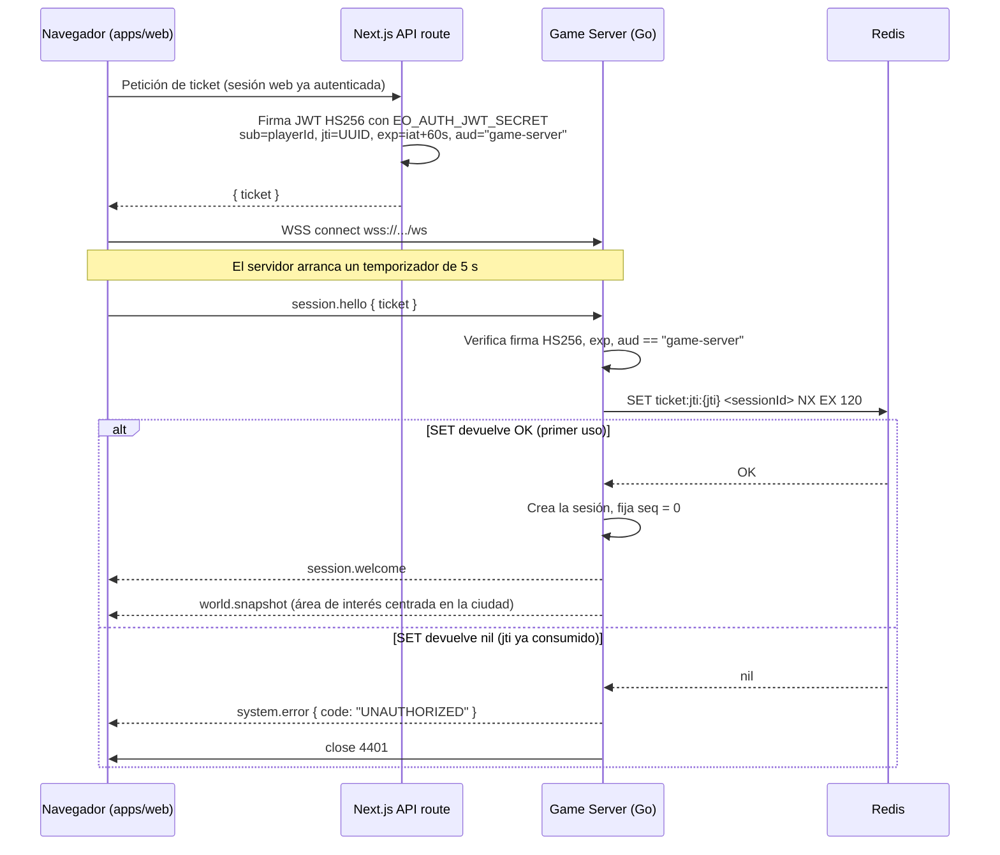

# ADR-010: Autenticación del game server mediante game ticket efímero de un solo uso

Propósito: fijar que Next.js autentica al usuario y emite un JWT HS256 de 60 segundos con `jti` consumible una única vez en Redis, que el game server verifica ese ticket en `session.hello` y que el game server nunca gestiona contraseñas.

| Campo | Valor |
|---|---|
| **Estado** | **Aceptado** |
| **Fecha** | **2026-09-09** |
| Ámbito | `apps/web` (API route), `services/game-server/internal/auth`, `internal/websocket` |
| Índice | [README.md](README.md) |
| Relacionados | [ADR-004](ADR-004-redis-hot-state.md), [ADR-006](ADR-006-websocket-protocol.md), [ADR-009](ADR-009-shared-protocol-package.md) |

---

## 1. Contexto

Hay dos procesos con responsabilidades muy distintas. `apps/web` (Next.js 15) es una aplicación web
convencional: sirve páginas, tiene sesiones de navegador, y es donde vive todo lo que huele a cuenta de
usuario. `services/game-server` (Go 1.23) es un proceso de simulación autoritativa que acepta conexiones
WSS de larga duración y no tiene ninguna razón de ser para saber qué es una contraseña.

La conexión de juego debe quedar ligada a un `playerId` con la misma confianza que la sesión web, pero sin
que el game server participe en el ciclo de vida de credenciales. Además, un WebSocket introduce
particularidades incómodas: el *upgrade* es una petición HTTP GET normal, no está sujeto a la política CORS
del navegador, y las URLs de esa petición atraviesan proxies inversos y balanceadores que las registran en
sus logs de acceso.

El canon fija el mecanismo; este ADR lo justifica y desarrolla sus implicaciones.

---

## 2. Decisión

**Next.js autentica al usuario y emite un *game ticket*: un JWT HS256 firmado con `EO_AUTH_JWT_SECRET`, con
TTL de 60 segundos y claims `{ sub: playerId, jti, iat, exp, aud: "game-server" }`. El cliente lo presenta
en el primer mensaje `session.hello { ticket }` de la conexión WSS. El game server verifica firma, `exp` y
`aud`, y consume el `jti` en Redis para impedir replay. El game server no gestiona contraseñas.**

### 2.1 Flujo



Si el primer mensaje no llega antes de **5 segundos**, o no es `session.hello`, la conexión se cierra con
`4408`. Si el ticket es inválido, expirado, con `aud` incorrecta o con `jti` ya consumido, el servidor
responde `system.error` con `UNAUTHORIZED` y cierra con `4401`. El mensaje de error se envía **antes** del
cierre para que el cliente pueda distinguir «tu ticket caducó, pide otro» de «la red se cayó».

### 2.2 Consumo del `jti`

```
SET ticket:jti:{jti} <sessionId> NX EX 120
```

`NX` hace la operación atómica: gana el primero que llega y no hay ventana de carrera entre comprobar y
escribir. El TTL de la clave es de **120 segundos**, el doble del TTL del ticket, y esa asimetría es
deliberada: la marca de consumo debe **sobrevivir al propio ticket**. Si la clave expirase a la vez que el
ticket, un replay justo en la frontera podría encontrar la clave ya evaporada y el `exp` todavía válido por
milésimas. Con el doble de margen, cualquier ticket que aún pase la validación de `exp` encuentra su marca
si ya fue usado, y sobra holgura para desviaciones de reloj moderadas.

### 2.3 Por qué el ticket viaja en `session.hello` y no en la query string

Poner el ticket en `wss://host/ws?ticket=...` sería más simple: se autenticaría durante el *upgrade*, sin
necesidad de un estado «conectado pero no autenticado» ni de un temporizador de 5 segundos. Se descarta por
razones concretas:

- **Las URLs quedan escritas en sitios que no controlamos.** El upgrade de WebSocket es una petición HTTP
  GET, y todo proxy inverso, balanceador, CDN o WAF por el que pase la registra en su log de acceso con la
  query string completa. Un ticket con TTL de 60 segundos es de vida corta, pero los logs son de vida larga
  y suelen agregarse en sistemas con controles de acceso mucho más laxos que los de una base de datos de
  credenciales.
- **Se filtran también por otros caminos.** Historial del navegador, cabecera `Referer` en algunas
  configuraciones, capturas de pantalla de herramientas de red, tickets de soporte donde alguien pega «la
  URL que me falla».
- **El cuerpo de un frame WSS no tiene esos problemas.** Va cifrado por TLS igual que la URL, pero además
  ningún intermediario HTTP lo registra: para un proxy, después del upgrade solo hay bytes opacos.
- **Permite responder con el protocolo.** Fallar en el handshake HTTP solo deja códigos de estado; fallar
  en `session.hello` permite devolver un `system.error` con el código canónico `UNAUTHORIZED` y un
  `requestId` correlacionable, que es exactamente lo que el cliente necesita para decidir si reintenta.

El coste asumido es un estado adicional en la máquina de la conexión —«conectada, no autenticada»— con su
temporizador de 5 segundos, su cierre `4408` y la regla de que ningún mensaje distinto de `session.hello`
se procesa en ese estado.

---

## 3. Alternativas consideradas

### 3.1 Cookie de sesión compartida entre Next.js y el game server

**A favor (real).** Es lo más simple de todo: el navegador ya manda la cookie en el upgrade, no hay que
emitir nada, no hay ticket que caduque, no hay que reemitir al reconectar, y la sesión web y la de juego
son literalmente la misma. Un solo lugar donde revocar.

**En contra.** Dos problemas serios. El primero es de dominio: game server y frontend son procesos
independientes y, en producción, muy probablemente orígenes distintos; compartir cookie obliga a un dominio
común y a coordinar `SameSite`, `Domain` y `Secure` entre dos despliegues, lo que ata la topología de
despliegue a la autenticación. El segundo es peor: **el upgrade de WebSocket no está sujeto a CORS**. Una
página maliciosa puede abrir un WebSocket contra nuestro game server y el navegador adjuntará las cookies
del usuario; la única defensa es validar la cabecera `Origin`, que el servidor sí controla pero que ningún
cliente no-navegador está obligado a enviar con honestidad. Es la variante WebSocket del CSRF clásico y se
evita por completo cuando la credencial es un ticket que el atacante no puede obtener. Rechazada.

### 3.2 Token de larga duración almacenado en el cliente

Un JWT de horas o días guardado en `localStorage` y presentado en cada conexión.

**A favor (real).** Reconexión trivial: el cliente reintenta con el mismo token tras un corte de red, sin
depender de que el frontend siga en pie ni de que la sesión web siga viva. Menos peticiones al backend web.
Funciona bien para clientes que no son navegadores.

**En contra.** La ventana de robo pasa de 60 segundos a la vida del token. Un XSS, una extensión hostil o
un volcado de `localStorage` entregan una credencial utilizable durante horas, no durante un minuto. Y como
un JWT no se puede revocar sin una lista de revocación consultada en cada uso, revocar exige exactamente la
infraestructura de estado en Redis que este diseño ya usa —pero consultada continuamente en lugar de una
sola vez por conexión. Se paga el coste de la revocación y se pierde la ventana corta. Rechazada.

### 3.3 OAuth con un proveedor externo

**A favor (real).** Elimina la gestión de contraseñas del proyecto entero, no solo del game server: sin
almacenamiento de hashes, sin flujos de recuperación, sin política de contraseñas, sin la responsabilidad
de una filtración de credenciales. Reduce la fricción de registro, que en un juego importa. Aporta 2FA
gratis si el proveedor lo tiene.

**En contra.** No aporta nada al problema que este ADR resuelve. OAuth decide **cómo Next.js averigua quién
es el usuario**; una vez lo sabe, sigue haciendo falta un mecanismo para trasladar esa identidad a una
conexión WSS de un proceso Go, y ese mecanismo seguiría siendo un ticket efímero. Es una decisión ortogonal,
y adoptarla ahora añadiría una dependencia externa y un flujo de callbacks a un MVP que aún no tiene
movimiento de unidades funcionando. **Diferida, no descartada**: encaja limpiamente sobre este diseño,
sustituyendo solo la parte de `apps/web` que decide el `sub`. La elección de proveedor es
**TBD (fuera de MVP)**.

### 3.4 Autenticación propia dentro del game server

Que el proceso Go tenga sus propios endpoints de login, hashee contraseñas y emita sus propias sesiones.

**A favor (real).** Una dependencia menos en el arranque de la conexión: sin `apps/web` disponible no habría
manera de entrar hoy, y con esta alternativa el game server sería autosuficiente. Un cliente nativo futuro
tampoco necesitaría pasar por la web.

**En contra.** Duplica responsabilidades que ya existen y que están mejor resueltas en el lado web: hashing
con parámetros de coste actualizados, limitación de intentos, verificación de email, recuperación de
contraseña, expiración de sesiones. Cada una es una superficie de ataque que habría que mantener en Go, en
un proceso cuyo trabajo real es simular un mundo a 10 Hz. Y arrastraría al bucle de juego preocupaciones
que no le corresponden. Rechazada.

---

## 4. Consecuencias

### 4.1 Positivas

- **El game server nunca ve una contraseña.** Ni la almacena, ni la transporta, ni la registra por accidente
  en un log estructurado. La superficie de credenciales queda confinada a `apps/web`.
- **Ventana de robo de 60 segundos.** Un ticket interceptado solo sirve dentro de ese minuto y **solo una
  vez**: si la víctima ya lo usó, el atacante encuentra el `jti` consumido y recibe `UNAUTHORIZED`.
- **Autenticación sin estado en el camino caliente.** Verificar HS256 es una operación de HMAC-SHA256 sobre
  unos cientos de bytes. La única consulta a Redis es una escritura `SET NX` por conexión, no por mensaje.
- **Fallo explícito y accionable.** El cliente recibe `system.error` con `UNAUTHORIZED` antes del cierre
  `4401`, lo que le permite pedir un ticket nuevo en lugar de reintentar a ciegas.
- **Radio de explosión pequeño en la rotación.** Rotar `EO_AUTH_JWT_SECRET` invalida los tickets en vuelo,
  pero los tickets en vuelo viven como mucho 60 segundos y las sesiones ya establecidas no dependen del
  secreto. El impacto máximo es un minuto de conexiones nuevas fallidas.

### 4.2 Negativas (enunciadas sin adornos)

- **HS256 es simétrico: el game server puede fabricar tickets.** Comparte el mismo secreto que los firma,
  así que un game server comprometido no solo puede leer tickets ajenos: puede emitir uno válido para
  cualquier `playerId`. Con un algoritmo asimétrico (RS256, EdDSA) el game server solo tendría la clave
  pública y esa capacidad desaparecería. La migración a firma asimétrica es la evolución natural de este
  ADR y requerirá uno nuevo que lo supersede.
- **Dependencia de relojes razonablemente sincronizados.** `exp` se evalúa contra el reloj del game server y
  se emite contra el reloj de Next.js. Con un TTL de 60 segundos, una desviación de decenas de segundos entre
  ambas máquinas empieza a rechazar tickets legítimos, y una desviación en sentido contrario alarga la
  validez efectiva. Mitigación operativa: NTP en ambos hosts, con ajuste por deslizamiento y no por salto.
  El margen de tolerancia (*leeway*) que el verificador debe aceptar **no está definido por el canon:
  TBD (fuera de MVP)**.
- **Cada reconexión exige un ticket nuevo.** El ticket es de un solo uso y dura un minuto, así que un corte
  de red obliga al cliente a pedir otro a `apps/web` **antes** de reabrir el WebSocket. Esto acopla la
  reconexión de juego a la disponibilidad del frontend y a la vigencia de la sesión web: si la sesión web
  caducó mientras el jugador estaba conectado, la reconexión se convierte en un re-login completo, con el
  jugador expulsado del mundo en el peor momento posible. El backoff de reconexión debe ser exponencial y
  con *jitter*; un cliente que reintenta agresivamente convierte un incidente de red en una tormenta de
  peticiones de ticket.
- **Redis pasa a estar en el camino del login.** Si Redis no está disponible, el `SET NX` falla y ninguna
  conexión nueva se autentica. Es coherente con el canon —Redis es estado caliente, no fuente de verdad—
  pero significa que una caída de Redis impide entrar al mundo aunque PostgreSQL esté perfectamente sano.
  Esto debe reflejarse en `GET /ready`.
- **Un `jti` consumido y una sesión fallida son indistinguibles para el cliente.** Ambos devuelven
  `UNAUTHORIZED`. Es deliberado —no dar información a quien sondea— pero complica el diagnóstico de soporte,
  que debe apoyarse en los logs correlacionados por `request_id` y `session_id`.
- **No hay rotación de secreto con solapamiento.** Con un único `EO_AUTH_JWT_SECRET` no existe un `kid` ni
  soporte para dos secretos válidos a la vez, así que la rotación tiene una ventana de fallo de hasta 60
  segundos. Soportar dos secretos simultáneos es **TBD (fuera de MVP)**.

### 4.3 Reglas operativas derivadas

| Regla | Motivo |
|---|---|
| `EO_AUTH_JWT_SECRET` solo por variable de entorno, jamás en el repositorio | Canon §14. |
| El ticket nunca se escribe en un log, ni completo ni truncado | Un log es un almacén de credenciales accidental. |
| El `jti` sí se registra en los logs | Permite correlacionar sin exponer la credencial. |
| Se registran los intentos fallidos con `player_id` (si es deducible), `session_id` y motivo | Detección de replay y de sondeo. |
| El frontend no cachea el ticket más allá del intento de conexión | Un ticket cacheado en memoria compartida reintroduce la ventana que este diseño elimina. |

---

## 5. Verificación

| Qué se verifica | Nivel | Cómo |
|---|---|---|
| Ticket válido autentica | integration | `session.hello` con ticket recién emitido → `session.welcome`. |
| Replay rechazado | integration | El mismo ticket dos veces → segunda conexión `UNAUTHORIZED` + close `4401`. |
| Expiración | unit | Ticket con `exp` en el pasado (`FakeClock`) → `UNAUTHORIZED`. |
| Audiencia | unit | `aud != "game-server"` → `UNAUTHORIZED`. |
| Firma | unit | Ticket firmado con otro secreto → `UNAUTHORIZED`. |
| Timeout de handshake | integration | Conectar y no enviar nada → close `4408` a los 5 s. |
| Primer mensaje incorrecto | integration | Enviar `unit.move` antes de `session.hello` → `UNAUTHORIZED` + close `4401`. |
| TTL de la marca de consumo | integration | `TTL ticket:jti:{jti}` ≈ 120 s tras el consumo. |

---

## 6. Referencias

- [../specs/websocket-protocol.md](../specs/websocket-protocol.md) — `session.hello`, `session.welcome`, códigos de cierre.
- [../architecture/networking.md](../architecture/networking.md) — máquina de estados de la conexión.
- [../invariants/security.md](../invariants/security.md) — `INV-SEC-*`.
- [../operations/configuration.md](../operations/configuration.md) — `EO_AUTH_JWT_SECRET`, `EO_REDIS_URL`.
- [ADR-009](ADR-009-shared-protocol-package.md) — el ticket viaja dentro del protocolo, no fuera de él.
