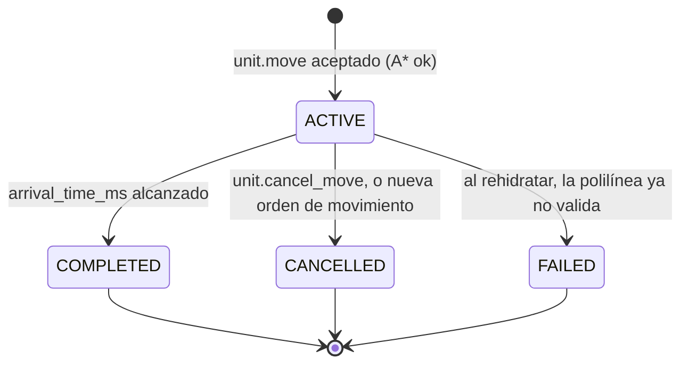

# ADR-011: Movimiento persistido como polilínea temporizada

Propósito: justificar la decisión central del proyecto — el camino de una unidad se persiste una sola vez como una polilínea de waypoints `{x, y, tMs}`, de modo que la posición autoritativa en cualquier instante es una función pura de `(polilínea, tiempo)` y no requiere replay de ticks ni escritura por tick.

| Campo | Valor |
|---|---|
| **Estado** | **Aceptado** |
| **Fecha** | **2026-09-09** |
| Ámbito | `services/game-server/internal/domain/movement`, `internal/game/loop`, `internal/persistence` |
| Índice | [README.md](README.md) |
| Relacionados | [ADR-003](ADR-003-postgresql-source-of-truth.md), [ADR-007](ADR-007-game-loop-frequency.md), [ADR-008](ADR-008-grid-coordinate-system.md) |

---

## 1. Contexto

Empires Online es un mundo persistente 24/7: el mundo evoluciona sin jugadores conectados y **ningún estado
durable depende de un WebSocket vivo**. Una unidad que empieza a caminar a las 03:14 sigue caminando aunque
su dueño cierre el navegador, aunque el proceso del game server se reinicie por un despliegue, y aunque se
caiga por un fallo. Cuando el proceso vuelva, la unidad tiene que estar donde le corresponde estar según el
tiempo transcurrido, no donde estaba cuando el proceso murió.

Eso convierte «¿dónde está esta unidad?» en la pregunta más cara del sistema, porque hay que responderla
en tres contextos con requisitos incompatibles entre sí:

| Contexto | Frecuencia | Requisito |
|---|---|---|
| Bucle de simulación | 10 Hz, sobre todas las unidades en movimiento | Barato en CPU, sin I/O. |
| Recuperación tras crash o despliegue | Una vez al arrancar, sobre todo el mundo | Rápido y exacto sin importar cuánto tiempo haya pasado. |
| Cliente dibujando a 60 fps | Continuo, por cada unidad visible | Suave, sin sondear al servidor. |

Además hay restricciones duras ya fijadas:

- El cliente envía **intención**, nunca posiciones: `unit.move { unitId, target:{x,y} }`. El cliente jamás
  manda una secuencia de tiles.
- El tick **nunca** hace I/O bloqueante contra PostgreSQL.
- La simulación es determinista: sin `time.Now()` ni `rand` dentro del dominio, con `Clock` y
  `RandomSource` inyectados.
- El servidor razona en tiles enteros ([ADR-008](ADR-008-grid-coordinate-system.md)); la interpolación
  sub-tile es exclusivamente visual y ocurre en el cliente.

---

## 2. Decisión

**Cuando el servidor acepta un `unit.move`, ejecuta A\* una única vez, convierte el camino resultante en una
polilínea temporizada y la persiste completa en `unit_movements`. A partir de ese momento la posición
autoritativa de la unidad es una función pura del par (polilínea, tiempo): no se recalcula, no se replica
por tick y no se vuelve a escribir hasta que el movimiento termina.**

### 2.1 Estructura de la polilínea

Un movimiento es un array de waypoints `{x, y, tMs}` donde `tMs` es el offset en milisegundos desde
`start_time_ms` en el que la unidad **alcanza** ese tile. **La ruta incluye el tile de origen**: es el
primer waypoint y siempre lleva `tMs = 0`. El pathfinder ya devuelve el origen como primer elemento, y
`BuildTimedPath` lo copia tal cual antes de temporizar el resto.

Ejemplo canónico —el mismo que fija el test `TestEjemploNumericoCanonico` del dominio, y el único que debe
citarse en la documentación—, con un `VILLAGER` (`baseMsPerTile = 600`):

```
(0,0) -> (1,0)  GRASSLAND  ortogonal   600 ms    acc     0 -> 600
(1,0) -> (2,1)  GRASSLAND  diagonal    849 ms    acc   600 -> 1449
(2,1) -> (3,1)  FOREST     ortogonal   960 ms    acc  1449 -> 2409
(3,1) -> (4,1)  ROAD       ortogonal   360 ms    acc  2409 -> 2769
```

```json
{
  "start_time_ms": 1757404800000,
  "arrival_time_ms": 1757404802769,
  "status": "ACTIVE",
  "path": [
    { "x": 0, "y": 0, "tMs": 0    },
    { "x": 1, "y": 0, "tMs": 600  },
    { "x": 2, "y": 1, "tMs": 1449 },
    { "x": 3, "y": 1, "tMs": 2409 },
    { "x": 4, "y": 1, "tMs": 2769 }
  ]
}
```

El coste de cada segmento se calcula con **aritmética entera pura**, sin coma flotante, para que dos
ejecuciones idénticas produzcan exactamente los mismos milisegundos en cualquier plataforma:

```go
// internal/domain/movement/path.go — world.CostBase = 10; √2 en punto fijo.
const (
    sqrt2Num int64 = 1414214
    sqrt2Den int64 = 1000000
)

func StepDurationMs(baseMsPerTile int64, costUnits int32, diagonal bool) int64 {
    if costUnits <= 0 {
        return 0
    }
    base := int64(world.CostBase)
    ms := (baseMsPerTile*int64(costUnits) + base/2) / base   // redondeo al ms más cercano
    if diagonal {
        ms = (ms*sqrt2Num + sqrt2Den/2) / sqrt2Den           // redondeo al ms más cercano
    }
    if ms < 1 {
        ms = 1                                               // ningún paso es instantáneo
    }
    return ms
}
```

**Regla canónica: se redondea cada segmento al milisegundo más cercano y sólo después se acumula** sobre el
`tMs` anterior. Redondear —y no truncar— evita un sesgo sistemático a favor de la unidad: mil pasos truncados
regalarían casi un segundo. `baseMsPerTile` es propiedad del tipo de unidad (`VILLAGER` = 600 ms) y el coste
del terreno es un entero en `costUnits` sobre una base de 10, no un multiplicador en coma flotante.

Con `VILLAGER` y los costes canónicos de terreno:

| Terreno | `costUnits` | Ortogonal | Diagonal |
|---|---|---|---|
| `ROAD` | 6 | 360 ms | 509 ms |
| `GRASSLAND` | 10 | 600 ms | 849 ms |
| `FOREST` | 16 | 960 ms | 1358 ms |
| `HILL` | 18 | 1080 ms | 1527 ms |

`MOUNTAIN` y `WATER` no son transitables y nunca aparecen en una polilínea.

### 2.2 La función de posición

```go
// TimedPath.PositionAt es una función pura: mismos argumentos, mismo resultado,
// siempre. No consulta el reloj, no consulta la base de datos, no muta nada.
// elapsedMs es el offset desde el inicio del movimiento.
func (p TimedPath) PositionAt(elapsedMs int64) world.Tile {
    if len(p) == 0 {
        return world.Tile{}
    }
    if elapsedMs <= 0 {
        return p[0].Tile()                 // aún no ha empezado: el ORIGEN
    }
    if elapsedMs >= p[len(p)-1].TMs {
        return p[len(p)-1].Tile()          // ya llegó: el DESTINO
    }
    // Búsqueda binaria del último waypoint con TMs <= elapsedMs;
    // los TMs son estrictamente crecientes.
    lo, hi := 0, len(p)-1
    for lo < hi {
        mid := (lo + hi + 1) / 2
        if p[mid].TMs <= elapsedMs {
            lo = mid
        } else {
            hi = mid - 1
        }
    }
    return p[lo].Tile()
}

// Sobre un movimiento se usa siempre el envoltorio, que traduce el instante
// absoluto a offset: movement.Movement.PositionAt(nowMs int64) world.Tile.
```

Coste: `O(log k)` sobre los `k` waypoints, por búsqueda binaria, **también dentro del bucle de simulación**.
No existe un cursor incremental ni ninguna segunda implementación «rápida» de la derivación de posición:
`INV-MOVE-006` exige que todo el sistema —tick, snapshot, recuperación y tests— pase por esta única función,
precisamente para que un tick saltado no pueda hacer divergir dos caminos de cálculo distintos.
`IndexAt(elapsedMs)` devuelve el índice del waypoint alcanzado con la misma búsqueda, cuando hace falta el
índice y no el tile.

### 2.3 Ciclo de vida



`FAILED` **no se alcanza durante la simulación normal**: en el MVP su única fuente es la recuperación al
arrancar (§2.5). Mientras el proceso está vivo, un movimiento sólo sale de `ACTIVE` por llegada o por
cancelación.

La razón de una cancelación viaja al cliente en `unit.movement.cancelled.reason` y su dominio es
`REPLACED | CANCELLED_BY_PLAYER | PATH_BLOCKED | UNIT_DEAD | SERVER`. Hoy la simulación emite dos de esos
valores: `REPLACED` cuando una orden nueva sustituye a la anterior y `CANCELLED_BY_PLAYER` cuando el jugador
la cancela explícitamente.

**Invariante:** una unidad tiene como máximo un movimiento `ACTIVE`. En RAM, la orden anterior se cancela
**antes** de registrar la nueva, de modo que no existe ningún instante con dos movimientos activos; en
PostgreSQL, el `UPDATE ... SET status='CANCELLED'` del anterior y el `INSERT` del nuevo van en **la misma
transacción** (`GameStore.PersistMovementStart`), y el índice único parcial
`unit_movements_one_active_per_unit` es la última línea de defensa. Los invariantes formales
(`INV-MOVE-*`, incluida la monotonía estricta de `tMs`) están en
[../invariants/movement.md](../invariants/movement.md).

### 2.4 Qué es autoritativo, qué se persiste y cuándo

| Dato | Dónde vive | Cuándo se escribe |
|---|---|---|
| Polilínea, `start_time_ms`, `arrival_time_ms`, `status` | `unit_movements` (PostgreSQL) | Al iniciar y al finalizar, en una **transacción encolada** en la cola de persistencia. |
| Posición durante un movimiento activo | Derivada: `m.PositionAt(now)` | **Nunca**. Es reconstruible. |
| Posición consolidada de la unidad | `units` | Al finalizar el movimiento y en el flush periódico de dirty-flag (`EO_PERSISTENCE_FLUSH_INTERVAL_TICKS=50`, 5 s). |
| Índice del waypoint alcanzado | Se calcula al vuelo con `IndexAt` | Nunca. Reconstruible en `O(log k)`. |

**El tick no ejecuta esa transacción.** La simulación muta el estado en RAM y **encola** el trabajo
(`Job{Name: "movement.start"}`) en la cola de persistencia, que unos workers ejecutan fuera del bucle, con
hasta 3 intentos y backoff, y una compensación `OnPermanentFailure` si se agotan. Es lo que hace cumplible
la regla «el tick nunca hace I/O de PostgreSQL», y tiene una ventana de riesgo que conviene enunciar sin
adornos: si el proceso muere entre la aceptación del comando y el COMMIT —típicamente unas pocas decenas de
milisegundos—, ese movimiento se pierde y la unidad se recupera en su última posición consolidada. Es un RPO
documentado, no un descuido.

Detalle completo en [../database/persistence-strategy.md](../database/persistence-strategy.md).

### 2.5 Recuperación tras crash o despliegue

Al arrancar, `simulation.Hydrate` carga los movimientos con `status = 'ACTIVE'` y aplica, por movimiento,
exactamente estas tres reglas, en este orden:

| Condición | Acción |
|---|---|
| `movement.Validate(m.Path, world)` falla —la polilínea ya no es transitable, no es contigua, no es monótona, o la unidad ya no existe— | El movimiento se marca **`FAILED`** y la unidad **se queda en su última posición consolidada**. Nunca se teletransporta a nadie por un dato dudoso. |
| `arrival_time_ms <= now` | El movimiento ya debía haber terminado: la unidad aparece directamente en el tile de destino, el movimiento se cierra como **`COMPLETED`** y la posición se consolida en `units`. |
| `arrival_time_ms > now` | Se **reanuda** desde la polilínea: la posición se evalúa con `m.PositionAt(now)` y el movimiento sigue `ACTIVE`. |

La validación va **antes** que las otras dos por una razón deliberada: completar o reanudar un movimiento
cuya ruta ya no vale sería mover una unidad basándose en un dato que el mundo actual desmiente.

**No hay replay.** El coste de recuperar un movimiento es una fila leída y una evaluación de `PositionAt`:
`O(1)` respecto al tiempo transcurrido. Da exactamente igual que el proceso haya estado parado 200 ms o
siete horas.

### 2.6 Contrato de red

| Momento | Mensaje | Payload |
|---|---|---|
| Comando aceptado | `unit.move.accepted` | `{unitId, movementId}`, correlacionado por `requestId` y enviado sólo al jugador. |
| Comando rechazado | `unit.move.rejected` | `{unitId, code, message}` con código de dominio: `TARGET_NOT_WALKABLE`, `PATH_NOT_FOUND`, `PATH_TOO_LONG`, `UNIT_NOT_OWNED`, `UNIT_NOT_MOVABLE`, `UNIT_DEAD`, `UNIT_GARRISONED`, `TARGET_OUT_OF_BOUNDS`, `INVALID_TARGET`. |
| Movimiento iniciado | `unit.movement.started` | `{unitId, movement:{movementId, path, startTimeMs, arrivalTimeMs, target}}` — **la polilínea completa**, difundida a los suscriptores del chunk afectado. |
| Llegada | `unit.movement.completed` | `{unitId, movementId, finalPosition}`. |
| Cancelación | `unit.movement.cancelled` | `{unitId, movementId, stoppedAt, reason}`, con `reason` en el dominio de §2.3. |

El reparto entre `unit.move.rejected` (rechazo de dominio, con código de error) y `system.error` (fallo de
protocolo: `INVALID_MESSAGE`, `RATE_LIMITED`, `MESSAGE_TOO_LARGE`) lo fija
[../specs/websocket-protocol.md](../specs/websocket-protocol.md), que es la autoridad.

Que `unit.movement.started` lleve la polilínea entera es lo que hace posible la interpolación del cliente:
recibe el camino y el instante de inicio, y a partir de ahí dibuja 60 fps de movimiento suave **sin
preguntar nada más al servidor**. No hay sondeo, no hay corrección continua, no hay predicción especulativa.

---

## 3. Alternativas consideradas

### 3.1 Persistir la posición en cada tick

Escribir `units.x`, `units.y` en cada tick para cada unidad en movimiento.

**A favor (real).** Es el modelo mental más simple que existe: la base de datos siempre refleja la verdad
actual, cualquier consulta ad-hoc (`SELECT x, y FROM units`) devuelve la posición real, y la recuperación
tras crash es trivial porque no hay nada que reconstruir. Las consultas espaciales sobre la tabla `units`
son directas y siempre están al día.

**En contra.** El coste de escritura es prohibitivo y crece linealmente con la actividad del mundo. A 10 Hz
con `U` unidades en movimiento son `10 · U` actualizaciones de fila por segundo; con 500 unidades caminando
—una cifra modesta para un MMO— son **5000 `UPDATE` por segundo**, cada uno con su reescritura de fila,
su WAL, su mantenimiento de índice y su hinchazón de tabla que alimenta al autovacuum. Y todo ese gasto
compra información **redundante**: cada una de esas filas es derivable del camino y del reloj. Además
violaría la restricción de no hacer I/O de PostgreSQL dentro del tick, así que habría que encolarlo, con lo
que la cola de persistencia pasaría a ser el cuello de botella real. Rechazada.

### 3.2 Guardar solo origen, destino y velocidad, y recalcular el camino al cargar

Persistir `from`, `to`, `start_time_ms` y la velocidad, y volver a ejecutar A\* al arrancar.

**A favor (real).** Es la representación más compacta posible: cuatro columnas y ningún `jsonb`. La escritura
es mínima, la tabla no crece con la longitud del camino y el esquema es trivial de indexar.

**En contra.** **No es determinista en el tiempo.** El camino que A\* devuelve depende del estado del mapa y
del algoritmo en el momento de ejecutarlo. Si entre el inicio del movimiento y el reinicio del proceso se
construyó un edificio, se cambió el `costUnits` de un terreno o —peor— se desplegó una versión con un
desempate distinto en A\*, la unidad **salta a otra ruta**. Un jugador que dejó una caravana rodeando un
bosque por el norte la encuentra viniendo por el sur, sin explicación posible. Y no hay forma honesta de
responder «¿dónde estaba a las 03:20?», porque la respuesta depende de qué versión del código conteste.
Convierte cada despliegue en un evento con consecuencias observables sobre el mundo. Rechazada.

### 3.3 Replay de eventos desde el último snapshot

Event sourcing: persistir los eventos de dominio y reconstruir el estado reproduciéndolos desde un snapshot.

**A favor (real).** Es la solución conceptualmente más correcta y la más potente a largo plazo: auditoría
completa de todo lo que pasó, capacidad de responder «¿cómo se llegó a este estado?», *time travel* para
depurar, y una base natural para detección de trampas y para analítica. Encaja además con la separación
Command / Event / State que el canon ya establece, y la tabla `world_events` es un primer paso en esa
dirección.

**En contra.** El coste de recuperación es `O(eventos desde el snapshot)`, y en un mundo 24/7 eso significa
que la ventana de reinicio crece con el tiempo transcurrido salvo que se mantenga una disciplina estricta de
snapshots — que es infraestructura adicional que hay que construir, probar y operar. Exige además resolver
versionado de eventos, migración de eventos antiguos y compactación, todo antes de que el MVP tenga una sola
unidad andando. Con la polilínea la recuperación es `O(1)` y no necesita snapshots en absoluto. **Correcta
pero desproporcionada para el MVP**: no se descarta como evolución futura, y `world_events` no cierra esa
puerta. Rechazada por coste y complejidad, no por incorrección.

### 3.4 Simulación continua obligatoria sin persistencia intermedia

Mantener el movimiento solo en RAM y persistir únicamente al llegar.

**A favor (real).** Cero escrituras durante el trayecto —aún menos que la polilínea, que escribe una fila al
empezar—, ninguna estructura que serializar, y el código más simple de todos: un bucle que avanza punteros
en memoria.

**En contra.** No sobrevive a un crash. Un reinicio pierde todos los movimientos en vuelo, y las unidades
aparecen en su última posición consolidada —hasta 5 segundos atrasada por el flush de dirty-flag— sin
ninguna orden pendiente. En un mundo persistente 24/7 eso no es un detalle: es la violación directa del
principio de que ningún estado durable depende de un proceso vivo. Rechazada.

---

## 4. Consecuencias

### 4.1 Positivas

- **La posición es una función pura.** `PositionAt(m, t)` no consulta reloj, ni base de datos, ni estado
  global. Es trivial de testear, imposible de hacer no determinista y directamente comprensible al leerla.
- **Recuperación `O(1)` por movimiento.** Una fila y una evaluación, con independencia del tiempo
  transcurrido. Un reinicio de siete horas cuesta lo mismo que uno de dos segundos.
- **Se elimina la escritura por tick.** Un trayecto de 30 tiles de `GRASSLAND` dura 18 s = 180 ticks. Con
  este modelo cuesta **2 escrituras** (una al iniciar, una al finalizar) en lugar de 180: una reducción del
  98,9 %. La cola de persistencia deja de ser el cuello de botella y la tabla `units` deja de sufrir
  hinchazón por actualizaciones redundantes.
- **El cliente interpola con exactitud y sin sondear.** Recibe la polilínea y `start_time_ms` en
  `unit.movement.started` y dibuja a 60 fps por su cuenta. La suavidad visual queda desacoplada del tick
  rate del servidor ([ADR-007](ADR-007-game-loop-frequency.md)), y el jugador ve movimiento continuo aunque
  el servidor solo piense diez veces por segundo.
- **Un tick saltado no pierde movimiento.** La política de salto de ticks bajo overrun es segura
  precisamente porque la posición no se integra paso a paso: se evalúa. Como mucho se retrasa la
  notificación de una llegada.
- **El movimiento es verificable en tests.** «Con `FakeClock` en `start_time_ms + 2000`, la unidad está en
  (12,12)» es una aserción exacta sobre un tile concreto, no una comparación con tolerancia. Los tests de
  recuperación son igual de tajantes: reiniciar el proceso y assertar la misma posición.
- **Ancho de banda proporcional a los eventos, no al tiempo.** Una unidad que cruza el mapa genera dos
  mensajes, no uno por tick.

### 4.2 Negativas (enunciadas sin adornos)

**a) El camino queda congelado ante cambios del mapa a mitad de recorrido.**

La polilínea se calcula una vez y **no se replantea sola**. Si aparece un obstáculo sobre un tile que la
unidad aún no ha pisado —un edificio nuevo en la capa de ocupación—, la polilínea sigue diciendo que pasará
por ahí, y la unidad pasa. Esto es una consecuencia real del modelo, no un descuido, y así se asume.

**Política del MVP, tal y como está implementada:**

1. La simulación **no revalida** los movimientos `ACTIVE` cuando cambia la capa de ocupación. La fase 3 del
   tick avanza posiciones y detecta llegadas; no cancela por decisión propia. Un movimiento en vuelo sobre
   un tile que se bloqueó **continúa hasta su destino**.
2. La revalidación en caliente —recalcular o abortar la ruta al bloquearse un tile pendiente— es
   **fuera de MVP**.
3. El único momento en que una ruta se somete a examen es la **rehidratación tras un reinicio**:
   `movement.Validate` comprueba la polilínea contra el mundo actual y, si ya no es válida, marca el
   movimiento `FAILED` y deja la unidad en su **última posición consolidada** (§2.5). No se recalcula ruta
   automáticamente: el jugador decide qué hacer con una unidad que no pudo llegar.

Los costes de esta elección conviene nombrarlos. El primero: durante la vida del proceso existe una ventana
en la que el mundo y la ruta discrepan, y se resuelve a favor de la ruta. El segundo: `FAILED` sólo se
produce al arrancar, cuando no hay ningún cliente esperando ese movimiento concreto, así que **el protocolo
v1 no necesita —ni tiene— un `unit.movement.failed`**; el estado durable queda como `FAILED` para auditoría
y el cliente ve la posición correcta en el `world.snapshot` inicial de su siguiente sesión. El mapeo de un
fallo interno a mensajes de red, si alguna vez ocurre con una sesión abierta, lo fija
[../specs/websocket-protocol.md](../specs/websocket-protocol.md), que es la autoridad; ni `FAILED` ni ningún
valor equivalente pertenecen al dominio de `unit.movement.cancelled.reason`. El tercero: en el MVP las
fuentes de bloqueo dinámico son escasas (la muralla 3×3 de la ciudad inicial y poco más), así que el
escenario es raro — pero cuando deje de serlo habrá que decidir la política de revalidación, y esa decisión
merecerá su propio ADR.

**b) El `jsonb` crece con la longitud de la ruta, y el peor caso no está bien acotado.**

Un waypoint serializado ronda los 30–31 bytes (`{"x":511,"y":511,"tMs":218472},`), y ése es el **único
tamaño de referencia por waypoint** que debe citarse en toda la documentación. Un camino de 256 tiles son
257 waypoints ≈ **7,8 KiB** de JSON, aproximadamente la mitad de `EO_WS_MAX_MESSAGE_BYTES = 16384`, y ese
mensaje se difunde a **todos** los suscriptores del chunk afectado, no a un solo cliente.

**La cota operativa real es el tamaño del mensaje serializado, no un número de waypoints.** Ni
`EO_PATHFINDING_MAX_DISTANCE=256` ni `EO_PATHFINDING_MAX_NODES=20000` acotan directamente el **número de
waypoints**: el primero limita la distancia Chebyshev al destino y el segundo la expansión de la búsqueda.
Un camino que rodea un obstáculo entre dos tiles a distancia 3 puede tener decenas de waypoints, y un
terreno con forma de laberinto puede producir uno considerablemente más largo que la distancia en línea
recta. Por eso es **incorrecto** afirmar que una polilínea tiene como máximo `EO_PATHFINDING_MAX_DISTANCE + 1`
waypoints. En un mundo de 512×512 mayoritariamente abierto la longitud real se aproxima a la distancia
octile y el caso no se da; **la cota explícita sobre el número de waypoints es TBD (fuera de MVP)** y debe
resolverse antes de que la generación de terreno produzca regiones laberínticas. Mitigación vigente: el
límite de distancia mantiene los caminos cortos, y el techo de tamaño de mensaje —hoy aplicado por el
servidor a los frames **entrantes** con `SetReadLimit`— es la referencia con la que hay que dimensionar los
salientes y vigilar la métrica de tamaño.

**c) Cancelar produce una corrección visual de hasta un tile.**

El servidor razona en tiles: al cancelar, la unidad queda en el último waypoint alcanzado. El cliente, que
estaba interpolando **entre** waypoints, la estaba dibujando en algún punto intermedio. El resultado es un
salto hacia atrás de hasta un tile completo — hasta 600 ms de trayecto para un `VILLAGER` en `GRASSLAND`,
más en terreno caro. Es inherente a que el dominio sea discreto y la interpolación sea visual; suavizar la
corrección en el cliente es cosmética y no cambia la verdad del servidor.

**d) La polilínea compromete un horario que ignora todo lo posterior.**

No hay evitación dinámica de otras unidades, ni cambios de velocidad a mitad de trayecto. Un modificador de
velocidad —un efecto, una tecnología, una carretera construida por delante— obligaría a **recalcular la
polilínea entera** y reemitirla, porque los `tMs` de todos los segmentos posteriores cambiarían. Nada de eso
está en el MVP, pero la primera mecánica que altere la velocidad de una unidad en marcha tendrá que pagar
ese recálculo.

**e) Acoplamiento al reloj de pared.**

Todo el modelo se apoya en epoch milliseconds. Un ajuste del reloj del sistema **hacia atrás** (un salto NTP,
no un deslizamiento) hace que `PositionAt` devuelva posiciones anteriores: las unidades retroceden. La
abstracción `Clock` centraliza el problema en un punto, pero no lo elimina. Mitigación operativa: NTP
configurado para corregir por deslizamiento, nunca por salto.

**f) Consultar «dónde está una unidad» fuera del game server no es una simple lectura.**

Cualquier consumidor externo —una herramienta de soporte, un informe, un `SELECT` de diagnóstico— que lea
`units.x, units.y` obtiene la última posición **consolidada**, que puede estar hasta 5 segundos atrasada o,
si hay un movimiento `ACTIVE`, ser directamente el punto de partida del trayecto. Para saber la posición
real hay que unir con `unit_movements` y evaluar la polilínea. Es el precio de no escribir cada tick, y
tiene que estar documentado allí donde alguien vaya a hacer esa consulta
([../database/schema.md](../database/schema.md)).

---

## 5. Detalles de implementación que no son negociables

| Regla | Motivo |
|---|---|
| `tMs` estrictamente creciente; **el primer waypoint es el origen** con `tMs = 0` | Precondición de la búsqueda binaria de `PositionAt` y del invariante de monotonía; `Validate` lo comprueba al construir y al rehidratar. |
| El redondeo al milisegundo más cercano se aplica **por segmento, antes de acumular**, con aritmética entera | Reproducibilidad exacta del array desde el camino, en cualquier plataforma y sin coma flotante. |
| `arrival_time_ms = start_time_ms + path[last].tMs`, persistido y no recalculado | Permite decidir la recuperación con una comparación (`HasArrived`), sin abrir el `jsonb`. |
| La cancelación por nueva orden y la creación del nuevo movimiento ocurren en **la misma transacción** (`MovementRepo.Start`) | Sin ella, una unidad puede quedar con dos movimientos `ACTIVE` o con ninguno. En RAM, además, la cancelación precede siempre al alta. |
| El `requestId` de `unit.move` se reserva en Redis con `SETNX` (`idem:{playerId}:{requestId}`, TTL 300 s) antes de ejecutar el comando | Un reintento tras un corte de red no debe crear un segundo movimiento. La tabla `idempotency_keys` existe en el esquema para la deduplicación durable, pero **el MVP no la escribe**: la idempotencia vive sólo en Redis, y si Redis no responde el comando se ejecuta igualmente (se prefiere jugar a bloquear al jugador). |
| `start_time_ms` lo da el `Clock` inyectado (`clock.NowMs()`) en el instante en que el tick aplica el comando; nunca un `time.Now()` suelto dentro del dominio | Determinismo: con `FakeClock` el mismo tick produce exactamente la misma polilínea. |

---

## 6. Verificación

| Qué se verifica | Nivel | Cómo | Estado |
|---|---|---|---|
| Ejemplo numérico canónico (0 / 600 / 1449 / 2409 / 2769) | unit | `TestEjemploNumericoCanonico` sobre `BuildTimedPath`. | En verde |
| Coste por segmento | unit | `TestDuracionDeUnPaso`: terrenos × ortogonal/diagonal, valores exactos en ms; ningún paso instantáneo. | En verde |
| Monotonía, contigüidad y transitabilidad de la polilínea | unit | `TestValidateComprobaciones` sobre `Validate`. | En verde |
| `PositionAt` / `IndexAt` | unit | Antes del inicio (origen), en cada frontera de waypoint, en medio de un segmento y después de la llegada (destino). | En verde |
| Un solo movimiento `ACTIVE` | simulation | Dos `unit.move` seguidos: el primero se notifica `CANCELLED` con `reason: REPLACED` y el segundo queda `ACTIVE`. | En verde |
| Recuperación con llegada vencida | simulation | `Hydrate` con el reloj más allá de `arrival_time_ms`: unidad en el tile final y movimiento `COMPLETED`. | En verde |
| Recuperación en mitad del trayecto | simulation | `Hydrate` con avance parcial: posición exacta esperada y movimiento sigue `ACTIVE`. | En verde |
| Recuperación con polilínea inválida | simulation | `Hydrate` con una ruta que ya no valida: movimiento `FAILED` y unidad en su última posición consolidada. | En verde |
| Idempotencia por `requestId` | integration | Reenviar el mismo `requestId` no crea un segundo movimiento. | Diseñado; pendiente de Docker |
| Persistencia transaccional del inicio | integration | `PersistMovementStart`: el anterior queda `CANCELLED` y el nuevo `ACTIVE` en la misma transacción; el índice único parcial rechaza el segundo activo. | Diseñado; pendiente de Docker |
| Determinismo del bucle | simulation | `FakeClock`: avanzar 10 s y assertar el tile exacto. | En verde |

Los tests de integración requieren PostgreSQL y Redis reales por Docker Compose; mientras el daemon de
Docker no esté arrancado quedan pendientes de ejecución, no aprobados. Niveles y gates en
[../testing/strategy.md](../testing/strategy.md),
[../testing/simulation-tests.md](../testing/simulation-tests.md).

---

## 7. Referencias

- [../specs/movement.md](../specs/movement.md) — spec funcional completa de `unit.move` y `unit.cancel_move`.
- [../invariants/movement.md](../invariants/movement.md) — `INV-MOVE-*`.
- [../architecture/pathfinding.md](../architecture/pathfinding.md) — A\* octile, límites y desempate.
- [../database/persistence-strategy.md](../database/persistence-strategy.md) — durable, caliente y reconstruible.
- [../database/schema.md](../database/schema.md) — `unit_movements`, `units`.
- [../operations/disaster-recovery.md](../operations/disaster-recovery.md) — recuperación del mundo tras caída.
- [ADR-007](ADR-007-game-loop-frequency.md) — por qué saltar ticks es seguro con este modelo.
