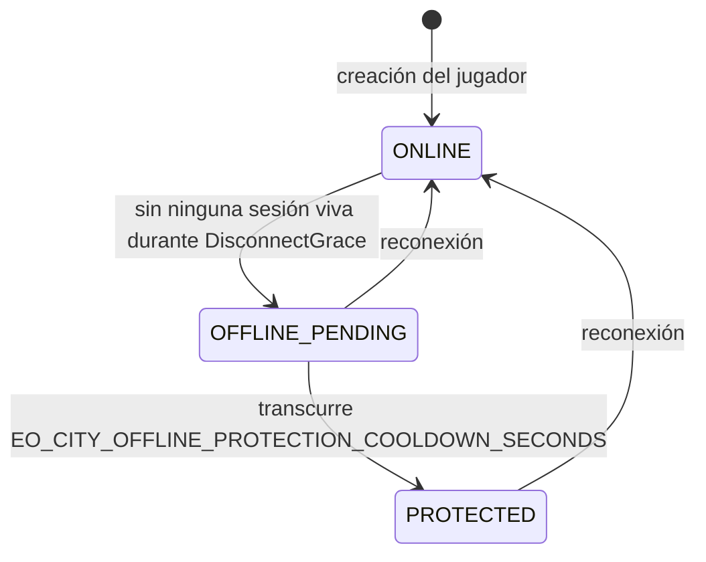

# Invariantes de la Ciudad (INV-CITY-xxx)

Propiedades de propiedad, población, emplazamiento y máquina de estados de presencia/protección de las ciudades.

Formato y severidades: [README.md](README.md). Presencia y protección: canon §9. Eras y población: canon §10.

---

## Contexto

Cada jugador tiene en MVP **una** ciudad, creada junto con él ([INV-PLAYER-003](player.md#inv-player-003)): un `TOWN_CENTER` más una zona urbana amurallada inicial. La ciudad es el ancla del jugador en el mundo: es donde se centra la vista al conectar (canon §13) y es el sujeto de la protección por desconexión.

### Máquina de estados de presencia

Parámetros canónicos que gobiernan la máquina:

| Variable | Valor por defecto | Rol |
|---|---|---|
| `EO_PRESENCE_TTL_SECONDS` | 30 | TTL de `presence:player:{playerId}` en Redis **y** valor de `DisconnectGrace` en el loop |
| `EO_PRESENCE_HEARTBEAT_SECONDS` | 10 | Periodicidad del heartbeat que renueva el TTL en Redis |
| `EO_CITY_OFFLINE_PROTECTION_COOLDOWN_SECONDS` | 300 | Espera en `OFFLINE_PENDING` antes de `PROTECTED` |

> **Quién decide la transición.** La decide el **game loop, con estado en RAM**: `Simulation` mantiene un contador de sesiones vivas por jugador y la marca `disconnectedAt` del instante en que cayó la última, y la fase 5 del tick (`ProcessTimers`) degrada a `OFFLINE_PENDING` cuando `now - disconnectedAt >= DisconnectGrace`, siendo `DisconnectGrace = EO_PRESENCE_TTL_SECONDS`. **No** se lee la expiración de la clave de Redis para decidirlo. Redis mantiene `presence:player:{playerId}` para observadores externos y para el futuro multiproceso, no como condición de esta transición. Un jugador con varias sesiones abiertas sigue `ONLINE` mientras le quede una: `handlePlayerDisconnected` sólo arma el margen cuando el contador llega a cero.

`protection_until` es `NULL` en MVP: la protección es indefinida mientras el jugador siga offline. `applyPresence` lo pone a `NULL` al volver a `ONLINE` y **nunca le asigna un valor** al entrar en `PROTECTED`. El campo existe para límites futuros; **no** se usa como temporizador en MVP. `city.update` lo emite como `protectionUntilMs`, que en MVP viaja siempre como `null`.

**El servidor es el único que decide el estado.** El cliente lo observa vía `city.update`. No existe ningún mensaje cliente→servidor v1 que altere `presence_state`.

---

## INV-CITY-001 — Una ciudad tiene exactamente un owner

| Campo | Valor |
|---|---|
| Severidad | CRITICO |
| Aplicación | DB, TYPE, TEST |
| Milestone | M2 |
| Política ante violación | FAIL_FAST (constraint) |
| Cobertura | **Sin cobertura ejecutada**: `TestBootstrapCreaMundoCompletoDelJugador` (integration, `internal/persistence/postgres`) lo ejercita pero está **diseñado y no ejecutado** (Docker) |

**Enunciado.** Toda fila de `cities` tiene una columna de owner no nula que referencia una fila existente de `players`, y esa columna es escalar: una ciudad nunca tiene cero ni dos propietarios simultáneos, ni siquiera durante una transferencia.

**Razón.** El owner de la ciudad determina quién recibe `city.update`, sobre quién se calcula la presencia que dispara la protección, y contra quién se evalúan las reglas de territorio y diplomacia. Una ciudad sin owner es una ciudad cuya presencia no es computable: quedaría permanentemente en el estado en que estuviera, protegida o expuesta, sin nadie que pudiera cambiarla. Una ciudad con dos owners hace ambiguo el resultado de cualquier chequeo de protección: dos jugadores con presencia distinta darían dos respuestas incompatibles a «¿está protegida?».

El caso «durante una transferencia» merece énfasis: los cambios de ownership son **write-through inmediato y transaccional** (canon §12), de modo que el owner anterior y el nuevo nunca coexisten ni se ausentan; la transición es atómica.

**Cómo se garantiza.**

- `DB` — `cities.owner_player_id uuid NOT NULL REFERENCES players (id) ON DELETE CASCADE`, con la clave foránea declarada en línea. Al ser escalar y no nula, «exactamente uno» es estructural.
- `DOMAIN` — el límite MVP de **una ciudad por jugador** —lo que hace consistente el «centrar la vista en la ciudad del jugador» del canon §13— es una regla del **dominio**, no una constraint: la migración `000001` crea `cities_owner_idx` como índice **no único** sobre `owner_player_id`. La unicidad efectiva viene de que el único punto de alta es la transacción de bootstrap, y de que `State.CityOf(playerID)` indexa una sola ciudad por jugador en RAM. Convertirlo en índice único es un cambio de esquema y es **TBD (fuera de MVP)**.
- `DB` — la única unicidad declarada sobre `cities` es `cities_unique_center UNIQUE (center_x, center_y)`: dos ciudades no pueden compartir centro. Es lo que sostiene [INV-CITY-008](#inv-city-008).
- `DB` — `cities.version integer NOT NULL DEFAULT 0` habilita concurrencia optimista (canon §11): un cambio de ownership concurrente hace fallar al segundo escritor en vez de perder una escritura.
- `TYPE` — el agregado `city.City` en Go lleva `OwnerPlayerID uuid.UUID` como valor, no puntero; no existe representación de «sin owner» en memoria.

**Cómo se verifica.**

- `TestBootstrapCreaMundoCompletoDelJugador` (integration, `internal/persistence/postgres`) — **diseñado, aún no ejecutado**: la ciudad creada tiene owner resoluble.
- Test previsto: `Test_INV_CITY_001_ExactlyOneOwner` (integration) — `INSERT` con owner nulo falla por `NOT NULL`; `INSERT` con un `uuid` inexistente falla por clave foránea.
- Test previsto: `Test_INV_CITY_001_OwnershipChangeIsAtomic` (integration) — la transferencia entre dos jugadores deja exactamente una fila con el nuevo owner y ninguna con el anterior; no hay instante observable con cero ni dos.

**Violación en runtime.** Imposible en escritura. En lectura, si el cargador encuentra un owner irresoluble: log `invariant_violation` con `inv_id=INV-CITY-001` y `city_id`. Política `FAIL_FAST` del cargador de esa ciudad: la ciudad no se incorpora a la simulación y se escala. No se asigna un owner por defecto bajo ninguna circunstancia.

---

## INV-CITY-002 — `population` nunca supera `population_limit`

| Campo | Valor |
|---|---|
| Severidad | ALTO |
| Aplicación | DB, DOMAIN, TEST |
| Milestone | M2 |
| Política ante violación | REJECT |
| Cobertura | **Cubierto** en dominio por `TestLimiteDePoblacion` (`internal/domain/city`); el rechazo por `CHECK` sólo se ejercita en integración, aún no ejecutada |

**Enunciado.** Para toda ciudad y en todo instante, `0 <= population <= population_limit`.

**Razón.** El límite de población es el regulador económico y militar del juego: define cuántas unidades puede sostener un jugador y, por tanto, cuánta ventaja acumula. Si se puede sobrepasar —aunque sea transitoriamente por una condición de carrera entre dos creaciones concurrentes— la progresión por eras deja de significar algo, porque la era ya no restringe.

El fallo típico no es un olvido de comprobar, sino un **TOCTOU**: dos comandos leen `population = 19` con límite 20, ambos comprueban «cabe uno más» y ambos insertan, dejando 21.

**Cómo se garantiza.**

- `DB` — la migración `000001` declara **dos** constraints complementarias sobre `cities`: `population integer NOT NULL DEFAULT 0 CHECK (population >= 0)` en la propia columna, y `CONSTRAINT cities_population_within_limit CHECK (population <= population_limit)`. Juntas cubren el enunciado completo; ésos son sus nombres reales, sin prefijo de convención. Son la última línea de defensa y la que hace imposible el TOCTOU si `population` se actualiza en la misma transacción que la creación de la unidad.
- `DOMAIN` — `City.HasPopulationRoom(n int32) bool` (`internal/domain/city`) es el único punto que decide si caben `n` puntos de población más. La creación de unidades comprueba la capacidad **dentro de la misma transacción** que inserta en `units` e incrementa `population`, no antes en una lectura suelta: la verificación de capacidad y el incremento son una sola operación.
- `DOMAIN` — rebasar el límite es una regla de negocio con código estable: se responde `POPULATION_LIMIT_REACHED` (canon §16). Que la regla exista no exime de la constraint: la regla protege la experiencia, el `CHECK` protege el dato.
- `DB` — `cities.version` permite detectar la escritura concurrente perdida cuando el incremento se hace por lectura-modificación-escritura.

**Cómo se verifica.**

- `TestLimiteDePoblacion` (unit, `internal/domain/city`) — **existe y pasa**: `HasPopulationRoom` deja de admitir unidades exactamente en el límite.
- Test previsto: `Test_INV_CITY_002_ConcurrentCreationDoesNotOverflow` (integration) — N goroutines intentan crear la última plaza simultáneamente; exactamente una tiene éxito y `population == population_limit` al final.
- Test previsto: `Test_INV_CITY_002_DatabaseRejectsOverflow` (integration) — `UPDATE cities SET population = population_limit + 1` falla por `cities_population_within_limit`, y `population = -1` falla por el `CHECK` de columna.

**Violación en runtime.** Detección en la guarda de dominio y en el error de constraint de PostgreSQL. Log `invariant_violation` con `inv_id=INV-CITY-002`, `city_id`, `population` y `population_limit`. Política `REJECT`: la creación no ocurre. Si se detecta una ciudad **ya persistida** por encima del límite (por ejemplo, tras bajar un `population_cap` en `eras`), no se destruyen unidades: la ciudad queda bloqueada para nuevas creaciones hasta volver bajo el límite, y se registra un `world_events` de auditoría.

---

## INV-CITY-003 — `population_limit` deriva de la era vigente

| Campo | Valor |
|---|---|
| Severidad | ALTO |
| Aplicación | DB, DOMAIN, TEST |
| Milestone | M2 |
| Política ante violación | REPAIR |
| Cobertura | **Sin cobertura ejecutada**: el catálogo de eras vive en la migración `000002_seed_catalogs` y sólo se ejercita en integración, aún no ejecutada |

**Enunciado.** Para toda ciudad, `population_limit = era.population_cap + modificadores de edificios`, donde `era` es la era vigente de la ciudad y el conjunto de modificadores es **vacío en MVP**; por tanto en MVP `population_limit == era.population_cap` exactamente.

**Razón.** El límite es una función del estado, no un dato independiente. Si se puede escribir un `population_limit` arbitrario, la progresión por eras se puede saltar editando una fila, y la información de «qué era estoy jugando» deja de ser deducible del límite. El invariante mantiene el límite como valor **derivado y recomputable**, lo que a su vez permite corregirlo sin ambigüedad si diverge.

Eras del MVP, definidas en la tabla `eras`, **no en código** (canon §10):

| Era | `population_cap` |
|---|---|
| `STONE_AGE` | 20 |
| `BRONZE_AGE` | 50 |
| `IRON_AGE` | 100 |
| `CASTLE_AGE` | 150 |

**Cómo se garantiza.**

- `DB` — `cities.era text NOT NULL REFERENCES eras (code)`: la referencia es al **código** de la era, no a un `era_id` numérico. Los `population_cap` viven en `eras`, poblada por la migración `000002_seed_catalogs`, y ningún literal `20`/`50`/`100`/`150` aparece en el código Go: `city.EraDefinition` es la fila del catálogo, no una constante.
- `DB` — `cities.population_limit integer NOT NULL CHECK (population_limit >= 0)`: el límite nunca es negativo, ni siquiera transitoriamente durante una recomputación.
- `DOMAIN` — el catálogo de eras se representa en Go como `city.EraDefinition` (`Code`, `Name`, `Ordinal`, `PopulationCap`), que es una **fila de la tabla `eras`**, no una constante. El límite se deriva de su `PopulationCap`; en MVP no hay modificadores de edificios que sumar, así que la derivación es la identidad.
- `DOMAIN` — cuando existan modificadores, el cálculo vivirá en un punto único y `population_limit` se escribirá **sólo** con su resultado; ningún handler lo asignará directamente. Ese punto único **todavía no existe** porque en MVP no hay nada que combinar.
- `DOMAIN` — el cambio de era recomputará y persistirá `population_limit` en la misma transacción que cambia la era, y emitirá `city.update` (canon §13) para que el cliente refleje el nuevo límite. El avance de era está **fuera del alcance implementado hoy**: ninguna ruta cambia `cities.era`.
- `DOMAIN` — al cargar una ciudad en arranque se recomputa el límite y se compara con el persistido; la divergencia se repara.

**Cómo se verifica.**

- Test previsto: `Test_INV_CITY_003_PopulationLimitDerivesFromEra` (integration) — para cada una de las cuatro eras sembradas por `000002_seed_catalogs` (`STONE_AGE` 20, `BRONZE_AGE` 50, `IRON_AGE` 100, `CASTLE_AGE` 150), el límite calculado coincide exactamente con el `population_cap` de la tabla.
- Test previsto: `Test_INV_CITY_003_EraChangeRecomputesLimit` (integration) — al avanzar de `STONE_AGE` a `BRONZE_AGE`, `population_limit` pasa de 20 a 50 en la misma transacción y se emite un `city.update`.
- Test previsto: `Test_INV_CITY_003_NoHardcodedCapsInCode` (unit) — el catálogo de eras cargado desde `eras` es la única fuente; el test falla si la constante existe también en Go.
- Test previsto: `Test_INV_CITY_003_LoadRepairsDivergentLimit` (integration) — una fila con `population_limit` manipulado se corrige al cargar y se registra la reparación.

**Violación en runtime.** Detección en la carga de ciudad y en una aserción previa a persistir. Log `invariant_violation` con `inv_id=INV-CITY-003`, `city_id`, límite persistido y límite recomputado. Política `REPAIR`: se escribe el valor recomputado, se registra un `world_events` de auditoría y se emite `city.update`. La reparación es segura porque el valor correcto es una función determinista del estado; ver la excepción de [INV-CITY-002](#inv-city-002) si la reparación deja la ciudad por encima del límite.

---

## INV-CITY-004 — El dominio de `presence_state` es cerrado

| Campo | Valor |
|---|---|
| Severidad | CRITICO |
| Aplicación | DB, TYPE, TEST |
| Milestone | M5 |
| Política ante violación | FAIL_FAST |
| Cobertura | **Cubierto** en dominio por `TestEstadosDePresenciaValidos` (`internal/domain/city`); el rechazo por `CHECK` se ejercita en `TestTransicionesDePresenciaSePersisten` (integration, **diseñado y no ejecutado**) |

**Enunciado.** `cities.presence_state` toma exclusivamente uno de estos tres valores: `ONLINE`, `OFFLINE_PENDING`, `PROTECTED`. Ningún otro valor, incluidos `NULL`, la cadena vacía y variantes de capitalización, es admisible.

**Razón.** Toda decisión de protección es un `switch` sobre este campo. Un cuarto valor cae en la rama `default`, y esa rama tiene que decidir algo: si decide «no protegida», un jugador offline pierde su protección sin causa; si decide «protegida», un jugador online se vuelve intocable. Ambas son fallas de gameplay severas producidas por un dato mal escrito.

El canon §11 fija la representación: enums de dominio como `text` + `CHECK`, **no** tipos `ENUM` de PostgreSQL, para permitir evolución sin locks. Eso hace la constraint la única defensa a nivel de datos, y por tanto obligatoria.

**Cómo se garantiza.**

- `DB` — `CONSTRAINT cities_presence_state_valid CHECK (presence_state IN ('ONLINE', 'OFFLINE_PENDING', 'PROTECTED'))`, con la columna `text NOT NULL DEFAULT 'ONLINE'`. Ése es el nombre real de la constraint.
- `TYPE` — en Go, `city.PresenceState` es un tipo con nombre sobre `string` con las tres constantes exportadas (`PresenceOnline`, `PresenceOfflinePending`, `PresenceProtected`) y el predicado `PresenceState.Valid() bool`, que es el punto único donde se decide si un valor pertenece al conjunto. Toda hidratación desde la base de datos pasa por `Valid()` antes de incorporar la ciudad a la simulación.
- `TYPE` — el esquema Zod de `city.update` en `packages/protocol` declara el campo como un enum de esos tres literales; los contract tests garantizan que el servidor jamás emite otro valor.
- `DB` — el valor inicial en la creación de la ciudad es `ONLINE`, coherente con la máquina de estados.

**Cómo se verifica.**

- `TestEstadosDePresenciaValidos` (unit, `internal/domain/city`) — **existe y pasa**: `Valid()` acepta exactamente los tres valores y rechaza cualquier otro, incluida la capitalización incorrecta y la cadena vacía.
- `TestTransicionesDePresenciaSePersisten` (integration, `internal/persistence/postgres`) — **diseñado, aún no ejecutado**: el `CHECK` rechaza cualquier valor fuera del conjunto.
- Test previsto: `Test_INV_CITY_004_ProtocolEnumMatchesDomain` (contract) — el enum del JSON Schema de `city.update` coincide exactamente con las tres constantes de Go.

**Violación en runtime.** Detección en `PresenceState.Valid()` al hidratar la ciudad desde la base de datos. Log `invariant_violation` con `inv_id=INV-CITY-004`, `city_id` y el valor crudo. Política `FAIL_FAST` de la carga de esa ciudad: no se incorpora a la simulación. No se asume un estado por defecto, porque cualquiera de los dos defaults posibles perjudica a alguien.

---

## INV-CITY-005 — Solo transiciones permitidas de `presence_state`

| Campo | Valor |
|---|---|
| Severidad | ALTO |
| Aplicación | DOMAIN, TEST |
| Milestone | M5 |
| Política ante violación | REJECT (la transición no se aplica) |
| Cobertura | **Cubierto** por `TestAutomataDePresencia`, `TestTransicionAlMismoEstadoEsIdempotente`, `TestNextStateOnDisconnect` y `TestShouldEngageProtection` (`internal/domain/city`) y por `TestCicloDePresenciaYProteccion` y `TestReconexionDentroDelMargenNoDegradaLaCiudad` (`internal/game/simulation`) |

**Enunciado.** Todo cambio de `presence_state` pertenece al conjunto de aristas permitidas: `ONLINE → OFFLINE_PENDING`, `OFFLINE_PENDING → PROTECTED`, `OFFLINE_PENDING → ONLINE`, `PROTECTED → ONLINE`. Cualquier otro par origen-destino es inválido.

**Precisión sobre la identidad.** Reaplicar el estado actual (`from == to`) **es válido y no es un cambio**: `city.CanTransition` lo admite explícitamente como operación idempotente, y `applyPresence` retorna sin tocar nada ni emitir `city.update`. Eso es lo que permite reenviar `PlayerConnected` desde una segunda sesión sin efectos secundarios.

**Razón.** El salto prohibido más peligroso es `ONLINE → PROTECTED` directo: eliminaría el cooldown de 300 s, permitiendo a un jugador desconectarse y quedar instantáneamente intocable. Ese cooldown es precisamente lo que hace que desconectarse no sea una jugada táctica. El salto inverso `PROTECTED → OFFLINE_PENDING` también está prohibido: retrocedería a un jugador desde protección a espera sin que él hiciera nada.

Nótese qué transición **no existe**: `ONLINE → PROTECTED`. Y qué transición no requiere temporizador: `PROTECTED → ONLINE` es inmediata al reconectar, sin penalización.

**Cómo se garantiza.**

- `DOMAIN` — una única función `city.CanTransition(from, to PresenceState) bool` implementa la tabla completa, y un único punto de escritura, `Simulation.applyPresence`, la consulta antes de mutar. Ningún otro sitio escribe el campo; el repositorio sólo persiste el resultado.
- `DOMAIN` — la tabla de transición es exhaustiva y explícita, no un conjunto de `if` encadenados; los pares no listados devuelven `false` en lugar de caer en un `default` permisivo, y `applyPresence` registra un `warn` y **no** aplica el cambio.
- `DOMAIN` — la condición de `ONLINE → OFFLINE_PENDING` es: el contador de sesiones vivas del jugador llegó a cero **y** transcurrió `DisconnectGrace` (= `EO_PRESENCE_TTL_SECONDS`, 30 s) desde ese instante. Se evalúa en la fase 5 del tick (`ProcessTimers`), no en el manejador de cierre del socket: un socket que se cae no es por sí solo una desconexión. La marca `disconnectedAt` es estado en RAM del propio loop, no una lectura de Redis.
- `DOMAIN` — `OFFLINE_PENDING → PROTECTED` la dispara `city.ShouldEngageProtection(state, lastOfflineAt, cooldown, now)` con `cooldown = EO_CITY_OFFLINE_PROTECTION_COOLDOWN_SECONDS`, evaluado con el `Clock` inyectado; nunca con `time.Now()`.
- `DOMAIN` — cada transición aplicada es write-through inmediato (canon §12) y emite `city.update`; `CityProtectionEngaged` es un evento de dominio del canon §15.

**Cómo se verifica.**

- `TestAutomataDePresencia` (unit, `internal/domain/city`) — **existe y pasa**: matriz completa de pares origen-destino; sólo las cuatro aristas permitidas devuelven `true`.
- `TestTransicionAlMismoEstadoEsIdempotente` (unit, `internal/domain/city`) — **existe y pasa**: `from == to` es admisible y no cuenta como transición.
- `TestNextStateOnDisconnect` y `TestShouldEngageProtection` (unit, `internal/domain/city`) — **existen y pasan**: cubren los bordes exactos del cooldown.
- `TestCicloDePresenciaYProteccion` (simulation, `internal/game/simulation`) — **existe y pasa**: con `FakeClock`, desconexión → 29 s sigue `ONLINE` → 31 s `OFFLINE_PENDING` → 290 s más sigue `OFFLINE_PENDING` → vencido el cooldown, `PROTECTED`. No hay salto directo `ONLINE → PROTECTED`.
- `TestReconexionDentroDelMargenNoDegradaLaCiudad` (simulation, `internal/game/simulation`) — **existe y pasa**: reconectar dentro del margen mantiene `ONLINE` sin transición intermedia.
- `TestVariasSesionesDelMismoJugador` (simulation, `internal/game/simulation`) — **existe y pasa**: cerrar una de dos sesiones no arma el margen.

**Violación en runtime.** Detección en `applyPresence` al consultar `city.CanTransition`. Log `invariant_violation` con `inv_id=INV-CITY-005`, `city_id`, estado origen y destino. Política `REJECT`: se conserva el estado anterior y no se emite `city.update`. Un estado congelado que se puede investigar es preferible a una transición inventada que cambia las reglas bajo el jugador.

---

## INV-CITY-006 — Una ciudad protegida rechaza las acciones prohibidas

| Campo | Valor |
|---|---|
| Severidad | CRITICO |
| Aplicación | DOMAIN, TEST |
| Milestone | M5 |
| Política ante violación | REJECT |
| Cobertura | **Parcial**: `TestIsProtected` (`internal/domain/city`) cubre el predicado; el conjunto de acciones hostiles es vacío en MVP, así que **no hay test de rechazo** que escribir todavía |

**Enunciado.** Mientras `presence_state = PROTECTED`, toda acción del conjunto prohibido por la regla de protección dirigida contra esa ciudad o contra su territorio se rechaza con `CITY_PROTECTED`, sin producir ningún efecto sobre el estado.

**Razón.** La protección por desconexión es la promesa del juego a sus jugadores: apagar el ordenador no debe costar la partida. Si una sola vía de acción se salta la comprobación, la promesa es falsa y la protección se convierte en una falsa sensación de seguridad, que es peor que no tenerla.

El riesgo estructural es la **dispersión**: cada nueva acción que se añada al juego es una oportunidad de olvidar el chequeo. Por eso el invariante se garantiza en un punto único y obligatorio, no repitiendo `if` en cada handler.

**Cómo se garantiza.**

- `DOMAIN` — el predicado autoritativo es `City.IsProtected() bool` (`internal/domain/city`), que devuelve `PresenceState == PROTECTED` y nada más. Cuando exista la primera acción hostil, el punto único que la consulte devolverá `CITY_PROTECTED` (código estable del catálogo, `protocol.CodeCityProtected`); toda acción clasificada como hostil deberá pasar por él, sin ruta alternativa.
- `DOMAIN` — la clasificación de acciones será un enum cerrado con exhaustividad verificada: añadir una acción nueva sin clasificarla debe romper la compilación o el test de exhaustividad, lo que convierte el olvido en un fallo detectado. Ese enum **todavía no existe**: hoy no hay ninguna acción hostil que clasificar.
- `DOMAIN` — la evaluación usa el `presence_state` autoritativo del servidor. El cliente nunca aporta el estado de protección; lo observa por `city.update` ([INV-SEC-001](security.md#inv-sec-001)).
- `DOMAIN` — `protection_until` es `NULL` en MVP (protección indefinida mientras el jugador siga offline, canon §9): el chequeo depende del estado, **no** de una comparación de fechas. Un chequeo escrito como `now < protection_until` sería incorrecto en MVP, porque con `NULL` daría siempre falso.

**Alcance real en MVP.** El combate está fuera de MVP (canon §21), así que el conjunto de acciones hostiles **ejecutables** hoy es efectivamente vacío. El invariante y su punto único se implementan igualmente en M5, con la clasificación de acciones ya cerrada, para que la primera acción hostil que se añada nazca cubierta. La lista definitiva de acciones prohibidas cuando exista combate y saqueo es **TBD (fuera de MVP)**.

Distinción con diplomacia: el `garrison` de unidades ajenas requiere un `treaties` en estado `ACTIVE` con `allows_garrison` (canon §10) y se rechaza con `TREATY_REQUIRED`, que es un código distinto y una regla distinta. La protección no sustituye a la diplomacia ni viceversa.

**Cómo se verifica.**

- `TestIsProtected` (unit, `internal/domain/city`) — **existe y pasa**: `IsProtected()` es verdadero exactamente en `PROTECTED`, y lo es con `ProtectionUntil == nil`, que es el caso del MVP.
- `TestCatalogoDeErroresCoincideConElExportado` (contract, `internal/protocol`) — **existe y pasa**: `CITY_PROTECTED` está en el catálogo cerrado de 22 códigos y coincide con el exportado por `packages/protocol`.
- Test previsto: `Test_INV_CITY_006_ProtectedCityRejectsForbiddenActions` (unit) — para cada acción clasificada como hostil, una ciudad `PROTECTED` devuelve `CITY_PROTECTED` y el estado queda idéntico.
- Test previsto: `Test_INV_CITY_006_ActionClassificationIsExhaustive` (unit) — toda variante del enum de acciones está clasificada; añadir una sin clasificar falla.

**Violación en runtime.** Detección: si una acción hostil produjo efecto sobre una ciudad `PROTECTED`, la aserción posterior del handler lo detecta. Log `invariant_violation` con `inv_id=INV-CITY-006`, `city_id`, acción y `player_id` del actor. Política `REJECT` antes del efecto. Una violación consumada se trata como incidente: la protección es una garantía hacia el jugador, y su ruptura debe revisarse manualmente, no repararse en silencio.

---

## INV-CITY-007 — El centro de la ciudad está sobre un tile válido

| Campo | Valor |
|---|---|
| Severidad | ALTO |
| Aplicación | DOMAIN, TEST |
| Milestone | M2 |
| Política ante violación | FAIL_FAST en creación |
| Cobertura | **Sin cobertura ejecutada**: el emplazamiento lo decide `founding.FindSite`, ejercitado por `TestBootstrapCreaMundoCompletoDelJugador` (integration), **diseñado y no ejecutado** |

**Enunciado.** Las coordenadas del centro de toda ciudad cumplen [INV-WORLD-001](world.md#inv-world-001) (dentro de `[0, EO_WORLD_WIDTH) × [0, EO_WORLD_HEIGHT)`) y el tile correspondiente tiene un terreno con `walkable = sí` según el canon §5.

**Razón.** El centro de la ciudad es a la vez ancla espacial y de red: es el punto en que se centra el área de interés al conectar (canon §13) y el origen desde el que se colocan los tres aldeanos iniciales. Un centro fuera de límites hace que el cálculo de `chunkId` produzca un chunk arbitrario y el jugador quede suscrito a una región del mundo que no es la suya. Un centro sobre `WATER` o `MOUNTAIN` deja una ciudad físicamente inalcanzable: ninguna unidad puede llegar a ella porque el pathfinder no expandirá nunca ese tile, lo que convierte la ciudad en un objeto decorativo permanentemente aislado.

Distinción importante: se exige terreno **transitable**, no ausencia de ocupación. La propia ciudad marca su zona urbana en la capa de ocupación al crearse; exigir un tile libre de ocupación sería contradictorio consigo mismo.

**Cómo se garantiza.**

- `DOMAIN` — `founding.FindSite` sólo considera candidatos que pasan `World.IsWalkable` sobre terreno y que dejan un entorno despejado de radio 3 para la zona urbana amurallada inicial (rectángulo 3 × 3 bloqueado alrededor del centro), con una separación mínima de 24 tiles respecto de cualquier otro centro. Si no encuentra candidato, la creación del jugador **falla** con rollback ([INV-PLAYER-003](player.md#inv-player-003)); no se coloca la ciudad en un sitio inválido.
- `DOMAIN` — la validación de emplazamiento se ejecuta dentro de la transacción de creación, contra el mundo ya cargado y validado por [INV-WORLD-002](world.md#inv-world-002).
- `DOMAIN` — el rango de coordenadas **no** lo verifica ninguna constraint: la migración `000001` declara `center_x integer NOT NULL` y `center_y integer NOT NULL` sin `CHECK` de límites, porque el límite superior es `EO_WORLD_WIDTH`/`EO_WORLD_HEIGHT` y eso es configuración, no esquema. La transitabilidad tampoco es verificable con un `CHECK`, porque el terreno vive en `world_chunks` como `bytea`. Ambas mitades del invariante se garantizan en dominio y test, y así se declara explícitamente: la ficha declara `DOMAIN` y `TEST`, no `DB`.
- `DOMAIN` — al cargar ciudades en arranque se revalida centro contra el mundo generado; una divergencia significa que el mapa cambió bajo las ciudades existentes y es un fallo de arranque ([INV-WORLD-005](world.md#inv-world-005)).

**Cómo se verifica.**

- `TestBootstrapCreaMundoCompletoDelJugador` (integration, `internal/persistence/postgres`) — **diseñado, aún no ejecutado**: el centro creado cae dentro de límites y sobre terreno transitable.
- Test previsto: `Test_INV_CITY_007_PlacementFailsOnFullyBlockedWorld` (unit) — mundo de prueba enteramente `WATER`: `FindSite` falla en lugar de colocar la ciudad.
- Test previsto: `Test_INV_CITY_007_StartupDetectsCityOnBlockedTerrain` (integration) — se altera el terreno bajo una ciudad existente; el arranque lo detecta y aborta.
- Test previsto: `Test_INV_CITY_007_OutOfBoundsCenterRejectedInDomain` (unit) — el dominio rechaza un centro fuera de rango; **no** se espera que lo rechace la base de datos, que no tiene esa constraint.

**Violación en runtime.** Detección en la colocación y en la revalidación de arranque. Log `invariant_violation` con `inv_id=INV-CITY-007`, `city_id`, coordenadas y terreno encontrado. Política `FAIL_FAST`: en creación, rollback; en arranque, aborta antes de aceptar conexiones. Reubicar automáticamente una ciudad existente está prohibido: mover la ciudad de un jugador sin su conocimiento es un efecto de gameplay mayor que el problema que resolvería.

---

## INV-CITY-008 — Las zonas urbanas de dos ciudades nunca se solapan

| Campo | Valor |
|---|---|
| Severidad | ALTO |
| Aplicación | DB, DOMAIN, TEST |
| Milestone | M2 |
| Política ante violación | FAIL_FAST en creación |
| Cobertura | **Sin cobertura ejecutada**: `TestDosCiudadesNoPuedenCompartirCentro` (integration, `internal/persistence/postgres`) cubre la mitad `DB` pero está **diseñado y no ejecutado** |

**Enunciado.** Las zonas urbanas de dos ciudades distintas nunca comparten un tile en la capa de ocupación: dos ciudades no pueden tener el mismo centro y la separación Chebyshev mínima entre centros es de 24 tiles, muy por encima del 3 × 3 que ocupa cada zona.

**Razón.** La capa de ocupación es un conjunto de tiles bloqueados, no un mapa de propietarios: `World.SetBlocked` no guarda quién bloqueó qué. Si dos zonas urbanas compartieran tiles, destruir o mover una de las dos ciudades desbloquearía tiles que la otra sigue necesitando bloqueados, o al revés dejaría bloqueados tiles sin dueño para siempre. El invariante evita ese problema por geometría en lugar de por contabilidad: si las zonas no pueden tocarse, no hace falta llevar cuentas.

El margen es deliberadamente enorme. Cada zona urbana es un rectángulo 3 × 3 (radio 1 alrededor del centro), así que dos zonas se tocarían con centros a distancia Chebyshev 2. La separación mínima real es **24**, doce veces ese mínimo: no se busca sólo evitar el solape, sino garantizar que entre dos ciudades quepa terreno jugable.

**Cómo se garantiza.**

- `DB` — `CONSTRAINT cities_unique_center UNIQUE (center_x, center_y)`: dos ciudades no pueden compartir centro, ni siquiera por un `INSERT` directo.
- `DOMAIN` — `founding.FindSite` descarta todo candidato a menos de `minCityDistance = 24` tiles Chebyshev de cualquier centro existente, y exige además un entorno despejado de `clearRadius = 3`. La búsqueda es en espiral desde una semilla derivada del nombre de usuario, así que es determinista y reproducible.
- `DOMAIN` — el bloqueo se aplica como un único `World.SetBlocked(minX, minY, maxX, maxY, true)` con `townCenterRadius = 1`: la zona urbana es exactamente el 3 × 3 alrededor del centro, sin bordes borrosos que pudieran solaparse por un error de aritmética de índices.

**Cómo se verifica.**

- `TestDosCiudadesNoPuedenCompartirCentro` (integration, `internal/persistence/postgres`) — **diseñado, aún no ejecutado**: el segundo `INSERT` con el mismo centro falla por `cities_unique_center`.
- Test previsto: `Test_INV_CITY_008_UrbanAreasDoNotOverlap` (unit) — tras fundar N ciudades en un mundo de prueba, ningún par de zonas 3 × 3 comparte tile y ningún par de centros está a menos de 24 de distancia Chebyshev.

**Violación en runtime.** Detección en `FindSite` (candidato demasiado cerca) y en el error de unicidad de `cities_unique_center`. Log `invariant_violation` con `inv_id=INV-CITY-008`, ambos `city_id` y la distancia observada. Política `FAIL_FAST`: la fundación no ocurre. Reubicar una ciudad ya existente está prohibido por la misma razón que en [INV-CITY-007](#inv-city-007).

---

## INV-CITY-009 — `population` es el recuento de unidades vivas de la ciudad

| Campo | Valor |
|---|---|
| Severidad | ALTO |
| Aplicación | DOMAIN, TEST |
| Milestone | M2 |
| Política ante violación | REPAIR (recontar desde `units`) |
| Cobertura | **Sin cobertura ejecutada**: requiere PostgreSQL; **no existe todavía** el test |

**Enunciado.** Para toda ciudad, `cities.population` es igual al número de filas de `units` con `city_id` de esa ciudad y `status <> 'DEAD'`, tras cada transacción confirmada.

**Razón.** `population` es un contador **denormalizado**: existe para que el chequeo de capacidad de [INV-CITY-002](#inv-city-002) sea una comparación de dos enteros de la misma fila, sin un `COUNT(*)` sobre `units` en el camino caliente de la creación de unidades. Toda denormalización puede divergir, y aquí la divergencia tiene dos formas simétricas y ambas dañinas:

- **`population` alto** — la ciudad se declara llena antes de estarlo; el jugador pierde plazas que sí le corresponden y no hay forma de que lo detecte.
- **`population` bajo** — la ciudad admite más unidades de las que su era permite; la progresión por eras deja de significar algo, que es exactamente lo que [INV-CITY-002](#inv-city-002) protege.

La cualificación «tras cada transacción confirmada» es la que hace el enunciado verificable: **dentro** de una transacción el contador y las filas cambian en momentos distintos, y exigir la igualdad en todo instante intermedio sería exigir algo que ninguna base de datos ofrece.

**Cómo se garantiza.**

- `DOMAIN` — el incremento de `population` y el `INSERT` en `units` ocurren en la **misma transacción**; lo mismo el decremento y el paso a `DEAD`. No hay ninguna ruta que toque una sin la otra.
- `DOMAIN` — el estado `DEAD` es terminal ([INV-UNIT-002](units.md#inv-unit-002)), así que el decremento ocurre exactamente una vez por unidad. Un estado no terminal permitiría decrementar dos veces.
- `DB` — `units_city_idx` (índice parcial sobre `city_id WHERE city_id IS NOT NULL`) hace que el recuento de reparación sea barato: recontar no es una operación que haya que evitar por coste.
- `DOMAIN` — la carga de arranque recuenta y compara con el valor persistido; la divergencia se repara antes de aceptar conexiones.

**Cómo se verifica.**

- Test previsto: `Test_INV_CITY_009_PopulationMatchesLiveUnitCount` (integration) — tras un escenario que crea y mata unidades, `cities.population` coincide con `SELECT count(*) FROM units WHERE city_id = $1 AND status <> 'DEAD'` para toda ciudad.

**Violación en runtime.** Detección en la reconciliación de arranque y en una aserción posterior a la creación de unidades. Log `invariant_violation` con `inv_id=INV-CITY-009`, `city_id`, contador persistido y recuento real. Política `REPAIR`: prevalece el recuento sobre `units`, que es la fuente, y se registra un `world_events` de auditoría. La reparación es segura porque el valor correcto es una función pura de datos que sí son autoritativos.

---

## INV-CITY-010 — Fundar una ciudad no muta el terreno

| Campo | Valor |
|---|---|
| Severidad | ALTO |
| Aplicación | DOMAIN, TEST |
| Milestone | M2 |
| Política ante violación | FAIL_FAST |
| Cobertura | **Cubierto** por `TestCapaDeOcupacionNoMutaElTerreno` (`internal/game/world`); la comparación contra `world_chunks` la cubre `TestMundoPersistidoCoincideByteAByteConLaSemilla` (integration, aún no ejecutado) |

**Enunciado.** El `TerrainType` de un tile nunca cambia por la existencia de una ciudad: el contenido de `world_chunks` regenerado desde `EO_WORLD_SEED` es idéntico byte a byte antes y después de fundar ciudades; fundar sólo escribe la capa de ocupación.

**Razón.** Terreno y ocupación son dos capas distintas por diseño (ver el contexto de [world.md](world.md)), y la separación es lo que hace que [INV-WORLD-005](world.md#inv-world-005) siga siendo cierto en un mundo poblado: si fundar una ciudad reescribiera el terreno a un valor «urbano», el mapa dejaría de ser función pura de la semilla y regenerarlo produciría un mundo distinto del persistido. A partir de ahí, la validación de arranque no podría distinguir «el generador cambió» de «hay ciudades».

La consecuencia práctica es que el terreno bajo una ciudad **sigue siendo el que era**: si se derribara la muralla, el tile vuelve a ser `GRASSLAND` o `FOREST` sin necesidad de recordar qué había. La ocupación es un overlay booleano reconstruible; el terreno es dato generado.

**Cómo se garantiza.**

- `DOMAIN` — `World.SetBlocked(minX, minY, maxX, maxY, bool)` escribe **exclusivamente** la capa de ocupación. No existe ninguna función exportada que escriba el array de terreno después de la generación.
- `DOMAIN` — `World.IsWalkable` combina las dos capas en la lectura (`terreno walkable` **y** `no bloqueado`), de modo que el efecto de bloqueo se obtiene sin tocar el terreno.
- `DOMAIN` — la fundación de ciudad llama a `SetBlocked` sobre el rectángulo 3 × 3 y a nada más; los aldeanos se colocan fuera de ese rectángulo, a `spawnRadius = 2`.

**Cómo se verifica.**

- `TestCapaDeOcupacionNoMutaElTerreno` (unit, `internal/game/world`) — **existe y pasa**: tras `SetBlocked`, `TerrainAt` devuelve el mismo valor que antes y sólo `IsWalkable` cambia.
- `TestMundoPersistidoCoincideByteAByteConLaSemilla` (integration, `internal/persistence/postgres`) — **diseñado, aún no ejecutado**: `world_chunks` coincide con el mundo regenerado incluso con ciudades fundadas.
- Test previsto: `Test_INV_CITY_010_FoundingDoesNotMutateTerrain` (unit) — se toma la huella del terreno, se funda una ciudad y la huella no cambia.

**Violación en runtime.** Detección en la comparación de arranque contra `world_chunks` ([INV-WORLD-005](world.md#inv-world-005)). Log `invariant_violation` con `inv_id=INV-CITY-010` y el `chunkId` divergente. Política `FAIL_FAST`: el arranque no continúa, porque un terreno mutado bajo entidades persistidas invalida sus posiciones.

---

## INV-CITY-011 — Un estado no `ONLINE` siempre tiene marca de desconexión

| Campo | Valor |
|---|---|
| Severidad | ALTO |
| Aplicación | DOMAIN, TEST |
| Milestone | M5 |
| Política ante violación | REPAIR |
| Cobertura | **Cubierto indirectamente** por `TestCicloDePresenciaYProteccion` (`internal/game/simulation`), que comprueba `LastOfflineAt != nil` al degradar a `OFFLINE_PENDING`; **no existe todavía** un test dedicado al invariante completo |

**Enunciado.** Si `cities.presence_state` es distinto de `'ONLINE'`, entonces `cities.last_offline_at IS NOT NULL`.

**Razón.** `last_offline_at` no es un dato informativo: es el **origen del cooldown** que decide cuándo `OFFLINE_PENDING` pasa a `PROTECTED`. `ShouldEngageProtection` devuelve `false` si `lastOfflineAt` es `nil`, así que una ciudad `OFFLINE_PENDING` con la marca nula se queda **atascada para siempre**: nunca alcanza la protección y su dueño pierde exactamente la garantía que el sistema le promete. Y una ciudad `PROTECTED` sin marca es un estado del que no se puede reconstruir cuándo empezó la protección, lo que hace imposible auditar si se concedió a tiempo ([INV-CITY-013](#inv-city-013)).

**Cómo se garantiza.**

- `DOMAIN` — `Simulation.applyPresence` escribe `LastOfflineAt = now` en el mismo paso en que fija el estado `OFFLINE_PENDING`. No hay ninguna ruta que fije el estado sin la marca.
- `DOMAIN` — `PROTECTED` sólo es alcanzable desde `OFFLINE_PENDING` ([INV-CITY-005](#inv-city-005)), que ya escribió la marca; y ninguna transición la borra. El único punto que toca `ProtectionUntil` es la vuelta a `ONLINE`, que lo pone a `NULL` sin tocar `LastOfflineAt`.
- `DOMAIN` — el valor de `now` viene del `Clock` inyectado, el mismo que evalúa el cooldown: origen y comparación usan el mismo reloj.

**Cómo se verifica.**

- `TestCicloDePresenciaYProteccion` (simulation, `internal/game/simulation`) — **existe y pasa**: al degradar a `OFFLINE_PENDING` la marca deja de ser nula.
- Test previsto: `Test_INV_CITY_011_OfflineStateHasOfflineTimestamp` (integration) — barrido sobre `cities`: ninguna fila con `presence_state <> 'ONLINE'` tiene `last_offline_at IS NULL`.

**Violación en runtime.** Detección en la reconciliación de arranque y en una aserción posterior a la transición. Log `invariant_violation` con `inv_id=INV-CITY-011` y `city_id`. Política `REPAIR`: se fija `last_offline_at` al instante de la detección y se registra un `world_events`. Es una reparación conservadora —retrasa la protección, nunca la adelanta—, que es el lado seguro del error.

---

## INV-CITY-012 — Una ciudad `ONLINE` no arrastra `protection_until`

| Campo | Valor |
|---|---|
| Severidad | ALTO |
| Aplicación | DOMAIN, TEST |
| Milestone | M5 |
| Política ante violación | REPAIR (limpiar el campo) |
| Cobertura | **Cubierto indirectamente** por `TestCicloDePresenciaYProteccion` (`internal/game/simulation`); **no existe todavía** un test dedicado |

**Enunciado.** Si `cities.presence_state = 'ONLINE'`, entonces `cities.protection_until IS NULL`.

**Razón.** `protection_until` es el campo previsto para una protección **con caducidad**, que el MVP no implementa: hoy es siempre `NULL` y la protección se decide exclusivamente por el estado. Un `protection_until` no nulo sobre una ciudad `ONLINE` es, por tanto, un residuo: significa que alguien escribió el campo y la vuelta a `ONLINE` no lo limpió.

El peligro no es del MVP sino del futuro inmediato. En cuanto exista una comprobación del tipo `now < protection_until`, ese residuo protegería a un jugador **conectado**, que es justo lo contrario de lo que la mecánica pretende: la protección por desconexión existe para quien no está. Mantener el campo limpio mientras no se usa es lo que impide que su primer uso herede basura.

**Cómo se garantiza.**

- `DOMAIN` — `Simulation.applyPresence` pone `ProtectionUntil = nil` en la rama `ONLINE`, en el mismo paso en que fija el estado. Es la única rama que toca el campo.
- `DOMAIN` — ninguna ruta del MVP **asigna** un valor a `ProtectionUntil`: la rama `PROTECTED` no lo escribe. El campo sólo puede pasar de `NULL` a `NULL`.
- `BOUNDARY` — `city.update` emite `protectionUntilMs` como `null` cuando el campo es nulo, de modo que el cliente no puede inferir una caducidad inexistente.

**Cómo se verifica.**

- `TestCicloDePresenciaYProteccion` (simulation, `internal/game/simulation`) — **existe y pasa**: el ciclo completo nunca deja un `ProtectionUntil` no nulo.
- Test previsto: `Test_INV_CITY_012_OnlineCityHasNoProtectionUntil` (integration) — barrido sobre `cities`: ninguna fila `ONLINE` tiene `protection_until` no nulo.

**Violación en runtime.** Detección en la reconciliación de arranque. Log `invariant_violation` con `inv_id=INV-CITY-012` y `city_id`. Política `REPAIR`: se pone el campo a `NULL` y se emite `city.update`. La reparación es segura porque en MVP el valor correcto es siempre `NULL`.

---

## INV-CITY-013 — La protección nunca se concede antes de tiempo

| Campo | Valor |
|---|---|
| Severidad | CRITICO |
| Aplicación | DOMAIN, TEST |
| Milestone | M5 |
| Política ante violación | FAIL_FAST (la transición no se aplica) |
| Cobertura | **Cubierto** por `TestShouldEngageProtection` (`internal/domain/city`) y `TestCicloDePresenciaYProteccion` (`internal/game/simulation`) |

**Enunciado.** Para toda ciudad en `'PROTECTED'`, el instante actual no es anterior a `last_offline_at` más `EO_CITY_OFFLINE_PROTECTION_COOLDOWN_SECONDS`: la protección nunca se concede antes de que venza el cooldown completo.

**Razón.** El cooldown de 300 s es lo único que impide que desconectarse sea una jugada táctica. Si la protección se concediera antes —por un error de signo en la comparación, por un redondeo, o porque alguien usó `<=` donde tocaba `<`—, un jugador a punto de perder una batalla podría cerrar el cliente y volverse intocable en el acto. La mecánica pasaría de ser una promesa de que apagar el ordenador no cuesta la partida a ser un botón de invulnerabilidad.

Por eso la severidad es `CRITICO` y no `ALTO`: no es un estado incoherente acotado a una entidad, es una vía de abuso directo.

**Cómo se garantiza.**

- `DOMAIN` — la decisión está en una única función pura, `city.ShouldEngageProtection(state, lastOfflineAt, cooldown, now) bool`, escrita como `!now.Before(lastOfflineAt.Add(cooldown))`. La formulación en negativo es deliberada: expresa «no antes de», que es exactamente el enunciado, sin dejar margen a un `>` mal puesto.
- `DOMAIN` — la función devuelve `false` si el estado no es `OFFLINE_PENDING` o si `lastOfflineAt` es `nil`: ninguna de las dos condiciones de borde concede protección por defecto.
- `DOMAIN` — `now` viene del `Clock` inyectado, el mismo que escribió `lastOfflineAt` ([INV-CITY-011](#inv-city-011)). El dominio no llama a `time.Now()`, lo que hace el borde exacto reproducible con `FakeClock`.
- `DOMAIN` — el cooldown se lee de configuración (`EO_CITY_OFFLINE_PROTECTION_COOLDOWN_SECONDS`, por defecto 300 s), nunca de un literal en la lógica.

**Cómo se verifica.**

- `TestShouldEngageProtection` (unit, `internal/domain/city`) — **existe y pasa**: cubre los bordes exactos, incluido el instante justo anterior al vencimiento, el instante exacto y el estado equivocado.
- `TestCicloDePresenciaYProteccion` (simulation, `internal/game/simulation`) — **existe y pasa**: a 290 s del cooldown la ciudad sigue `OFFLINE_PENDING`; sólo tras vencerlo pasa a `PROTECTED`.
- Test previsto: `Test_INV_CITY_013_ProtectionNeverGrantedEarly` (integration) — barrido sobre `cities`: ninguna fila `PROTECTED` tiene `now < last_offline_at + cooldown`.

**Violación en runtime.** Detección en una aserción previa a aplicar la transición a `PROTECTED`. Log `invariant_violation` con `inv_id=INV-CITY-013`, `city_id`, `last_offline_at`, cooldown y `now`. Política `FAIL_FAST`: la transición no se aplica y la ciudad sigue `OFFLINE_PENDING`. Conceder protección de más es peor que concederla tarde.

---

## INV-CITY-014 — Ninguna ciudad protegida tiene a su dueño presente

| Campo | Valor |
|---|---|
| Severidad | CRITICO |
| Aplicación | DOMAIN, TEST |
| Milestone | M5 |
| Política ante violación | REPAIR (volver a `ONLINE`) |
| Cobertura | **Cubierto** por `TestCicloDePresenciaYProteccion`, `TestReconexionDentroDelMargenNoDegradaLaCiudad` y `TestVariasSesionesDelMismoJugador` (`internal/game/simulation`) |

**Enunciado.** Ninguna ciudad permanece en `'PROTECTED'` u `'OFFLINE_PENDING'` mientras su dueño tenga al menos una sesión viva: aplicar el comando `PlayerConnected` la devuelve a `'ONLINE'` en el mismo comando que incrementa el contador de sesiones, antes de que se sirva el snapshot de esa sesión.

**Razón.** Es el reverso de [INV-CITY-013](#inv-city-013), y es igual de explotable en la otra dirección: un jugador **conectado** cuya ciudad siguiera `PROTECTED` sería intocable mientras juega. Eso convierte la protección por desconexión en invulnerabilidad permanente, que es el peor resultado posible de la mecánica.

La cualificación temporal —«en el mismo comando», «antes de que se sirva el snapshot»— no es adorno. Si la vuelta a `ONLINE` ocurriera en la fase 5 del tick siguiente, existiría una ventana de hasta un tick completo en la que el jugador ya está jugando y su ciudad todavía está protegida. A 10 Hz son 100 ms, suficientes para una acción.

**Cómo se garantiza.**

- `DOMAIN` — `handlePlayerConnected` hace las tres cosas en el mismo comando y en este orden: incrementa el contador de sesiones, borra la marca `disconnectedAt` y llama a `setPresence(playerID, ONLINE)`. No hay ninguna vía por la que una sesión se establezca sin ese comando.
- `DOMAIN` — el snapshot inicial se sirve como respuesta a un comando **posterior** en la misma cola (`RequestSnapshot`), de modo que el orden de la cola garantiza que la ciudad ya está `ONLINE` cuando el jugador ve el mundo.
- `DOMAIN` — la degradación es simétrica: `handlePlayerDisconnected` sólo arma la marca cuando el contador de sesiones llega a cero. Un jugador con dos pestañas abiertas que cierra una sigue `ONLINE`.
- `DOMAIN` — `ProcessTimers` reevalúa el contador antes de degradar: si aparece una sesión mientras corre el margen, la marca se borra y no hay transición.

**Cómo se verifica.**

- `TestCicloDePresenciaYProteccion` (simulation, `internal/game/simulation`) — **existe y pasa**: reconectar desde `PROTECTED` devuelve a `ONLINE` de inmediato.
- `TestReconexionDentroDelMargenNoDegradaLaCiudad` (simulation) — **existe y pasa**: reconectar durante el margen deja la ciudad `ONLINE` sin transición intermedia.
- `TestVariasSesionesDelMismoJugador` (simulation) — **existe y pasa**: con dos sesiones, cerrar una no degrada nada.
- Test previsto: `Test_INV_CITY_014_NoProtectedCityWithPresentOwner` (integration) — barrido: ninguna ciudad `PROTECTED` u `OFFLINE_PENDING` pertenece a un jugador con sesiones vivas.

**Violación en runtime.** Detección en una aserción del emisor de snapshots (se va a servir un snapshot a un jugador cuya ciudad no está `ONLINE`). Log `invariant_violation` con `inv_id=INV-CITY-014`, `city_id`, `player_id` y el número de sesiones. Política `REPAIR`: se aplica la transición a `ONLINE` y se emite `city.update`. La reparación es segura y va en la dirección correcta: retira una protección indebida, nunca la concede.

---

## INV-CITY-015 — Las marcas de presencia no retroceden

| Campo | Valor |
|---|---|
| Severidad | MEDIO |
| Aplicación | DOMAIN, TEST |
| Milestone | M5 |
| Política ante violación | Log `error` + métrica; sin reparación |
| Cobertura | **Sin cobertura**: **no existe todavía** un test de monotonía de `last_online_at` / `last_offline_at` |

**Enunciado.** `cities.last_online_at` y `cities.last_offline_at` son monótonos no decrecientes dentro de una ejecución del proceso.

**Razón.** Ambas marcas son entradas de cálculos temporales: `last_offline_at` es el origen del cooldown ([INV-CITY-013](#inv-city-013)) y `last_online_at` es la base de cualquier informe de actividad. Si retrocedieran, el cooldown se **reiniciaría hacia atrás** y una ciudad podría alcanzar la protección antes de lo debido, o quedarse esperando un vencimiento que ya pasó.

El alcance es deliberadamente «dentro de una ejecución del proceso», y no absoluto: garantizar monotonía a través de reinicios exigiría comparar contra el valor persistido y abortar ante un salto de reloj, que es la disciplina de [INV-WORLD-004](world.md#inv-world-004) para el `tickNumber`, no para estas marcas. Un ajuste NTP hacia atrás entre dos ejecuciones puede violar la propiedad sin que nada del MVP se rompa: por eso la severidad es `MEDIO` y la política no repara nada.

**Cómo se garantiza.**

- `DOMAIN` — las marcas se escriben exclusivamente en `Simulation.applyPresence`, con el valor `now` que el loop recibe una sola vez por tick. Dentro de una ejecución, ese valor procede del `Clock` inyectado y avanza con el calendario absoluto del loop.
- `DOMAIN` — las marcas sólo se escriben en la transición, nunca en una reevaluación: reaplicar el estado actual retorna antes de tocar nada ([INV-CITY-005](#inv-city-005)).
- `DOMAIN` — con `FakeClock`, el tiempo sólo avanza cuando el test lo hace avanzar, lo que hace la propiedad comprobable de forma determinista.

**Cómo se verifica.**

- Test previsto: `Test_INV_CITY_015_PresenceTimestampsAreMonotonic` (simulation) — con `FakeClock`, un ciclo largo de conexiones y desconexiones no produce ninguna escritura anterior a la previa.

**Violación en runtime.** Detección en una aserción de `applyPresence` que compara el valor nuevo con el anterior. Log `invariant_violation` con `inv_id=INV-CITY-015`, `city_id` y ambas marcas. Sin reparación: se conserva el valor mayor y se registra. No se aborta el tick, porque un salto de reloj no corrompe estado durable.

---

## INV-CITY-016 — La rehidratación de arranque no escribe presencia

| Campo | Valor |
|---|---|
| Severidad | MEDIO |
| Aplicación | TEST |
| Milestone | M5 |
| Política ante violación | Log `error`; revisión manual |
| Cobertura | **Sin cobertura**: `simulation.Hydrate` no escribe `cities` hoy, pero **no existe todavía** un test que lo fije |

**Enunciado.** La rehidratación del arranque (`simulation.Hydrate`) no escribe `cities`: ejecutarla dos veces sobre la misma base de datos deja `presence_state`, `last_offline_at` y `last_online_at` idénticos.

**Razón.** Es la propiedad que hace del reinicio un no-evento para la presencia. `Hydrate` incorpora ciudades, unidades y movimientos al estado en RAM y resuelve los movimientos vencidos; si además tocara el estado de presencia, cada reinicio del proceso desplazaría las marcas y, con ellas, el origen del cooldown. Un servidor que se reinicia dos veces durante los 300 s de espera podría dejar a un jugador desconectado sin protección indefinidamente, reiniciando su cuenta atrás en cada arranque.

La presencia es un hecho sobre **el jugador**, no sobre el proceso. Reconstruirla es trabajo de la fase 5 del tick, que compara marcas contra el reloj; leerla es trabajo de `Hydrate`. Mezclar ambas cosas es lo que este invariante prohíbe.

**Cómo se garantiza.**

- `DOMAIN` — `Hydrate(state, units, cities, movements, nowMs, log)` sólo llama a `state.AddCity`, `state.AddUnit` y a la resolución de movimientos. No hay ninguna llamada a `applyPresence` ni ningún `Persister.Submit` de presencia en esa ruta.
- `DOMAIN` — la primera reevaluación de presencia ocurre en el primer `ProcessTimers` posterior al arranque, con las marcas tal como estaban en disco. Si el cooldown venció durante la caída, la ciudad pasa a `PROTECTED` en ese primer tick, que es el comportamiento correcto.
- `DOMAIN` — `Hydrate` es idempotente por la misma razón que es de sólo lectura sobre `cities`: no tiene efectos que acumular.

**Cómo se verifica.**

- Test previsto: `Test_INV_CITY_016_HydrateIsIdempotentForPresence` (recovery) — se toma la huella de `presence_state`, `last_offline_at` y `last_online_at`, se ejecuta `Hydrate` dos veces y la huella no cambia.

**Violación en runtime.** Detección en el test de recovery y en una aserción que compara la huella de `cities` antes y después de la rehidratación. Log `invariant_violation` con `inv_id=INV-CITY-016` y `city_id`. Sin reparación automática: una escritura de presencia durante el arranque es un defecto de diseño que hay que quitar, no compensar.

---

## Trazabilidad

| Invariante | Componente propietario | Relacionado con |
|---|---|---|
| INV-CITY-001 | `internal/domain/city` | [INV-PLAYER-003](player.md#inv-player-003) |
| INV-CITY-002 | `internal/domain/city` | [INV-CITY-003](#inv-city-003) |
| INV-CITY-003 | `internal/domain/city` | [../database/schema.md](../database/schema.md) |
| INV-CITY-004 | `internal/domain/city`, `packages/protocol` | [INV-CITY-005](#inv-city-005) |
| INV-CITY-005 | `internal/domain/city`, `internal/game/simulation` | [../architecture/game-loop.md](../architecture/game-loop.md) |
| INV-CITY-006 | `internal/domain/city` | [INV-SEC-001](security.md#inv-sec-001) |
| INV-CITY-007 | `internal/game/founding`, `internal/game/world` | [INV-WORLD-001](world.md#inv-world-001), [INV-UNIT-001](units.md#inv-unit-001) |
| INV-CITY-008 | `internal/game/founding`, `internal/game/world` | [INV-CITY-007](#inv-city-007) |
| INV-CITY-009 | `internal/domain/city`, `internal/domain/unit` | [INV-CITY-002](#inv-city-002) |
| INV-CITY-010 | `internal/game/world`, `internal/game/founding` | [INV-WORLD-005](world.md#inv-world-005) |
| INV-CITY-011 | `internal/game/simulation` | [INV-CITY-005](#inv-city-005) |
| INV-CITY-012 | `internal/game/simulation` | [INV-CITY-006](#inv-city-006) |
| INV-CITY-013 | `internal/domain/city`, `internal/game/simulation` | [INV-CITY-005](#inv-city-005) |
| INV-CITY-014 | `internal/game/simulation` | [INV-CITY-006](#inv-city-006) |
| INV-CITY-015 | `internal/game/simulation` | [INV-WORLD-004](world.md#inv-world-004) |
| INV-CITY-016 | `internal/game/simulation` | [INV-PERSIST-002](persistence.md#inv-persist-002) |
