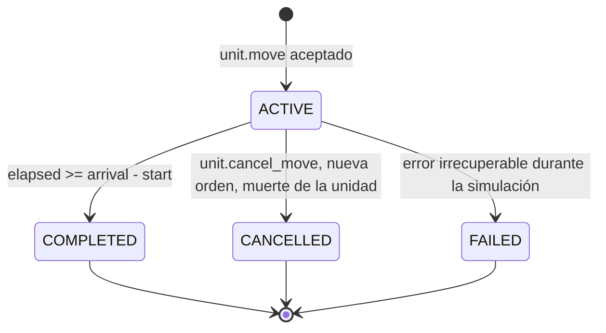

# Invariantes de Movimiento (INV-MOVE-xxx)

Propiedades de la polilínea temporizada, la unicidad del movimiento activo, la derivación analítica de la posición y la terminación de movimientos.

Formato y severidades: [README.md](README.md). Modelo de movimiento: canon §7. Pathfinding: canon §8.

---

## Contexto: el modelo de polilínea temporizada

Es el mecanismo central del servidor y conviene tenerlo presente antes de leer las fichas.

El cliente envía **intención**, nunca trayectoria:

```json
{ "v": 1, "type": "unit.move", "requestId": "…uuid4…", "payload": { "unitId": 8123, "target": { "x": 140, "y": 96 } } }
```

El servidor ejecuta el pipeline fijo del canon §7:

```
validar ownership → validar estado de unidad → validar destino → A* → crear movimiento → simular → notificar
```

y persiste el resultado como una **polilínea temporizada**: un array de waypoints `{ x, y, tMs }` donde `tMs` es el offset en milisegundos desde `start_time_ms` en el que la unidad **alcanza** ese tile. El primer waypoint es el origen con `tMs = 0`.

```
   start_time_ms = 1757400000000

   idx  tile        tMs      significado
   ---  ----------  -------  --------------------------------------------
    0   (10, 10)         0   origen; la unidad ya está aquí
    1   (11, 10)       600   GRASSLAND ortogonal: costUnits 10 ->  600
    2   (12, 11)      1449   GRASSLAND diagonal:  600 -> 849 (x sqrt2)
    3   (13, 11)      2409   FOREST    ortogonal: costUnits 16 ->  960
    4   (14, 11)      2769   ROAD      ortogonal: costUnits  6 ->  360

   arrival_time_ms = start_time_ms + 2769 = 1757400002769
```

Coste de un segmento — **aritmética entera pura**, tal como la implementa `movement.StepDurationMs`:

```go
// internal/domain/movement/path.go
const sqrt2Num, sqrt2Den = 1414214, 1000000   // sqrt(2) en punto fijo
// world.CostBase = 10  (coste 10 == multiplicador 1.0)

func StepDurationMs(baseMsPerTile int64, costUnits int32, diagonal bool) int64 {
    ms := (baseMsPerTile*int64(costUnits) + 5) / 10          // redondeo al ms más cercano
    if diagonal { ms = (ms*1414214 + 500000) / 1000000 }     // redondeo al ms más cercano
    if ms < 1 { ms = 1 }
    return ms
}
```

`baseMsPerTile` es propiedad del `unit_type` y vive en el catálogo de `internal/domain/unit`: `VILLAGER` = **600 ms**. `costUnits` es el coste **entero** del tile de destino del segmento, sobre la base `world.CostBase = 10`: `GRASSLAND` 10, `FOREST` 16, `HILL` 18, `ROAD` 6 (`MOUNTAIN` y `WATER` son intransitables y no tienen coste). No hay multiplicadores en punto flotante en ninguna parte del cálculo: `√2` es la fracción exacta `1414214/1000000`.

Duraciones de paso para `VILLAGER` (`baseMsPerTile = 600`):

| terreno | `costUnits` | ortogonal | diagonal |
|---|---|---|---|
| `GRASSLAND` | 10 | **600** | **849** |
| `FOREST` | 16 | **960** | **1358** |
| `HILL` | 18 | **1080** | **1527** |
| `ROAD` | 6 | **360** | **509** |

**Regla canónica: se redondea cada segmento al milisegundo más cercano y sólo después se acumula.** No se trunca: mil pasos truncados regalarían casi un segundo de ventaja. El redondeo por segmento y la acumulación en `int64` son lo que hace la aritmética reproducible en cualquier plataforma ([INV-MOVE-013](#inv-move-013)).

La consecuencia arquitectónica de todo esto es que **la posición es analíticamente reconstruible**: no requiere replay de ticks.

```
posición(T) = waypoint con el mayor tMs tal que tMs <= (T - start_time_ms)
```

De ahí que la posición durante un movimiento activo sea explícitamente *reconstruible* y no se persista cada tick (canon §12). La interpolación sub-tile es exclusivamente visual, del cliente; el servidor razona en tiles.

Estados de movimiento: `ACTIVE`, `COMPLETED`, `CANCELLED`, `FAILED`. Los tres últimos son **terminales**.

> **Nota sobre las dos métricas de coste.** Son dos métricas distintas por diseño: la primera elige el camino, la segunda lo cronometra, y **ningún invariante de este archivo depende de que coincidan**.
>
> El A\* de `internal/pathfinding` busca con costes enteros escalados: `costScaleOrtho = 1000` y `costScaleDiag = 1414`, siendo el coste de un paso `terrainCostUnits * escala`. Su heurística es octile **ponderada por `world.MinTerrainCostUnits`, que vale 6 (`ROAD`)**, no 10: `h = minCost*1000*rectos + minCost*1414*diagonales`. Usar el coste de la hierba haría la heurística inadmisible en un mundo con caminos más baratos, y una heurística inadmisible devuelve rutas subóptimas. El desempate del heap es determinista por `(f, h, y, x)`.
>
> La polilínea se temporiza después con `StepDurationMs`, con `√2 = 1414214/1000000` y redondeo por segmento.

---

<a id="inv-move-001"></a>
## INV-MOVE-001 — A lo sumo un movimiento `ACTIVE` por unidad

| Campo | Valor |
|---|---|
| Severidad | CRITICO |
| Aplicación | DB, DOMAIN, TEST |
| Milestone | M4 |
| Política ante violación | FAIL_FAST (constraint) |
| Cobertura | **Cubierto** por `TestNuevaOrdenReemplazaLaAnterior` y `TestVerticalSliceMovimiento` (`internal/game/simulation`); la constraint la cubre `TestIndiceUnicoImpideDosMovimientosActivos` (integration, **diseñado y no ejecutado**) |

**Enunciado.** En todo instante existe como máximo una fila en `unit_movements` con `status = ACTIVE` para una unidad dada. Una nueva orden cancela la anterior (`CANCELLED`, con `reason = REPLACED`) **antes** de registrar la nueva.

**Razón.** Dos movimientos activos hacen que la posición derivada esté doblemente definida: dos polilíneas distintas dan dos respuestas a «¿dónde está la unidad en T?». El sistema tendría que elegir, y cualquier criterio de elección es arbitrario. Peor aún, el loop avanzaría ambos, emitiendo `entity.update` contradictorios al cliente: la unidad parpadearía entre dos posiciones. Y la recuperación tras crash cargaría dos activos para la misma unidad sin regla para reconciliarlos.

Es también un vector de abuso: si dos órdenes concurrentes crean dos movimientos, un jugador podría duplicar el desplazamiento efectivo de una unidad.

**Cómo se garantiza.**

- `DB` — `unit_movements_one_active_per_unit`: índice **parcial** único sobre `unit_movements (unit_id) WHERE status = 'ACTIVE'`. Es la garantía dura: PostgreSQL rechaza el segundo activo aunque el dominio falle. Un índice parcial (no un `UNIQUE` completo) es imprescindible, porque una unidad sí puede acumular muchos movimientos `COMPLETED` y `CANCELLED` a lo largo de su vida.
- `DOMAIN` — `Simulation.handleMoveUnit` llama a `cancelActiveMovement(u, ReasonReplaced, nowMs)` **antes** de registrar el nuevo movimiento, con este comentario literal en el código: «Cancelar el movimiento anterior ANTES de registrar el nuevo, para que en ningún instante existan dos movimientos activos de la misma unidad». No hay ruta que registre un activo sin cancelar el anterior.
- `DOMAIN` — en memoria, `State` indexa los movimientos **por unidad** (`State.Movement(unitID)`), no por movimiento: la estructura de datos no admite dos entradas para la misma unidad. Ésa es la garantía primaria, porque el orden de las escrituras durables lo decide después la cola de persistencia.
- `DOMAIN` — el borde aplica idempotencia por `requestId` ([INV-SEC-007](security.md#inv-sec-007)): un reintento de la misma orden no llega siquiera a la simulación.

> **Precisión sobre la transaccionalidad.** La escritura durable **no** ocurre dentro del tick: `handleMoveUnit` aplica el cambio en RAM y **encola** el trabajo `movement.start` en la cola de persistencia, que ejecutan workers fuera del tick (hasta 3 intentos con backoff, y `OnPermanentFailure` si se agotan). El tick nunca hace I/O de PostgreSQL. La consecuencia honesta es una ventana de riesgo de típicamente unas decenas de milisegundos: si el proceso muere entre la aceptación y el `COMMIT`, ese movimiento se pierde y la unidad queda en su última posición consolidada. Es un RPO documentado, no un descuido; el índice parcial sigue garantizando que nunca haya dos activos en disco.

**Cómo se verifica.**

- `TestNuevaOrdenReemplazaLaAnterior` (simulation, `internal/game/simulation`) — **existe y pasa**: la segunda orden deja la primera en `CANCELLED` con `reason = REPLACED` y emite `unit.movement.cancelled` seguido de `unit.movement.started`; queda un único movimiento activo.
- `TestVerticalSliceMovimiento` (simulation) — **existe y pasa**: el ciclo completo deja exactamente un activo en cada instante.
- `TestIndiceUnicoImpideDosMovimientosActivos` (integration, `internal/persistence/postgres`) — **diseñado, aún no ejecutado**: el `INSERT` directo de un segundo `ACTIVE` falla por `unit_movements_one_active_per_unit`.
- Test previsto: `Test_INV_MOVE_001_ConcurrentOrdersProduceOneActive` (integration) — dos órdenes simultáneas sobre la misma unidad: una prevalece, la otra falla; nunca quedan dos activos.

**Violación en runtime.** Detección en el error de índice único (en el worker de persistencia) y en una aserción del loop al indexar movimientos activos. Log `invariant_violation` con `inv_id=INV-MOVE-001`, `unitId` y los ids de ambos movimientos. Política `FAIL_FAST`: la nueva orden se rechaza con `INTERNAL_ERROR` y el estado previo se conserva intacto; si el fallo es del worker, `OnPermanentFailure` compensa deteniendo la unidad.

---

<a id="inv-move-002"></a>
## INV-MOVE-002 — La polilínea es no vacía y empieza en el origen con `tMs = 0`

| Campo | Valor |
|---|---|
| Severidad | CRITICO |
| Aplicación | DB, DOMAIN, TEST |
| Milestone | M4 |
| Política ante violación | FAIL_FAST (el movimiento no se crea) |
| Cobertura | **Cubierto** por `TestBuildTimedPathRechazaEntradasInvalidas`, `TestValidateComprobaciones` y `TestPositionAt` (`internal/domain/movement`) y por `TestMoverseAlSitioDondeYaEstas` (`internal/game/simulation`) |

**Enunciado.** Toda polilínea persistida es no vacía y su waypoint de índice 0 coincide exactamente con la posición autoritativa de la unidad en el instante `start_time_ms`, con `tMs = 0`. Toda polilínea de un movimiento **registrado** tiene además al menos dos waypoints: una orden hacia el tile que la unidad ya ocupa no crea movimiento ([INV-MOVE-014](#inv-move-014)).

**Razón.** El waypoint 0 es el ancla que hace que la derivación analítica sea total: `posición(T)` para `T = start_time_ms` debe devolver algo, y ese algo es el origen. Sin él, la evaluación en `T = start_time_ms` no encuentra ningún waypoint con `tMs <= 0` y la función queda indefinida en su propio instante inicial; en Go, el resultado típico es un índice `-1` y un `panic` dentro del tick.

Que el waypoint 0 coincida con la posición real de la unidad es igual de importante: si difieren, la unidad **teletransporta** al arrancar el movimiento. Ese es exactamente el fallo que aparece cuando el origen se toma de una lectura antigua en lugar de la posición autoritativa en el momento de crear el movimiento.

El mínimo de **dos** waypoints implica que un movimiento hacia el tile en que la unidad ya está no se crea. La decisión concreta está implementada y es firme: se responde `unit.move.accepted` con `movementId = 0` y **no** se crea fila en `unit_movements` ni se emite `unit.movement.started`; ver [INV-MOVE-014](#inv-move-014) y la spec funcional en [../specs/movement.md](../specs/movement.md).

Distinción importante entre las dos comprobaciones: `movement.Validate` exige polilínea **no vacía** (`len >= 1`), porque también valida polilíneas rehidratadas desde disco; el mínimo de dos waypoints lo impone el pipeline de `unit.move`, que nunca llega a construir una de un solo punto.

**Cómo se garantiza.**

- `DOMAIN` — la polilínea se construye con `movement.BuildTimedPath(tiles []world.Tile, grid CostGrid, baseMsPerTile int64) (TimedPath, error)`, que fija el waypoint 0 con `tMs = 0` a partir del primer tile de la ruta. El llamador no puede omitirlo ni falsearlo, y `BuildTimedPath` rechaza entradas inválidas en lugar de producir una polilínea degenerada.
- `DOMAIN` — el origen que recibe el constructor es la **posición autoritativa** de la unidad (`Simulation.authoritativePosition(u, nowMs)`), no la posición consolidada en `units`, que puede ir por detrás. Si la unidad venía de otro movimiento, el origen es el tile que ocupa en ese instante según su polilínea ([INV-MOVE-008](#inv-move-008)), no el destino original. El pathfinder devuelve rutas que **incluyen el tile de origen** como primer elemento, lo que hace que el ancla sea correcta por construcción.
- `DOMAIN` — `movement.Validate(p, grid)` verifica `len(p) >= 1` y `p[0].TMs == 0` antes de persistir y también al rehidratar; una polilínea vacía devuelve `ErrEmptyPath` y un `tMs[0]` distinto de cero devuelve `ErrInvalidOrigin`.
- `DB` — `CONSTRAINT unit_movements_path_is_array CHECK (jsonb_typeof(path) = 'array' AND jsonb_array_length(path) >= 1)`: PostgreSQL rechaza una polilínea vacía o que no sea un array, aunque el dominio fallara.
- `TYPE` — el esquema Zod de `unit.movement.started` en `packages/protocol` declara la polilínea como un array no vacío de `{x, y, tMs}` enteros, y los tests de contrato lo verifican contra el JSON Schema exportado.

**Cómo se verifica.**

- `TestBuildTimedPathRechazaEntradasInvalidas` (unit, `internal/domain/movement`) — **existe y pasa**: una lista de tiles vacía o incoherente no produce polilínea.
- `TestValidateComprobaciones` (unit, `internal/domain/movement`) — **existe y pasa**: `Validate` rechaza polilínea vacía (`ErrEmptyPath`) y `tMs[0] != 0` (`ErrInvalidOrigin`).
- `TestPositionAt` (unit, `internal/domain/movement`) — **existe y pasa**: evaluar en `elapsedMs = 0` devuelve el origen exacto.
- `TestMovementStartedLlevaLaPolilineaCompleta` (contract, `internal/protocol`) — **existe y pasa**: `unit.movement.started` transporta la polilínea entera, con su waypoint 0.
- `TestMoverseAlSitioDondeYaEstas` (simulation, `internal/game/simulation`) — **existe y pasa**: no se crea una polilínea degenerada de un solo punto.

**Violación en runtime.** Detección en `movement.Validate`. Log `invariant_violation` con `inv_id=INV-MOVE-002`, `unitId` y el detalle del defecto. Política `FAIL_FAST` del comando: el movimiento no se persiste, la unidad se queda donde está y se responde `unit.move.rejected` con `INTERNAL_ERROR`.

---

<a id="inv-move-003"></a>
## INV-MOVE-003 — Los `tMs` son estrictamente crecientes

| Campo | Valor |
|---|---|
| Severidad | CRITICO |
| Aplicación | DOMAIN, TEST |
| Milestone | M4 |
| Política ante violación | FAIL_FAST (el movimiento no se crea) |
| Cobertura | **Cubierto** por `TestNingunPasoEsInstantaneo`, `TestDuracionDeUnPaso`, `TestEjemploNumericoCanonico` y `TestValidateComprobaciones` (`internal/domain/movement`) |

**Enunciado.** Para todo par de waypoints consecutivos de una polilínea, `tMs[i] < tMs[i+1]`, con todos los `tMs` enteros no negativos.

**Razón.** La derivación de posición es una búsqueda del último waypoint con `tMs <= elapsed`. Esa búsqueda solo es correcta —y solo admite búsqueda binaria— sobre una secuencia ordenada. Con `tMs` iguales, dos waypoints compiten por el mismo instante y la respuesta depende del criterio de desempate de la implementación, lo que introduce no-determinismo justo en la función más consultada del sistema. Con `tMs` decrecientes, la unidad retrocede en el tiempo: la búsqueda devuelve un waypoint anterior al que ya había alcanzado y el cliente ve la unidad saltar hacia atrás.

Un `tMs` igual al anterior significaría además velocidad infinita en ese segmento: la unidad cambia de tile en cero milisegundos.

**Cómo se garantiza.**

- `DOMAIN` — el coste de segmento lo calcula `StepDurationMs`. Con `baseMsPerTile = 600` (`VILLAGER`) y el coste mínimo del catálogo de terreno (`ROAD` = 6 unidades), el segmento más barato posible es **360 ms** ortogonal y **509 ms** diagonal, muy lejos de cero. El acumulador es `int64` y estrictamente creciente por construcción.
- `DOMAIN` — `StepDurationMs` tiene una guarda final explícita, `if ms < 1 { ms = 1 }`: ningún paso puede durar cero milisegundos, ni siquiera para un `unit_type` futuro tan rápido que el redondeo lo llevara a cero. La guarda vive en el punto único de cálculo, no repartida por los llamadores.
- `DOMAIN` — **no se usa punto flotante en ninguna parte del cálculo**: el factor diagonal es la fracción entera `1414214/1000000` y el redondeo es `(x*num + den/2) / den`. No hay una operación en coma flotante que pudiera producir dos resultados distintos en dos plataformas.
- `DOMAIN` — `movement.Validate` recorre la secuencia y devuelve `ErrPathNotMonotonic` si algún `tMs[i]` no supera al anterior, antes de persistir y también al rehidratar.

**Cómo se verifica.**

- `TestNingunPasoEsInstantaneo` (unit, `internal/domain/movement`) — **existe y pasa**: ninguna combinación de terreno transitable × (ortogonal, diagonal) produce un paso de 0 ms.
- `TestDuracionDeUnPaso` (unit, `internal/domain/movement`) — **existe y pasa**: la tabla completa de duraciones (600/849, 960/1358, 1080/1527, 360/509) es exacta.
- `TestEjemploNumericoCanonico` (unit, `internal/domain/movement`) — **existe y pasa**: golden test sobre el ejemplo documentado arriba; los `tMs` son exactamente `0, 600, 1449, 2409, 2769`. Fija el redondeo y detecta cualquier cambio accidental en la aritmética.
- `TestValidateComprobaciones` (unit, `internal/domain/movement`) — **existe y pasa**: polilíneas con `tMs` repetidos o decrecientes devuelven `ErrPathNotMonotonic`.

**Violación en runtime.** Detección en `movement.Validate` y en la guarda de `StepDurationMs`. Log `invariant_violation` con `inv_id=INV-MOVE-003`, `unitId`, índice y los dos `tMs` implicados. Política `FAIL_FAST`: el movimiento no se crea. Nunca se «corrige» sumando 1 ms al empate: eso enmascararía un error de cálculo de coste que se manifestaría en otra parte.

---

<a id="inv-move-004"></a>
## INV-MOVE-004 — Waypoints transitables y contiguos en 8-vecindad

| Campo | Valor |
|---|---|
| Severidad | CRITICO |
| Aplicación | DOMAIN, TEST |
| Milestone | M4 |
| Política ante violación | FAIL_FAST (el movimiento no se crea) |
| Cobertura | **Cubierto** por `TestValidateComprobaciones` (`internal/domain/movement`), `TestAdyacenciaYDiagonal` (`internal/game/world`) y `TestProhibidoAtajarEsquinas` (`internal/pathfinding`) |

**Enunciado.** Para todo par de waypoints consecutivos `(a, b)` de una polilínea: `b` es transitable (terreno `walkable` y sin ocupación), `max(|b.x - a.x|, |b.y - a.y|) == 1` (contigüidad en 8-vecindad, sin saltos ni repeticiones) y, si el paso es diagonal, ambos tiles ortogonales adyacentes —`(a.x, b.y)` y `(b.x, a.y)`— son transitables.

**Razón.** Tres fallos distintos, un solo invariante porque los tres se verifican en el mismo recorrido:

1. **Waypoint bloqueado** — la unidad atraviesa agua o muralla. Ver [INV-WORLD-003](world.md#inv-world-003) para la razón completa.
2. **Salto** — dos waypoints no contiguos significan teletransporte: la unidad desaparece de un tile y aparece a distancia. Rompe la coherencia visual y, si el salto cruza un obstáculo, hace irrelevante todo el modelo de bloqueo.
3. **Corner cutting** — la diagonal entre dos obstáculos ortogonales. El canon §4 lo **prohíbe explícitamente**: sin esa regla, una unidad atraviesa la esquina exacta donde se tocan dos murallas, que es el punto donde una fortificación debería ser más sólida, y las defensas construidas en diagonal dejan de funcionar.

```
   Corner cutting PROHIBIDO:            Diagonal PERMITIDA:

     . M                                  . .
     M X   <- X quiere ir en diagonal     . X
             desde la esquina inferior
             izquierda; ambos ortogonales   ambos ortogonales transitables
             son MOUNTAIN -> prohibido
```

**Cómo se garantiza.**

- `DOMAIN` — el expansor de vecinos del A\* genera exactamente las 8 direcciones y, para las 4 diagonales, exige que ambos ortogonales sean transitables antes de considerar el vecino. Un vecino que no cumple no entra en la open list.
- `DOMAIN` — el path reconstruido desde el mapa de predecesores es contiguo por construcción, ya que cada arista del grafo de búsqueda es un paso de 8-vecindad.
- `DOMAIN` — reverificación en `movement.Validate`: **transitabilidad** (`grid.IsWalkable` sobre cada waypoint, `ErrPathNotWalkable`) y **contigüidad** en 8-vecindad (`Tile.IsAdjacent`, `ErrPathNotContiguous`) sobre cada par consecutivo, antes de persistir y también al rehidratar. `IsAdjacent` exige `dx <= 1 && dy <= 1` y descarta el par idéntico, de modo que un salto o una repetición son rechazados.
- `DOMAIN` — el desempate del A\* es determinista y estable por `(f, h, y, x)`, lo que hace que el mismo par origen-destino produzca siempre la misma polilínea y, por tanto, el mismo resultado de validación.

> **Alcance real de la reverificación.** `movement.Validate` **no** comprueba hoy la ausencia de corner cutting: esa tercera propiedad la garantiza únicamente el expansor de vecinos del A\*, que no admite la diagonal si alguno de los dos ortogonales está bloqueado. La reverificación de salida cubre las otras dos propiedades del enunciado. Es una asimetría deliberada de coste —comprobar el corner cutting exige dos consultas extra al grid por waypoint diagonal— y una limitación honesta: si el canon §8 sustituye A\* por Hierarchical A\*, la ausencia de corner cutting queda apoyada sólo en el pathfinder nuevo. Añadir esa comprobación a `Validate` es trabajo pendiente y está anotado aquí, no dado por hecho.

**Cómo se verifica.**

- `TestValidateComprobaciones` (unit, `internal/domain/movement`) — **existe y pasa**: un waypoint intransitable devuelve `ErrPathNotWalkable`; un salto o una repetición devuelven `ErrPathNotContiguous`.
- `TestAdyacenciaYDiagonal` (unit, `internal/game/world`) — **existe y pasa**: `IsAdjacent` rechaza la distancia 0 y la distancia 2, y `IsDiagonalTo` clasifica correctamente el paso.
- `TestProhibidoAtajarEsquinas` (unit, `internal/pathfinding`) — **existe y pasa**: el path rodea la esquina en lugar de cruzarla.
- `TestRutaEsDeterminista` (unit, `internal/pathfinding`) — **existe y pasa**: el mismo par origen-destino produce siempre la misma ruta.
- Test previsto: `Test_INV_MOVE_004_ValidateRejectsCornerCut` (unit) — polilínea construida a mano que atraviesa una esquina entre dos obstáculos ortogonales: `Validate` debe rechazarla. **Hoy no la rechaza**; el test acompañará a esa comprobación cuando se añada.

**Violación en runtime.** Detección en `movement.Validate`. Log `invariant_violation` con `inv_id=INV-MOVE-004`, `unitId`, índice del par y el motivo (`blocked`, `not_contiguous`, `corner_cut`). Política `FAIL_FAST`: el movimiento no se crea, la unidad permanece `IDLE`, el comando se responde `unit.move.rejected` con `INTERNAL_ERROR`. No se recorta el path hasta el último waypoint válido: entregar un movimiento parcial que el jugador no pidió es peor que rechazar.

---

<a id="inv-move-005"></a>
## INV-MOVE-005 — `arrival_time_ms` es coherente con la polilínea

| Campo | Valor |
|---|---|
| Severidad | ALTO |
| Aplicación | DB, DOMAIN, TEST |
| Milestone | M4 |
| Política ante violación | REPAIR (recomputar desde la polilínea) |
| Cobertura | **Cubierto** por `TestMovementCicloDeVida` y `TestEjemploNumericoCanonico` (`internal/domain/movement`) y por `TestSnapshotIncluyeElMovimientoEnCurso` (`internal/game/simulation`) |

**Enunciado.** Para todo movimiento, `arrival_time_ms = start_time_ms + tMs` del último waypoint de su polilínea, y el último waypoint es el tile de destino aceptado.

**Razón.** `arrival_time_ms` es un valor **denormalizado** que existe por una razón concreta: permite consultar y ordenar movimientos vencidos con SQL sin deserializar la polilínea, que es exactamente lo que hace la recuperación tras crash del canon §7 (cargar los `ACTIVE` y completar los que ya llegaron). Toda denormalización puede divergir de su fuente, y aquí la divergencia tiene dos formas:

- `arrival_time_ms` **adelantado** — el movimiento se declara completado antes de tiempo y la unidad hace snap al destino habiéndose «saltado» el trayecto restante.
- `arrival_time_ms` **atrasado** — el movimiento nunca se cierra; la unidad queda `MOVING` indefinidamente sobre su destino, con la polilínea agotada.

**Cómo se garantiza.**

- `DOMAIN` — `arrival_time_ms` se calcula en un único punto, `movement.New`, como `startTimeMs + path.DurationMs()`, a partir de la polilínea ya validada. Ningún handler lo asigna por su cuenta.
- `DOMAIN` — la polilínea y `arrival_time_ms` se escriben en la misma fila y en la misma sentencia; no pueden desincronizarse por una escritura parcial.
- `DOMAIN` — la rehidratación de arranque (`simulation.Hydrate`) revalida la polilínea antes de reanudar y usa `Movement.HasArrived(nowMs)` —que se apoya en `ArrivalTimeMs`— para decidir si completar el movimiento; una polilínea que no valida cierra el movimiento como `FAILED` en lugar de teletransportar la unidad.
- `DB` — `CONSTRAINT unit_movements_time_ordered CHECK (arrival_time_ms >= start_time_ms)`. Ése es su nombre y su formulación reales: la comparación es **`>=`**, no `>`, porque el esquema no prohíbe un movimiento de duración cero aunque el dominio nunca lo cree ([INV-MOVE-003](#inv-move-003)). La igualdad exacta con el último `tMs` no es expresable en un `CHECK` sobre la polilínea serializada; se declara así explícitamente y se cubre en dominio y test.

**Cómo se verifica.**

- `TestMovementCicloDeVida` (unit, `internal/domain/movement`) — **existe y pasa**: `ArrivalTimeMs` se deriva de la polilínea y `HasArrived` cambia exactamente en ese instante.
- `TestEjemploNumericoCanonico` (unit, `internal/domain/movement`) — **existe y pasa**: `DurationMs()` del ejemplo canónico es exactamente 2769.
- `TestSnapshotIncluyeElMovimientoEnCurso` (simulation, `internal/game/simulation`) — **existe y pasa**: el snapshot emite `startTimeMs` y `arrivalTimeMs` coherentes con la polilínea que transporta.
- Test previsto: `Test_INV_MOVE_005_RecoveryRecomputesArrival` (recovery) — un `arrival_time_ms` manipulado se recomputa al arrancar y se registra la reparación.
- Test previsto: `Test_INV_MOVE_005_DatabaseRejectsArrivalBeforeStart` (integration) — `INSERT` con `arrival_time_ms < start_time_ms` falla por `unit_movements_time_ordered`.

**Violación en runtime.** Detección en la recuperación de arranque y en una aserción previa a persistir. Log `invariant_violation` con `inv_id=INV-MOVE-005`, `movementId`, valor persistido y recomputado. Política `REPAIR`: prevalece la polilínea, que es la fuente, y se reescribe `arrival_time_ms`. La reparación es segura porque el valor correcto es una función pura de un dato que sí es autoritativo.

---

<a id="inv-move-006"></a>
## INV-MOVE-006 — La posición derivada nunca adelanta al reloj del servidor

| Campo | Valor |
|---|---|
| Severidad | CRITICO |
| Aplicación | DOMAIN, TEST |
| Milestone | M4 |
| Política ante violación | FAIL_FAST |
| Cobertura | **Cubierto** por `TestPositionAt` e `TestIndexAt` (`internal/domain/movement`) y por `TestVerticalSliceMovimiento` y `TestSimulacionEsReproducible` (`internal/game/simulation`) |

**Enunciado.** Para todo instante `T` del servidor y todo movimiento, la posición derivada es el waypoint de mayor `tMs` que cumple `tMs <= (T - start_time_ms)`. Nunca se devuelve un waypoint cuyo `tMs` supere el tiempo transcurrido, y para `T < start_time_ms` la función devuelve el origen.

**Razón.** Es la formulación operativa del principio de servidor autoritativo (canon §1.1) sobre el eje temporal: la unidad está donde el tiempo transcurrido dice que está, ni un tile más adelante. Adelantarse es lo mismo que teletransportar, con dos consecuencias concretas:

- **Ventaja de gameplay** — una unidad que aparece adelantada llega antes a un objetivo que otra que salió al mismo tiempo. Cuando exista territorio y combate, eso es una ventaja competitiva obtenida por un defecto de cálculo.
- **Incoherencia cliente-servidor** — el cliente interpola visualmente entre waypoints. Si el servidor emite una posición por delante de la que el cliente calcula, la unidad da un salto visible hacia adelante en cada `entity.update`.

El riesgo real está en el redondeo del tiempo de tick. Con `EO_TICK_RATE_HZ = 10`, el tick tiene período 100 ms. Es tentador evaluar la posición en `tickTime` redondeado al alza, o comparar con `<` en lugar de `<=`, o usar el `tickTime` del tick siguiente. Cualquiera de esas variantes adelanta la posición hasta 100 ms, que en `ROAD` es más de un cuarto de tile.

**Cómo se garantiza.**

- `DOMAIN` — existe un **único** punto de derivación: `Movement.PositionAt(nowMs int64) world.Tile`, que delega en `TimedPath.PositionAt(elapsedMs int64)`. Ambas son puras y sin acceso al reloj; reciben el instante como argumento. Todo el sistema las usa a través de `Simulation.authoritativePosition`: el emisor de deltas, el manejador de nueva orden (para calcular el origen), la cancelación y la persistencia. No hay una segunda implementación «rápida» en ningún sitio.
- `DOMAIN` — la búsqueda es binaria sobre la secuencia ordenada de `tMs` (`TimedPath.IndexAt`), con la comparación `tMs <= elapsed` y `elapsed = nowMs - start_time_ms`, en aritmética entera de `int64`. Sin flotantes, sin redondeo hacia arriba.
- `DOMAIN` — `nowMs` proviene siempre del `Clock` inyectado (canon §1.5); durante el tick es `tickTime = epoch_ms + tickNumber * tickDurationMs`, que es el tiempo del tick **en curso**, nunca el del siguiente.
- `DOMAIN` — `elapsed < 0` (evaluación anterior al inicio) devuelve el origen, no un error ni un índice negativo.
- `DOMAIN` — si `elapsed >= arrival_time_ms - start_time_ms`, la función devuelve el último waypoint: la posición se satura en el destino y nunca extrapola más allá.

**Cómo se verifica.**

- `TestPositionAt` (unit, `internal/domain/movement`) — **existe y pasa**: cubre el borde exacto (`elapsed == tMs[i]` devuelve el waypoint `i`), `elapsed < 0` (devuelve el origen) y `elapsed` muy posterior a la llegada (satura en el destino, sin extrapolar).
- `TestIndexAt` (unit, `internal/domain/movement`) — **existe y pasa**: la búsqueda binaria devuelve el índice correcto en todos los bordes.
- `TestVerticalSliceMovimiento` (simulation, `internal/game/simulation`) — **existe y pasa**: la secuencia de posiciones emitidas por el loop a 10 Hz coincide con la derivación analítica; el loop no introduce su propio redondeo.
- `TestSimulacionEsReproducible` (simulation, `internal/game/simulation`) — **existe y pasa**: dos ejecuciones con el mismo `FakeClock` producen la misma secuencia de posiciones.
- Test previsto: `Test_INV_MOVE_006_DerivedPositionNeverAheadOfClock` (unit) — property test: para 10 000 pares (movimiento, `T`) aleatorios, el waypoint devuelto cumple `tMs <= T - start_time_ms`.

**Violación en runtime.** Detección en una aserción interna de `TimedPath.IndexAt` (waypoint elegido con `tMs > elapsed`) y en el comparador del test de simulación. Log `invariant_violation` con `inv_id=INV-MOVE-006`, `movementId`, `elapsed` y el `tMs` devuelto. Política `FAIL_FAST` del tick: es un defecto de la función más crítica del sistema y no debe absorberse, porque el efecto acumulado es imperceptible por evento y decisivo en agregado.

---

<a id="inv-move-007"></a>
## INV-MOVE-007 — Un movimiento terminado nunca vuelve a `ACTIVE`

| Campo | Valor |
|---|---|
| Severidad | CRITICO |
| Aplicación | DB, DOMAIN, TEST |
| Milestone | M4 |
| Política ante violación | REJECT (la transición no se aplica) |
| Cobertura | **Cubierto** por `TestEstadosDeMovimiento` y `TestMovementCicloDeVida` (`internal/domain/movement`) y por los tres tests de recuperación (`internal/game/simulation`); `TestFinishEsIdempotente` (integration) está **diseñado y no ejecutado** |

**Enunciado.** `COMPLETED`, `CANCELLED` y `FAILED` son estados terminales de `unit_movements`: ninguna transición sale de ellos, y en particular ninguna vuelve a `ACTIVE`.



**Razón.** La terminalidad es lo que hace que el historial de movimientos sea un registro de hechos y no un estado mutable. Si un movimiento pudiera reactivarse, se producirían:

- **Violación de [INV-MOVE-001](#inv-move-001)** — reactivar uno viejo mientras existe uno nuevo produce dos activos. El índice parcial único lo impediría, pero el intento en sí indica una máquina de estados rota.
- **Reejecución de eventos** — un `COMPLETED` que vuelve a `ACTIVE` y se completa de nuevo emite un segundo `UnitMovementCompleted` para el mismo hecho, duplicando el evento en `world_events` y en los deltas.
- **Movimiento con tiempos caducados** — un movimiento reactivado tiene un `start_time_ms` del pasado. Su `elapsed` es enorme, así que se completa instantáneamente: la unidad teletransporta al destino de una orden antigua que ya había sido cancelada.

Este último caso es el peligro concreto de la recuperación tras crash: al cargar movimientos hay que cargar **solo** los `ACTIVE`, nunca reabrir los terminales.

**Cómo se garantiza.**

- `DOMAIN` — `MovementRepo.Finish(ctx, db, movementID, status)` es el punto único de cierre y **rechaza `ACTIVE` como estado terminal** con un error explícito: no existe ninguna llamada capaz de reabrir un movimiento.
- `DB` — `CONSTRAINT unit_movements_status_valid CHECK (status IN ('ACTIVE','COMPLETED','CANCELLED','FAILED'))`, en línea con la convención de `text` + `CHECK` del canon §11. Ése es su nombre real.
- `DB` — el `UPDATE` de cierre lleva siempre `WHERE id = $1 AND status = 'ACTIVE'`: la guarda está en la sentencia, no en una lectura previa. Nunca se hace un `UPDATE` incondicional por id.
- `DOMAIN` — cero filas afectadas se trata como **éxito idempotente**, no como error, y así está comentado en el código: la finalización puede llegar por el tick y por la recuperación, y no debe fallar por eso. La idempotencia es lo que hace segura la reanudación tras un crash.
- `DOMAIN` — la carga de recuperación consulta explícitamente `WHERE status = 'ACTIVE'`; los terminales no se cargan en memoria.
- `DOMAIN` — el cierre del movimiento y la actualización de `units.status` se aplican juntos en RAM y se encolan como un único trabajo de persistencia ([INV-UNIT-005](units.md#inv-unit-005)).

**Cómo se verifica.**

- `TestEstadosDeMovimiento` (unit, `internal/domain/movement`) — **existe y pasa**: el conjunto de estados es cerrado y los tres terminales están identificados.
- `TestMovementCicloDeVida` (unit, `internal/domain/movement`) — **existe y pasa**: el ciclo de vida no admite volver a `ACTIVE`.
- `TestRecuperacionMovimientoEnCurso`, `TestRecuperacionMovimientoVencidoDuranteLaCaida` y `TestRecuperacionConPolilineaInvalida` (recovery, `internal/game/simulation`) — **existen y pasan**: el arranque sólo reanuda `ACTIVE`, cierra como `COMPLETED` lo vencido y como `FAILED` lo corrupto.
- `TestVerticalSliceMovimiento` (simulation) — **existe y pasa**: un movimiento completado emite exactamente un `unit.movement.completed`.
- `TestFinishEsIdempotente` (integration, `internal/persistence/postgres`) — **diseñado, aún no ejecutado**: cerrar dos veces el mismo movimiento no cambia nada y no falla.

**Violación en runtime.** Detección en `MovementRepo.Finish` (intento de cierre con `ACTIVE`). Log `invariant_violation` con `inv_id=INV-MOVE-007`, `movementId`, estado actual y estado destino. Política `REJECT`: la transición no se aplica y el movimiento conserva su estado terminal.

---

<a id="inv-move-008"></a>
## INV-MOVE-008 — Cancelar deja la unidad en el último tile alcanzado

| Campo | Valor |
|---|---|
| Severidad | ALTO |
| Aplicación | DOMAIN, TEST |
| Milestone | M4 |
| Política ante violación | REPAIR (snap al waypoint correcto) |
| Cobertura | **Cubierto** por `TestCancelacionExplicita` y `TestNuevaOrdenReemplazaLaAnterior` (`internal/game/simulation`) y por `TestPositionAt` (`internal/domain/movement`) |

**Enunciado.** Al cancelar un movimiento en el instante `T`, la posición persistida de la unidad es exactamente `Movement.PositionAt(T)`: el último waypoint efectivamente alcanzado. La unidad jamás queda entre dos tiles, ni retrocede al origen, ni avanza al destino.

**Razón.** El servidor razona en tiles (canon §7); la interpolación sub-tile es exclusivamente visual y vive en el cliente. Una posición «entre tiles» en el servidor es un estado que ninguna otra parte del sistema sabe manejar: el pathfinder necesita un tile de origen, el índice de ocupación necesita un tile, y `chunkOf` necesita coordenadas enteras de tile.

Las tres alternativas incorrectas tienen cada una su consecuencia:

| Snap incorrecto | Consecuencia |
|---|---|
| Al **origen** | La unidad retrocede visiblemente; el jugador pierde todo el trayecto recorrido al cancelar |
| Al **destino** | Cancelar equivale a llegar: la cancelación se convierte en un teletransporte gratuito, explotable |
| A una posición **interpolada** | Coordenadas no enteras o un tile que la unidad nunca pisó, posiblemente intransitable |

La cancelación no es un caso raro: ocurre en **cada nueva orden**, porque una orden nueva cancela la anterior dentro de la misma transacción ([INV-MOVE-001](#inv-move-001)). Un jugador que redirige sus unidades constantemente ejercita este camino más que ningún otro.

**Cómo se garantiza.**

- `DOMAIN` — `Simulation.cancelActiveMovement` usa el mismo `Movement.PositionAt` que todo lo demás, evaluado en el `nowMs` del tick en curso. No hay un cálculo alternativo de «dónde estaba»; el propio código lo documenta: «La unidad queda SIEMPRE sobre el último tile alcanzado, nunca entre dos».
- `DOMAIN` — la posición resultante se fija en RAM (`Unit.SetTile`), la unidad se marca como *dirty* y el cierre del movimiento se encola como trabajo de persistencia. La posición de una unidad en movimiento normalmente no se persiste (es reconstruible), pero al cancelar deja de serlo y debe escribirse.
- `DOMAIN` — el waypoint devuelto pertenece a la polilínea, que ya fue validada por [INV-MOVE-004](#inv-move-004), luego es transitable: la unidad no puede quedar sobre un tile bloqueado, y [INV-UNIT-001](units.md#inv-unit-001) se preserva.
- `DOMAIN` — se emite `unit.movement.cancelled` con la posición final y con la `reason` que corresponde (`CANCELLED_BY_PLAYER`, `REPLACED`, `PATH_BLOCKED`, `UNIT_DEAD` o `SERVER`), para que el cliente detenga su interpolación en el mismo tile que el servidor y no en el que su animación hubiera alcanzado.

**Cómo se verifica.**

- `TestCancelacionExplicita` (simulation, `internal/game/simulation`) — **existe y pasa**: con `FakeClock`, cancelar a mitad de trayecto deja la unidad exactamente sobre el último waypoint alcanzado, y el movimiento en `CANCELLED`.
- `TestNuevaOrdenReemplazaLaAnterior` (simulation) — **existe y pasa**: la segunda orden arranca desde la posición donde quedó la primera, no desde su origen ni desde su destino.
- `TestPositionAt` (unit, `internal/domain/movement`) — **existe y pasa**: cancelar antes de completar el primer segmento devolvería el origen; en el borde exacto devuelve ese waypoint.
- `TestMovimientoSobreviveAlCicloDePersistencia` (integration, `internal/persistence/postgres`) — **diseñado, aún no ejecutado**: la posición tras cancelar sobrevive a un reinicio.

**Violación en runtime.** Detección en una aserción posterior a la cancelación que comprueba que la posición persistida pertenece a la polilínea del movimiento cancelado. Log `invariant_violation` con `inv_id=INV-MOVE-008`, `unitId`, `movementId`, posición escrita y esperada. Política `REPAIR`: se reescribe la posición al waypoint correcto y se emite un `entity.update` corrector. La reparación es segura porque el valor correcto es determinista y la polilínea sigue disponible.

---

<a id="inv-move-009"></a>
## INV-MOVE-009 — La posición es función pura de `(path, start_time_ms, T)`

| Campo | Valor |
|---|---|
| Severidad | ALTO |
| Aplicación | DOMAIN, TEST |
| Milestone | M4 |
| Política ante violación | FAIL_FAST |
| Cobertura | **Cubierto** por `TestSimulacionEsReproducible` (`internal/game/simulation`) y por `TestPositionAt` e `TestIndexAt` (`internal/domain/movement`) |

**Enunciado.** La posición de una unidad en cualquier instante `T` es función pura de `(path, start_time_ms, T)`: se obtiene por búsqueda binaria sobre la polilínea y nunca requiere replay de ticks.

**Razón.** Es la propiedad arquitectónica de la que dependen la recuperación tras crash y los tests reproducibles, y la razón de ser del modelo de polilínea temporizada frente a un modelo de simulación incremental.

- **Recuperación en O(1)** — un servidor caído veinte minutos no tiene que reproducir doce mil ticks para saber dónde estaría cada unidad: evalúa la función y ya está ([INV-PERSIST-002](persistence.md#inv-persist-002)). Un modelo incremental exigiría un log de eventos y un replay, con todo lo que eso implica de tiempo de arranque y de superficie de error.
- **Nada que persistir por tick** — si la posición fuera un acumulador, habría que escribirla; al ser derivable, no se persiste durante el movimiento ([INV-PERSIST-004](persistence.md#inv-persist-004)).
- **Tests deterministas** — con `FakeClock`, evaluar la función en instantes elegidos da resultados exactos y comparables, sin depender de cuántas veces corriera el loop.

La palabra **pura** es la carga del enunciado: la función no lee el reloj, no lee el mundo, no consulta la base de datos y no muta nada. Recibe el instante como argumento. Cualquier dependencia oculta destruiría las tres consecuencias de arriba a la vez.

**Cómo se garantiza.**

- `DOMAIN` — `TimedPath.PositionAt(elapsedMs int64) world.Tile` y `TimedPath.IndexAt(elapsedMs int64) int` son funciones sobre el valor de la polilínea, sin receptor mutable ni acceso al exterior. `Movement.PositionAt(nowMs)` sólo resta `StartTimeMs` y delega.
- `DOMAIN` — la búsqueda es **binaria** sobre la secuencia de `tMs`, que es estrictamente creciente por [INV-MOVE-003](#inv-move-003). La monotonía no es un detalle de eficiencia: es la precondición que hace correcta la búsqueda binaria.
- `DOMAIN` — el loop no acumula posición: en cada tick evalúa la función para las unidades en movimiento y emite el delta si el tile cambió. No hay ningún estado intermedio que pudiera divergir entre dos ejecuciones.
- `DOMAIN` — el tiempo entra siempre por el `Clock` inyectado y se pasa como argumento; el dominio no llama a `time.Now()`.

**Cómo se verifica.**

- `TestSimulacionEsReproducible` (simulation, `internal/game/simulation`) — **existe y pasa**: dos ejecuciones con el mismo `FakeClock` y las mismas órdenes producen exactamente la misma secuencia de estados.
- `TestPositionAt` e `TestIndexAt` (unit, `internal/domain/movement`) — **existen y pasan**: la evaluación en instantes arbitrarios no depende de la historia previa.
- `TestRecuperacionCompletaTrasReinicio` (recovery, `internal/game/simulation`) — **existe y pasa**: el estado reconstruido sin replay coincide con el esperado.

**Violación en runtime.** Detección en el comparador del test de reproducibilidad y en cualquier aserción que evalúe la función dos veces con los mismos argumentos y obtenga resultados distintos. Log `invariant_violation` con `inv_id=INV-MOVE-009` y `movementId`. Política `FAIL_FAST`: una función de posición impura invalida la recuperación, que es la garantía más cara de recuperar una vez perdida.

---

<a id="inv-move-010"></a>
## INV-MOVE-010 — La posición sólo cambia a tiles de la propia polilínea

| Campo | Valor |
|---|---|
| Severidad | CRITICO |
| Aplicación | DOMAIN, TEST |
| Milestone | M4 |
| Política ante violación | FAIL_FAST |
| Cobertura | **Cubierto** por `TestVerticalSliceMovimiento` y `TestRechazosDeMovimiento` (`internal/game/simulation`) y por `TestPayloadConCamposExtraNoAportaEstado` (`internal/websocket`) |

**Enunciado.** Mientras una unidad tiene un movimiento activo, su posición sólo cambia a tiles presentes en su propia polilínea; ninguna ruta de código escribe `units.(x, y)` a partir de datos del cliente.

**Razón.** Es [INV-SEC-001](security.md#inv-sec-001) aplicado al dato más valioso del juego. Si existiera una sola ruta por la que la posición se escribiera desde el payload, sobraría el pathfinding, sobraría el modelo de bloqueo y sobraría la velocidad de las unidades: bastaría enviar «estoy en el centro de la ciudad enemiga».

La formulación en dos mitades es deliberada, porque son dos fallos distintos:

- **«Sólo a tiles de su polilínea»** cierra la puerta a un cálculo interno erróneo: una interpolación, un tile «cercano», un redondeo que produzca una coordenada que la unidad nunca pisó. Todos ellos violan además [INV-UNIT-001](units.md#inv-unit-001), porque un tile no perteneciente a la polilínea no ha sido validado como transitable.
- **«Ninguna ruta escribe desde datos del cliente»** cierra la puerta al ataque directo.

**Cómo se garantiza.**

- `DOMAIN` — durante un movimiento activo la posición **no se escribe**: se deriva ([INV-MOVE-009](#inv-move-009)). Las únicas escrituras de `Unit.SetTile` ocurren al completar o cancelar, y ambas usan un waypoint devuelto por `PositionAt`.
- `DOMAIN` — el pipeline de `unit.move` sólo acepta del cliente `unitId` y `target`; el origen lo calcula el servidor con `authoritativePosition`, y la ruta la calcula el A\*.
- `BOUNDARY` — el payload de `unit.move` es exactamente `{ unitId, target: {x, y} }` y el esquema es estricto: un campo extra se rechaza con `INVALID_MESSAGE` ([INV-MOVE-011](#inv-move-011)).
- `DOMAIN` — el flush periódico excluye las unidades con movimiento activo ([INV-PERSIST-004](persistence.md#inv-persist-004)), de modo que ni siquiera la persistencia puede escribir una posición intermedia.

**Cómo se verifica.**

- `TestVerticalSliceMovimiento` (simulation, `internal/game/simulation`) — **existe y pasa**: todas las posiciones observadas durante el trayecto son waypoints de la polilínea.
- `TestPayloadConCamposExtraNoAportaEstado` (e2e, `internal/websocket`) — **existe y pasa**: un payload con campos extra no cambia la posición de la unidad.
- `TestElComandoDeMovimientoNoAdmiteRuta` (contract, `internal/protocol`) — **existe y pasa**: el esquema de `unit.move` no admite una ruta enviada por el cliente.
- `TestRechazosDeMovimiento` (simulation) — **existe y pasa**: un comando rechazado no produce ningún cambio de posición.

**Violación en runtime.** Detección en una aserción posterior a toda escritura de posición, que comprueba que el tile escrito pertenece a la polilínea del movimiento en curso. Log `invariant_violation` con `inv_id=INV-MOVE-010`, `unitId`, `movementId` y el tile escrito. Política `FAIL_FAST` del tick. Una escritura consumada desde datos del cliente es un incidente de seguridad, no un bug ordinario.

---

<a id="inv-move-011"></a>
## INV-MOVE-011 — Ningún mensaje del cliente transporta estado de movimiento

| Campo | Valor |
|---|---|
| Severidad | CRITICO |
| Aplicación | TYPE, BOUNDARY, TEST |
| Milestone | M3 |
| Política ante violación | REJECT con `INVALID_MESSAGE` |
| Cobertura | **Cubierto** por los tests de `packages/protocol` (18 en verde, entre ellos «rechaza un payload que intente aportar estado autoritativo desconocido» y «unit.move no admite que el cliente envíe una ruta») y por `TestElComandoDeMovimientoNoAdmiteRuta` (`internal/protocol`) |

**Enunciado.** Ningún mensaje cliente→servidor de la v1 transporta posición, ruta, `tMs`, velocidad ni instante de llegada; los esquemas cliente→servidor son estrictos y rechazan cualquier campo extra.

**Razón.** Es la garantía **estructural** de la que [INV-MOVE-010](#inv-move-010) es la garantía de comportamiento. La diferencia importa: una regla de comportamiento se puede olvidar en un handler nuevo; un esquema estricto no se puede olvidar, porque el mensaje no llega a decodificarse.

La asimetría con el sentido contrario es deliberada y hay que entenderla para no «corregirla» por error: los esquemas **servidor→cliente NO son estrictos**, para poder añadir campos opcionales sin romper clientes antiguos. Es exactamente la política correcta en cada dirección: estricto donde entra dato ajeno, tolerante donde sale dato propio.

La forma en que este invariante se rompe en la práctica no es un ataque, sino una comodidad: añadir a `unit.move` un `estimatedArrival` «para que el cliente no espere», o un `path` «que el cliente ya calculó para la previsualización». Por eso se garantiza en el esquema y no con disciplina.

**Cómo se garantiza.**

- `TYPE` — los esquemas Zod de `packages/protocol/src/v1/client.ts` son la fuente de verdad del protocolo. Los cinco mensajes cliente→servidor son `session.hello`, `session.ping`, `session.view`, `unit.move` y `unit.cancel_move`, y ninguno declara campos de estado derivado. `unit.move` es exactamente `{ unitId, target: {x, y} }`.
- `BOUNDARY` — los esquemas cliente→servidor se exportan a JSON Schema con `additionalProperties: false`. Un campo desconocido **falla la validación** en lugar de ignorarse silenciosamente; un descarte silencioso podría convertirse en aceptación tras un refactor.
- `BOUNDARY` — el decodificador de Go valida a mano por rendimiento, pero los tests de contrato de `internal/protocol` lo verifican contra el JSON Schema embebido (`go:embed` del espejo generado por `pnpm run protocol:build`): la implementación rápida no puede divergir del esquema.
- `TYPE` — las coordenadas se declaran como enteros, lo que descarta flotantes y `NaN` antes de llegar a Go.

**Cómo se verifica.**

- `packages/protocol` (Vitest, 18 tests en verde) — **existen y pasan**: «rechaza un payload que intente aportar estado autoritativo desconocido», «unit.move no admite que el cliente envíe una ruta», «rechaza coordenadas no enteras: el mundo es un grid de tiles» y «no ha derivado respecto de los esquemas Zod (misma comprobación que la CI)».
- `TestElComandoDeMovimientoNoAdmiteRuta` (contract, `internal/protocol`) — **existe y pasa**: el espejo embebido en Go coincide.
- `TestPayloadConCamposExtraNoAportaEstado` (e2e, `internal/websocket`) — **existe y pasa**: el rechazo llega hasta el borde real.

**Violación en runtime.** Detección en la validación del esquema y en el decodificador. Log `invariant_violation` con `inv_id=INV-MOVE-011`, `session_id` y el campo ofensivo. Política `REJECT` con `INVALID_MESSAGE`; no se procesa nada del mensaje. Un PR que añada un campo de estado a un payload cliente→servidor debe bloquearse en revisión aunque los tests pasen.

---

<a id="inv-move-012"></a>
## INV-MOVE-012 — El último waypoint es exactamente el destino pedido

| Campo | Valor |
|---|---|
| Severidad | MEDIO |
| Aplicación | DOMAIN, TEST |
| Milestone | M4 |
| Política ante violación | FAIL_FAST (el movimiento no se crea) |
| Cobertura | **Cubierto** por `TestVerticalSliceMovimiento` (`internal/game/simulation`) y `TestRutaTrivialEnLineaRecta` (`internal/pathfinding`) |

**Enunciado.** El último waypoint de la polilínea es exactamente el `target` solicitado: el MVP nunca reubica el destino ni entrega rutas parciales.

**Razón.** Es una promesa de contrato con el jugador: la unidad va donde se le dijo, o no va. Las dos alternativas que este invariante prohíbe son tentadoras y ambas peores:

- **Reubicar el destino** («el tile pedido está bloqueado, voy al más cercano transitable») convierte un rechazo claro en un comportamiento que el jugador no pidió y no puede predecir. En una orden de retirada, «el más cercano» puede ser el lado equivocado del obstáculo. El canon §8 es explícito: el MVP **no** busca un tile cercano; se responde `TARGET_NOT_WALKABLE`.
- **Entregar una ruta parcial** («no hay camino completo, te acerco lo que pueda») deja a la unidad en un sitio arbitrario, posiblemente expuesta, sin que el jugador lo haya decidido. Se responde `PATH_NOT_FOUND`.

En ambos casos el jugador prefiere un error inmediato y accionable a una obediencia aproximada.

**Cómo se garantiza.**

- `DOMAIN` — `handleMoveUnit` valida el destino **antes** del A\*: fuera de límites responde `TARGET_OUT_OF_BOUNDS`, intransitable responde `TARGET_NOT_WALKABLE`. No hay ninguna rama que sustituya el destino por otro.
- `DOMAIN` — `pathfinding.FindPath` devuelve `ErrPathNotFound` si no hay ruta completa, y `ErrPathTooLong` / el límite de nodos si excede su presupuesto. **Nunca devuelve una ruta parcial**, y la simulación traduce el error a `PATH_NOT_FOUND` o `PATH_TOO_LONG`.
- `DOMAIN` — `movement.New(unitID, path, target, startTimeMs)` recibe el `target` del comando y `TimedPath.Destination()` devuelve el último waypoint; ambos coinciden porque la ruta viene del A\* hacia ese mismo destino.
- `DOMAIN` — la ruta devuelta por el pathfinder **incluye el tile de origen** como primer elemento, de modo que el primer y el último waypoint son, respectivamente, el origen autoritativo y el destino pedido.

**Cómo se verifica.**

- `TestVerticalSliceMovimiento` (simulation, `internal/game/simulation`) — **existe y pasa**: la unidad termina exactamente en el tile pedido.
- `TestRutaTrivialEnLineaRecta` y `TestOrigenIgualADestino` (unit, `internal/pathfinding`) — **existen y pasan**: la ruta empieza en el origen y termina en el destino; `from == to` devuelve una ruta de un solo tile, sin error.
- `TestSinRutaPosibleSeRechaza` (simulation) — **existe y pasa**: sin camino se responde `PATH_NOT_FOUND` y no se crea ningún movimiento parcial.
- `TestDestinoIntransitableSeRechaza` (unit, `internal/pathfinding`) y el caso «destino intransitable» de `TestRechazosDeMovimiento` — **existen y pasan**: no se reubica el destino.

**Violación en runtime.** Detección en una aserción previa a registrar el movimiento, que compara `path.Destination()` con el `target` del comando. Log `invariant_violation` con `inv_id=INV-MOVE-012`, `unitId`, destino pedido y último waypoint. Política `FAIL_FAST`: el movimiento no se crea y se responde `INTERNAL_ERROR`. Entregar un movimiento que el jugador no pidió es peor que rechazar.

---

<a id="inv-move-013"></a>
## INV-MOVE-013 — La aritmética de tiempos es entera y reproducible

| Campo | Valor |
|---|---|
| Severidad | ALTO |
| Aplicación | DOMAIN, TEST |
| Milestone | M4 |
| Política ante violación | FAIL_FAST |
| Cobertura | **Cubierto** por `TestEjemploNumericoCanonico`, `TestDuracionDeUnPaso` y `TestNingunPasoEsInstantaneo` (`internal/domain/movement`) |

**Enunciado.** La duración de cada segmento se redondea al milisegundo más cercano **antes** de acumularse, con aritmética entera pura (`world.CostBase = 10`, `√2 = 1414214/1000000`); el resultado es idéntico en cualquier plataforma.

**Razón.** Dos exigencias distintas convergen en la misma regla.

La primera es **la equidad**: si cada segmento se truncara en lugar de redondearse, la unidad ganaría hasta 0,5 ms por paso. Mil pasos truncados regalan casi un segundo de ventaja, y esa ventaja es sistemática, no aleatoria: siempre a favor de quien más se mueve. Redondear reparte el error en los dos sentidos y lo mantiene acotado.

La segunda es **el determinismo**: la aritmética en coma flotante no garantiza el mismo resultado en dos plataformas, dos versiones de compilador o dos niveles de optimización. Un `1.41421356` multiplicado en `float64` puede diferir en el último bit y, tras un redondeo, en un milisegundo entero. Ese milisegundo rompe el golden test, rompe la reproducibilidad de [INV-MOVE-009](#inv-move-009) y hace que un bug reportado no se pueda reproducir en otra máquina. Con `(ms*1414214 + 500000) / 1000000` en `int64` no hay margen: el resultado es el mismo en todas partes.

El orden importa tanto como los tipos: **primero se redondea el segmento, después se acumula**. Acumular en alta precisión y redondear al final daría otro resultado y haría que el `tMs` de un waypoint dependiera de toda la historia del camino en lugar de sólo del paso anterior.

**Cómo se garantiza.**

- `DOMAIN` — `movement.StepDurationMs(baseMsPerTile int64, costUnits int32, diagonal bool) int64` es el punto único de cálculo. Su cuerpo es aritmética entera: `(baseMsPerTile*costUnits + 5) / 10` y, si el paso es diagonal, `(ms*1414214 + 500000) / 1000000`. El `+5` y el `+500000` son exactamente el medio denominador: eso es redondeo al más cercano, no truncamiento.
- `DOMAIN` — `world.CostBase = 10` es el denominador de `terrainCostUnits`: coste 10 equivale a multiplicador 1,0. Los costes del catálogo de terreno son enteros (10, 16, 18, 6), de modo que no hay ningún punto de entrada en coma flotante.
- `DOMAIN` — `BuildTimedPath` acumula en `int64` sumando duraciones ya redondeadas; no hay un acumulador de precisión intermedia.
- `DOMAIN` — no existe ninguna otra implementación de la duración de un paso en el árbol; el pathfinder usa su propia escala de costes (`1000`/`1414`) para **buscar**, y no para cronometrar.

**Cómo se verifica.**

- `TestEjemploNumericoCanonico` (unit, `internal/domain/movement`) — **existe y pasa**: el ejemplo canónico produce exactamente `0, 600, 1449, 2409, 2769`. Es el golden test que fija el redondeo.
- `TestDuracionDeUnPaso` (unit, `internal/domain/movement`) — **existe y pasa**: la tabla completa de duraciones ortogonales y diagonales es exacta para los cuatro terrenos transitables.
- `TestNingunPasoEsInstantaneo` (unit, `internal/domain/movement`) — **existe y pasa**: la guarda `ms < 1` funciona.
- `TestSimulacionEsReproducible` (simulation, `internal/game/simulation`) — **existe y pasa**: la reproducibilidad de extremo a extremo descansa sobre esta aritmética.

**Violación en runtime.** Detección en el golden test de CI, que es preventiva: cualquier cambio en la aritmética lo rompe. Log `invariant_violation` con `inv_id=INV-MOVE-013` y los valores esperado y obtenido. Política `FAIL_FAST`. La respuesta correcta a un golden roto es entender por qué cambió la aritmética, no actualizar el fixture.

---

<a id="inv-move-014"></a>
## INV-MOVE-014 — Moverse al tile propio se acepta sin crear movimiento

| Campo | Valor |
|---|---|
| Severidad | MEDIO |
| Aplicación | DOMAIN, TEST |
| Milestone | M4 |
| Política ante violación | REJECT |
| Cobertura | **Cubierto** por `TestMoverseAlSitioDondeYaEstas` (`internal/game/simulation`) |

**Enunciado.** Un `unit.move` cuyo destino coincide con la posición autoritativa de la unidad se **acepta** sin crear fila en `unit_movements` y sin emitir `unit.movement.started`; si había movimiento activo, se cancela con `reason = CANCELLED_BY_PLAYER`.

**Razón.** Es el caso degenerado del pipeline, y las tres respuestas posibles no son equivalentes:

- **Rechazar con `INVALID_TARGET`** obligaría al cliente a comprobar la posición antes de enviar, lo que es exactamente el tipo de estado que el cliente no debe usar para decidir ([INV-SEC-001](security.md#inv-sec-001)). Además convierte en error una orden que el jugador dio a propósito.
- **Crear un movimiento de un solo waypoint** violaría [INV-MOVE-002](#inv-move-002) y produciría un movimiento con duración cero que ninguna otra parte del sistema sabe manejar.
- **Aceptar sin crear movimiento** —lo implementado— es idempotente, no produce basura en `unit_movements` y da al jugador la respuesta que espera.

La segunda mitad del enunciado es la parte con significado de gameplay: si la unidad estaba en tránsito y su posición **actual** coincide con el destino pedido, la orden es en la práctica «párate aquí». Cancelar con `CANCELLED_BY_PLAYER` —y no con `REPLACED`— es correcto porque no hay ningún movimiento nuevo que reemplace al anterior: fue el jugador quien lo detuvo, y ésa es la razón que el cliente debe mostrar.

**Cómo se garantiza.**

- `DOMAIN` — `handleMoveUnit` compara `origin == cmd.Target` **después** de calcular la posición autoritativa y **antes** de invocar el A\*: el caso degenerado no consume presupuesto de pathfinding.
- `DOMAIN` — en esa rama se llama a `cancelActiveMovement(u, ReasonCancelledByPlayer, nowMs)` y se responde `unit.move.accepted` con `movementId = 0`. El `0` es el marcador de «no se creó movimiento», coherente con que los ids de `unit_movements` son `bigint GENERATED ALWAYS AS IDENTITY` y empiezan en 1.
- `DOMAIN` — el orden de las validaciones previas se conserva: ownership → estado de unidad → límites → transitabilidad del destino → **caso degenerado** → A\*. Una unidad ajena o muerta se rechaza antes de llegar aquí.
- `BOUNDARY` — la respuesta es `unit.move.accepted`, no `unit.movement.started`: el cliente no recibe ninguna polilínea que interpolar.

**Cómo se verifica.**

- `TestMoverseAlSitioDondeYaEstas` (simulation, `internal/game/simulation`) — **existe y pasa**: se emite exactamente un `unit.move.accepted`, ningún `unit.movement.started`, y la unidad queda `IDLE`. El propio test documenta la razón: «no se crea una polilínea degenerada de un solo punto».
- Test previsto: `Test_INV_MOVE_014_SelfMoveCancelsActiveWithPlayerReason` (simulation) — una unidad en tránsito que recibe una orden hacia el tile que ocupa en ese instante emite `unit.movement.cancelled` con `reason = CANCELLED_BY_PLAYER`.

**Violación en runtime.** Detección en una aserción posterior que comprueba que no se registró movimiento cuando origen y destino coinciden. Log `invariant_violation` con `inv_id=INV-MOVE-014`, `unitId` y el tile. Política `REJECT`: el movimiento espurio no se registra.

---

## Cobertura conjunta

Las catorce fichas se refuerzan entre sí. Vistas como una sola propiedad: *una unidad está siempre en un tile transitable determinado por, como mucho, una polilínea válida que el servidor calculó, evaluada por una función pura en un tiempo que nunca se adelanta al servidor, y toda terminación deja un estado consistente y persistido.*

```
      INV-MOVE-001  a lo sumo un ACTIVE
             │
             ▼
      INV-MOVE-002  polilínea no vacía, ancla en el origen
             │
             ├── INV-MOVE-003  tMs estrictamente crecientes
             ├── INV-MOVE-004  waypoints transitables y contiguos
             └── INV-MOVE-005  arrival_time_ms coherente
             │
             ▼
      INV-MOVE-006  posición derivada nunca adelantada
             │
             ├── INV-MOVE-009  posición = función pura de (path, start, T)
             ├── INV-MOVE-007  terminales no reactivables
             └── INV-MOVE-008  cancelación hace snap a tile alcanzado
             │
             ▼
      INV-UNIT-001  posición sobre tile válido y transitable


   Rama de autoridad (el cliente no aporta trayectoria):

      INV-MOVE-011  ningún mensaje del cliente lleva estado de movimiento
             │
             ▼
      INV-MOVE-010  la posición sólo cambia a tiles de la propia polilínea
             │
             ├── INV-MOVE-012  el último waypoint es el destino pedido
             └── INV-MOVE-014  moverse al tile propio no crea movimiento

   Rama de determinismo:

      INV-MOVE-013  aritmética entera con redondeo por segmento
             │
             ▼
      INV-MOVE-003  tMs estrictamente crecientes
             │
             ▼
      INV-MOVE-009  búsqueda binaria correcta y reproducible
```

## Trazabilidad

| Invariante | Componente propietario | Relacionado con |
|---|---|---|
| INV-MOVE-001 | `internal/domain/movement` | [INV-UNIT-005](units.md#inv-unit-005), [INV-SEC-007](security.md#inv-sec-007) |
| INV-MOVE-002 | `internal/domain/movement` | [INV-MOVE-008](#inv-move-008) |
| INV-MOVE-003 | `internal/domain/movement` | [../architecture/game-loop.md](../architecture/game-loop.md) |
| INV-MOVE-004 | `internal/pathfinding`, `internal/domain/movement` | [INV-WORLD-003](world.md#inv-world-003) |
| INV-MOVE-005 | `internal/domain/movement` | [INV-PERSIST-002](persistence.md#inv-persist-002) |
| INV-MOVE-006 | `internal/domain/movement`, `internal/game/loop` | [INV-WORLD-004](world.md#inv-world-004), [INV-SEC-001](security.md#inv-sec-001) |
| INV-MOVE-007 | `internal/domain/movement` | [INV-PERSIST-002](persistence.md#inv-persist-002) |
| INV-MOVE-008 | `internal/domain/movement` | [INV-PERSIST-004](persistence.md#inv-persist-004) |
| INV-MOVE-009 | `internal/domain/movement` | [INV-PERSIST-002](persistence.md#inv-persist-002) |
| INV-MOVE-010 | `internal/game/simulation` | [INV-SEC-001](security.md#inv-sec-001), [INV-UNIT-001](units.md#inv-unit-001) |
| INV-MOVE-011 | `packages/protocol`, `internal/protocol` | [INV-SEC-001](security.md#inv-sec-001) |
| INV-MOVE-012 | `internal/pathfinding`, `internal/game/simulation` | [INV-WORLD-003](world.md#inv-world-003) |
| INV-MOVE-013 | `internal/domain/movement`, `internal/game/world` | [INV-WORLD-005](world.md#inv-world-005) |
| INV-MOVE-014 | `internal/game/simulation` | [INV-MOVE-002](#inv-move-002) |
