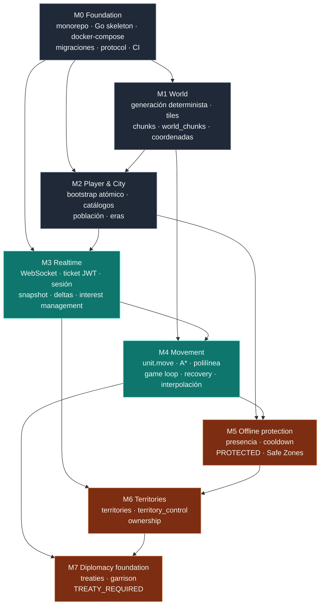

# Roadmap

Visión temporal de Empires Online: qué se construye, en qué orden, por qué en ese orden y cómo se sabe que cada etapa terminó.

## 1. Estado del proyecto

El proyecto **ya no es greenfield**. El lado servidor del vertical slice está construido: el módulo Go
de `services/game-server` compila (`go build ./...`), pasa `go vet` y su suite de tests unitarios, de
contrato, de simulación y de recuperación está **en verde**, igual que los 18 tests de Vitest de
`packages/protocol`. M0 está prácticamente cerrado y buena parte de M1 a M5 está implementada del lado
servidor.

Lo que falta, y que este roadmap no debe dar por hecho:

| Pendiente | Situación |
|---|---|
| **Cliente `apps/web/`** | No existe todavía. Es el entregable que impide cerrar M3 y M4 y ejecutar el flujo end-to-end delante de un humano. |
| **Tests de integración** | Escritos y diseñados, pero **no ejecutados**: requieren PostgreSQL y Redis reales por Docker Compose y el daemon de Docker no arrancó en la máquina de desarrollo. |
| **CI en GitHub Actions** | Todavía no montada. Hasta que exista, ningún milestone puede declararse cerrado con la Definition of Done completa. |
| **Alta de jugador en Next.js** | `POST /api/auth/register` y `POST /api/auth/login` los sirve hoy el propio game server (`internal/httpapi`, con bcrypt). ADR-010 los sitúa en Next.js; el traslado está pendiente y registrado como deuda. |

Ningún milestone se considera **cerrado** hasta que su documentación refleje lo implementado y la CI
esté en verde.

El entorno de desarrollo real sobre el que se planifica es Windows 10 Pro con Node v22.17.1,
pnpm 10.25.0, git 2.38.1 y Docker CLI 20.10.22 con Compose v2.15.1 (daemon **no arrancado**). **Go 1.27.0
está instalado** en `C:\Program Files\Go` (`winget install --id GoLang.Go`); el `go.mod` declara `go 1.23`
como versión mínima. `psql`, `redis-cli`, `make` y `gh` no están instalados: el task runner del
repositorio son **pnpm scripts**, no un Makefile, y el acceso a Postgres y Redis se hace mediante
`docker compose exec`.

## 2. Estrategia: vertical slice antes que profundidad

M0 a M7 forman un **vertical slice**: atraviesan el stack completo —cliente Next.js/PixiJS,
protocolo WebSocket, Game Server en Go, PostgreSQL y Redis, observabilidad y CI— para un conjunto
mínimo de funcionalidad, en lugar de completar una capa antes de empezar la siguiente.

El objetivo del slice es que, al terminar M7, exista este recorrido íntegro y funcionando:

```
Jugador se registra (hoy POST /api/auth/register en el game server; ADR-010 lo mueve a Next.js)
   -> recibe un game ticket (JWT HS256, TTL 60 s)
   -> abre wss://.../ws y envía session.hello
   -> el servidor valida el ticket, consume el jti en Redis y responde session.welcome
   -> recibe world.snapshot centrado en su ciudad (radio 2 chunks)
   -> ve su Centro Urbano y sus 3 aldeanos renderizados en isométrico
   -> ordena unit.move a un tile lejano
   -> el servidor valida, ejecuta A*, persiste la polilínea temporizada y emite
      unit.move.accepted + unit.movement.started
   -> el cliente interpola el movimiento suavemente entre waypoints
   -> el servidor se reinicia a mitad del trayecto y el movimiento sobrevive
   -> el jugador se desconecta, su ciudad pasa a OFFLINE_PENDING y luego a PROTECTED
   -> el territorio y los treaties condicionan lo que otro jugador puede hacer allí
```

Por qué esta estrategia y no la contraria:

1. **El riesgo está en las costuras, no en las capas.** Los fallos caros de un MMORTS aparecen en
   las interfaces: qué es autoritativo, cómo se sincroniza el estado, qué sobrevive a un reinicio,
   cómo se versiona el protocolo. Un slice fino los expone en la semana 1 y no en el mes 6.
2. **Valida los principios no negociables temprano.** Servidor autoritativo, mundo persistente,
   separación PostgreSQL/Redis/RAM y determinismo son propiedades transversales: solo se demuestran
   con un caso de uso completo. Un mundo generado sin nadie que lo mire no prueba nada.
3. **Cada milestone es demostrable.** M4 termina con una unidad moviéndose en pantalla y
   sobreviviendo a un `restart`. Eso es un criterio binario, no una opinión.
4. **Las abstracciones se validan con un consumidor real.** La interfaz `Pathfinder` solo se sabe
   correcta cuando algo la usa; el `Clock` inyectado solo demuestra su valor cuando hay un test de
   simulación que avanza 10 segundos y asserta estado exacto.
5. **Profundizar es barato después; corregir cimientos es caro.** Añadir tipos de unidad, recursos o
   tecnologías sobre un slice sólido es trabajo incremental. Cambiar el modelo de movimiento o la
   estrategia de persistencia con diez sistemas encima, no.

Lo que el slice explícitamente **no** hace: combate completo, economía completa, árbol tecnológico
completo, cientos de unidades, crafting, quests, NPCs complejos, marketplace, chat avanzado,
ranking, IA avanzada, naval y clanes. Todo eso queda **Fuera de MVP** y se documenta como diseño,
nunca como funcionalidad existente.

## 3. Los ocho milestones

| ID | Nombre | Objetivo en una frase | Valor entregado | Criterio binario de finalización | Estado real |
|---|---|---|---|---|---|
| **M0** | Foundation | Levantar el esqueleto ejecutable del monorepo, el módulo Go, la infraestructura local y el CI. | El equipo puede clonar, arrancar y contribuir con verificación automática. | `pnpm run db:up` levanta Postgres y Redis, el servidor arranca, `GET /health` y `GET /ready` responden 200 y el workflow de GitHub Actions pasa en verde. | **Parcial**: todo hecho salvo la CI |
| **M1** | World | Generar el mundo determinísticamente desde `EO_WORLD_SEED` y persistirlo por chunks. | Existe un mundo consultable, reproducible y auditable. | Dos generaciones con la misma seed producen el mismo mundo byte a byte y las transformaciones de coordenadas pasan sus tests. | **Hecho** (tests en verde) |
| **M2** | Player & City | Crear un jugador con su ciudad y sus 3 aldeanos en una única transacción atómica. | Hay entidades de dominio persistentes sobre las que operar. | El bootstrap de un jugador nuevo deja en base 1 fila en `players`, 1 en `cities` y 3 en `units`, o ninguna; nunca un estado parcial. | **Hecho** del lado servidor |
| **M3** | Realtime | Conectar cliente y servidor con autenticación por ticket, snapshot e interest management por chunks. | El jugador ve el mundo en tiempo real y solo lo que le concierne. | Un cliente se autentica con `session.hello`, recibe `session.welcome` y `world.snapshot`, y al mover la vista con `session.view` recibe `entity.spawn`/`entity.despawn` coherentes con el radio de 2 chunks. | **Parcial**: servidor hecho, falta `apps/web` |
| **M4** | Movement | Mover unidades con A\*, polilínea temporizada, game loop a 10 Hz y recuperación tras reinicio. | El primer verbo real del juego funciona extremo a extremo. | Una unidad ordenada a un destino llega al tile correcto en el tiempo esperado, y si el servidor se reinicia a mitad de trayecto el movimiento continúa o se completa sin intervención. | **Parcial**: servidor hecho, falta la interpolación del cliente |
| **M5** | Offline protection & Safe Zones | Modelar presencia, cooldown de protección y zonas seguras calculadas por el servidor. | El mundo persistente deja de castigar la desconexión. | Al vencer el margen de reconexión la ciudad pasa a `OFFLINE_PENDING` y, tras el cooldown, a `PROTECTED`; al reconectar vuelve a `ONLINE` y `protection_until` queda a NULL. | **Parcial**: presencia y protección hechas; `safe_zones` sólo tabla |
| **M6** | Territories | Introducir territorios rectangulares y control/ownership sobre el mundo. | El espacio pasa a tener significado político. | Un territorio con control asignado se refleja en `territory.update` y su ownership sobrevive a un reinicio del servidor. | **Pendiente**: tablas creadas, lógica diferida |
| **M7** | Diplomacy foundation | Persistir treaties y garrisons y hacer que condicionen las acciones permitidas. | Existe la base sobre la que construir alianzas, comercio y guerra. | Un intento de garrison sin treaty `ACTIVE` con `allows_garrison` verdadero devuelve `TREATY_REQUIRED`; con él, la unidad pasa a `GARRISONED` de forma persistente. | **Pendiente**: tablas creadas, lógica diferida |

El desglose entregable por entregable —qué está HECHO, qué PARCIAL y qué PENDIENTE— está en
[milestones.md](milestones.md).

## 4. Dependencias entre milestones



Lectura de las aristas críticas:

- `M0 → todo`: sin módulo Go, migraciones y CI no hay nada verificable.
- `M1 → M4`: A\* necesita un grid transitable real; con un mapa falso el pathfinding no demuestra
  nada sobre los `costUnits` del terreno ni sobre la prohibición de corner cutting.
- `M2 → M3`: el `world.snapshot` se centra en la ciudad del jugador; sin ciudad no hay centro de vista.
- `M3 → M4`: `unit.move` es un mensaje del protocolo; necesita sesión, `requestId` e idempotencia.
- `M4 → M5`: la protección offline solo es interesante cuando existen unidades que se mueven y por
  tanto un mundo que puede afectarte mientras no estás.
- `M6 → M7`: un treaty regula qué se puede hacer en el territorio de otro; sin territorio, el
  garrison no tiene semántica espacial.

Paralelización posible: M1 y M2 pueden avanzar simultáneamente tras M0 si M2 no depende todavía de
la posición concreta de spawn; el paquete `@empires-online/protocol` y el cliente PixiJS pueden
avanzar en paralelo a M1/M2 porque su contrato está congelado por el canon del protocolo v1. El
detalle de qué se puede solapar y qué no está en [milestones.md](milestones.md).

## 5. Después de M7

Las fases siguientes están **listadas y priorizadas, no diseñadas en detalle**. Cada una requerirá
su propia especificación funcional, sus invariantes y, cuando cambie una decisión estructural, un
ADR. Ninguna tiene migración escrita en el MVP.

**Economy.** Introduce recursos, recolección y almacenamiento: los aldeanos dejan de ser piezas que
solo se mueven y pasan a producir. Depende técnicamente de M4 (un ciclo de recolección es una
secuencia de movimientos más un temporizador de trabajo, resuelto en la fase `process
timers/scheduled events` del tick), de M2 (la ciudad como almacén y como límite de población) y de
una extensión de la estrategia de persistencia: los stocks son candidatos naturales a
*dirty-flag + flush periódico*, no a write-through por tick. Es la fase que más presiona el
presupuesto de mensajes por segundo del protocolo, porque los contadores cambian continuamente.

**Technology.** Árbol tecnológico y avance de era. Depende de Economy (toda investigación tiene un
coste en recursos) y del catálogo `eras` ya creado en M2, que define `population_cap` por era. Añade
las tablas `technologies` y `civilization_technologies`, hoy fuera de MVP y sin migración. El riesgo
principal es de modelado: los efectos de las tecnologías deben ser datos en base, nunca condicionales
en el código del dominio.

**Civilizations.** Activa los bonos culturales por civilización (Roman, Byzantine, Persian, Norse…).
El catálogo `civilizations` existe desde M2, pero en el MVP no aplica modificadores. Depende de
Technology y Economy, porque la mayoría de bonos se expresan como multiplicadores sobre costes,
velocidades o límites. Requiere una capa de resolución de modificadores determinista y ordenada, o
el balance se vuelve irreproducible.

**Trade.** Mercados y transacciones entre jugadores (`markets`, `trade_transactions`). Depende de
Economy —sin recursos no hay nada que comerciar— y de Diplomacy (M7), porque el treaty de tipo
`TRADE` es la habilitación natural del intercambio. Introduce por primera vez transacciones
multi-jugador con riesgo de condición de carrera, y por tanto necesita bloqueos en Redis y
concurrencia optimista sobre las filas afectadas.

**Caravans.** Rutas y caravanas (`trade_routes`, `caravans`) que transportan mercancía por el mundo
y pueden ser interceptadas. Depende de Trade y de una generalización de M4: el modelo de polilínea
temporizada debe aplicarse a entidades que no son unidades de combate, con reutilización de la
interfaz `Pathfinder` sin tocar el protocolo. Es la primera fase donde el pathfinding deja de ser
puntual y pasa a ser continuo, lo que dispara la revisión del A\* plano.

**Factions.** Efectos reales de la Global Faction (ORDER / CHAOS / NEUTRAL), ortogonal a la
civilización. El catálogo `factions` existe desde M2 sin efectos. Depende de Territories (M6) y de
Combat, porque la facción se expresa sobre todo como reglas de agresión permitida, bonos en
territorio afín y objetivos globales. Requiere decidir antes si la facción es mutable y a qué coste.

**Combat.** La fase 4 del tick, `resolve simulation`, está reservada para esto desde M0 y en el MVP
no hace nada. Depende de M4 (posición autoritativa y estados de unidad), de tipos de unidad más allá
de `VILLAGER` y de M5 (nada puede atacar una ciudad `PROTECTED`). Es la fase con mayor impacto sobre
el volumen de deltas y sobre el determinismo: exige que `RandomSource` esté inyectada desde el primer
día, cosa que M0 ya garantiza.

**Sieges.** Asedio de ciudades y zonas urbanas amuralladas. Depende de Combat, de Economy (máquinas
de asedio con coste) y de M6, porque un asedio es una disputa de ownership sobre un territorio.
Introduce eventos de larga duración que deben sobrevivir a reinicios exactamente igual que los
movimientos, reutilizando el patrón de recuperación validado en M4.

**Clans.** Organizaciones persistentes de jugadores (tabla `clans`, fuera de MVP). Depende de M7:
un clan es, estructuralmente, un conjunto de treaties permanentes con gestión de membresía y
permisos. El trabajo duro no es el modelo de datos sino la autorización: qué puede hacer un miembro
en nombre del clan sobre ciudades, territorios y garrisons ajenos.

**Large-scale warfare.** Guerra a gran escala con muchos jugadores y unidades concurrentes en la
misma región. Depende de todo lo anterior y es la primera fase que puede exigir cambios
estructurales fuera del dominio: revisión del interest management, del formato de los mensajes
(hoy JSON sin compresión), del A\* plano y posiblemente del supuesto de un único proceso de Game
Server. Es el disparador natural de la mayoría de las deudas técnicas registradas en
[backlog.md](backlog.md).

## 6. Riesgos del proyecto

| Riesgo | Por qué es real aquí | Mitigación adoptada |
|---|---|---|
| Complejidad del estado persistente | Tres capas —PostgreSQL durable, Redis caliente, RAM del Game Server— con reglas distintas. Es fácil que una capa mienta y que el mundo divergira tras un reinicio. | Regla de clasificación obligatoria en todo documento relevante: qué es autoritativo en RAM, qué se persiste inmediatamente, qué eventualmente y qué es reconstruible. Write-through transaccional para eventos irreversibles, dirty-flag con flush cada `EO_PERSISTENCE_FLUSH_INTERVAL_TICKS` (50 ticks, 5 s) para estado consolidable, y posición durante un movimiento activo derivada de `unit_movements` en vez de escrita. Tests de nivel *recovery* obligatorios desde M4. |
| Coste del interest management | La suscripción por chunk con radio 2 crea un área de 5×5 chunks, es decir 160×160 tiles por jugador. El coste de recalcular conjuntos y difundir deltas crece con jugadores × entidades visibles, y hoy no hay compresión ni agregación. | Radio configurable (`EO_INTEREST_RADIUS_CHUNKS`), difusión por chunk y no por entidad, snapshot solo al conectar y deltas incrementales después, rate limit de `session.view`, y métricas desde M3 (`eo_ws_messages_total`, `eo_connected_websockets`) para medir antes de optimizar. La compresión y la agregación quedan como deuda con disparador explícito. |
| Deriva del protocolo | Zod define el contrato en TypeScript, pero el Game Server valida a mano en Go por rendimiento. Dos implementaciones de la misma verdad divergen siempre, y una divergencia silenciosa rompe clientes en producción. | Fuente única en `packages/protocol/src/v1/`, exportación de JSON Schema en el build, `go:embed` de esos esquemas en el servidor y **contract tests** obligatorios que validan cada mensaje emitido contra el esquema. Versionado explícito `"v": 1` en cada mensaje y código `UNSUPPORTED_VERSION` para rechazos limpios. Los contract tests ya existen y están en verde: un test en Go verifica que los 22 códigos de error coinciden con los exportados por `packages/protocol`. Falta el eslabón de CI que bloquee el PR ante deriva del JSON Schema. |
| Equilibrio del juego | Ningún valor de gameplay puede quedar disperso por el código o el balanceo se vuelve imposible de razonar y de reproducir. | Todo valor de gameplay pasa por `internal/config` con prefijo `EO_`, y los catálogos (`eras`, `civilizations`, `factions`) viven en tablas, no en código. Determinismo forzado por `Clock` y `RandomSource` inyectados, de modo que un escenario de balance se puede repetir exactamente. El equilibrio real solo se aborda a partir de Combat y Economy: en el MVP no hay nada que equilibrar y no se pretende lo contrario. |
| Operación 24/7 | El mundo evoluciona sin jugadores conectados; un despliegue, un crash o una migración ocurren siempre con estado vivo. Ningún estado durable puede depender de un WebSocket vivo. | `GET /health` sin dependencias y `GET /ready` que comprueba Postgres, Redis y el loop vivo; logging estructurado JSON con `ts`, `level`, `msg`, `player_id`, `session_id`, `request_id`, `tick`; métricas Prometheus incluyendo `eo_game_tick_overruns_total` y `eo_persistence_queue_depth`; prohibición absoluta de I/O bloqueante contra Postgres dentro del tick; y recuperación de movimientos `ACTIVE` al arrancar, validada por tests desde M4. Migraciones con `.up.sql`/`.down.sql` para poder revertir. |

Riesgo de entorno, específico de esta máquina: **el daemon de Docker Desktop no ha arrancado**, y no hay
`psql`, `redis-cli`, `make` ni `gh`. Consecuencia concreta y honesta: los tests de integración están
escritos pero **no ejecutados**, y así debe decirlo toda la documentación mientras siga siendo cierto.
Go ya está resuelto: 1.27.0 instalado. Mitigación: los tests de integración están *gated* por
`EO_INTEGRATION=1` para que la suite unitaria siga siendo ejecutable sin Docker —y de hecho lo es, en
verde—, y el acceso a las bases se hace siempre vía `docker compose exec`.

## 7. Documentos relacionados

- [milestones.md](milestones.md) — el detalle ejecutable de M0 a M7.
- [backlog.md](backlog.md) — backlog priorizado, deuda técnica aceptada y preguntas abiertas.
- [../architecture/overview.md](../architecture/overview.md) — visión de componentes y capas de estado.
- [../architecture/game-loop.md](../architecture/game-loop.md) — fases del tick y determinismo.
- [../architecture/persistence.md](../architecture/persistence.md) — write-through, dirty-flag y reconstrucción.
- [../specs/websocket-protocol.md](../specs/websocket-protocol.md) — envelopes, mensajes y códigos de error.
- [../database/schema.md](../database/schema.md) — DDL canónico y convenciones de tablas.
- [../testing/strategy.md](../testing/strategy.md) — niveles de test y Definition of Done.
