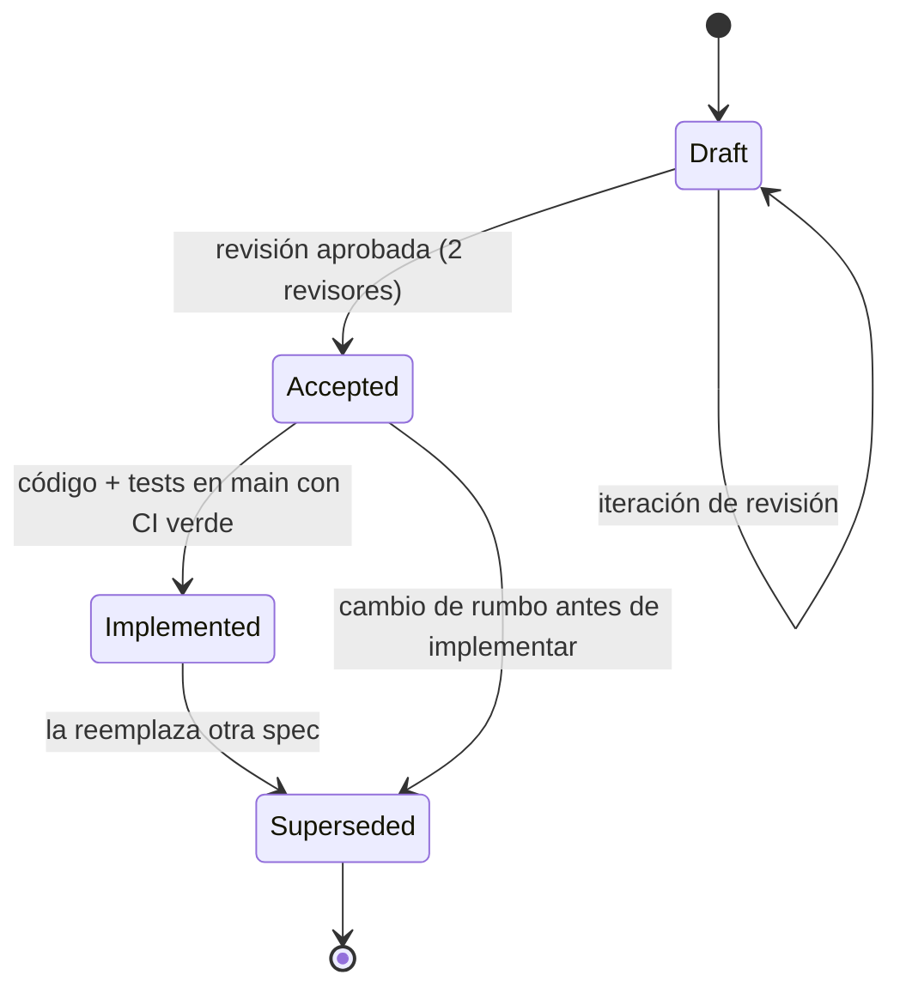

# Especificaciones funcionales

Índice, plantilla obligatoria y ciclo de vida de las specs de Empires Online: aquí se define cómo se escribe una spec antes de escribir una sola línea de código.

## 1. Por qué existe este directorio

El canon técnico fija el proceso en su principio no negociable número 6, *Spec-Driven Development*:

```
Requirement → Specification → Invariants → Design → Implementation
            → Unit → Integration → Contract → Docs → Review
```

La especificación es el segundo eslabón y el único que produce un artefacto revisable **antes** de que exista
código. Un cambio de gameplay que no pase por una spec no tiene invariantes, y sin invariantes no hay forma de
saber si la implementación es correcta o simplemente no ha fallado todavía.

**Regla dura del proyecto:** *ninguna feature importante se implementa sin spec previa en estado `Accepted`.*
Una feature es importante si cumple al menos una de estas condiciones:

- introduce o modifica una tabla de PostgreSQL o una migración;
- introduce o modifica un tipo de mensaje del protocolo WebSocket v1;
- introduce o modifica un código de error estable del canon §16;
- introduce o modifica un invariante de dominio;
- cambia el orden de fases del tick o el modelo de persistencia;
- afecta a la autoridad del servidor sobre el estado (ownership, presencia, protección, resultados).

Lo que **no** requiere spec: refactors internos sin cambio observable, mejoras de logging, ajustes de formato,
tests adicionales sobre comportamiento ya especificado y correcciones de bugs que restauran el comportamiento
que la spec ya describía. En estos casos basta con la referencia a la spec vigente en el PR.

La Definition of Done del canon §19 exige `spec + invariantes + ADR si aplica + implementación + unit +
integration + contract + errores testeados + docs + logs/métricas + CI verde + sin violaciones de invariantes`.
La spec es la primera casilla, no la última.

## 2. Índice de especificaciones

Éstas son las nueve specs que existen hoy en el directorio. No hay ninguna más: si un documento cita una
spec que no aparece en esta tabla, la cita está rota.

| Spec | Archivo | Milestone | Estado | Alcance |
|---|---|---|---|---|
| Player | [player.md](player.md) | M2 Player & City | Draft | Identidad, autenticación por ticket, alta y bootstrap atómico, Civilization y Global Faction, rasgos data-driven |
| City | [city.md](city.md) | M2 Player & City | Draft | Ciudad, emplazamiento, zona urbana amurallada, población y límite por era, ownership |
| Presence & Protection | [presence.md](presence.md) | M5 Offline protection & Safe Zones | Draft | Presencia de jugador en Redis, `presence_state` durable de la ciudad, cooldown de protección |
| Unit | [unit.md](unit.md) | M2 / M4 | Draft | `units`, estados `IDLE`/`MOVING`/`GARRISONED`/`HIDDEN`/`DEAD`, `VILLAGER` |
| Movement | [movement.md](movement.md) | M4 Movement | Draft | `unit.move`, A\*, polilínea temporizada, recuperación tras crash |
| Safe Zones | [safe-zones.md](safe-zones.md) | M5 Offline protection & Safe Zones | Draft | Geometría de `safe_zones`, pertenencia de tiles y estado `HIDDEN` |
| Territory | [territory.md](territory.md) | M6 Territories | Draft | `territories` y `territory_control`, resolución tile → territorio |
| Garrison | [garrison.md](garrison.md) | M7 Diplomacy foundation | Draft | `garrisons`, entrada y salida, tratados con `allows_garrison` |
| WebSocket protocol v1 | [websocket-protocol.md](websocket-protocol.md) | M3 Realtime | Draft | Envelopes, los 5 mensajes cliente→servidor y los 14 servidor→cliente, límites e idempotencia |

**No existe `world.md`.** El grid, los chunks y la generación determinista desde `EO_WORLD_SEED` están
documentados hoy en [../invariants/world.md](../invariants/world.md) y en
[../architecture/pathfinding.md](../architecture/pathfinding.md); escribir una spec funcional del mundo es
trabajo pendiente, no un documento existente, y ningún otro documento debe enlazarla como si estuviera.

Documentación relacionada que **no** es una spec funcional y por tanto no sigue esta plantilla:

- [../architecture/game-loop.md](../architecture/game-loop.md) — orden de fases del tick, `Clock`, determinismo.
- [../architecture/persistence.md](../architecture/persistence.md) — write-through, dirty-flag, reconstruible.
- [../database/schema.md](../database/schema.md) — DDL canónico de todas las tablas.
- [../decisions/](../decisions/) — decisiones de arquitectura (ADR) con alternativas descartadas.

## 3. Plantilla obligatoria de spec

La plantilla tiene tres partes: una **cabecera** fija, un **núcleo** fijo y un **cuerpo temático** libre.
Lo que sigue describe lo que las nueve specs del §2 hacen realmente; no es un ideal al que ninguna se ajuste.

### 3.1 Cabecera

Cada spec abre con `# Título`, una línea de propósito y una **tabla de metadatos**:

```markdown
# Nombre de la entidad

Una línea que dice para qué sirve este documento.

| Campo | Valor |
|---|---|
| Spec ID | `SPEC-CITY` |
| Estado | Draft |
| Milestone | M2 Player & City |
| Canon | §9, §10, §11, §12 |
| Depende de | [player.md](player.md), [unit.md](unit.md) |
| Reemplaza a | — |
| Invariantes | rango citado o asignado por esta spec |
```

`Depende de` solo puede enlazar documentos que existan (§2). `Estado` es uno de los cuatro del ciclo de
vida (§4).

### 3.2 Secciones fijas de apertura

| # | Sección | Qué contiene | Error típico a evitar |
|---|---|---|---|
| 1 | **Objetivo** | Una o dos frases: qué problema resuelve la entidad o el subsistema. | Repetir el título con más palabras. |
| 2 | **Scope (y no-scope)** | Lista de lo incluido y lista explícita de lo excluido, marcando `Fuera de MVP`. | Dejar el no-scope implícito. |
| 3 | **Actores** | Quién o qué participa: jugador, cliente web, game server, PostgreSQL, Redis, tick loop. | Confundir actor con módulo de código. |

### 3.3 Cuerpo temático

A partir de la sección 4 cada spec ordena su propio material. Hay dos formas admitidas, y ambas se usan:

- **Forma de contrato de entrada/salida** (`player.md`, `city.md`, `presence.md`): `4. Inputs`,
  `5. Outputs`, `6. Reglas de negocio`, `7. Estados y transiciones`. Es la forma preferida cuando la
  entidad se manipula mediante comandos del protocolo.
- **Forma de modelo de dominio** (`unit.md`, `movement.md`, `safe-zones.md`, `garrison.md`,
  `territory.md`): secciones temáticas propias —modelo de datos, catálogo, geometría, máquina de estados,
  construcción de la polilínea— porque el valor del documento está en el modelo, no en el formulario de
  entrada. Las reglas siguen siendo numeradas y verificables (§5.1).

Ninguna de las dos formas autoriza a omitir el núcleo de §3.4.

### 3.4 Núcleo obligatorio de cierre

Toda spec funcional termina con estas secciones, en este orden y con estos títulos, sea cual sea su cuerpo:

| Sección | Qué contiene | Error típico a evitar |
|---|---|---|
| **Errores** | Tabla de códigos del canon §16 con condición exacta de disparo. | Inventar códigos nuevos. |
| **Invariantes** | IDs `INV-<FAMILIA>-NNN` del registro de [../invariants/](../invariants/) y cómo se verifica cada uno. | Confundir regla de negocio con invariante; reasignar un ID ya tomado. |
| **Persistencia** | Respuesta a las cuatro preguntas del canon §12. | No decir qué es reconstruible. |
| **Eventos y contratos de red** | Eventos de dominio en pasado y los mensajes v1 implicados, con referencia al esquema Zod. Puede partirse en dos secciones (`Eventos` y `Contratos de red`) cuando ambas son largas. | Nombrar eventos en imperativo; definir el payload aquí como si fuera autoritativo. |
| **Tests esperados** | Tabla de tests por nivel: unit, integration, contract, simulation, recovery. | "Se testeará adecuadamente". |
| **Documentos relacionados** | Enlaces relativos a las specs y documentos vecinos. Opcional cuando el cuerpo ya los enlaza. | Enlazar archivos inexistentes. |

`websocket-protocol.md` es la única excepción declarada: es un **contrato de protocolo**, no la spec de una
entidad de dominio, y organiza su cuerpo por envelope, ciclo de vida y catálogo de mensajes. Sigue la
cabecera de §3.1 y las secciones de errores y tests, pero no las de invariantes, persistencia y eventos,
que en su caso viven en las specs de las entidades que transporta.

La sección de **Persistencia** responde literalmente a las cuatro preguntas del canon §12, en una tabla o
en cuatro párrafos rotulados:

1. ¿Qué es autoritativo en RAM del game server?
2. ¿Qué se persiste inmediatamente y de forma transaccional (write-through)?
3. ¿Qué se persiste eventualmente (dirty-flag + flush cada `EO_PERSISTENCE_FLUSH_INTERVAL_TICKS`)?
4. ¿Qué es reconstruible y por tanto **no** se persiste?

## 4. Ciclo de vida de una spec



| Estado | Significado | Quién puede cambiarlo | Efecto práctico |
|---|---|---|---|
| `Draft` | En redacción o revisión. Su contenido no obliga a nadie. | Autor | Prohibido implementar contra ella. |
| `Accepted` | Revisada y aprobada. Es el contrato de la implementación. | Revisores del PR de la spec | Habilita abrir el PR de implementación. |
| `Implemented` | Existe código en `main` que la cumple, con unit + integration + contract en verde. | Autor del PR de implementación | La spec pasa a ser documentación de referencia del comportamiento real. |
| `Superseded` | Reemplazada. Se conserva el archivo con un aviso al principio y el enlace a la sucesora. | Autor de la sucesora | Nadie debe implementar contra ella. |

Reglas del ciclo:

- **No se borra una spec.** Se marca `Superseded` y se enlaza a la que la reemplaza, para que el historial de
  decisiones siga siendo legible.
- **Una spec `Implemented` que deja de describir el código es un bug**, no una discrepancia aceptable. O se
  arregla el código o se abre una nueva spec que la reemplace.
- Un cambio de comportamiento sobre una spec `Implemented` se hace con un PR que actualiza la spec **en el
  mismo commit** que el código. La spec no se actualiza "después".
- Si la decisión tiene alternativas descartadas que merecen memoria (por ejemplo: rechazar el destino
  intransitable en lugar de buscar un tile cercano, canon §8), va un **ADR** en
  [../decisions/](../decisions/) y la spec lo enlaza en lugar de argumentar dentro.

## 5. Convención de IDs

### 5.1 Reglas de negocio: `RN-<DOMINIO>-NNN`

- `RN` fijo, `<DOMINIO>` en mayúsculas ASCII (`PLAYER`, `CITY`, `PRESENCE`, `UNIT`, `MOVE`, `WORLD`),
  `NNN` con tres dígitos y ceros a la izquierda, empezando en `001`.
- Ejemplos: `RN-CITY-001`, `RN-PRESENCE-004`.
- Los números **no se reciclan**. Si una regla desaparece, su ID se marca como retirado en la propia tabla con
  una fila `RN-CITY-007 · Retirada · sustituida por RN-CITY-012`.
- Las familias de `RN` son libres por spec: cada documento declara su dominio en la sección 6.

### 5.2 Invariantes: `INV-<FAMILIA>-NNN`

Un invariante es una propiedad que **siempre** es cierta entre transacciones, no una acción a ejecutar. Si
una frase empieza por "el servidor debe", es una regla de negocio; si empieza por "nunca existe" o "para toda
fila", es un invariante.

**El único registro de invariantes es [../invariants/](../invariants/).** Una spec **cita** IDs; no los
define ni los reasigna. Un ID estable designa un solo invariante para siempre: si una spec usa
`INV-UNIT-001` con un significado distinto al de [../invariants/units.md](../invariants/units.md), la spec
está mal, no el registro.

Familias del canon §22, con el archivo que las registra:

| Familia | Archivo del registro | Ámbito |
|---|---|---|
| `INV-WORLD` | [../invariants/world.md](../invariants/world.md) | Grid, tiles, chunks, límites del mundo |
| `INV-PLAYER` | [../invariants/player.md](../invariants/player.md) | Identidad, sesión, presencia del jugador, civilización y facción |
| `INV-CITY` | [../invariants/city.md](../invariants/city.md) | Ciudad, ownership, población, `presence_state` y protección |
| `INV-UNIT` | [../invariants/units.md](../invariants/units.md) | Unidades, estados, población consumida |
| `INV-MOVE` | [../invariants/movement.md](../invariants/movement.md) | Movimientos, polilínea, unicidad del movimiento activo |
| `INV-PERSIST` | [../invariants/persistence.md](../invariants/persistence.md) | Coherencia entre RAM, PostgreSQL y Redis |
| `INV-SEC` | [../invariants/security.md](../invariants/security.md) | Autoridad del servidor, autenticación, autorización |

Las familias `INV-TERR`, `INV-SAFE` y `INV-GARR` que usan `territory.md`, `safe-zones.md` y `garrison.md`
se registran en dos archivos del catálogo: `docs/invariants/territory.md` (TERR y SAFE) y
`docs/invariants/diplomacy.md` (GARR). Mientras esos archivos no existan, esas familias están **sin
registrar** y ninguna spec debe darlas por definidas.

**No existe `INV-PRESENCE`**: los invariantes de presencia se reparten entre `INV-PLAYER` (presencia del
jugador, volátil, Redis) e `INV-CITY` (`presence_state` durable, PostgreSQL). Ver
[presence.md](presence.md) §9.

Regla de asignación, en dos pasos:

1. Si el enunciado **coincide en significado** con un ID ya registrado, se usa ese ID tal cual.
2. Si es un invariante **nuevo**, toma el siguiente número libre de su familia por encima del máximo ya
   registrado, y **debe añadirse a `docs/invariants/` antes de citarse** desde una spec.

**No copies aquí la lista de máximos ocupados.** Una lista así se desactualiza en cuanto alguien registra
un invariante y se olvida de volver, y entonces induce exactamente la colisión que pretende evitar —le
pasó a este documento—. El dato vive en un único sitio, la tabla resumen de
[../invariants/README.md](../invariants/README.md), y se obtiene del repositorio:

```bash
grep -rho "INV-[A-Z]*-[0-9]\{3\}" docs/invariants/ | sort -u | tail -1   # por familia: ver el README del registro
```

Cada spec declara al principio de su sección de invariantes qué IDs cita y cuáles asigna, para que dos
documentos no colisionen. Que un ID citado no esté registrado lo detecta `pnpm run docs:check`, que corre
en CI; lo que **ningún verificador puede detectar** es reutilizar un ID existente con otro significado, así
que esa comprobación es responsabilidad de quien revisa la PR.

### 5.3 Referencias cruzadas

Dentro de la prosa, los IDs se citan tal cual (`INV-CITY-003`) y, cuando conviene, con enlace relativo a su
ficha del registro: `[INV-UNIT-005](../invariants/units.md#inv-unit-005)`. Los tests nombran el ID que
cubren en el nombre de la función (`Test_INV_UNIT_005_MovingIffActiveMovement`) o en un comentario, de modo
que `grep INV-UNIT-005` encuentre registro, spec e implementación.

## 6. Reglas de escritura comunes

- **Español en la prosa; inglés exacto del canon en identificadores**: nombres de tablas, columnas, tipos de
  mensaje, códigos de error, constantes y variables de entorno `EO_*`.
- **Nada se hardcodea dos veces.** Todo valor de gameplay pasa por `internal/config` (canon §17). Si una spec
  necesita un número que el canon no define, escribe `TBD (fuera de MVP)` en lugar de inventarlo.
- **Nunca describir features inexistentes como si existieran.** El proyecto es greenfield: estas specs
  describen el diseño objetivo. Lo excluido del primer vertical slice se marca `Fuera de MVP` de forma
  explícita, no por omisión.
- **El servidor es autoritativo.** Ninguna spec puede aceptar del cliente posición final, HP, recursos,
  resultados, ownership, cooldowns, ETA ni paths.
- **Determinismo.** Ninguna spec puede prescribir `time.Now()` ni `rand` dentro del dominio: se usan las
  interfaces `Clock` y `RandomSource` inyectadas, y `FakeClock` en tests.
