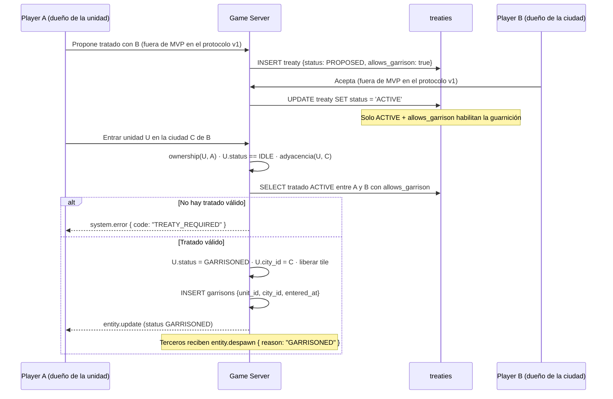
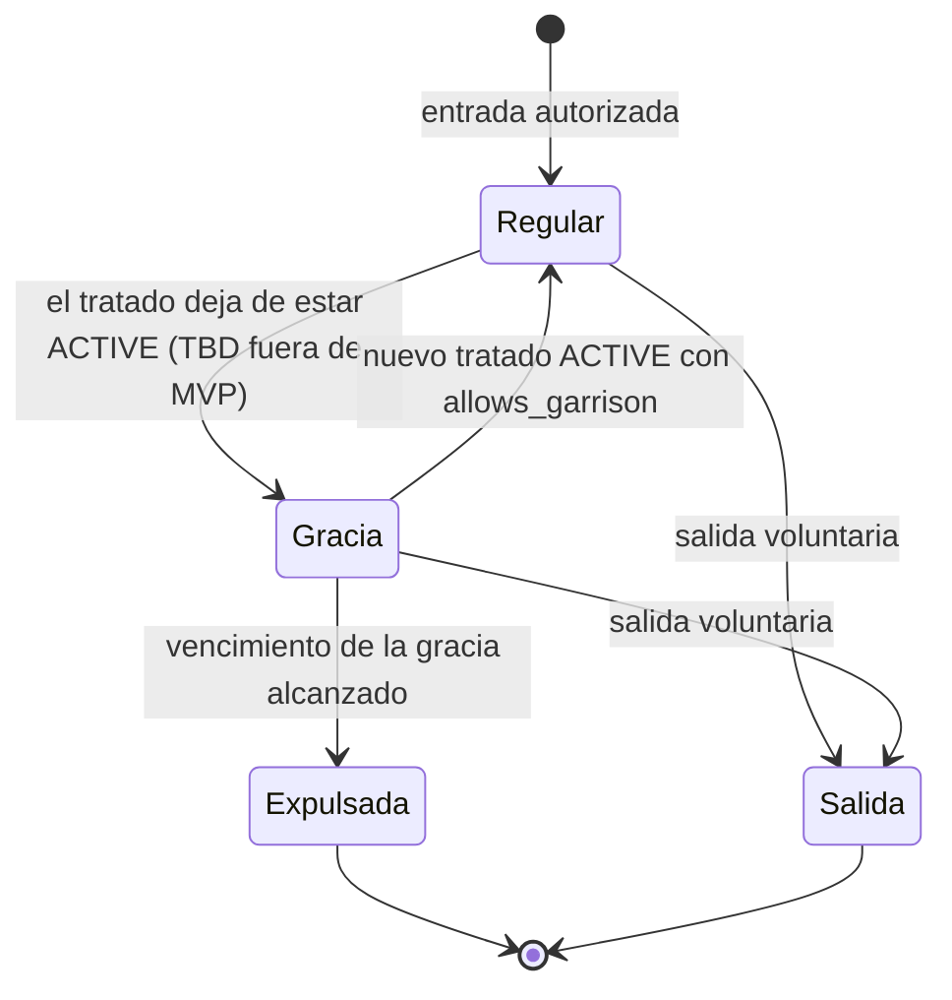

# Garrison

Especificación de la guarnición de unidades en ciudades: quién puede entrar, qué implica el estado
`GARRISONED`, cómo se sale y qué ocurre cuando el tratado que autorizaba la estancia deja de estar
vigente.

| Campo | Valor |
|---|---|
| Spec ID | `SPEC-GARRISON` |
| Estado | Draft |
| Milestone | M6 Territory, Safe Zones & Diplomacy |
| Canon | §10, §11, §12, §13, §16 |
| Depende de | [unit.md](unit.md), [city.md](city.md), [movement.md](movement.md) |
| Reemplaza a | — |

## 1. Objetivo

Guarnecer es meter una unidad **dentro** de una ciudad: la unidad abandona el tablero, deja de ser
visible y deja de ser ordenable hasta que salga. Es la primera pieza de juego que depende de la
diplomacia, porque alojar unidades de otro jugador exige un `Treaty` vigente entre ambos.

En el MVP las **tablas `garrisons` y `treaties` existen** (migración `000001_initial_schema`), el
estado `GARRISONED` existe en el dominio y en el protocolo, pero **la lógica de guarnición está
diferida**: ningún proceso del servidor escribe hoy una fila de `garrisons`. El valor de escribir
esta spec ahora es cerrar el modelo de ownership, visibilidad y autorización cruzada antes de que
existan más sistemas apoyados sobre él.

## 2. Scope

**Dentro de MVP**

- Tablas `garrisons` y `treaties`, creadas por la migración `000001_initial_schema` (canon §11:
  entidades creadas en el MVP con la lógica completa diferida).
- El valor `GARRISONED` del dominio de `units.status` (`CHECK units_status_valid`) y del enum
  `UnitStatus` de `packages/protocol`.
- El valor `GARRISONED` de `entity.despawn.payload.reason`, ya presente en el protocolo v1.
- Los códigos de error `TREATY_REQUIRED` y `UNIT_GARRISONED`, ya presentes en el catálogo de
  `packages/protocol/src/v1/errors.ts`.

**Fuera de MVP**

- **El servicio de dominio de entrada y salida de guarnición: `TBD (fuera de MVP)`.** Las reglas de
  §6 describen el diseño objetivo; no hay código que las ejecute todavía.
- Comandos de red `unit.garrison` / `unit.ungarrison`: **TBD (fuera de MVP)**. El protocolo v1 fija
  cinco comandos cliente→servidor (`session.hello`, `session.ping`, `session.view`, `unit.move`,
  `unit.cancel_move`) y ninguno guarnece.
- Diplomacia completa: proponer, aceptar, rechazar, renegociar o romper tratados desde el cliente;
  caducidad automática; notificaciones de diplomacia.
- **Expulsión diferida por ruptura de tratado: `TBD (fuera de MVP)`.** La decisión está tomada (§6.4)
  pero `garrisons` **no tiene** columna de vencimiento en la migración `000001`: implementarla exige
  una migración aditiva. Ver §10.
- Historial auditable de guarniciones cerradas: `garrisons` no conserva la fila al salir (§6.3). El
  registro histórico sería una fila en `world_events`, **TBD (fuera de MVP)**.
- Visibilidad de la composición de la guarnición para el jugador anfitrión: `city.update` no
  transporta hoy ningún campo de guarnición (§12). **TBD (fuera de MVP)**.
- Capacidad máxima de guarnición por ciudad: **TBD (fuera de MVP)**. El canon no define ningún límite
  ni variable `EO_` para ello y aquí no se inventa uno.
- Efectos defensivos de la guarnición (bonos de defensa, disparo desde murallas): dependen del
  combate, que está fuera de scope.
- Guarnición en edificios que no sean ciudades.

## 3. Actores

| Actor | Rol |
|---|---|
| Player propietario de la unidad | Ordena entrar y salir. Conserva el ownership en todo momento. |
| Player anfitrión (dueño de la ciudad) | Autoriza implícitamente vía tratado. |
| Game Server | Valida, muta el estado y decide expulsiones. Autoridad única. |
| Terceros | No ven nada de la guarnición. |

## 4. Inputs

No hay ningún input de red en el MVP: el protocolo v1 no define comando de guarnición. Los inputs
del diseño objetivo son los del servicio de dominio.

| Input | Origen | Tipo | Nota |
|---|---|---|---|
| `unitID` | Servicio de dominio / seeds / tests | `int64` (`units.id`) | Unidad a guarnecer o a sacar. |
| `cityID` | Servicio de dominio / seeds / tests | `int64` (`cities.id`) | Ciudad anfitriona. |
| `requesterID` | Sesión autenticada | `uuid` (`players.id`) | Debe coincidir con `units.player_id`. |
| `tickTime` | `Clock` inyectado del game loop | `int64` epoch ms | Instante de simulación. Nunca `time.Now()` en el dominio. |
| Estado de `treaties` | PostgreSQL | filas | Consultado en el momento de la entrada, no cacheado por unidad. |
| Capa de ocupación del mundo | RAM (`world.SetBlocked`) | overlay | Para liberar y recuperar el tile. |

Comando de red equivalente: **TBD (fuera de MVP)**.

## 5. Outputs

| Output | Destino | Cuándo |
|---|---|---|
| Fila `garrisons (unit_id, city_id, entered_at)` | PostgreSQL | Entrada. Se borra al salir. |
| `units.status`, `units.city_id`, `units.x`, `units.y`, `units.chunk_x`, `units.chunk_y` | PostgreSQL | Entrada y salida, en la misma transacción. |
| Liberación / reocupación del tile en la capa de ocupación | RAM | Entrada y salida. |
| `entity.update` | Propietario | Entrada y salida. |
| `entity.despawn { reason: "GARRISONED" }` | Terceros del chunk | Entrada. |
| `entity.spawn` | Terceros del chunk de reentrada | Salida. |
| `system.error { code, requestId }` | Solicitante | Rechazo. |
| Eventos de dominio `UnitGarrisoned` / `UnitUngarrisoned` | Bus interno | Entrada y salida. |
| Log `warn` "sin tile de reentrada" | Logs | Salida imposible por ciudad rodeada (§6.3). |

## 6. Reglas de negocio

### 6.1 Condiciones de entrada

```
puede_entrar(u, c, requester) :=
      u.player_id == requester                       -- ownership, si no UNIT_NOT_OWNED
  AND u.status == IDLE                               -- si no UNIT_NOT_MOVABLE / UNIT_GARRISONED / UNIT_DEAD
  AND existe la ciudad c                             -- si no CITY_NOT_FOUND
  AND es_adyacente(u, c)                             -- si no INVALID_TARGET
  AND ( c.owner_player_id == u.player_id             -- ciudad propia: siempre
        OR hay_tratado_activo_con_garrison(u.player_id, c.owner_player_id) )  -- si no TREATY_REQUIRED
```

| ID | Regla |
|---|---|
| `RN-GARR-001` | Ownership: solo el dueño de la unidad (`units.player_id`) puede guarnecerla o sacarla. El anfitrión nunca adquiere control. |
| `RN-GARR-002` | Solo se entra desde `IDLE`. No existe "entrar en marcha": desde `MOVING` se rechaza con `UNIT_NOT_MOVABLE`. |
| `RN-GARR-003` | La unidad debe ser adyacente a la zona urbana de la ciudad en las 8 direcciones, con la misma noción de vecindad que el movimiento (canon §4). Si no, `INVALID_TARGET`. |
| `RN-GARR-004` | Ciudad propia (`cities.owner_player_id == units.player_id`): la entrada es siempre autorizada. No requiere tratado, ni presencia, ni condición adicional. |
| `RN-GARR-005` | Ciudad ajena: se exige una fila de `treaties` entre ambos jugadores con `status = 'ACTIVE'` y `allows_garrison = true`. Si no, `TREATY_REQUIRED`. |
| `RN-GARR-006` | Lo que autoriza es el **par (`status`, `allows_garrison`)**, no el `treaty_type`. Los tres tipos (`NON_AGGRESSION`, `ALLIANCE`, `TRADE`) autorizan por igual si llevan el flag. `PROPOSED`, `EXPIRED` y `BROKEN` no autorizan nada. |
| `RN-GARR-007` | El par de jugadores de `treaties` es **canónico y ordenado**: el `CHECK treaties_canonical_pair` impone `player_a_id < player_b_id`. Toda consulta debe ordenar el par antes de buscar (`LEAST`/`GREATEST`), nunca hacer un `OR` de las dos direcciones. |
| `RN-GARR-008` | El tratado es **simétrico** en MVP: una única fila cubre ambas direcciones. Guarnición unilateral (A puede alojar en B pero no al revés) es **TBD (fuera de MVP)**. |
| `RN-GARR-009` | La protección offline de la ciudad anfitriona (`presence_state = 'PROTECTED'`) **no** bloquea la entrada de unidades del propio dueño ni de aliados con tratado: la protección es contra agresión, no contra logística. No se emite `CITY_PROTECTED` por guarnecer. |

Consulta canónica del tratado autorizante, con el par ya ordenado:

```sql
SELECT 1
  FROM treaties
 WHERE player_a_id = LEAST($1::uuid, $2::uuid)
   AND player_b_id = GREATEST($1::uuid, $2::uuid)
   AND status = 'ACTIVE'
   AND allows_garrison
 LIMIT 1;
```

### 6.2 Flujo Player A → Treaty → Player B → unidad guarnecida



Diagrama estructural de la autorización:

```
   Player A                     Treaty                      Player B
  ┌────────┐          ┌────────────────────────┐          ┌────────┐
  │ unit U │          │ status = ACTIVE        │          │ city C │
  │ owner=A│──────────│ allows_garrison = true │──────────│ owner=B│
  └────────┘          │ {A, B} canónico A < B  │          └────────┘
       │              └────────────────────────┘               │
       │                          │                            │
       └──────── U entra ─────────┴──────── U alojada en C ─────┘
                                  │
                 A conserva el ownership de U en todo momento.
                 B NUNCA puede ordenar a U (UNIT_NOT_OWNED).
```

### 6.3 Salida de la guarnición

| ID | Regla |
|---|---|
| `RN-GARR-010` | La salida siempre la ejecuta el servidor y produce `GARRISONED → IDLE`. |
| `RN-GARR-011` | Tile de reentrada: el primer tile transitable y desocupado del anillo exterior de la zona urbana, recorrido en orden estable ascendente por `(y, x)`. El mismo criterio de desempate determinista que usa el pathfinder (canon §8), para que la salida sea reproducible en tests. |
| `RN-GARR-012` | Se escriben `units.x`, `units.y`, `units.chunk_x`, `units.chunk_y` con ese tile, `status = 'IDLE'`, y la unidad vuelve a la capa de ocupación. |
| `RN-GARR-013` | La fila de `garrisons` se **borra** (`DELETE ... WHERE unit_id = $1`). La tabla del MVP no tiene columna de cierre: `garrisons.unit_id` es la PRIMARY KEY y solo modela guarniciones **abiertas**. El historial auditable es **TBD (fuera de MVP)** y su sitio natural es `world_events`. |
| `RN-GARR-014` | Si **no hay ningún tile de reentrada disponible** (ciudad completamente rodeada), la salida no falla con error: queda **pendiente**, se reintenta en la fase 5 de cada tick y se registra un log de nivel `warn`. La unidad permanece `GARRISONED`. Se prefiere el reintento silencioso a inventar un código de error nuevo o a colocar la unidad en un tile arbitrario, que rompería `INV-UNIT-001`. |

### 6.4 Ruptura del tratado con la unidad dentro — decisión

**Problema.** Una unidad de A está guarnecida en una ciudad de B gracias a un tratado. El tratado
pasa a `BROKEN` o `EXPIRED`. La condición que autorizaba la estancia ya no se cumple, pero la unidad
sigue dentro.

Tres políticas posibles:

| Política | Descripción | Por qué se descarta / se elige |
|---|---|---|
| Expulsión inmediata | Al cambiar el status del tratado, todas las unidades afectadas salen en el mismo tick. | **Descartada.** Convierte la ruptura de tratado en un arma: B rompe el tratado y vomita las unidades de A en tiles a su elección, potencialmente rodeadas. Además exige colocar N unidades a la vez, con riesgo de no encontrar tiles y de un pico de trabajo dentro del tick. |
| Permanencia indefinida | La unidad se queda hasta que su dueño decida salir. | **Descartada.** Vacía de sentido el requisito de tratado: bastaría con firmar un tratado un instante para alojar unidades para siempre. |
| **Expulsión diferida con periodo de gracia** | El tratado deja de estar `ACTIVE`, la guarnición se marca como *en gracia*, y al vencer el plazo el servidor la expulsa por el procedimiento normal de salida. | **Elegida.** |

**Decisión adoptada: expulsión diferida con periodo de gracia. Implementación `TBD (fuera de MVP)`.**

Mecánica del diseño objetivo:

| ID | Regla |
|---|---|
| `RN-GARR-015` | Cuando un tratado sale de `ACTIVE`, el servidor localiza las guarniciones abiertas entre esos dos jugadores y las marca *en gracia*. **No** cambia el estado de las unidades. |
| `RN-GARR-016` | Durante la gracia la unidad sigue `GARRISONED` con todos sus efectos: invisible, no ordenable. Su dueño puede sacarla voluntariamente en cualquier momento, y esa es la vía esperada. |
| `RN-GARR-017` | En la fase 5 de cada tick, toda guarnición en gracia con vencimiento `<= tickTime` se resuelve con el procedimiento de salida de §6.3. Si no hay tile libre, se reintenta cada tick: la expulsión es una intención persistente, no un evento de una sola oportunidad. |
| `RN-GARR-018` | La autorización se **recalcula siempre contra el estado actual de `treaties`**, nunca contra el id de un tratado antiguo. Si vuelve a existir un tratado `ACTIVE` con `allows_garrison` entre los dos jugadores, la gracia se cancela. Esto es también lo que permite que `garrisons` no necesite columna `treaty_id`. |
| `RN-GARR-019` | La guarnición en **ciudad propia** nunca entra en gracia: no depende de ningún tratado. |

**Por qué está fuera del MVP.** La tabla `garrisons` de la migración `000001` tiene exactamente tres
columnas (`unit_id`, `city_id`, `entered_at`) y **no hay dónde persistir el vencimiento de la
gracia**. Sin persistirlo, un reinicio olvidaría la expulsión. Habilitar esta mecánica exige una
migración aditiva que añada una columna de vencimiento (por ejemplo `eviction_deadline_ms bigint
NULL`), y hasta entonces la política queda documentada pero no implementada.

**Duración del periodo de gracia: TBD (fuera de MVP).** El canon §17 no define ninguna variable de
configuración para este plazo y esta spec no inventa una. Cuando se fije, debe ser un valor de
configuración con prefijo `EO_` y no una constante en el código (canon §17), y el servicio de dominio
debe aceptarlo como parámetro explícito para poder testearlo con `FakeClock`.

## 7. Estados y transiciones

La guarnición no introduce un estado nuevo: reutiliza `GARRISONED` de `units.status`, cuyo dominio
cerrado es `IDLE | MOVING | GARRISONED | HIDDEN | DEAD` (`CHECK units_status_valid`).

| Origen | Destino | Disparador | Fase del tick |
|---|---|---|---|
| `IDLE` | `GARRISONED` | Entrada autorizada (§6.1) | Fase 2 (comandos) |
| `GARRISONED` | `IDLE` | Salida voluntaria del propietario | Fase 2 (comandos) |
| `GARRISONED` | `IDLE` | Expulsión al vencer la gracia (`TBD (fuera de MVP)`) | Fase 5 (timers) |
| `GARRISONED` | `GARRISONED` | Salida solicitada sin tile de reentrada libre: se reintenta | Fase 5 (timers) |

Transiciones prohibidas: `MOVING → GARRISONED`, `HIDDEN → GARRISONED`, `GARRISONED → MOVING`,
`GARRISONED → HIDDEN`. Ver la máquina completa en [unit.md](unit.md).

Ciclo de vida de la propia guarnición (fila de `garrisons`), incluida la parte diferida:



### 7.1 Efectos del estado GARRISONED

| Efecto | Regla |
|---|---|
| **No ocupa tile del mundo** | La unidad se retira de la capa de ocupación. Su tile anterior queda libre para pathfinding y para otras unidades. `units.x`/`units.y` conservan el último tile exterior como referencia de reentrada, pero **no** representan una posición ocupada: `INV-UNIT-003` excluye explícitamente a las unidades guarnecidas. |
| **Invisible para terceros** | Al entrar se emite `entity.despawn { reason: "GARRISONED" }` a todos los observadores del chunk. Mientras esté guarnecida no aparece en `world.snapshot`, ni en `entity.spawn`, ni en ningún delta dirigido a terceros. |
| **Visible para su propietario** | Vía `entity.update`, con `status = "GARRISONED"` y `cityId` de la ciudad anfitriona. La visibilidad para el anfitrión es `TBD (fuera de MVP)`: `city.update` no transporta la composición de la guarnición (§12). |
| **No recibe órdenes de movimiento** | `unit.move` y `unit.cancel_move` se rechazan con `UNIT_GARRISONED`. No hay excepción: no existe "mover hacia la salida". La unidad debe salir primero. |
| **No se oculta ni se revela** | La fase 5 del tick ignora las unidades `GARRISONED`; el interior de una ciudad no es Safe Zone (ver [safe-zones.md](safe-zones.md)). |
| **Cuenta para la población** | Sigue viva y sigue contando contra `cities.population_limit` (canon §10). Guarnecer no es una vía para esquivar el cap. |
| **Sobrevive al offline** | El mundo persiste (canon §1.2). Desconectarse no expulsa unidades ni las devuelve al mapa. |
| **Conserva el ownership** | El anfitrión no adquiere ningún control. Cualquier comando de B sobre U devuelve `UNIT_NOT_OWNED`. |

## 8. Errores

Todos los códigos son del catálogo estable de `packages/protocol/src/v1/errors.ts` (canon §16). Esta
spec no introduce ninguno.

| Código | Cuándo |
|---|---|
| `UNIT_NOT_FOUND` | No existe `units.id`. |
| `UNIT_NOT_OWNED` | El solicitante no es `units.player_id`. Incluye el caso del anfitrión intentando mover unidades alojadas. Se comprueba **antes** que el estado. |
| `UNIT_DEAD` | `units.status = 'DEAD'`. |
| `UNIT_GARRISONED` | Cualquier comando de movimiento sobre una unidad guarnecida, o segunda entrada de una unidad ya dentro. |
| `UNIT_NOT_MOVABLE` | La unidad no está `IDLE` (típicamente `MOVING` o `HIDDEN`) al intentar entrar. |
| `CITY_NOT_FOUND` | La ciudad destino no existe. |
| `INVALID_TARGET` | La unidad no es adyacente a la zona urbana de la ciudad. |
| `TREATY_REQUIRED` | Entrada en ciudad ajena sin `Treaty` `ACTIVE` con `allows_garrison = true` entre ambos jugadores. |
| `INTERNAL_ERROR` | Fallo de la transacción de entrada o salida, o cola de comandos llena (canon §13). |

Códigos que deliberadamente **no** se emiten:

- `CITY_PROTECTED`: la protección offline no bloquea la entrada de unidades autorizadas
  (`RN-GARR-009`).
- `POPULATION_LIMIT_REACHED`: guarnecer no crea unidades. Se documenta para descartar la confusión.

## 9. Invariantes

Familia `INV-GARR-xxx`, **nueva**. Rango que ocupa esta spec: `INV-GARR-001..007`. El registro
consolidado de la familia es [../invariants/diplomacy.md](../invariants/diplomacy.md) (fichero en
redacción junto con esta spec; hasta que exista, esta tabla es la referencia).

| ID | Invariante | Dónde se verifica |
|---|---|---|
| `INV-GARR-001` | Una unidad tiene como máximo una guarnición abierta. | `garrisons.unit_id` es PRIMARY KEY (garantía física de la base de datos) + test de integración |
| `INV-GARR-002` | `units.status = 'GARRISONED'` ⟺ existe una fila de `garrisons` para esa unidad. | Misma transacción en entrada y salida + test de integración |
| `INV-GARR-003` | Existe fila de `garrisons` ⟹ `units.city_id = garrisons.city_id`. | Test de integración |
| `INV-GARR-004` | Guarnición en ciudad ajena (`units.player_id <> cities.owner_player_id`) ⟹ existía un `Treaty` `ACTIVE` con `allows_garrison = true` entre ambos en el instante de la entrada. | Test de simulación en el momento de la entrada |
| `INV-GARR-005` | Ninguna unidad `GARRISONED` figura en la capa de ocupación del mundo. Es la materialización de `INV-UNIT-003` para este subsistema. | Test de simulación |
| `INV-GARR-006` | Ninguna unidad `GARRISONED` aparece en un delta dirigido a un jugador distinto de su propietario. | Test de integración de visibilidad |
| `INV-GARR-007` | El ownership (`units.player_id`) de una unidad guarnecida no cambia al entrar ni al salir. | Unit test |

Invariante que **no** se declara todavía: la coherencia entre gracia y tratado vigente, porque la
gracia no tiene columna donde vivir (§6.4). Se añadirá como `INV-GARR-008` en la misma migración
aditiva que introduzca el vencimiento.

## 10. Persistencia

Respuesta a las cuatro preguntas del canon §12.

| Dato | Autoritativo en | Estrategia |
|---|---|---|
| Entrada y salida de guarnición (`garrisons` + `units.status` + `units.city_id` + `units.x/y/chunk_x/chunk_y`) | PostgreSQL | **Write-through transaccional**: la fila de `garrisons` y la mutación de `units` van en la **misma transacción**; un estado a medias violaría `INV-GARR-002`. Igual que el resto de escrituras durables, la transacción se **encola** en la cola de persistencia y la ejecuta un worker fuera del tick: el tick nunca hace I/O contra PostgreSQL. |
| Estado de los tratados (`treaties`) | PostgreSQL | Write-through transaccional por el mismo camino. |
| Índice en RAM de guarniciones abiertas por ciudad | RAM | **Reconstruible** al arrancar leyendo `garrisons` (índice `garrisons_city_idx`). No se persiste. |
| Tile de reentrada | — | **No se persiste**: se calcula al salir, contra el estado real de ocupación. |
| Vencimiento de la gracia | — | **No existe columna en el MVP** (§6.4). Mientras no exista, un reinicio no puede recordar una expulsión pendiente, y por eso la mecánica está `TBD (fuera de MVP)` en lugar de implementada a medias. |

Nada de este subsistema usa dirty-flag + flush: una guarnición a medio escribir es un estado
inconsistente observable, no una magnitud que tolere perder unos segundos.

DDL real de la migración `000001_initial_schema` (el DDL canónico completo vive en
[../database/schema.md](../database/schema.md)):

```sql
CREATE TABLE garrisons (
    unit_id    bigint      PRIMARY KEY REFERENCES units (id) ON DELETE CASCADE,
    city_id    bigint      NOT NULL REFERENCES cities (id) ON DELETE CASCADE,
    entered_at timestamptz NOT NULL DEFAULT now()
);

CREATE INDEX garrisons_city_idx ON garrisons (city_id);
```

Consecuencias que esta spec asume y que no debe contradecir:

- `unit_id` es la PRIMARY KEY: modela **guarniciones abiertas**, una como máximo por unidad
  (`INV-GARR-001`), y no hay fila para guarniciones cerradas.
- El instante de entrada es `entered_at timestamptz`, no un `*_time_ms`. La aritmética del juego no
  depende de él en MVP; cuando dependa, la migración aditiva deberá añadir su `entered_time_ms`.
- No hay `treaty_id`, ni `owner_player_id`, ni `host_player_id`: el propietario se obtiene por join
  con `units.player_id` y el anfitrión con `cities.owner_player_id`. La autorización se recalcula
  contra `treaties` (`RN-GARR-018`), no se congela en la fila.
- El borrado de una unidad o de una ciudad arrastra la guarnición (`ON DELETE CASCADE`).

`treaties`, campos relevantes aquí:

| Campo | Valores / forma |
|---|---|
| `player_a_id`, `player_b_id` | `uuid REFERENCES players (id)`, con `CHECK treaties_canonical_pair (player_a_id < player_b_id)` y `CHECK treaties_distinct_players (player_a_id <> player_b_id)` |
| `treaty_type` | `NON_AGGRESSION` \| `ALLIANCE` \| `TRADE` (`CHECK treaties_type_valid`) |
| `status` | `PROPOSED` \| `ACTIVE` \| `EXPIRED` \| `BROKEN` (`CHECK treaties_status_valid`) |
| `allows_garrison` | `boolean NOT NULL DEFAULT false` |
| `proposed_at`, `accepted_at`, `expires_at`, `broken_at` | `timestamptz`; solo `proposed_at` es `NOT NULL` |

Índice `treaties_one_active_per_pair_and_type` (único parcial sobre
`(player_a_id, player_b_id, treaty_type) WHERE status = 'ACTIVE'`): como máximo un tratado vigente de
cada tipo entre dos jugadores. Solo `ACTIVE` habilita la guarnición; el resto del ciclo de vida del
tratado pertenece a la diplomacia, diferida.

## 11. Eventos

Eventos de dominio (canon §15, hechos en pasado): `UnitGarrisoned`, `UnitUngarrisoned`. Alimentan los
deltas de red. `GarrisonEvictionScheduled` y `UnitEvicted` pertenecen a la mecánica de gracia y son
**TBD (fuera de MVP)**.

Su escritura en `world_events` (`event_type`, `tick`, `player_id`, `payload jsonb`) es
**TBD (fuera de MVP)**: sería también la vía para el historial auditable que `garrisons` ya no
conserva (`RN-GARR-013`).

## 12. Contratos de red

Mensajes servidor→cliente, todos existentes en el protocolo v1; los payloads los fija Zod en
`packages/protocol/src/v1/` y son la autoridad.

| Situación | Propietario | Terceros del chunk |
|---|---|---|
| Entrada | `entity.update { id, status: "GARRISONED", cityId }` | `entity.despawn { id, reason: "GARRISONED" }` |
| Salida / expulsión | `entity.update { id, status: "IDLE", x, y, cityId }` | `entity.spawn { unit }` |
| Comando rechazado | `system.error { code: "TREATY_REQUIRED" \| "UNIT_GARRISONED" \| …, requestId }` | — |

Precisiones que el protocolo v1 impone y esta spec acata:

- `entity.despawn.payload.reason` tiene el valor `GARRISONED` en el enum
  (`OUT_OF_INTEREST | DEAD | GARRISONED | HIDDEN | REMOVED`). No se usa `OUT_OF_INTEREST`, que sería
  semánticamente falso, ni `DEAD`, que haría al cliente reproducir efectos de destrucción.
- `entity.spawn.payload` es `{ unit }` y **no lleva campo `reason`**: la reaparición al salir de la
  guarnición es indistinguible, para el cliente, de una entrada en el área de interés. Añadir un
  motivo de spawn sería un cambio de protocolo, `TBD (fuera de MVP)`.
- `city.update.payload` es `{ id, name?, population?, populationLimit?, presenceState?,
  protectionUntilMs? }`: **no transporta la guarnición**. Que el anfitrión vea qué unidades aloja
  exige un campo o un mensaje nuevo, `TBD (fuera de MVP)`.
- Los ids durables (`unitId`, `cityId`) viajan como **número** JSON: `EntityId` es
  `z.number().int().min(1).max(Number.MAX_SAFE_INTEGER)`.

Los comandos cliente→servidor de guarnición son **TBD (fuera de MVP)**; cuando se añadan, entrarán
por el mismo camino de validación e idempotencia que `unit.move` (`requestId` reservado con `SETNX`
en Redis bajo la clave `idem:{playerId}:{requestId}` y respaldado por la tabla `idempotency_keys`).
Detalle en [websocket-protocol.md](websocket-protocol.md).

## 13. Tests esperados

Todos los tests de esta sección están **pendientes**: describen el diseño objetivo, no una suite
existente. Los tests de integración exigen PostgreSQL y Redis reales (`EO_INTEGRATION=1`) y hoy no se
ejecutan porque el daemon de Docker no está disponible en la máquina de desarrollo.

**Unit (dominio puro, `FakeClock`)**

- Ciudad propia: entrada autorizada sin consultar tratados (`RN-GARR-004`).
- Ciudad ajena sin tratado ⟹ `TREATY_REQUIRED` (`RN-GARR-005`).
- Ciudad ajena con tratado en cada status (`PROPOSED`, `ACTIVE`, `EXPIRED`, `BROKEN`) × cada valor de
  `allows_garrison`: solo (`ACTIVE`, `true`) autoriza. Ocho casos, tabla explícita (`RN-GARR-006`).
- Los tres `treaty_type` con `allows_garrison = true` y `status = 'ACTIVE'` autorizan por igual: el
  tipo no es la condición (`RN-GARR-006`).
- El par de jugadores se ordena antes de consultar: buscar (B, A) encuentra la fila (A, B)
  (`RN-GARR-007`).
- Entrada desde `MOVING` ⟹ `UNIT_NOT_MOVABLE`; desde `GARRISONED` ⟹ `UNIT_GARRISONED`; desde `DEAD`
  ⟹ `UNIT_DEAD` (`RN-GARR-002`).
- `unit.move` sobre unidad guarnecida ⟹ `UNIT_GARRISONED` (también `unit.cancel_move`).
- El anfitrión intentando mover una unidad alojada ⟹ `UNIT_NOT_OWNED`, no `UNIT_GARRISONED`: el
  ownership se comprueba antes que el estado (`RN-GARR-001`).
- Salida: elección determinista del tile de reentrada por orden `(y, x)`; con el primer candidato
  ocupado se elige el siguiente (`RN-GARR-011`).

**Simulation (loop determinista)**

- Entrada y salida completas: la unidad desaparece de la capa de ocupación y vuelve a ella con el
  tile esperado (`INV-GARR-005`).
- Ciudad rodeada sin tiles libres: la unidad permanece `GARRISONED` y el intento se repite cada tick
  sin errores ni panics (`RN-GARR-014`).
- Guarnición en ciudad propia: nunca depende de tratados (`RN-GARR-019`).
- Expulsión diferida (`RN-GARR-015..018`): **pendiente de la migración aditiva** de §6.4.

**Integration (PostgreSQL + Redis reales, `EO_INTEGRATION=1`)**

- Atomicidad: fallo forzado tras insertar en `garrisons` ⟹ ni la fila ni el cambio de `units.status`
  quedan en la base (`INV-GARR-002`).
- PRIMARY KEY de `garrisons`: dos guarniciones abiertas para la misma unidad son rechazadas por la
  base de datos (`INV-GARR-001`).
- `ON DELETE CASCADE`: borrar la unidad o la ciudad elimina la fila de `garrisons`.
- Visibilidad: tres sesiones (propietario, anfitrión, tercero). Al guarnecer, el tercero recibe
  `entity.despawn { reason: "GARRISONED" }` y ningún mensaje posterior menciona la unidad
  (`INV-GARR-006`).

**Contract**

- `entity.despawn` con `reason = "GARRISONED"` valida contra el JSON Schema exportado por
  `packages/protocol`.

**Recovery**

- Reinicio con guarniciones abiertas: el índice en RAM se reconstruye desde `garrisons` y ninguna
  unidad guarnecida reaparece en la capa de ocupación (`INV-GARR-005`).

## 14. Documentos relacionados

- [unit.md](unit.md) — máquina de estados, ownership y transiciones prohibidas.
- [safe-zones.md](safe-zones.md) — la otra vía de invisibilidad y por qué no se componen.
- [city.md](city.md) — zona urbana, adyacencia y protección offline.
- [movement.md](movement.md) — por qué una unidad guarnecida no tiene origen de path.
- [websocket-protocol.md](websocket-protocol.md) — envelopes, límites e idempotencia.
- [../database/schema.md](../database/schema.md) — DDL de `garrisons` y `treaties`.
- [../invariants/diplomacy.md](../invariants/diplomacy.md) — registro de la familia `INV-GARR-*`.
