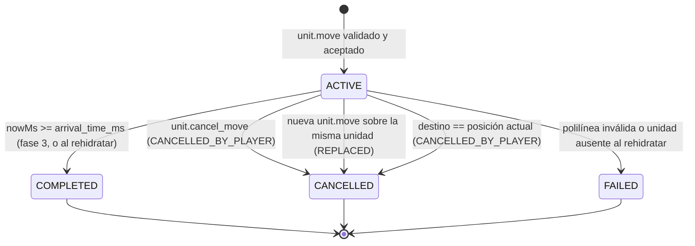

# Especificación funcional: Movimiento de unidades

Define de forma completa y verificable cómo una unidad se desplaza por el mundo de Empires Online: qué envía el cliente, qué valida y decide el servidor, cómo se construye y persiste la polilínea temporizada, y por qué el modelo hace estructuralmente imposible que el cliente teletransporte una unidad.

| Campo | Valor |
|---|---|
| Spec ID | `SPEC-MOVEMENT` |
| Estado | Implemented |
| Milestone | M4 Movement |
| Canon | §2, §6, §7, §8, §12, §13, §16 |
| Depende de | [unit.md](unit.md), [player.md](player.md), [websocket-protocol.md](websocket-protocol.md) |
| Reemplaza a | — |

> **Nota de estado.** El código existe en `services/game-server` y sus tests unitarios, de simulación
> y de contrato están en verde. Los tests de **integración** (PostgreSQL + Redis reales) están
> diseñados pero **no ejecutados**: el daemon de Docker no arranca en la máquina de desarrollo actual.
> Ver [../operations/local-development.md](../operations/local-development.md).

Documentos relacionados: [../architecture/pathfinding.md](../architecture/pathfinding.md) · [../architecture/game-loop.md](../architecture/game-loop.md) · [../architecture/persistence.md](../architecture/persistence.md) · [websocket-protocol.md](websocket-protocol.md) · [../database/schema.md](../database/schema.md) · [../decisions/ADR-011-movement-timed-polyline.md](../decisions/ADR-011-movement-timed-polyline.md) · [../invariants/movement.md](../invariants/movement.md)

---

## 1. Objetivo

Permitir que un jugador ordene a una unidad de su propiedad desplazarse a un tile de destino, y que el servidor —única autoridad— determine la ruta, el tiempo de recorrido y la posición de la unidad en cualquier instante, de forma **determinista**, **persistente** y **reconstruible sin replay de ticks**.

El movimiento es el primer *vertical slice* completo del proyecto (milestone **M4**) y el banco de pruebas de los cuatro principios del canon: servidor autoritativo, mundo persistente, capas de estado y determinismo.

Código de referencia: `internal/domain/movement/{path.go,movement.go}` (dominio puro),
`internal/game/simulation/simulation.go` (`handleMoveUnit`, `handleCancelMovement`, `AdvanceMovements`),
`internal/game/simulation/recovery.go` (`Hydrate`) y `internal/persistence/postgres/movements.go`.

---

## 2. Scope y no-scope

### En scope (MVP)

- Comando `unit.move` con destino único.
- Comando `unit.cancel_move`.
- Cálculo de ruta con A\* de 8 direcciones (ver [../architecture/pathfinding.md](../architecture/pathfinding.md)).
- Construcción, difusión y persistencia diferida de la **polilínea temporizada**.
- Avance de la unidad en la fase 3 del tick y detección de llegada.
- Cancelación del movimiento anterior al recibir una orden nueva sobre una unidad ya en movimiento.
- Supervivencia a desconexión del cliente y a reinicio del servidor, incluido el caso de `arrival_time_ms` ya vencido.
- Unidad soportada en MVP: `VILLAGER` (`baseMsPerTile = 600`).

### Fuera de MVP (no documentar como existente)

| Tema | Estado |
|---|---|
| Movimiento de grupo / formaciones | Fuera de MVP |
| Colisión entre unidades (dos unidades pueden ocupar el mismo tile) | Fuera de MVP |
| Recálculo automático de ruta si el terreno se bloquea durante el trayecto | Fuera de MVP |
| Órdenes encoladas (waypoints múltiples, patrullas) | Fuera de MVP |
| Movimiento naval sobre WATER | Fuera de MVP (canon §5) |
| Interrupción del movimiento por combate | Fuera de MVP (canon §6 fase 4 reservada) |
| Modificadores de velocidad por tecnología o civilización | Fuera de MVP |
| Búsqueda del tile libre más cercano si el destino está bloqueado | Fuera de MVP (canon §8: se rechaza) |
| Cota dura de waypoints por polilínea | `TBD (fuera de MVP)` — ver RN-MOVE-014 |
| Registro del movimiento en `world_events` | Fuera de MVP: la tabla y su repositorio existen, pero el subsistema de movimiento no escribe en ella |
| Validación del mensaje entrante contra el JSON Schema **en tiempo de ejecución** | Fuera de MVP: los esquemas embebidos alimentan los *contract tests*, no el camino caliente |
| Movimiento de `TOWN_CENTER` | No aplica: es un *building*, no una unidad (canon §10) |

---

## 3. Actores

| Actor | Rol | Puede |
|---|---|---|
| **Jugador propietario** | Emite intención | `unit.move`, `unit.cancel_move` sobre sus propias unidades |
| **Otros jugadores en el área de interés** | Observadores | Reciben `unit.movement.started` / `.completed` / `.cancelled` y `entity.update` de unidades visibles |
| **Game Server (loop)** | Autoridad | Valida, calcula ruta, crea/cancela/completa movimientos, avanza posiciones |
| **Pathfinder** | Servicio interno | Devuelve una secuencia de tiles contiguos; no conoce unidades ni tiempos |
| **Persistence worker** | Servicio interno | Ejecuta las transacciones de `unit_movements` y `units` **fuera** del tick |
| **Clock** | Servicio inyectado | Fuente única de tiempo (`FakeClock` en tests); prohibido `time.Now()` en el dominio |

---

## 4. Inputs

### 4.1 `unit.move` (cliente → servidor)

```json
{
  "v": 1,
  "type": "unit.move",
  "requestId": "3f2a8c14-6b7e-4d51-9a03-1c5e77bb2d90",
  "payload": {
    "unitId": 4821,
    "target": { "x": 14, "y": 11 }
  }
}
```

| Campo | Tipo | Reglas |
|---|---|---|
| `requestId` | UUID | Obligatorio en comandos. Clave de idempotencia; si falta, `INVALID_MESSAGE` |
| `payload.unitId` | integer | `bigint` de `units.id`. Serializado como **número** JSON (`EntityId` de `packages/protocol` es `z.number().int()`); en MVP siempre < 2⁵³ |
| `payload.target.x` | integer | `int32`, `0 ≤ x < EO_WORLD_WIDTH` |
| `payload.target.y` | integer | `int32`, `0 ≤ y < EO_WORLD_HEIGHT` |

**El cliente envía únicamente el destino.** No envía ruta, ni posiciones intermedias, ni ETA, ni velocidad
(`INV-MOVE-011`). Los esquemas cliente→servidor de `@empires-online/protocol` son **estrictos**
(`additionalProperties: false`), así que un campo extra se rechaza en la frontera TypeScript. El game server
decodifica el `payload` con `encoding/json` y lo que no encaje produce `INVALID_MESSAGE`; la validación
contra el JSON Schema embebido se ejerce hoy en los *contract tests*, no en cada mensaje.

### 4.2 `unit.cancel_move` (cliente → servidor)

```json
{
  "v": 1,
  "type": "unit.cancel_move",
  "requestId": "9d1b0f62-2c44-4e0a-b7d5-8a6e3f01c722",
  "payload": { "unitId": 4821 }
}
```

### 4.3 Configuración que participa

| Variable | Por defecto | Uso en esta spec |
|---|---|---|
| `EO_TICK_RATE_HZ` | 10 | Granularidad de la emisión de posición (100 ms) |
| `EO_PATHFINDING_MAX_DISTANCE` | 256 | Distancia Chebyshev máxima origen→destino; se comprueba **antes** de expandir un solo nodo |
| `EO_PATHFINDING_MAX_NODES` | 20000 | Nodos expandidos máximos por consulta |
| `EO_WS_MAX_MESSAGE_BYTES` | 16384 | `SetReadLimit` de la conexión: acota el mensaje **entrante** |
| `EO_PERSISTENCE_FLUSH_INTERVAL_TICKS` | 50 | Volcado periódico de la posición consolidada (5 s a 10 Hz) |
| `EO_INTEREST_RADIUS_CHUNKS` | 2 | Radio de suscripción por chunk que decide quién ve los eventos |

`baseMsPerTile` **no** es configuración de entorno: es una propiedad del catálogo de unidades
(`internal/domain/unit`, `Definition.BaseMsPerTile`), fijada en `600` para `VILLAGER`.

---

## 5. Outputs

| Mensaje | Destinatario | Cuándo |
|---|---|---|
| `unit.move.accepted` | solo el emisor (lleva `requestId`) | El comando pasó todas las validaciones; también en el caso «ya estás ahí» (RN-MOVE-006) |
| `unit.move.rejected` | solo el emisor (lleva `requestId`) | Fallo de validación de dominio; incluye `code` del catálogo de errores (§8) |
| `unit.movement.started` | suscritos al chunk **de origen** de la unidad | Movimiento creado; lleva la polilínea completa |
| `unit.movement.completed` | suscritos al chunk **de llegada** | La unidad alcanzó el último waypoint |
| `unit.movement.cancelled` | suscritos al chunk **donde se detuvo** | Cancelación explícita, supersesión o «ya estás ahí» |
| `entity.update` | suscritos al chunk de la nueva posición | En cada tick en que el waypoint alcanzado cambia (fase 3) |
| `system.error` | solo el emisor | Fallos de transporte/sesión y de `unit.cancel_move`: `INVALID_MESSAGE`, `RATE_LIMITED`, `UNSUPPORTED_VERSION`, `UNIT_NOT_FOUND`, `UNIT_NOT_OWNED` |

**Regla de encaminamiento de errores.** Los fallos de transporte y de sesión se responden con `system.error`.
Los fallos de dominio de `unit.move` se responden con `unit.move.rejected`, que también transporta un `code`
estable. `unit.cancel_move` es la excepción documentada: sus dos fallos de dominio viajan hoy en
`system.error`, no en un mensaje de rechazo propio. Un cliente correcto trata todos los casos por `code`,
nunca por el texto humano.

---

## 6. Reglas de negocio

### 6.1 Secuencia de validación de `unit.move`

El servidor valida en **orden fijo** y se detiene en el primer fallo. El orden importa: es lo que hace que los
tests de error sean deterministas y que no se filtre información sobre unidades ajenas (se comprueba propiedad
antes que estado). El orden que sigue es exactamente el de `handleMoveUnit`.

**Capa de transporte y de sesión** (`internal/websocket/server.go`, antes de encolar el comando):

| # | Regla | Comprobación | Fallo → código | Respuesta |
|---|---|---|---|---|
| RN-MOVE-001 | Tamaño | El marco entrante no supera `EO_WS_MAX_MESSAGE_BYTES` (`SetReadLimit`) | — | La lectura falla y la **conexión se cierra**; no se emite ningún payload de error |
| RN-MOVE-002 | Tasa | Token bucket `EO_WS_RATE_LIMIT_PER_SECOND` (20/s, burst 40) | `RATE_LIMITED` | `system.error` y cierre inmediato `4429` |
| RN-MOVE-003 | Envelope | JSON parseable, `v == 1`, `type` en el catálogo cerrado de comandos | `INVALID_MESSAGE` / `UNSUPPORTED_VERSION` | `system.error`; la conexión sigue abierta |
| RN-MOVE-004 | Payload | `payload` decodifica a `{unitId, target:{x,y}}` y `requestId` no está vacío | `INVALID_MESSAGE` | `system.error` |
| RN-MOVE-005 | Idempotencia | `SETNX idem:{playerId}:{requestId}` (TTL 300 s) en Redis | — | Si la clave ya existía, el comando se **descarta en silencio**: no se re-ejecuta y **no se reenvía** la respuesta original (ver la nota al final de §12). Si Redis no responde, el comando **se ejecuta igualmente**: se prefiere jugar a bloquear al jugador |

La autenticación no aparece como paso por mensaje: el handshake `session.hello` ocurre **antes** del bucle de
lectura, así que toda orden que llega a este punto pertenece a una sesión ya autenticada (cierre `4401` en caso
contrario).

**Capa de dominio** (`handleMoveUnit`, fase 2 del tick):

| # | Regla | Comprobación | Fallo → código |
|---|---|---|---|
| RN-MOVE-006 | Existencia | `units.id = unitId` está en el estado en RAM | `UNIT_NOT_FOUND` |
| RN-MOVE-007 | Propiedad | `units.player_id == session.playerId` (`EnsureOwnedBy`) | `UNIT_NOT_OWNED` |
| RN-MOVE-008 | Estado | `EnsureCanMove()`: `IDLE`, `MOVING` y **`HIDDEN` sí pueden moverse**; `DEAD` y `GARRISONED` no | `UNIT_DEAD` / `UNIT_GARRISONED` / `UNIT_NOT_MOVABLE` |
| RN-MOVE-009 | Límites | `world.TileInBounds(target)` | `TARGET_OUT_OF_BOUNDS` |
| RN-MOVE-010 | Transitabilidad | `world.IsWalkable(target)`: terreno transitable **y** libre en el *blocked overlay* | `TARGET_NOT_WALKABLE` |
| RN-MOVE-011 | Destino == origen | Si `PositionAt(now) == target`, **se acepta sin crear movimiento** (§6.2) | — (éxito) |
| RN-MOVE-012 | Catálogo | `unit.Lookup(u.Type)` devuelve la definición del tipo | `INTERNAL_ERROR` |
| RN-MOVE-013 | Ruta | `Pathfinder.FindPath` con `MaxNodes` y `MaxDistance` | `TARGET_OUT_OF_BOUNDS` / `TARGET_NOT_WALKABLE` / `PATH_TOO_LONG` / `PATH_NOT_FOUND` / `INTERNAL_ERROR` |
| RN-MOVE-014 | Polilínea | `BuildTimedPath(tiles, world, baseMsPerTile)` valida contigüidad y transitabilidad | `INTERNAL_ERROR` |
| RN-MOVE-015 | Sustitución | Se cancela el movimiento anterior (`REPLACED`) **antes** de registrar el nuevo | — |
| RN-MOVE-016 | Creación | Se crea el movimiento en RAM, `units.status = MOVING`, se marca *dirty* y se **encola** la escritura durable | — |

Notas de diseño sobre reglas concretas:

- **RN-MOVE-008: `HIDDEN` se mueve.** Una unidad oculta en una SafeZone puede recibir una orden de movimiento;
  moverse es precisamente lo que la revela. `EnsureCanMove` devuelve `nil` para `HIDDEN`. `UNIT_NOT_MOVABLE`
  queda reservado al caso `default`: un `status` fuera del dominio conocido.
- **RN-MOVE-013 y el orden interno de A\*.** `FindPath` comprueba, en este orden: destino dentro del mundo,
  origen dentro del mundo, origen transitable (`ErrOriginNotWalkable` → `INTERNAL_ERROR`), destino transitable,
  **distancia Chebyshev ≤ `MaxDistance`** y sólo entonces expande nodos. La cota de distancia se aplica
  **antes** de la búsqueda, con cero nodos expandidos, tal y como exige
  [../architecture/pathfinding.md](../architecture/pathfinding.md).
- **`INVALID_TARGET` no participa en el movimiento.** El código existe en el catálogo de errores, pero
  `handleMoveUnit` no lo emite en ningún camino: el destino igual al origen se **acepta** (RN-MOVE-011) y el
  destino malformado se rechaza antes, en `INVALID_MESSAGE`.
- **No existe una cota de tamaño serializado de la polilínea.** `EO_WS_MAX_MESSAGE_BYTES` se aplica sólo a la
  lectura (`SetReadLimit`); el camino de salida no comprueba el tamaño del mensaje ni el número de waypoints.
  Una cota dura de waypoints es `TBD (fuera de MVP)`, coherente con ADR-011.
- **RN-MOVE-010 es coherente con el canon §8:** el MVP **no** busca un tile transitable cercano.

### 6.2 Moverse al tile donde ya estás

Es un caso especial explícito, no un rechazo:

```go
origin := s.authoritativePosition(u, nowMs)
if origin == cmd.Target {
    s.cancelActiveMovement(u, movement.ReasonCancelledByPlayer, nowMs)
    // unit.move.accepted con movementId = 0
    return
}
```

Consecuencias observables, verificadas por `TestMoverseAlSitioDondeYaEstas`:

1. Se responde `unit.move.accepted` al emisor, con `movementId = 0`.
2. **No se crea polilínea** ni fila en `unit_movements`: una ruta de un solo punto tendría
   `arrival_time_ms == start_time_ms` y rompería la monotonía de `tMs` (`INV-MOVE-003`).
3. **No se emite `unit.movement.started`.**
4. Si la unidad venía moviéndose, su movimiento se cancela con razón `CANCELLED_BY_PLAYER` y queda `IDLE` en el
   tile donde estaba: ordenar «ve a donde ya estás» es la forma canónica de detenerse en seco.

El pathfinder admite el caso degenerado `from == to` (devuelve una ruta de un único tile), pero el dominio no
llega a invocarlo. Este comportamiento es `INV-MOVE-014`.

### 6.3 Construcción de la polilínea temporizada

El pathfinder devuelve una lista de tiles sin tiempos, **incluido el tile de origen** como primer elemento. El
dominio la convierte en una **polilínea temporizada**: un array de waypoints `{x, y, tMs}` donde `tMs` es el
offset en milisegundos desde `start_time_ms` en el que la unidad **alcanza** ese tile.

1. El primer waypoint es el **origen**, con `tMs = 0` (`INV-MOVE-002`).
2. El coste temporal de cada segmento se calcula con **aritmética entera**, nunca en punto flotante:

```go
// internal/domain/movement/path.go
const sqrt2Num, sqrt2Den int64 = 1414214, 1000000   // √2 en punto fijo
// world.CostBase = 10

func StepDurationMs(baseMsPerTile int64, costUnits int32, diagonal bool) int64 {
    if costUnits <= 0 {
        return 0
    }
    base := int64(world.CostBase)
    ms := (baseMsPerTile*int64(costUnits) + base/2) / base   // redondeo al ms más cercano
    if diagonal {
        ms = (ms*sqrt2Num + sqrt2Den/2) / sqrt2Den           // redondeo al ms más cercano
    }
    if ms < 1 {
        ms = 1 // ningún paso puede ser instantáneo
    }
    return ms
}
```

3. `tMs` de un waypoint = suma acumulada de los `segmentMs` de todos los segmentos anteriores.
4. `arrival_time_ms = start_time_ms + tMs(último waypoint)` (`INV-MOVE-005`).

**Redondeo (`INV-MOVE-013`).** Se redondea **cada segmento al milisegundo más cercano y sólo después se
acumula**. Truncar regalaría un sesgo sistemático a favor de la unidad: mil pasos truncados regalarían casi un
segundo. Como todo el cálculo es entero, dos ejecuciones idénticas producen exactamente los mismos
milisegundos en cualquier plataforma; con punto flotante el resultado sería «casi siempre» igual, y «casi
siempre» no sirve para una simulación reproducible.

**El coste se toma del tile de DESTINO del segmento**, nunca del de origen. Entrar en un bosque cuesta lo que
cuesta el bosque. El coste se expresa en `costUnits`, décimas del coste base (`world.CostBase = 10`).

Duraciones de paso para `VILLAGER` (`baseMsPerTile = 600`), verificadas por `TestDuracionDeUnPaso`:

| Terreno | `costUnits` | Ortogonal | Diagonal |
|---|---|---|---|
| GRASSLAND | 10 | **600** | **849** |
| FOREST | 16 | **960** | **1358** |
| HILL | 18 | **1080** | **1527** |
| ROAD | 6 | **360** | **509** |

### 6.4 Ejemplo numérico canónico

Es el mismo del test `TestEjemploNumericoCanonico`. **Cualquier documento que ilustre la aritmética del
movimiento debe usar exactamente este ejemplo.**

Unidad `VILLAGER` (`baseMsPerTile = 600`), `unitId = 4821`, `start_time_ms = 1770000000000`.
Ruta devuelta por A\*: `(0,0) → (1,0) → (2,1) → (3,1) → (4,1)`.

| # | Segmento | Diagonal | Terreno destino | `costUnits` | Aritmética | `segmentMs` | `tMs` acumulado |
|---|---|---|---|---|---|---|---|
| 0 | — | — | — | — | origen | — | **0** |
| 1 | (0,0) → (1,0) | no | GRASSLAND | 10 | `(600·10 + 5) / 10` | 600 | **600** |
| 2 | (1,0) → (2,1) | **sí** | GRASSLAND | 10 | `(600·1414214 + 500000) / 1000000` | 849 | **1449** |
| 3 | (2,1) → (3,1) | no | FOREST | 16 | `(600·16 + 5) / 10` | 960 | **2409** |
| 4 | (3,1) → (4,1) | no | ROAD | 6 | `(600·6 + 5) / 10` | 360 | **2769** |

```json
[
  { "x": 0, "y": 0, "tMs": 0 },
  { "x": 1, "y": 0, "tMs": 600 },
  { "x": 2, "y": 1, "tMs": 1449 },
  { "x": 3, "y": 1, "tMs": 2409 },
  { "x": 4, "y": 1, "tMs": 2769 }
]
```

- `start_time_ms  = 1770000000000`
- `arrival_time_ms = 1770000000000 + 2769 = 1770000002769`

Observaciones que un implementador debe interiorizar:

- El segmento 2 es diagonal y **más caro** que el 1 pese a ser el mismo terreno: `849` frente a `600`.
- El segmento 3 (FOREST, ortogonal) cuesta `960`, más que la diagonal por pradera. El coste dominante es el
  terreno, no la diagonal.
- El segmento 4 (ROAD) cuesta `360`: la carretera es el único terreno del MVP más barato que la base.
- Una diagonal hacia FOREST costaría `((600·16+5)/10 · 1414214 + 500000) / 1000000 = 1358`.

### 6.5 Función de posición autoritativa

```go
// internal/domain/movement/path.go
// PositionAt devuelve la posición AUTORITATIVA en el instante indicado, expresado
// como offset en milisegundos desde el inicio del movimiento. Función PURA.
func (p TimedPath) PositionAt(elapsedMs int64) world.Tile {
	if len(p) == 0 {
		return world.Tile{}
	}
	if elapsedMs <= 0 {
		return p[0].Tile()
	}
	if elapsedMs >= p[len(p)-1].TMs {
		return p[len(p)-1].Tile()
	}
	// Búsqueda binaria del último waypoint con TMs <= elapsedMs.
	lo, hi := 0, len(p)-1
	for lo < hi {
		mid := (lo + hi + 1) / 2
		if p[mid].TMs <= elapsedMs {
			lo = mid
		} else {
			hi = mid - 1
		}
	}
	return p[lo].Tile()
}

// Movement.PositionAt traduce el instante absoluto a offset.
func (m *Movement) PositionAt(nowMs int64) world.Tile {
	return m.Path.PositionAt(nowMs - m.StartTimeMs)
}
```

`IndexAt` es su gemela y devuelve el índice del waypoint alcanzado. Propiedades:

- **Analítica, no simulada.** No requiere replay de ticks. Un servidor que arranca tras 6 horas de caída
  obtiene la posición correcta con una búsqueda binaria de `O(log L)` (`INV-MOVE-009`).
- **Monótona.** Para `T1 < T2` el índice devuelto nunca decrece. La unidad no retrocede.
- **Independiente del tick rate.** Cambiar `EO_TICK_RATE_HZ` altera la frecuencia de las notificaciones, no la
  trayectoria ni el tiempo de llegada.
- **Sin `time.Now()`.** El instante se pasa como argumento; en producción proviene de `Clock.NowMs()`, en tests
  de `FakeClock`.
- **El servidor razona siempre en tiles completos.** Una unidad nunca está «entre» dos tiles; la interpolación
  sub-tile es exclusivamente visual y vive en el cliente.

### 6.6 Creación del movimiento, avance y llegada

**Creación** (fase 2 del tick, `handleMoveUnit`):

1. `start_time_ms = Clock.NowMs()` **leído al aplicar el comando**, dentro de la fase 2. No es el instante en
   que el handler WebSocket recibió el mensaje: el comando viaja por un canal y el reloj se consulta en el
   loop, de modo que con `FakeClock` la secuencia es reproducible bit a bit.
2. El origen es `PositionAt(now)` del movimiento anterior si la unidad estaba en `MOVING`, o `units.(x,y)` si
   no tenía movimiento activo. **La unidad no vuelve atrás ni salta hacia delante**: el nuevo camino parte del
   tile exacto que ocupa en ese instante.
3. Se invoca `Pathfinder.FindPath` y se construye la polilínea (§6.3).
4. Se cancela el movimiento anterior (`REPLACED`) y se registra el nuevo en RAM.
5. Se **encola** la escritura durable (§10) y se emiten `unit.move.accepted` (al emisor) y
   `unit.movement.started` (al chunk de origen) **en el acto**, dentro de la misma fase 2.

**Avance y llegada** (fase 3 del tick, `AdvanceMovements(nowMs)`), para cada movimiento `ACTIVE`:

```
pos := m.PositionAt(nowMs)
si pos != posición actual de la unidad:
    mover la unidad en RAM, recalcular su chunk, marcar dirty
    emitir entity.update {id, x, y} al chunk de destino
si m.HasArrived(nowMs):            // nowMs >= arrival_time_ms
    limpiar el movimiento del estado
    units.status -> IDLE
    emitir unit.movement.completed al chunk de llegada
    encolar PersistMovementFinish(movementID, COMPLETED)
```

El avance **nunca extrapola dirección ni velocidad**: siempre se resuelve leyendo la polilínea. Un tick que se
retrasa (overrun) o un salto de varios ticks no produce desviación: la posición sigue siendo
`PositionAt(nowMs)` y se saltan los waypoints intermedios sin que la unidad abandone jamás su ruta.

Avance observado para el ejemplo de §6.4, con `EO_TICK_RATE_HZ = 10` (período 100 ms):

| Tick relativo | offset (ms) | Último waypoint con `tMs ≤ offset` | Posición emitida | Evento |
|---|---|---|---|---|
| 0 | 0 | w0 | (0,0) | `unit.movement.started` (emitido en la fase 2 que crea el movimiento) |
| 5 | 500 | w0 | (0,0) | — |
| 6 | 600 | w1 | (1,0) | `entity.update` |
| 14 | 1400 | w1 | (1,0) | — |
| 15 | 1500 | w2 | (2,1) | `entity.update` |
| 24 | 2400 | w2 | (2,1) | — |
| 25 | 2500 | w3 | (3,1) | `entity.update` |
| 27 | 2700 | w3 | (3,1) | — |
| 28 | 2800 | w4 (final) | (4,1) | `entity.update` + `unit.movement.completed` |

La posición **emitida** está cuantizada al tick (granularidad 100 ms) y la llegada se detecta en el primer tick
cuyo `nowMs ≥ arrival_time_ms`: nunca antes (`INV-MOVE-006`). La posición **autoritativa** (§6.5) es exacta
para cualquier `T` y es la que se usa al responder consultas fuera de fase, por ejemplo un `world.snapshot` de
un cliente que se conecta a mitad del trayecto.

### 6.7 Nueva orden mientras la unidad se mueve

Es el caso crítico del subsistema. Una unidad **tiene como máximo un movimiento `ACTIVE`** (`INV-MOVE-001`).

En RAM, `handleMoveUnit` cancela el anterior antes de registrar el nuevo (RN-MOVE-015), de modo que en ningún
instante observable existen dos movimientos activos. En PostgreSQL, `MovementRepo.Start` hace lo mismo dentro
de **una sola transacción**, y el índice único parcial es la última línea de defensa:

```sql
BEGIN;

-- 1. Cancelar el movimiento activo previo, si lo hay.
UPDATE unit_movements
   SET status = 'CANCELLED', finished_at = now()
 WHERE unit_id = $1 AND status = 'ACTIVE'
 RETURNING id;

-- 2. Insertar el nuevo.
INSERT INTO unit_movements
       (unit_id, path, target_x, target_y, start_time_ms, arrival_time_ms, status)
VALUES ($1, $2, $3, $4, $5, $6, 'ACTIVE')
 RETURNING id;

COMMIT;
```

Garantías:

- El **índice único parcial** `unit_movements_one_active_per_unit` convierte `INV-MOVE-001` en una restricción
  de base de datos, no en una convención. Si dos conexiones intentaran crear dos movimientos activos de la
  misma unidad, la segunda falla con violación de unicidad (`23505`).
- El jugador recibe, en el mismo tick: `unit.movement.cancelled` con `reason: "REPLACED"` del movimiento viejo
  y `unit.movement.started` del nuevo.
- `reason` es un discriminante de payload, **no** un código de error. Sus valores son
  `REPLACED | CANCELLED_BY_PLAYER | PATH_BLOCKED | UNIT_DEAD | SERVER` (`movement.CancelReason`).
  En MVP el movimiento sólo produce `REPLACED` y `CANCELLED_BY_PLAYER`.
- `units.status` pasa de `MOVING` a `MOVING` sin pasar por `IDLE` desde el punto de vista del cliente: la
  cancelación y la creación ocurren en la misma aplicación de comando.

### 6.8 Cancelación explícita

`unit.cancel_move` valida existencia y propiedad, y nada más: **no comprueba el estado de la unidad**.

| Situación | Resultado |
|---|---|
| La unidad tiene un movimiento `ACTIVE` | Se cancela con `reason: "CANCELLED_BY_PLAYER"`; `units.(x,y) = PositionAt(now)`; `units.status = IDLE`; se emite `unit.movement.cancelled` al chunk donde se detuvo y se encola `PersistMovementFinish(..., CANCELLED)` |
| La unidad no se está moviendo | **No-op silencioso**: no hay error, y tampoco hay ningún mensaje de respuesta. `cancelActiveMovement` retorna sin efecto |
| La unidad no existe | `UNIT_NOT_FOUND` vía `system.error` |
| La unidad no es del jugador | `UNIT_NOT_OWNED` vía `system.error` |

La unidad se detiene **en el tile del último waypoint alcanzado**, nunca a mitad de segmento (`INV-MOVE-008`):
el servidor razona en tiles.

### 6.9 Por qué el teleport desde el cliente es imposible

No es una defensa añadida a posteriori: es una consecuencia estructural del modelo. Cinco eslabones, y basta
que uno se sostenga para bloquear el ataque; los cinco se sostienen a la vez.

1. **La superficie de entrada es un único tile de destino.** El esquema de `unit.move` admite `unitId` y
   `target:{x,y}`, y es **estricto**: cualquier campo extra se rechaza. No existe ningún mensaje
   cliente→servidor en v1 que contenga una posición, una ruta, un `tMs`, una velocidad o un `arrival_time_ms`.
   Un cliente modificado no tiene nada que falsificar: el campo no existe (`INV-MOVE-011`).
2. **El destino se valida antes de tocar nada.** Límites del mundo (`TARGET_OUT_OF_BOUNDS`), transitabilidad
   (`TARGET_NOT_WALKABLE`), distancia (`PATH_TOO_LONG`) y existencia de ruta (`PATH_NOT_FOUND`). Un destino al
   otro lado de una cordillera no produce un salto: produce un rechazo o una ruta que la rodea.
3. **La ruta la genera el servidor y es contigua por construcción.** Cada par de waypoints consecutivos es
   adyacente en 8-vecindad y todos los tiles son transitables (`INV-MOVE-004`); el pathfinder prohíbe además
   cortar esquinas. No existe una polilínea legal con un salto.
4. **El tiempo lo pone el servidor.** `start_time_ms` es `Clock.NowMs()` del servidor y cada `tMs` sale de
   `baseMsPerTile` —propiedad del catálogo de unidades, no del mensaje— por el `costUnits` del terreno. El
   cliente no puede acelerar: para adelantar 100 tiles tendría que adelantar el reloj **del servidor**.
5. **La posición se deriva, no se recibe.** `PositionAt(T)` es una función pura de la polilínea del servidor y
   del reloj del servidor. Ninguna ruta de código escribe `units.(x,y)` a partir de datos del cliente
   (`INV-MOVE-010`). Lo peor que consigue un cliente hostil es **mentirse a sí mismo**: dibujar su aldeano donde
   no está. En el siguiente `entity.update` la mentira se corrige, y para el resto de jugadores nunca existió.

Cota cuantitativa del desplazamiento máximo: un `VILLAGER` sobre ROAD (el terreno más barato del MVP) tarda
`360 ms` por tile ortogonal, es decir **menos de un tile cada 3 ticks**. Ninguna secuencia de mensajes del
cliente puede alterar esa cifra, porque no participa en su cálculo.

---

## 7. Estados y transiciones

### 7.1 Estado del movimiento (`unit_movements.status`)



`COMPLETED`, `CANCELLED` y `FAILED` son **terminales e inmutables** (`INV-MOVE-007`): `MovementRepo.Finish`
sólo actúa `WHERE status = 'ACTIVE'`, y si la fila ya estaba cerrada devuelve éxito sin tocarla —la
finalización puede llegar dos veces, por el tick y por la recuperación, y no debe fallar por eso.

`FAILED` está reservado a abortos **no atribuibles al jugador**. En MVP sus dos únicas fuentes son la
recuperación tras reinicio: la polilínea persistida no supera `movement.Validate`, o la unidad a la que
pertenece ya no existe (§10.4). La muerte de la unidad a mitad de trayecto está fuera de MVP (el combate es la
fase 4 del tick, reservada).

### 7.2 Estado de la unidad (`units.status`)

```
IDLE ------ unit.move aceptado -----> MOVING
HIDDEN ---- unit.move aceptado -----> MOVING   (moverse revela la unidad)
MOVING ---- llegada al último wp ---> IDLE
MOVING ---- unit.cancel_move -------> IDLE
MOVING ---- destino == posición ----> IDLE     (§6.2)
MOVING ---- nueva unit.move --------> MOVING   (sin pasar por IDLE de forma observable)
```

`GARRISONED` y `DEAD` bloquean el movimiento como precondición (RN-MOVE-008) y no son alcanzables desde este
subsistema en MVP.

---

## 8. Errores

Todos los códigos pertenecen al catálogo cerrado de 22 códigos de `internal/protocol/codes.go`, verificado
contra `packages/protocol` por un *contract test*. Esta spec **no introduce ninguno nuevo**.

| Código | Mensaje portador | Condición exacta de disparo |
|---|---|---|
| `UNIT_NOT_FOUND` | `unit.move.rejected` / `system.error` | `state.Unit(unitId)` no encuentra la unidad en RAM |
| `UNIT_NOT_OWNED` | `unit.move.rejected` / `system.error` | `u.PlayerID != session.PlayerID` |
| `UNIT_DEAD` | `unit.move.rejected` | `EnsureCanMove()` devuelve `ErrDead` (`status == DEAD`) |
| `UNIT_GARRISONED` | `unit.move.rejected` | `EnsureCanMove()` devuelve `ErrGarrisoned` (`status == GARRISONED`) |
| `UNIT_NOT_MOVABLE` | `unit.move.rejected` | `EnsureCanMove()` devuelve cualquier otro error: `status` fuera del dominio conocido. **No** se dispara para `HIDDEN` |
| `TARGET_OUT_OF_BOUNDS` | `unit.move.rejected` | `!world.TileInBounds(target)`, o el pathfinder devuelve `ErrTargetOutOfBounds` |
| `TARGET_NOT_WALKABLE` | `unit.move.rejected` | `!world.IsWalkable(target)` (terreno intransitable u ocupado), o el pathfinder devuelve `ErrTargetNotWalkable` |
| `PATH_TOO_LONG` | `unit.move.rejected` | El pathfinder devuelve `ErrPathTooLong`: distancia Chebyshev > `EO_PATHFINDING_MAX_DISTANCE`, o nodos expandidos > `EO_PATHFINDING_MAX_NODES` |
| `PATH_NOT_FOUND` | `unit.move.rejected` | El pathfinder agota el heap sin alcanzar el destino (`ErrPathNotFound`) |
| `INTERNAL_ERROR` | `unit.move.rejected` | Tipo de unidad ausente del catálogo, origen intransitable (`ErrOriginNotWalkable`), contexto cancelado, o `BuildTimedPath` falla |
| `INVALID_MESSAGE` | `system.error` | JSON malformado, tipo desconocido, `payload` que no decodifica, o `requestId` vacío |
| `UNSUPPORTED_VERSION` | `system.error` | `v != 1` |
| `RATE_LIMITED` | `system.error` + cierre `4429` | Token bucket agotado |

`INVALID_TARGET` pertenece al catálogo pero **el subsistema de movimiento no lo emite** (ver §6.1).
`MESSAGE_TOO_LARGE` tampoco: un marco por encima de `EO_WS_MAX_MESSAGE_BYTES` cierra la conexión desde
`SetReadLimit`, sin payload de error.

Códigos de cierre de WebSocket implicados: `4400` invalid, `4401` unauthenticated, `4429` rate limited,
`4500` internal.

---

## 9. Invariantes

Los IDs `INV-MOVE-001..008` pertenecen al registro único
[../invariants/movement.md](../invariants/movement.md) y se citan aquí **con su significado registrado**; esta
spec no los reasigna. Los IDs `INV-MOVE-009..014` son nuevos y se registran en ese mismo archivo y en la tabla
resumen de [../invariants/README.md](../invariants/README.md).

| ID | Invariante | Dónde se comprueba |
|---|---|---|
| `INV-MOVE-001` | A lo sumo un movimiento `ACTIVE` por unidad | Índice único parcial `unit_movements_one_active_per_unit` + cancelación previa en `handleMoveUnit` |
| `INV-MOVE-002` | La polilínea es no vacía y empieza en el origen con `tMs = 0` | `BuildTimedPath` + `Validate` (también al rehidratar) |
| `INV-MOVE-003` | Los `tMs` son estrictamente crecientes | `Validate`; `StepDurationMs` nunca devuelve 0 |
| `INV-MOVE-004` | Waypoints transitables y contiguos en 8-vecindad | `BuildTimedPath` + `Validate`; el pathfinder prohíbe cortar esquinas |
| `INV-MOVE-005` | `arrival_time_ms` es coherente con la polilínea | `movement.New` (`StartTimeMs + Path.DurationMs()`) + `CHECK unit_movements_time_ordered` |
| `INV-MOVE-006` | La posición derivada nunca adelanta al reloj del servidor | `PositionAt` acota por `arrival_time_ms`; la llegada se detecta con `nowMs >= arrival_time_ms` |
| `INV-MOVE-007` | Un movimiento terminado nunca vuelve a `ACTIVE` | `MovementRepo.Finish` actúa sólo `WHERE status = 'ACTIVE'` |
| `INV-MOVE-008` | Cancelar deja la unidad en el último tile alcanzado | `cancelActiveMovement` usa `m.PositionAt(nowMs)` |
| `INV-MOVE-009` | La posición en cualquier `T` es función pura de `(path, start_time_ms, T)`: no requiere replay de ticks | `TestRecuperacionMovimientoEnCurso` y `TestSimulacionEsReproducible` comparan `PositionAt` con la simulación tick a tick |
| `INV-MOVE-010` | La posición de una unidad con movimiento activo sólo cambia a tiles presentes en su polilínea | `AdvanceMovements` sólo escribe `m.PositionAt(nowMs)`; ninguna ruta de código escribe `units.(x,y)` desde datos del cliente |
| `INV-MOVE-011` | Ningún mensaje cliente→servidor de v1 transporta posición, ruta, `tMs`, velocidad ni instante de llegada | *Contract test* sobre los esquemas de `@empires-online/protocol` (estrictos) |
| `INV-MOVE-012` | `path[len-1]` es exactamente el `target` solicitado | Consecuencia de rechazar destinos intransitables (RN-MOVE-010) y de que A\* termina en el goal |
| `INV-MOVE-013` | Cada segmento se redondea al ms más cercano **antes** de acumular, con aritmética entera; el resultado es idéntico en cualquier plataforma | `TestEjemploNumericoCanonico` y `TestDuracionDeUnPaso` |
| `INV-MOVE-014` | Un `unit.move` cuyo destino coincide con la posición autoritativa se acepta **sin** crear fila en `unit_movements` ni emitir `unit.movement.started` | `TestMoverseAlSitioDondeYaEstas` |

---

## 10. Persistencia

Respuesta a las cuatro preguntas obligatorias del canon §12:

| Pregunta | Respuesta para movimiento |
|---|---|
| ¿Qué es autoritativo en RAM? | El movimiento activo, el waypoint alcanzado, la pertenencia a chunk y los interest sets |
| ¿Qué se persiste de forma transaccional? | Creación del movimiento (con cancelación del anterior en la misma transacción) y su cierre `COMPLETED`/`CANCELLED`/`FAILED` |
| ¿Qué se persiste eventualmente (dirty-flag)? | La posición consolidada `units.(x,y)`, con volcado cada `EO_PERSISTENCE_FLUSH_INTERVAL_TICKS = 50` (5 s a 10 Hz) |
| ¿Qué es reconstruible y NO se persiste por tick? | La posición durante un movimiento activo: es `PositionAt(T)` sobre `unit_movements` |

**El tick nunca hace I/O de PostgreSQL.** Cada transacción se **encola** en la cola de persistencia
(`Persister.Submit`) y la ejecuta un worker: hasta 3 intentos con *backoff*, y compensación
`OnPermanentFailure` si se agotan.

### 10.1 Ventana de riesgo de la escritura durable diferida

Es una decisión consciente con un coste que hay que documentar honestamente en lugar de disfrazarlo.

La secuencia real de `handleMoveUnit` es: mutar RAM → **encolar** la transacción → emitir
`unit.move.accepted` y `unit.movement.started`. El cliente recibe la confirmación **antes** del `COMMIT`.

Consecuencias:

1. **RPO distinto de cero.** Si el proceso muere entre la aceptación y el `COMMIT` —típicamente pocas decenas
   de milisegundos— ese movimiento se pierde y la unidad queda en su **última posición consolidada**. Al
   rehidratar no habrá ninguna fila `ACTIVE` de la que reconstruirlo. Es un RPO documentado, no un descuido: el
   precio de no bloquear el tick con I/O.
2. **Si la escritura falla de forma permanente**, `OnPermanentFailure` compensa deteniendo la unidad: el mundo
   no puede quedarse con un movimiento que la base de datos nunca conoció.
3. **El `movementId` anunciado puede ser `0`.** `unit_movements.id` lo asigna PostgreSQL en el `INSERT`, que
   ocurre en el worker; en el instante en que se emiten `unit.move.accepted` y `unit.movement.started` el
   identificador puede no estar todavía asignado. El cliente debe tratar `movementId` como opaco y correlacionar
   por `unitId` y `requestId`. Cerrar esta ventana (reservar el id antes de responder, o retrasar la
   confirmación hasta el `COMMIT`) es trabajo pendiente y **no** está resuelto en MVP.

Quien necesite RPO 0 para el inicio de movimiento debe cambiar el modelo, no la documentación.

### 10.2 Proyección de `unit_movements`

DDL canónico completo en [../database/schema.md](../database/schema.md) y en la migración
`000001_initial_schema.up.sql`; aquí sólo las columnas que existen realmente.

| Columna | Tipo | Notas |
|---|---|---|
| `id` | `bigint GENERATED ALWAYS AS IDENTITY` | PK; es el `movementId` del protocolo |
| `unit_id` | `bigint NOT NULL` | FK → `units.id` `ON DELETE CASCADE` |
| `path` | `jsonb NOT NULL` | polilínea `[{"x":int,"y":int,"tMs":int}, ...]`; el primer waypoint es el origen con `tMs = 0` |
| `target_x`, `target_y` | `integer NOT NULL` | destino solicitado |
| `start_time_ms` | `bigint NOT NULL` | epoch ms; `Clock.NowMs()` al aceptar el comando |
| `arrival_time_ms` | `bigint NOT NULL` | `start_time_ms + tMs(último)` |
| `status` | `text NOT NULL DEFAULT 'ACTIVE'` | `CHECK (status IN ('ACTIVE','COMPLETED','CANCELLED','FAILED'))` |
| `finished_at` | `timestamptz NULL` | `now()` del instante en que se cerró la fila |
| `created_at`, `updated_at` | `timestamptz NOT NULL DEFAULT now()` | `updated_at` lo mantiene el trigger `set_updated_at()` |

**No existen** en la tabla: `player_id`, `start_x`/`start_y` (ni `from_x`/`from_y`), `ended_time_ms`,
`cancel_reason` ni `version`. El origen del movimiento se lee de `path[0]`. En particular, el discriminante
`reason` (`REPLACED`, `CANCELLED_BY_PLAYER`, …) **viaja sólo en el mensaje** `unit.movement.cancelled` y **no
sobrevive a un reinicio**: la fila cerrada sólo conserva `status = 'CANCELLED'`. Es un límite deliberado del
MVP; persistir el motivo requeriría una migración nueva.

Restricciones e índices reales:

```sql
CONSTRAINT unit_movements_status_valid   CHECK (status IN ('ACTIVE','COMPLETED','CANCELLED','FAILED'));
CONSTRAINT unit_movements_time_ordered   CHECK (arrival_time_ms >= start_time_ms);
CONSTRAINT unit_movements_path_is_array  CHECK (jsonb_typeof(path) = 'array' AND jsonb_array_length(path) >= 1);

-- INV-MOVE-001, garantizado FÍSICAMENTE por la base de datos.
CREATE UNIQUE INDEX unit_movements_one_active_per_unit
    ON unit_movements (unit_id) WHERE status = 'ACTIVE';

-- Consulta de arranque: rehidratar todos los movimientos vivos, en orden estable.
CREATE INDEX unit_movements_active_idx
    ON unit_movements (arrival_time_ms, id) WHERE status = 'ACTIVE';
```

Éstos son los nombres operativos: los que aparecerán en el error `23505` y en `pg_stat_user_indexes`.
Cualquier documento que use otro nombre para estos dos índices está desalineado con la migración.

`path` como `jsonb` prioriza auditabilidad y simplicidad en MVP. Una codificación binaria compacta (al estilo
del `bytea` de `world_chunks`) está **fuera de MVP**.

### 10.3 Supervivencia a la desconexión

Ningún estado durable depende de un WebSocket vivo (canon §2). Al cerrarse la conexión:

- El movimiento sigue `ACTIVE` y la unidad sigue avanzando tick a tick
  (`TestElMovimientoContinuaConElJugadorDesconectado`).
- Sólo se cancela la **suscripción** del cliente al chunk; los deltas dejan de encolarse para esa sesión.
- La transición de la **ciudad** a `OFFLINE_PENDING`/`PROTECTED` es un subsistema independiente (canon §9) y no
  afecta a los movimientos en curso.

Al reconectar, `world.snapshot` incluye, para cada unidad visible con movimiento activo, un objeto `movement`
con la **polilínea completa**, `startTimeMs`, `arrivalTimeMs` y `target`, además de la posición autoritativa
resuelta a `now` en `x`/`y` (`Simulation.UnitView`, verificado por `TestSnapshotIncluyeElMovimientoEnCurso`).
Los `tMs` son relativos al `start_time_ms` original, de forma que el cliente reanuda la interpolación visual sin
ambigüedad. No se reenvía `unit.movement.started`.

El terreno de un chunk se envía **una sola vez por sesión** (`NeedsTerrain`/`MarkTerrainSent`), porque es
inmutable; los snapshots posteriores lo omiten. No hay hoy ninguna comprobación del tamaño serializado del
snapshot ni recorte por presupuesto: acotar el snapshot es `TBD (fuera de MVP)`.

### 10.4 Recuperación tras reinicio del servidor

Al arrancar, el servidor carga todos los `unit_movements` con `status = 'ACTIVE'` (`MovementRepo.ListActive`,
`ORDER BY id`) y `simulation.Hydrate` los resuelve uno a uno en O(1), con `now = Clock.NowMs()`:

```
si la unidad del movimiento ya no existe:
    FAILED (movimiento huérfano)

si movement.Validate(path, world) falla:            <-- polilínea inválida
    FAILED
    la unidad se queda en su ÚLTIMA POSICIÓN CONSOLIDADA; units.status = IDLE
    (nunca se teletransporta a nadie por un dato dudoso)

si movimiento.HasArrived(now):                      <-- caso "llegada vencida"
    la unidad se coloca en el destino (path[len-1]); units.status = IDLE
    COMPLETED

si no:
    units.(x,y) = PositionAt(now) ; units.status = MOVING
    el movimiento continúa en la fase 3 del primer tick
```

Los movimientos así clasificados vuelven en `RecoveryResult.FinishedMovements` y se cierran en la base de
datos con `PersistMovementFinish`, que es idempotente.

**El caso del `arrival_time_ms` ya vencido** es la prueba de fuego del modelo
(`TestRecuperacionMovimientoVencidoDuranteLaCaida`). Si el servidor estuvo caído 6 horas y el trayecto duraba 3
segundos, la unidad **no se queda congelada ni retrocede**: aparece en el destino. La consecuencia deliberada
es que **el mundo no descuenta el tiempo de caída**: coherente con el canon §2 (mundo persistente 24/7) y con
el hecho de que la posición es función del reloj de pared, no del contador de ticks.

Nota operativa: `Hydrate` no escribe `world_events`, y `finished_at` registra el instante del cierre en base de
datos, no el `arrival_time_ms` en que la unidad *debió* llegar; ese instante sigue siendo legible en la propia
columna `arrival_time_ms` de la fila.

Nota sobre el reloj: `PositionAt` es monótona respecto de `T`, pero un `T` menor devuelve una posición
anterior. En MVP se asume reloj monótono y se documenta la premisa; el endurecimiento frente a saltos de reloj
hacia atrás (ajuste NTP) es **TBD (fuera de MVP)**.

---

## 11. Eventos

Los eventos son hechos consumados (canon §15) y son la base de los deltas de red.

| Evento de dominio | Disparador | Mensaje WS derivado | Persistencia |
|---|---|---|---|
| `UnitMovementStarted` | Movimiento creado (fase 2) | `unit.movement.started` | `INSERT` en `unit_movements` (encolado) |
| `UnitMovementAdvanced` | El waypoint alcanzado cambia (fase 3) | `entity.update` | Ninguna inmediata: `units.(x,y)` va por dirty-flag |
| `UnitMovementCompleted` | `nowMs ≥ arrival_time_ms` (fase 3) o llegada vencida al rehidratar | `unit.movement.completed` | `UPDATE status='COMPLETED', finished_at=now()` (encolado) |
| `UnitMovementCancelled` | Cancelación explícita, supersesión o destino == posición | `unit.movement.cancelled` | `UPDATE status='CANCELLED', finished_at=now()` (encolado) |
| `UnitMovementFailed` | Recuperación con polilínea inválida o unidad ausente | — (no hay cliente conectado) | `UPDATE status='FAILED'` |

La tabla `world_events` y su repositorio (`internal/persistence/postgres/events.go`) existen, pero **el
subsistema de movimiento no escribe en ella en MVP**. Añadir esa traza es trabajo pendiente, no un hecho.

Los mensajes se emiten en el momento en que ocurre el hecho —fase 2 para el inicio, fase 3 para el avance y la
llegada— y se dirigen por chunk según el interest management (`EO_INTEREST_RADIUS_CHUNKS = 2`). El chunk de
destino de cada mensaje se detalla en §5.

---

## 12. Contratos de red

Los esquemas normativos viven en `packages/protocol/src/v1/` (Zod) y se exportan a JSON Schema
(`schema/v1/*.json`) para los *contract tests* del Game Server. Los identificadores `bigint` se serializan como
**números** JSON: `EntityId` es `z.number().int().min(1).max(Number.MAX_SAFE_INTEGER)`. Los esquemas
cliente→servidor son **estrictos**; los de servidor→cliente **no** lo son, para poder añadir campos opcionales
sin romper clientes antiguos.

### `unit.move.accepted`

```json
{
  "v": 1,
  "type": "unit.move.accepted",
  "seq": 1042,
  "ts": 1770000000000,
  "requestId": "3f2a8c14-6b7e-4d51-9a03-1c5e77bb2d90",
  "payload": { "unitId": 4821, "movementId": 9137 }
}
```

### `unit.move.rejected`

```json
{
  "v": 1,
  "type": "unit.move.rejected",
  "seq": 1042,
  "ts": 1770000000000,
  "requestId": "3f2a8c14-6b7e-4d51-9a03-1c5e77bb2d90",
  "payload": {
    "unitId": 4821,
    "code": "TARGET_NOT_WALKABLE",
    "message": "el destino no es transitable"
  }
}
```

### `unit.movement.started`

El movimiento va anidado en un objeto `movement` (`ActiveMovement`), no aplanado en el payload.

```json
{
  "v": 1,
  "type": "unit.movement.started",
  "seq": 1043,
  "ts": 1770000000000,
  "payload": {
    "unitId": 4821,
    "movement": {
      "movementId": 9137,
      "path": [
        { "x": 0, "y": 0, "tMs": 0 },
        { "x": 1, "y": 0, "tMs": 600 },
        { "x": 2, "y": 1, "tMs": 1449 },
        { "x": 3, "y": 1, "tMs": 2409 },
        { "x": 4, "y": 1, "tMs": 2769 }
      ],
      "startTimeMs": 1770000000000,
      "arrivalTimeMs": 1770000002769,
      "target": { "x": 4, "y": 1 }
    }
  }
}
```

### `unit.movement.completed`

```json
{
  "v": 1,
  "type": "unit.movement.completed",
  "seq": 1071,
  "ts": 1770000002800,
  "payload": {
    "unitId": 4821,
    "movementId": 9137,
    "finalPosition": { "x": 4, "y": 1 }
  }
}
```

`ts` (2800) es el instante del tick que detecta la llegada; el instante autoritativo es el `arrivalTimeMs`
(2769) que el cliente ya recibió en `unit.movement.started`. La diferencia máxima es un período de tick
(100 ms) y **siempre es positiva**: el servidor nunca anuncia una llegada antes de que ocurra
(`INV-MOVE-006`).

### `unit.movement.cancelled`

```json
{
  "v": 1,
  "type": "unit.movement.cancelled",
  "seq": 1055,
  "ts": 1770000001500,
  "payload": {
    "unitId": 4821,
    "movementId": 9137,
    "stoppedAt": { "x": 2, "y": 1 },
    "reason": "CANCELLED_BY_PLAYER"
  }
}
```

`reason` ∈ `REPLACED | CANCELLED_BY_PLAYER | PATH_BLOCKED | UNIT_DEAD | SERVER`.

### `entity.update` (avance)

```json
{
  "v": 1,
  "type": "entity.update",
  "seq": 1050,
  "ts": 1770000000600,
  "payload": { "id": 4821, "x": 1, "y": 0 }
}
```

El payload es un delta parcial: sólo viajan los campos que cambiaron, y el identificador de la entidad se
llama `id`, no `unitId`.

**Idempotencia.** `unit.move` y `unit.cancel_move` son comandos durables: el `requestId` se reserva en Redis
con `SETNX` sobre `idem:{playerId}:{requestId}` (TTL 300 s) antes de despachar el comando. Un reintento tras un
corte de red **no** crea un segundo movimiento. Nota honesta sobre el estado actual: el almacén de idempotencia
sabe guardar la respuesta original (`Complete`) y devolverla, pero el camino de `unit.move` todavía **no la
guarda**; hoy un duplicado se descarta en silencio y el cliente no recibe respuesta. Cerrar ese hueco es
trabajo pendiente. Si Redis no responde, el comando se ejecuta igualmente: se prefiere jugar a bloquear al
jugador, y así está decidido.

---

## 13. Tests esperados

Los tests marcados **(existe)** están escritos y en verde; el resto están diseñados y pendientes.

### Unit (dominio puro, sin Docker) — `internal/domain/movement`

| ID | Caso | Aserción | Test real |
|---|---|---|---|
| MV-U-001 | Polilínea del ejemplo §6.4 | `tMs` exactos `[0, 600, 1449, 2409, 2769]` | `TestEjemploNumericoCanonico` **(existe)** |
| MV-U-002 | Duración de un paso por terreno y dirección | 600/849, 960/1358, 1080, 360/509 | `TestDuracionDeUnPaso` **(existe)** |
| MV-U-003 | Ningún paso es instantáneo | `StepDurationMs` nunca devuelve 0 (`INV-MOVE-003`) | `TestNingunPasoEsInstantaneo` **(existe)** |
| MV-U-004 | `PositionAt` en fronteras y fuera de rango | Antes del inicio → origen; después de la llegada → destino | `TestPositionAt` **(existe)** |
| MV-U-005 | `IndexAt` | Índice del waypoint alcanzado, monótono | `TestIndexAt` **(existe)** |
| MV-U-006 | `BuildTimedPath` rechaza entradas inválidas | Ruta vacía, no contigua, tile intransitable, `baseMsPerTile ≤ 0` | `TestBuildTimedPathRechazaEntradasInvalidas` **(existe)** |
| MV-U-007 | `Validate` (`INV-MOVE-002/003/004`) | Origen con `tMs != 0`, `tMs` no creciente, waypoints no adyacentes, tile intransitable | `TestValidateComprobaciones` **(existe)** |
| MV-U-008 | Ciclo de vida del movimiento | `New`, `HasArrived`, `RemainingMs`, `Destination` (`INV-MOVE-005`) | `TestMovementCicloDeVida` **(existe)** |
| MV-U-009 | Dominio cerrado de `Status` | `Valid()` sobre los cuatro estados y sobre uno inventado | `TestEstadosDeMovimiento` **(existe)** |

### Simulation (loop determinista con `FakeClock`) — `internal/game/simulation`

| ID | Caso | Aserción | Test real |
|---|---|---|---|
| MV-S-001 | Vertical slice completo | `accepted` + `started`, avance por la polilínea y `completed` en el tick de llegada | `TestVerticalSliceMovimiento` **(existe)** |
| MV-S-002 | Nueva orden sobre unidad en movimiento | El anterior se cancela con `reason=REPLACED`; nunca dos `ACTIVE` (`INV-MOVE-001`) | `TestNuevaOrdenReemplazaLaAnterior` **(existe)** |
| MV-S-003 | Cancelación explícita | La unidad queda `IDLE` en el último waypoint alcanzado (`INV-MOVE-008`) | `TestCancelacionExplicita` **(existe)** |
| MV-S-004 | Los seis rechazos de dominio | `UNIT_NOT_FOUND`, `UNIT_NOT_OWNED`, `UNIT_DEAD`, `UNIT_GARRISONED`, `TARGET_OUT_OF_BOUNDS`, `TARGET_NOT_WALKABLE`; ninguno crea movimiento | `TestRechazosDeMovimiento` **(existe)** |
| MV-S-005 | Destino amurallado y aislado | `PATH_NOT_FOUND` | `TestSinRutaPosibleSeRechaza` **(existe)** |
| MV-S-006 | Destino == posición actual (`INV-MOVE-014`) | `accepted`, sin `started`, unidad `IDLE` | `TestMoverseAlSitioDondeYaEstas` **(existe)** |
| MV-S-007 | Movimiento con el jugador desconectado | El movimiento continúa y llega igual | `TestElMovimientoContinuaConElJugadorDesconectado` **(existe)** |
| MV-S-008 | Reproducibilidad (`INV-MOVE-009`) | Dos ejecuciones con la misma semilla y `FakeClock` producen el mismo estado | `TestSimulacionEsReproducible` **(existe)** |
| MV-S-009 | El volcado no ocurre en cada tick | Se persiste cada `EO_PERSISTENCE_FLUSH_INTERVAL_TICKS` | `TestVolcadoPeriodicoNoOcurreEnCadaTick` **(existe)** |
| MV-S-010 | Snapshot con movimiento en curso | El `UnitView` lleva `movement` con la polilínea completa | `TestSnapshotIncluyeElMovimientoEnCurso` **(existe)** |
| MV-S-011 | Tick perdido | Saltar del tick 5 al 20 deja la unidad en `w2`, no en `w1` ni fuera de ruta | pendiente |
| MV-S-012 | 500 unidades moviéndose | Duración de tick por debajo del período | pendiente |

### Recovery (`Hydrate`) — `internal/game/simulation`

| ID | Caso | Aserción | Test real |
|---|---|---|---|
| MV-R-001 | Reinicio a mitad de trayecto | Movimiento reanudado; posición = `PositionAt(now)`; `status = MOVING` | `TestRecuperacionMovimientoEnCurso` **(existe)** |
| MV-R-002 | `arrival_time_ms` vencido durante la caída | `COMPLETED` y unidad en el último waypoint | `TestRecuperacionMovimientoVencidoDuranteLaCaida` **(existe)** |
| MV-R-003 | Polilínea inválida | `FAILED`, unidad `IDLE` en su última posición consolidada | `TestRecuperacionConPolilineaInvalida` **(existe)** |
| MV-R-004 | Recuperación masiva | 1000 movimientos `ACTIVE` clasificados sin bloquear el arranque | pendiente |

### Pathfinding (dependencia directa) — `internal/pathfinding`

| ID | Caso | Test real |
|---|---|---|
| MV-P-001 | Límite de distancia aplicado antes de expandir nodos | `TestLimiteDeDistanciaSeAplica` **(existe)** |
| MV-P-002 | Límite de nodos | `TestLimiteDeNodosSeAplica` **(existe)** |
| MV-P-003 | Prohibido cortar esquinas (`INV-MOVE-004`) | `TestProhibidoAtajarEsquinas` **(existe)** |
| MV-P-004 | Determinismo de la ruta | `TestRutaEsDeterminista` **(existe)** |
| MV-P-005 | Las construcciones bloquean la ruta (*blocked overlay*) | `TestConstruccionesBloqueanLaRuta` **(existe)** |

### Contract (esquemas de `@empires-online/protocol`)

| ID | Caso | Aserción |
|---|---|---|
| MV-C-001 | Los mensajes de §12 validan contra el JSON Schema v1 | Sin campos extra ni faltantes; ids como número |
| MV-C-002 | `INV-MOVE-011` | Ningún esquema cliente→servidor de v1 contiene posición, ruta, `tMs`, velocidad ni instante de llegada |
| MV-C-003 | Catálogo de errores Go ↔ TypeScript | Los 22 códigos coinciden exactamente **(existe, `internal/protocol`)** |

### Integration (`Docker Compose` con PostgreSQL y Redis)

**Diseñados, no ejecutados**: el daemon de Docker no arranca en la máquina de desarrollo actual.

| ID | Caso | Aserción |
|---|---|---|
| MV-I-001 | Índice único parcial | Un `INSERT` de un segundo `ACTIVE` para la misma unidad viola `unit_movements_one_active_per_unit` (`23505`) |
| MV-I-002 | Atomicidad de la sustitución | Fallo inyectado entre el `UPDATE` de cancelación y el `INSERT` ⇒ rollback: el movimiento previo sigue `ACTIVE` |
| MV-I-003 | Inmutabilidad (`INV-MOVE-007`) | `Finish` sobre un movimiento ya cerrado no lo reabre y no falla |
| MV-I-004 | Idempotencia | `unit.move` repetido con el mismo `requestId` ⇒ un solo movimiento |
| MV-I-005 | Volcado periódico | Tras 50 ticks, `units.(x,y)` refleja la posición consolidada |
| MV-I-006 | Rehidratación desde base de datos | `ListActive` + `Hydrate` reconstruyen el mundo con las tres clasificaciones de §10.4 |

### E2E

| ID | Caso | Aserción |
|---|---|---|
| MV-E-001 | Cliente WS real: conectar, mover, llegar | Recibe `accepted`, `started`, `entity.update`, `completed` en ese orden |
| MV-E-002 | Desconexión a mitad de trayecto | Al reconectar, `world.snapshot` muestra la unidad avanzada y con su `movement` |
| MV-E-003 | Dos clientes en el mismo chunk | El observador recibe los mismos eventos de movimiento que el propietario |
