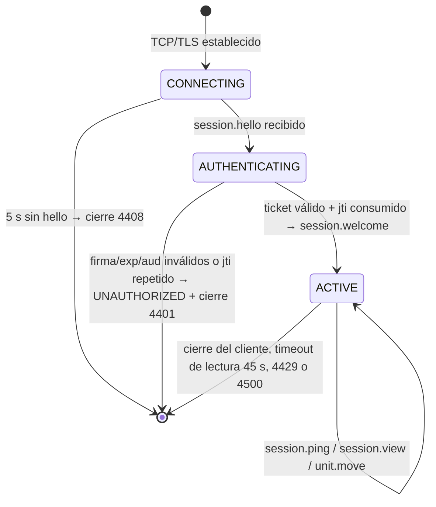

# Player

Especificación de la entidad `Player`: identidad, autenticación por ticket, alta con bootstrap atómico, y su relación ortogonal con `Civilization` y `Global Faction`.

| Campo | Valor |
|---|---|
| Spec ID | `SPEC-PLAYER` |
| Estado | Draft |
| Milestone | M2 Player & City |
| Canon | §0, §1, §10, §11, §12, §14, §16, §17 |
| Depende de | [city.md](city.md), [unit.md](unit.md), [websocket-protocol.md](websocket-protocol.md) |
| Reemplaza a | — |
| Invariantes | cita `INV-PLAYER-001..004` del registro; asigna `INV-PLAYER-005..008` |

## 1. Objetivo

Definir la identidad persistente de una persona dentro del mundo: cómo se crea, cómo se autentica frente al
game server, qué la caracteriza (`Civilization`, `Global Faction`) y cómo el alta produce, en una sola
transacción, un jugador jugable con ciudad y unidades.

## 2. Scope (y no-scope)

**Dentro del MVP**

- Identidad `uuid` estable y única del jugador.
- Verificación del *game ticket* JWT en el handshake `session.hello` y creación de la sesión.
- Alta del jugador con **bootstrap atómico**: `players` + `cities` + 3 `units` de tipo `VILLAGER` en una única
  transacción de PostgreSQL (`internal/persistence/postgres/bootstrap.go`).
- Endpoints **provisionales** `POST /api/auth/register` y `POST /api/auth/login`, servidos hoy por el propio
  game server (`internal/httpapi`) con `bcrypt`. Ver §4.1.
- Asignación de `Civilization` y de `Global Faction` como dos ejes independientes.
- Modelo **data-driven** de rasgos de civilización: `civilizations.traits` como `jsonb` consultado por clave,
  sin condicionales por civilización repartidos por el código.
- Relación 1:1 jugador↔ciudad en MVP y su consecuencia sobre el centrado de la vista al conectar.

**Fuera de MVP (no se implementa; se documenta el punto de extensión)**

- Traslado de la autenticación a `apps/web` (Next.js). Es la arquitectura objetivo de
  [ADR-010](../decisions/ADR-010-authentication-game-ticket.md), pero esa API route **todavía no existe** en `apps/web`, en el
  repositorio: hoy el emisor de tickets es el game server. Recuperación de cuenta, OAuth y verificación de
  correo son `TBD (fuera de MVP)`.
- Efecto de gameplay de los traits de civilización sobre economía, tecnología, combate o coste de unidades:
  esos subsistemas no existen (canon §21). Los valores sembrados en `civilizations.traits` existen pero
  **ningún sistema los lee todavía**.
- Elección de civilización y de facción por parte del jugador en el alta: hoy son parámetros de arranque del
  servidor, no campos del formulario (§4.1).
- Estados de moderación de cuenta (suspensión, baneo, borrado), renombrado, cambio de civilización o de
  facción, múltiples ciudades por jugador, clanes, ranking: `TBD (fuera de MVP)`.
- Mecánica de facciones (bonos, guerra ORDER/CHAOS, reputación): `Fuera de MVP`. En MVP la facción es un
  atributo persistido y visible, sin efecto sobre las reglas.

## 3. Actores

| Actor | Rol |
|---|---|
| Jugador humano | Origen de toda intención. Todos los jugadores son humanos; la variedad viene de `Civilization`, no de razas (canon §0). |
| Emisor del ticket | Firma el *game ticket* JWT HS256 con `EO_AUTH_JWT_SECRET`, `aud = "game-server"` y TTL 60 s. **Hoy es `services/game-server/internal/httpapi`** (`auth.Issuer`); en la arquitectura objetivo será `apps/web` (Next.js), que aún no existe. Nunca escribe estado de simulación. |
| `services/game-server` (Go) | Único autoritativo. Verifica el ticket, consume el `jti`, crea la sesión, ejecuta el bootstrap y responde. |
| PostgreSQL | *Durable source of truth*: `players`, `civilizations`, `factions`, `eras`, `cities`, `units`, `sessions`, `idempotency_keys`, `world_events`. |
| Redis | *Hot state*: `ticket:jti:{jti}`, `presence:player:{playerId}`, idempotencia de comandos del protocolo. Nunca sustituye a PostgreSQL. |

## 4. Inputs

### 4.1 Alta e inicio de sesión (fuera del canal WebSocket)

El canon no define un mensaje WebSocket de registro (§13 no lo lista), de modo que el alta **no** es un
comando del protocolo v1. Hoy la sirve el propio game server en `internal/httpapi/auth.go`, y así debe
documentarse: es una implementación **provisional y sustituible**, no la arquitectura objetivo. La
arquitectura objetivo ([ADR-010](../decisions/ADR-010-authentication-game-ticket.md)) traslada estos dos
endpoints a `apps/web`; mientras `apps/web` no exista, el vertical slice tiene que ser ejecutable de
extremo a extremo y el contrato del emisor de tickets queda documentado con código.

`POST /api/auth/register` — cuerpo JSON, máximo 4096 bytes:

| Input | Tipo | Origen | Notas |
|---|---|---|---|
| `username` | `string` | jugador | Validado por `player.ValidateUsername`; ver `RN-PLAYER-003`. |
| `password` | `string` | jugador | Mínimo 8 caracteres. Se deriva con `bcrypt.DefaultCost` y **nunca** se almacena en claro. |

`POST /api/auth/login` — mismo cuerpo `{ username, password }`.

Lo que el cuerpo **no** lleva, y por qué:

- **`playerId`.** Lo genera el servidor con `uuid.New()` dentro de la transacción (`RN-PLAYER-001`).
- **`civilizationCode` / `factionCode`.** En MVP son parámetros de arranque del proceso
  (`httpapi.Options.CivilizationID` = 1 → `ROMAN`, `FactionID` = 3 → `NEUTRAL`), no elección del jugador.
  Exponerlos en el formulario es `Fuera de MVP`; el modelo de datos ya soporta cualquier combinación
  (`RN-PLAYER-005`).
- **`requestId`.** El alta HTTP **no es idempotente por clave de petición**: ver `RN-PLAYER-006`.

Respuesta de ambos endpoints (`201 Created` en el alta, `200 OK` en el login):

```json
{
  "playerId": "6f0f7f1a-3d21-4a5b-8c9d-0e1f2a3b4c5d",
  "ticket": "<JWT HS256>",
  "expiresInSeconds": 60,
  "city": { "id": 1042, "name": "alicepolis", "centerX": 231, "centerY": 178 }
}
```

Errores del alta, con su código HTTP: `INVALID_MESSAGE` (400), `INVALID_USERNAME` (400), `WEAK_PASSWORD`
(400), `USERNAME_TAKEN` (409), `NO_SITE_AVAILABLE` (409), `INTERNAL_ERROR` (500). El login responde
`UNAUTHORIZED` (401) tanto si el usuario no existe como si la contraseña no coincide, tras comparar
igualmente contra un hash inválido para no revelar por tiempo qué nombres existen. **Estos códigos son
del transporte HTTP provisional y no pertenecen al catálogo de 22 códigos del protocolo v1** (canon §16):
cuando el alta se mueva a `apps/web`, desaparecen con ella.

### 4.2 Handshake de sesión (WebSocket v1)

| Mensaje | Dirección | Payload | Notas |
|---|---|---|---|
| `session.hello` | cliente→servidor | `{ ticket, clientVersion? }` | Primer mensaje de la conexión, antes de 5 s o cierre `4408`. Esquema estricto: cualquier campo adicional se rechaza. |
| `session.ping` | cliente→servidor | `{ clientTimeMs }` | Mantiene viva la conexión y refresca la presencia (ver [presence.md](presence.md)). El servidor responde `session.pong` con eco de `clientTimeMs`. |

Claims del ticket (canon §14): `{ sub: playerId, jti, iat, exp, aud: "game-server" }`, HS256, TTL **60 s**.
`clientVersion` es solo diagnóstico y telemetría: no altera ninguna decisión de gameplay.

### 4.3 Configuración consumida

| Variable | Valor por defecto | Uso en esta spec |
|---|---|---|
| `EO_AUTH_JWT_SECRET` | — (obligatoria) | Firma y verificación del ticket. Mínimo 32 caracteres; no puede contener `dev-only` si `EO_ENV=production`. |
| `EO_WORLD_WIDTH` / `EO_WORLD_HEIGHT` | 512 / 512 | Límites para el emplazamiento de la ciudad inicial. |
| `EO_WORLD_SEED` | 20260909 | Semilla del **generador del mapa**, no del emplazamiento. |
| `EO_INTEREST_RADIUS_CHUNKS` | 2 | Área de interés inicial centrada en la ciudad del jugador. |
| `EO_CHUNK_SIZE` | 32 | Deriva `units.chunk_x`/`chunk_y` de los aldeanos iniciales. |

Constante no configurable por entorno, fijada en código: el TTL del ticket, **60 s** (`ticketTTL` en
`cmd/server/main.go`). Tampoco lo son el plazo de handshake (5 s), el intervalo de ping (15 s) ni los
timeouts de lectura (45 s) y escritura (10 s) del WebSocket.

La semilla del emplazamiento **no** es `EO_WORLD_SEED`: es un FNV-1a de 64 bits del propio `username`
(`hashSeed`). Así dos altas simultáneas no compiten por el mismo tile y el mismo nombre obtiene siempre el
mismo punto de partida, lo que hace el alta reproducible en tests y depurable en producción.

## 5. Outputs

| Output | Destino | Cuándo |
|---|---|---|
| Fila en `players` | PostgreSQL | Alta, dentro de la transacción de bootstrap. |
| Fila en `cities` | PostgreSQL | Alta, misma transacción. Ver [city.md](city.md). |
| 3 filas en `units` (`VILLAGER`, `IDLE`) | PostgreSQL | Alta, misma transacción. |
| Fila en `world_events` con `event_type = 'PlayerBootstrapped'` | PostgreSQL | Alta, misma transacción. Payload: `{ cityId, villagers, center:{x,y} }`. |
| Comando `IntroducePlayer` | cola de comandos de la simulación | **Después** del COMMIT, nunca antes: el mundo en RAM solo conoce al jugador cuando la transacción confirmó. Incorpora ciudad, aldeanos y el rectángulo bloqueado de la muralla. |
| Ticket JWT + `city` | respuesta HTTP del alta o del login | Ver §4.1. |
| Fila en `sessions` | PostgreSQL | Handshake aceptado. |
| Clave `presence:player:{playerId}` | Redis, TTL `EO_PRESENCE_TTL_SECONDS` (30 s) | Handshake aceptado. Ver [presence.md](presence.md). |
| `session.welcome` | conexión que hizo el handshake | Tras verificar el ticket y crear la sesión. |
| `world.snapshot` | misma conexión | Inmediatamente después de `session.welcome`, con el área de interés centrada en la ciudad. |
| `system.error` | misma conexión | Ante cualquier fallo, con un `code` del canon §16. |
| Métrica `eo_connected_players` | Prometheus | Gauge, +1 al primer WS del jugador, −1 al cerrar el último. |
| Log estructurado con `player_id` | stdout JSON (`log/slog`) | Alta fallida, alta revertida y cierre de sesión. Nunca registra la contraseña, su hash ni el ticket completo. |

## 6. Reglas de negocio

Dominio de reglas: `RN-PLAYER`.

| ID | Regla |
|---|---|
| `RN-PLAYER-001` | `players.id` es un `uuid` (canon §11: la única PK que no es `bigint GENERATED ALWAYS AS IDENTITY`). Lo genera el servidor con `uuid.New()` (UUIDv4 respaldado por `crypto/rand`) **fuera del tick**, en la goroutine de la petición HTTP. No forma parte del dominio determinista y por tanto no usa `RandomSource`. |
| `RN-PLAYER-002` | Un jugador se identifica siempre por su `uuid`. Ningún mensaje del protocolo transporta claves internas alternativas ni índices posicionales. |
| `RN-PLAYER-003` | El nombre de cuenta es la columna **`players.username`**, no `display_name`: la tabla no tiene una columna de nombre visible separada. Es único (`UNIQUE` en la columna) y su formato se valida en **dos** niveles con la misma regla: `player.ValidateUsername` en el boundary y el `CHECK` `players_username_format` (`username ~ '^[A-Za-z0-9_-]{3,24}$'`) en PostgreSQL. Longitud 3..24 y únicamente `A-Z`, `a-z`, `0-9`, `_` y `-`. **No hay normalización NFKC ni recorte de espacios**, precisamente porque el alfabeto permitido es ASCII cerrado: normalizar sería resolver un problema que el `CHECK` ya impide. La lista de nombres reservados es `TBD (fuera de MVP)`. |
| `RN-PLAYER-004` | Todo jugador tiene exactamente una `Civilization` y exactamente una `Global Faction`, ambas `NOT NULL` con FK. No hay valor nulo ni "sin asignar". |
| `RN-PLAYER-005` | `Civilization` y `Global Faction` son **ejes ortogonales**: cualquier combinación del producto cartesiano es válida. No existe ninguna restricción, tabla de compatibilidad ni valor por defecto derivado del otro eje. |
| `RN-PLAYER-006` | El alta HTTP **no** es idempotente por `requestId`. La defensa contra el alta duplicada es el `UNIQUE` de `players.username`, que traduce a `USERNAME_TAKEN` (409); un reintento con el mismo nombre no crea un segundo jugador. La tabla `idempotency_keys` existe y sirve a los **comandos del protocolo v1**, no a este endpoint. Dar idempotencia por `requestId` al alta es `TBD (fuera de MVP)` y llegará con `apps/web`. |
| `RN-PLAYER-007` | El alta es **atómica**: `players` + `cities` + 3 `units` + el `world_events` de auditoría se escriben en una sola transacción (`Bootstrapper.Create` sobre `Store.InTx`). Un fallo en cualquier paso deja la base de datos sin rastro del jugador. No existe estado intermedio "jugador sin ciudad" ni "ciudad sin aldeanos". |
| `RN-PLAYER-008` | El game server nunca almacena ni registra contraseñas en claro: solo el `password_hash` de bcrypt, que se lee exclusivamente en `PlayerRepo.GetByUsername` y no viaja a ninguna otra capa ni a ningún log. Mientras el alta viva aquí (§4.1), la contraseña sí atraviesa el proceso el tiempo justo de derivar el hash; cuando el alta se mueva a `apps/web`, la única entrada de autenticación del game server será el ticket firmado. |
| `RN-PLAYER-009` | El ticket se verifica en firma HS256, `exp` y `aud == "game-server"`, y su `jti` se consume una sola vez en Redis (`ticket:jti:{jti}`). Un ticket sin `jti` se rechaza: sin él no se puede impedir el replay. Un `jti` ya consumido se rechaza con `UNAUTHORIZED` y cierre `4401`. |
| `RN-PLAYER-010` | Si `session.hello` no llega en los primeros 5 s de la conexión, el servidor cierra con código `4408`. Ningún otro tipo de mensaje se procesa antes del handshake. |
| `RN-PLAYER-011` | En MVP un jugador posee **exactamente una** ciudad. El área de interés inicial se centra en `cities.center_x` / `cities.center_y` de esa ciudad, con radio `EO_INTEREST_RADIUS_CHUNKS` (canon §13). Multi-ciudad es `Fuera de MVP`. |
| `RN-PLAYER-012` | Los rasgos de civilización no se consultan con condicionales por código de civilización. Toda lectura pasa por `Civilization.Trait(key, def)` (§6.3). |
| `RN-PLAYER-013` | La facción no restringe ninguna acción del MVP. Es un atributo persistido; su efecto sobre reglas es `Fuera de MVP`. |
| `RN-PLAYER-014` | El emplazamiento de la ciudad inicial se elige **antes** de abrir la transacción, con `founding.FindSite`: espiral determinista desde `hashSeed(username)`, entorno despejado de radio 3, separación mínima de 24 tiles con cualquier centro de ciudad existente, y 3 aldeanos a radio 2 sobre tiles transitables. Si no hay sitio, el alta responde `NO_SITE_AVAILABLE` (409) y **no** se coloca al jugador «donde sea». |

### 6.1 Ortogonalidad Civilization × Global Faction

`Civilization` es identidad **cultural** (unidades, tecnologías y bonos futuros). `Global Faction` es
alineamiento **político** del servidor: `ORDER`, `CHAOS`, `NEUTRAL`. Son dos preguntas distintas sobre el mismo
jugador y ninguna condiciona a la otra.

```
        Civilization (cultura)  ─────────────►
        │  Roman     Byzantine   Persian    Norse
   ORDER│   ✔           ✔           ✔         ✔
   CHAOS│   ✔           ✔           ✔         ✔
 NEUTRAL│   ✔           ✔           ✔         ✔
        ▼
   Global Faction (política)
```

Ejemplos que demuestran la ortogonalidad (los cuatro son estados válidos y simultáneos del mismo servidor):

| Jugador | `civilization` | `faction` | Lectura | ¿Válido? |
|---|---|---|---|---|
| `alice` | `ROMAN` | `ORDER` | Cultura romana, alineada con el Orden. | Sí |
| `bob` | `ROMAN` | `CHAOS` | Misma cultura que `alice`, política opuesta. Comparten árbol cultural, no bando. | Sí |
| `carol` | `NORSE` | `ORDER` | Cultura distinta a `alice`, mismo bando. Aliadas políticas con unidades distintas. | Sí |
| `dave` | `BYZANTINE` | `NEUTRAL` | No participa del eje político. Su cultura sigue siendo plena. | Sí |
| `erin` | `PERSIAN` | `CHAOS` | Cuarta combinación independiente. | Sí |

Consecuencias de diseño que se derivan de la tabla:

- La cardinalidad del espacio de jugadores es `|civilizations| × |factions|`; añadir una civilización no toca
  el eje de facciones y viceversa.
- Ninguna consulta SQL ni ninguna regla puede inferir la facción a partir de la civilización.
- Dos jugadores con la misma civilización pueden ser enemigos políticos; dos jugadores de la misma facción
  pueden tener bonos culturales completamente distintos.

**Estado real en MVP:** el modelo de datos admite las doce combinaciones, pero el alta provisional de §4.1
no las expone: todos los jugadores nacen `ROMAN` / `NEUTRAL` porque la civilización y la facción son
parámetros de arranque del proceso. La ortogonalidad es una propiedad del esquema verificable hoy con un
`INSERT` por cada par; abrir la elección al jugador es un cambio de formulario, no de modelo.

### 6.2 Catálogo de traits data-driven

El objetivo es no escribir jamás `if civilization == "ROMAN" { ... }` disperso por el dominio. Ese patrón
crece en O(civilizaciones × subsistemas), es imposible de testear exhaustivamente y obliga a recompilar para
un ajuste de balance.

El canon §11 fija la lista de tablas del MVP y `civilization_traits` **no** está en ella, así que no se crea
una tabla nueva: los traits viajan como `jsonb` dentro de `civilizations`.

```sql
-- civilizations (migración 000001). DDL canónico completo en ../database/schema.md
CREATE TABLE civilizations (
    id          integer     PRIMARY KEY,
    code        text        NOT NULL UNIQUE,   -- ROMAN, BYZANTINE, PERSIAN, NORSE
    name        text        NOT NULL,
    traits      jsonb       NOT NULL DEFAULT '{}'::jsonb,
    created_at  timestamptz NOT NULL DEFAULT now()
);
```

`civilizations`, `factions` y `eras` son catálogos sembrados por migración con `id` explícito y estable:
son la excepción a `bigint GENERATED ALWAYS AS IDENTITY`, porque su clave es un dato de juego versionado
en `000002_seed_catalogs.up.sql`, no un correlativo. Tampoco llevan `version` ni `updated_at`: se cambian
por migración, no por escritura de la aplicación.

**Forma de un trait: un objeto plano `clave → multiplicador`**, no una lista de operaciones. `1.0`
significa «sin efecto», que es lo que permite consultar cualquier clave sin comprobar antes si existe:

```json
{ "unit.move_speed": 0.95, "build.speed": 1.00, "defense.wall_hp": 1.20 }
```

Semillas reales de la migración 000002:

| `code` | `traits` |
|---|---|
| `ROMAN` | `{"unit.move_speed": 1.00, "build.speed": 1.10, "economy.gather_rate": 1.00}` |
| `BYZANTINE` | `{"unit.move_speed": 0.95, "build.speed": 1.00, "defense.wall_hp": 1.20}` |
| `PERSIAN` | `{"unit.move_speed": 1.05, "build.speed": 0.95, "economy.trade_yield": 1.15}` |
| `NORSE` | `{"unit.move_speed": 1.10, "build.speed": 0.90, "combat.raid_bonus": 1.15}` |

Las claves son cadenas estables en minúsculas con punto (`dominio.propiedad`). Un `op`, un `scope` y un
`source` por trait —el modelo de pipeline de modificadores con `ADD`/`MUL`/`SET_MIN`/`SET_MAX`— son
`Fuera de MVP`: hoy el único operador es la multiplicación implícita sobre un valor base y el `scope` es
siempre global a la civilización.

**Estado real en MVP: los traits están sembrados pero ningún sistema los lee.** `unit.move_speed` no se
aplica al construir la polilínea: el coste por segmento sale de `unit.Lookup(unitType).BaseMsPerTile`
(600 ms para `VILLAGER`) sin ningún modificador de por medio. Lo que existe es el **mecanismo de
consulta** (`Civilization.Trait`), de modo que enchufar el primer bono real sea un cambio de datos más una
línea en el punto de consumo, y no una refactorización.

### 6.3 Punto único de consulta de traits

El catálogo se carga al arrancar (`PlayerRepo.ListCivilizations`) y se cachea inmutable durante la vida del
proceso. La única vía admitida para leer un bono cultural es un método del dominio:

```go
// internal/domain/player/player.go
type Civilization struct {
    ID     int32
    Code   string
    Name   string
    Traits map[string]float64
}

// Trait devuelve el valor de un rasgo, o el valor por defecto si la civilización
// no lo define. Ésta es la ÚNICA vía admitida para consultar bonos culturales.
func (c Civilization) Trait(key string, def float64) float64
```

Propiedades que hacen que esto baste hoy:

- **Determinismo.** `Trait` es una lectura por clave de un mapa inmutable: no itera el mapa, así que no
  hereda el orden aleatorio de iteración de Go (canon §1.5).
- **Ausencia segura.** Una civilización que no declara la clave devuelve `def`. No hay caso nulo que cada
  llamador tenga que resolver a su manera, que es exactamente el modo de fallo que
  [`INV-PLAYER-002`](../invariants/player.md#inv-player-002) describe para las referencias irresolubles.
- **Sin condicionales por civilización.** El llamador nombra la propiedad que le concierne
  (`"unit.move_speed"`), nunca el código de la civilización.

Puntos de consumo previstos y su estado honesto:

| `key` | Valor base | Punto de aplicación | Estado |
|---|---|---|---|
| `unit.move_speed` | `600` ms/tile de `VILLAGER`, del catálogo de unidades | Coste temporal por segmento al construir la polilínea, ver [movement.md](movement.md) | **Sembrado pero sin consumir.** Hoy `BuildTimedPath` recibe `def.BaseMsPerTile` sin modificar. |
| `build.speed` | — | Construcción | `Fuera de MVP` (no hay construcción) |
| `economy.gather_rate` / `economy.trade_yield` | — | Economía | `Fuera de MVP` |
| `defense.wall_hp` / `combat.raid_bonus` | — | Combate | `Fuera de MVP` |
| Límite de población | `eras.population_cap` (20/50/100/150) | `cities.population_limit`, ver [city.md](city.md) | Implementado **sin** trait: se copia de la era en el alta. Ninguna civilización lo modifica. |

Cuando llegue el primer bono real habrá que decidir explícitamente **dónde** se aplica, porque la decisión
determina qué dato es autoritativo. Para `unit.move_speed` la respuesta ya está fijada por el esquema: la
tabla `units` **no** tiene columna `base_ms_per_tile` (ver [unit.md](unit.md) §4), así que el modificador
solo puede aplicarse al construir cada polilínea, y no queda congelado en ninguna fila. Un ajuste de
balance afecta al siguiente movimiento de todas las unidades, no solo a las creadas después.

Coste de mantenimiento: añadir una civilización con bonos es insertar una fila en `civilizations` con su
`traits` y, a lo sumo, una llamada a `Trait` en el punto que la consume. Cero ramas condicionales nuevas.

## 7. Estados y transiciones

El jugador tiene tres ejes de estado independientes que conviene no mezclar:

**a) Ciclo de vida de la cuenta.** En MVP existe un único estado vivo: el jugador está dado de alta y es
jugable. Suspensión, baneo y borrado son `TBD (fuera de MVP)` y no se modela una columna de estado para ellos
hasta que el canon los defina.

**b) Presencia del jugador** (volátil, Redis): derivada de la existencia de `presence:player:{playerId}` y de
la existencia de al menos una conexión WebSocket viva. No es una columna de `players`. Especificada por
completo en [presence.md](presence.md).

**c) Ciclo de vida de la sesión** (una fila de `sessions` por conexión aceptada):



`CONNECTING`, `AUTHENTICATING` y `ACTIVE` son estados **en RAM** de la goroutine de la conexión: la tabla
`sessions` no tiene columna de estado. Sus columnas son `id`, `player_id`, `connected_at`,
`disconnected_at`, `remote_addr` y `client_version`; una sesión abierta es una fila con
`disconnected_at IS NULL`.

La transición `ACTIVE → cerrada` **no** degrada por sí sola el estado de la ciudad: eso lo decide la fase de
timers del tick comparando contra `DisconnectGrace` (= `EO_PRESENCE_TTL_SECONDS`, 30 s) en RAM, no leyendo
la expiración de la clave de Redis. Un jugador con varias pestañas abiertas sigue `ONLINE` mientras le
quede una. Ver [presence.md](presence.md) §7.

## 8. Errores

Solo se usan códigos del canon §16, emitidos como `system.error` con `{ code, message, requestId?, details? }`.
La lógica de control se basa en `code`, jamás en el texto.

| Código | Condición exacta | Efecto sobre la conexión |
|---|---|---|
| `UNAUTHORIZED` | Ticket ausente, firma inválida, `exp` vencido, `aud != "game-server"`, `jti` ya consumido, o `sub` que no existe en `players`. | Cierre `4401`. |
| `FORBIDDEN` | La sesión autenticada intenta operar sobre entidades de otro jugador. | Cierre `4403` si es reiterado; en caso puntual, error y conexión viva. |
| `INVALID_MESSAGE` | `session.hello` malformado, `v` ausente, payload que no valida contra el esquema. | Cierre `4400`. |
| `UNSUPPORTED_VERSION` | `v != 1`. | Cierre `4400`. |
| `MESSAGE_TOO_LARGE` | Mensaje > `EO_WS_MAX_MESSAGE_BYTES` (16384). | Cierre `4400`. |
| `RATE_LIMITED` | Más de `EO_WS_RATE_LIMIT_PER_SECOND` (20) msg/s con burst 40. | Cierre `4429` si persiste. |
| `INTERNAL_ERROR` | Fallo de la transacción de bootstrap, de PostgreSQL o de Redis. | Cierre `4500`. La transacción revierte entera. |
| `NOT_IMPLEMENTED` | Operación de cuenta prevista pero fuera de MVP (renombrado, cambio de civilización o facción). | Conexión viva. |

Nota: no existe un código específico para "nombre en uso" ni para "civilización inexistente" en el canon §16.
Ambos se reportan como `INVALID_MESSAGE` con `details` describiendo el campo ofensor. Introducir un código
nuevo exigiría modificar el canon.

## 9. Invariantes (con ID)

El registro **único** de invariantes es [../invariants/player.md](../invariants/player.md). Esta spec cita
`INV-PLAYER-001..004` con el significado que allí tienen —no los redefine— y asigna los nuevos a partir de
`INV-PLAYER-005`, que es el primer número libre de la familia.

### 9.1 Invariantes ya registrados que esta spec ejerce

| ID | Enunciado (según el registro) | Dónde aparece en esta spec |
|---|---|---|
| [`INV-PLAYER-001`](../invariants/player.md#inv-player-001) | Un jugador solo comanda unidades propias: un comando sobre una unidad se ejecuta si y solo si `units.player_id` es el `playerId` de la sesión autenticada. | §3, [unit.md](unit.md) §8 |
| [`INV-PLAYER-002`](../invariants/player.md#inv-player-002) | Exactamente una `civilization` y exactamente una `faction`, ambas `NOT NULL` y con FK resoluble. | `RN-PLAYER-004`, `RN-PLAYER-005` |
| [`INV-PLAYER-003`](../invariants/player.md#inv-player-003) | Un jugador nuevo nace, atómicamente, con una ciudad y tres aldeanos `VILLAGER`. | `RN-PLAYER-007`, §10.1 |
| [`INV-PLAYER-004`](../invariants/player.md#inv-player-004) | La identidad de la sesión proviene exclusivamente del claim `sub` de un ticket verificado y con `jti` consumido. | `RN-PLAYER-009`, `RN-PLAYER-010`, §7 |

Nótese que `INV-PLAYER-001` designa el **ownership de comandos**, no la unicidad del `uuid`, y que
`INV-PLAYER-003` cubre de una vez la ciudad y los tres aldeanos. El test de integración que ya existe se
llama `Test_INV_PLAYER_003_NewPlayerHasOneCityAndThreeVillagers`, con ese significado.

### 9.2 Invariantes que esta spec asigna

Rango asignado: `INV-PLAYER-005..008`. Antes de citarse desde tests o código deben tener ficha en
[../invariants/player.md](../invariants/player.md) con el formato obligatorio del catálogo. La presencia
del jugador se documenta en [presence.md](presence.md) §9 y toma sus números por encima de éstos.

| ID | Invariante | Verificación |
|---|---|---|
| `INV-PLAYER-005` | `players.id` es `uuid` y único: no existen dos filas con el mismo id, y ningún otro mecanismo (correlativo, índice posicional) identifica a un jugador. | PK `uuid` en PostgreSQL + tipo `uuid.UUID` no puntero en el agregado de Go. |
| `INV-PLAYER-006` | `players.username` es único y cumple `^[A-Za-z0-9_-]{3,24}$`. La misma regla se aplica en el boundary (`player.ValidateUsername`) y en la base (`CHECK players_username_format`), de modo que ninguna ruta de escritura pueda saltársela. | `UNIQUE` + `CHECK` + unit test de tabla sobre `ValidateUsername`. |
| `INV-PLAYER-007` | Ninguna tabla guarda una contraseña en claro y ningún log estructurado contiene contraseña, `password_hash`, ticket completo ni `EO_AUTH_JWT_SECRET`. `password_hash` solo sale de `PlayerRepo.GetByUsername` y solo entra al verificador de credenciales. | Revisión de esquema + test que inspecciona los logs producidos durante alta, login y handshake. |
| `INV-PLAYER-008` | El comando `IntroducePlayer` que incorpora al jugador al mundo en RAM se emite **después** del COMMIT del bootstrap, nunca antes. No existe ningún instante en que el mundo en RAM conozca a un jugador que PostgreSQL no conoce. | Test de simulación con fallo inyectado en la transacción: el mundo no recibe la ciudad ni los aldeanos. |

No se asigna ningún invariante para «cada jugador tiene exactamente una ciudad»: esa propiedad es
[`INV-CITY-001`](../invariants/city.md#inv-city-001) del lado de la ciudad, y duplicarla desde la familia
`INV-PLAYER` crearía dos IDs para un solo hecho. Tampoco se asigna uno de idempotencia del alta: el alta
HTTP no es idempotente por `requestId` (`RN-PLAYER-006`), y un invariante que el código no garantiza es
una mentira documentada.

## 10. Persistencia

Respuesta a las cuatro preguntas del canon §12.

**1. Autoritativo en RAM del game server**

- Registro de conexiones WebSocket vivas por `playerId` (para el conteo de pestañas, ver [presence.md](presence.md)).
- Sesión en curso: `seq` saliente, límites de rate, centro de vista y conjunto de chunks suscritos.
- Catálogo de `civilizations`, `factions` y `eras` cargado al arranque y cacheado inmutable durante el proceso.

**2. Write-through inmediato y transaccional**

- Creación de `players`, `cities` y `units` (el bootstrap completo, en una sola transacción), más la fila
  de auditoría en `world_events`.
- Fila de `sessions` al aceptar el handshake y su cierre al desconectar.
- `idempotency_keys` para el `requestId` de los **comandos del protocolo v1**, no para el alta HTTP
  (`RN-PLAYER-006`).

**3. Dirty-flag + flush periódico (`EO_PERSISTENCE_FLUSH_INTERVAL_TICKS = 50`, 5 s)**

- Nada específico del jugador. `players` es una entidad de baja frecuencia de escritura; todos sus cambios son
  write-through.

**4. Reconstruible (no se persiste)**

- Presencia del jugador: se deriva de Redis + conexiones vivas.
- Conjunto de interés y suscripciones a chunks: se recalculan al conectar y con cada `session.view`.
- Valores efectivos derivados de `civilizations.traits`: se recalculan a partir del trait y del valor base.
  Nunca se persiste un valor ya modificado.

### 10.1 La transacción de bootstrap

Implementada en `internal/persistence/postgres/bootstrap.go` (`Bootstrapper.Create`). Las columnas son las
del DDL real; la secuencia, la que ejecuta el código:

```sql
BEGIN;

-- 1) jugador. El uuid lo genera la aplicación; el hash bcrypt llega ya derivado.
INSERT INTO players (id, username, password_hash, civilization_id, faction_id)
VALUES ($player_id, $username, $password_hash, $civilization_id, $faction_id);
-- una violación de UNIQUE(username) aborta el alta con USERNAME_TAKEN

-- 2) ciudad inicial: emplazamiento ya validado en memoria (ver city.md §6)
INSERT INTO cities (owner_player_id, name, center_x, center_y, era,
                    population, population_limit, presence_state, last_online_at)
VALUES ($player_id, $city_name, $cx, $cy, 'STONE_AGE',
        0, $era_population_cap, 'ONLINE', now())
RETURNING id;   -- → $city_id

-- 3) tres aldeanos alrededor del centro urbano, uno por INSERT.
--    chunk_x/chunk_y se derivan de x/y con EO_CHUNK_SIZE en el mismo statement.
INSERT INTO units (player_id, city_id, unit_type, x, y, hp, max_hp, status, chunk_x, chunk_y)
VALUES ($player_id, $city_id, 'VILLAGER', $x, $y, 40, 40, 'IDLE', $x / 32, $y / 32)
RETURNING id;

-- 4) población DERIVADA de las unidades vivas, no escrita a mano
UPDATE cities c
   SET population = COALESCE((
           SELECT count(*) FROM units u WHERE u.city_id = c.id AND u.status <> 'DEAD'
       ), 0),
       version = version + 1
 WHERE c.id = $city_id
RETURNING c.population;

-- 5) auditoría
INSERT INTO world_events (event_type, tick, player_id, payload)
VALUES ('PlayerBootstrapped', $tick, $player_id,
        '{"cityId": ..., "villagers": 3, "center": {"x": ..., "y": ...}}');

COMMIT;
```

Notas de diseño:

- Las columnas son `cities.owner_player_id`, `cities.center_x`, `cities.center_y` y `cities.id`; y
  `units.player_id`. Ni `cities.city_id` ni `units.owner_player_id` existen.
- `cities.era` referencia `eras(code)` en **texto** (`'STONE_AGE'`), no un `era_id` numérico.
- La **población se recalcula, no se asigna**: `UPDATE ... SET population = (SELECT count(*) ...)`. Escribir
  el literal `3` dejaría la ciudad desincronizada del mundo real en cuanto cambiara el número de aldeanos
  iniciales; derivarla hace imposible esa clase de bug.
- El **TOWN_CENTER** de la ciudad inicial (canon §10) no es una unidad y **no** tiene tabla propia: el canon §11
  fija las tablas del MVP y no incluye `buildings`. En MVP el Centro Urbano se representa por el propio tile
  `(center_x, center_y)` de la ciudad más el rectángulo 3×3 marcado en el overlay de ocupación —que se
  aplica al mundo en RAM con `IntroducePlayer`, no muta el terreno—. Una tabla general de edificios es
  `Fuera de MVP`. Ver [city.md](city.md) §6.
- La elección del emplazamiento y de los tres tiles de los aldeanos ocurre **en memoria y antes** de abrir la
  transacción (`founding.FindSite`, `RN-PLAYER-014`): la transacción no ejecuta búsquedas costosas con locks
  abiertos.
- `population_limit` se toma de `eras.population_cap` de `STONE_AGE` (20). Nunca se escribe el literal 20 en
  el código: el valor viaja desde el catálogo como `Options.PopulationCap`.
- `hp` y `max_hp` de los aldeanos salen de `unit.Lookup(VILLAGER).MaxHP` (40), no de un literal.
- La transacción **no** corre dentro del tick (canon §6: el tick jamás hace I/O bloqueante contra Postgres).
  Corre en la goroutine de la petición HTTP; el loop recibe el jugador ya creado a través del comando
  `IntroducePlayer`, encolado tras el COMMIT (`INV-PLAYER-008`).

## 11. Eventos

Eventos de dominio, nombrados en pasado (canon §15). Son la base de los deltas de red y de `world_events`.

| Evento | Payload | Emitido cuando | Consumidores |
|---|---|---|---|
| `PlayerBootstrapped` | `{ cityId, villagers, center: { x, y } }` | Dentro de la transacción de bootstrap. **Es el único que hoy se materializa como fila de `world_events`**, con `event_type = 'PlayerBootstrapped'`. | `world_events`, auditoría. |
| `CityCreated` | `{ cityId, ownerPlayerId, centerX, centerY, era, occurredAtMs }` | Commit del bootstrap. Ver [city.md](city.md). | Overlay de ocupación, difusión `city.update`. |
| `UnitSpawned` | `{ unitId, playerId, cityId, unitType, x, y, occurredAtMs }` (×3) | Commit del bootstrap, al aplicar `IntroducePlayer`. | `entity.spawn` a los suscriptores del chunk. |
| `PlayerSessionOpened` | `{ playerId, sessionId, occurredAtMs }` | `session.welcome` enviado. | Presencia, métricas. |
| `PlayerSessionClosed` | `{ playerId, sessionId, closeCode, occurredAtMs }` | Cierre de la conexión. | Presencia, métricas. |

Salvo `PlayerBootstrapped`, los demás son eventos **de dominio en RAM**: nombran el hecho y alimentan los
deltas de red y las métricas, pero no tienen hoy una fila propia en `world_events`. Añadirlos es aditivo y
no cambia el esquema.

`CityProtectionEngaged` es el evento canónico de protección y pertenece a [presence.md](presence.md).

## 12. Contratos de red

Los esquemas **Zod** de `packages/protocol/src/v1/` son la fuente de verdad; el JSON Schema exportado a
`packages/protocol/schema/v1/*.json` se embebe en el game server con `go:embed` y se usa en los *contract
tests*. Los payloads de abajo describen la **forma prevista**, no sustituyen al esquema.

`session.hello` (cliente→servidor):

```json
{
  "v": 1,
  "type": "session.hello",
  "requestId": "8b7c1f2e-0a4d-4f0b-9a1e-2c3d4e5f6a7b",
  "payload": { "ticket": "<JWT HS256>", "clientVersion": "web-0.1.0" }
}
```

`session.welcome` (servidor→cliente):

```json
{
  "v": 1,
  "type": "session.welcome",
  "seq": 1,
  "ts": 1767830400123,
  "requestId": "8b7c1f2e-0a4d-4f0b-9a1e-2c3d4e5f6a7b",
  "payload": {
    "sessionId": "1f2e3d4c-5b6a-4798-8a9b-0c1d2e3f4a5b",
    "playerId": "6f0f7f1a-3d21-4a5b-8c9d-0e1f2a3b4c5d",
    "serverTimeMs": 1767830400123,
    "tickDurationMs": 100,
    "heartbeatIntervalMs": 15000,
    "world": { "width": 512, "height": 512, "chunkSize": 32 }
  }
}
```

Reglas del contrato:

- El payload de `session.welcome` es exactamente `{ sessionId, playerId, serverTimeMs, tickDurationMs,
  heartbeatIntervalMs, world }`. **No lleva `displayName`, `civilization`, `faction`, `city` ni
  `tickRateHz`.** La cadencia se comunica como `tickDurationMs` (100 ms a 10 Hz), no como frecuencia: el
  cliente dimensiona su interpolación con una duración, no con un hercio que tendría que invertir.
- La ciudad del jugador no viaja en el `welcome`: llega en el `world.snapshot` inmediatamente posterior,
  dentro de `cities[]`, junto con el resto del área de interés. El alta y el login **sí** devuelven la
  ciudad en su respuesta HTTP (§4.1), que es lo que permite al cliente centrar la cámara antes incluso de
  abrir el WebSocket.
- `session.welcome` va siempre seguido de `world.snapshot` con el área de interés centrada en la ciudad del
  jugador y radio `EO_INTEREST_RADIUS_CHUNKS` (2).
- El cliente **no** aporta estado autoritativo en el handshake: ni posición, ni recursos, ni ownership. Solo el
  ticket.
- Donde la civilización y la facción sí aparecen, viajan como `code` en texto (`"ROMAN"`, `"NEUTRAL"`),
  nunca como id numérico interno.
- Ningún payload incluye traits resueltos: los valores efectivos son responsabilidad del servidor y el
  cliente no los necesita para simular (no simula).
- Los mensajes cliente→servidor validan contra esquemas **estrictos** (`additionalProperties: false`): un
  campo extra en `session.hello` se rechaza con `INVALID_MESSAGE`. Los servidor→cliente **no** son
  estrictos, para poder añadir campos opcionales sin romper clientes antiguos.

## 13. Tests esperados

| ID | Nivel | Descripción | Cubre |
|---|---|---|---|
| `T-PLAYER-U-001` | unit | `Civilization.Trait` sobre una clave ausente devuelve el valor por defecto; sobre `Traits == nil` también. | `RN-PLAYER-012` |
| `T-PLAYER-U-002` | unit | `Civilization.Trait` sobre una clave presente devuelve su multiplicador exacto, sin depender del orden de iteración del mapa. | `RN-PLAYER-012` |
| `T-PLAYER-U-003` | unit | `player.ValidateUsername`: tabla de casos con 2, 3, 24 y 25 caracteres, y con espacios, acentos, punto y `@`. Solo `[A-Za-z0-9_-]{3,24}` pasa. | `RN-PLAYER-003`, `INV-PLAYER-006` |
| `T-PLAYER-U-004` | unit | Verificación del ticket con `FakeClock`: válido, `exp` vencido, `aud` incorrecto, firma alterada, `alg=none`, `jti` ausente, claims incompletos. | `RN-PLAYER-009`, `INV-PLAYER-004` |
| `T-PLAYER-U-005` | unit | `founding.FindSite` con la misma semilla devuelve el mismo emplazamiento; con ciudades existentes respeta la separación de 24 tiles; sin sitio devuelve `ErrNoSite`. | `RN-PLAYER-014` |
| `T-PLAYER-I-001` | integration | Bootstrap completo: 1 fila en `players`, 1 en `cities`, 3 en `units` con `hp = max_hp = 40` y `status='IDLE'`, `cities.population = 3`. | `RN-PLAYER-007`, `INV-PLAYER-003` |
| `T-PLAYER-I-002` | integration | Fallo inyectado en el `INSERT` del tercer aldeano: no queda ninguna fila en `players`, `cities` ni `units`. | `RN-PLAYER-007`, `INV-PLAYER-003` |
| `T-PLAYER-I-003` | integration | Alta repetida con el mismo `username`: la segunda falla con `USERNAME_TAKEN` (409) y no crea ninguna fila adicional. | `RN-PLAYER-006`, `INV-PLAYER-006` |
| `T-PLAYER-I-004` | integration | Alta de un jugador por cada combinación (civilización × facción): las doce tienen éxito. Falla si alguien acopla los ejes. | `RN-PLAYER-005`, `INV-PLAYER-002` |
| `T-PLAYER-I-005` | integration | `jti` reutilizado: segundo handshake rechazado con `UNAUTHORIZED` y cierre `4401`. | `RN-PLAYER-009`, `INV-PLAYER-004` |
| `T-PLAYER-I-006` | integration | `INSERT` directo con `username` de 2 caracteres o con `@`: rechazado por `players_username_format`. | `INV-PLAYER-006` |
| `T-PLAYER-I-007` | integration | `INSERT` con `civilization_id` o `faction_id` nulo o inexistente: rechazado por `NOT NULL` / FK. | `INV-PLAYER-002` |
| `T-PLAYER-C-001` | contract | `session.hello` y `session.welcome` validan contra el JSON Schema exportado por `@empires-online/protocol`, con los campos exactos de §12. | §12 |
| `T-PLAYER-C-002` | contract | `session.hello` con un campo extra (`playerId`, por ejemplo) **no** valida: los mensajes cliente→servidor son estrictos. | `INV-PLAYER-004` |
| `T-PLAYER-C-003` | contract | `system.error` de handshake usa únicamente códigos del catálogo de 22 del canon §16. | §8 |
| `T-PLAYER-E-001` | e2e | Conexión sin `session.hello` durante 5 s → cierre `4408`. | `RN-PLAYER-010` |
| `T-PLAYER-E-002` | e2e | Handshake correcto → `session.welcome` seguido de `world.snapshot` centrado en la ciudad. | `RN-PLAYER-011` |
| `T-PLAYER-E-003` | e2e | Alta → el mundo en RAM no conoce al jugador hasta después del COMMIT; con la transacción abortada, ningún `entity.spawn` llega a ningún observador. | `INV-PLAYER-008` |

Los tests de integración requieren Docker Desktop **arrancado** y están gated por `EO_INTEGRATION=1`
(canon §3, §19). En la máquina de desarrollo actual el daemon de Docker no arranca, de modo que estos
tests están **diseñados pero no ejecutados**: no se pueden dar por verdes. El acceso a PostgreSQL y Redis
se hace vía `docker compose exec`, porque `psql` y `redis-cli` no están instalados.
