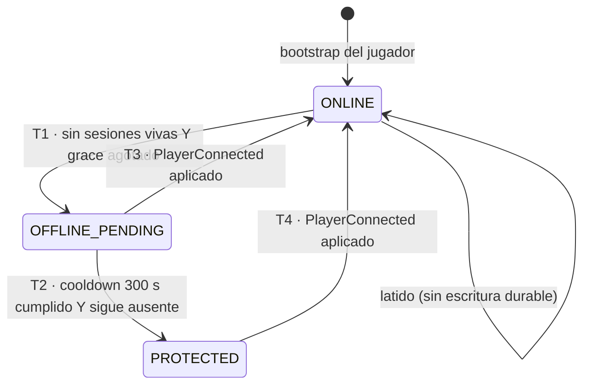

# Presence & Protection

Especificación de la presencia del jugador (volátil, Redis) y del `presence_state` durable de la ciudad (PostgreSQL), con el cooldown de protección offline y su evaluación en la fase de timers del tick.

| Campo | Valor |
|---|---|
| Spec ID | `SPEC-PRESENCE` |
| Estado | Draft |
| Milestone | M5 Offline protection & Safe Zones |
| Canon | §1, §6, §9, §10, §11, §12, §13, §14, §16, §17 |
| Depende de | [player.md](player.md), [city.md](city.md), [../architecture/game-loop.md](../architecture/game-loop.md) |
| Reemplaza a | — |
| Invariantes | Reutiliza `INV-CITY-004..006` del registro ([../invariants/city.md](../invariants/city.md)) y **añade** `INV-CITY-011..016`. Los `INV-CITY-008..010` los introduce [city.md](city.md) |

## 1. Objetivo

Definir, sin ambigüedad, qué significa que un jugador esté presente, cómo se traduce esa presencia en un estado
durable de su ciudad, cuánto tarda una ciudad abandonada en quedar protegida y qué implica exactamente estar
`PROTECTED` en el MVP. El principio rector del canon §1.3 es que *offline no detiene el mundo*: desconectarse
solo altera las reglas ligadas a la presencia del jugador, nada más.

## 2. Scope (y no-scope)

**Dentro del MVP**

- Presencia del jugador en Redis: clave `presence:player:{playerId}`, TTL 30 s, latido cada 10 s. Es estado
  **observable**, no la fuente de la decisión: ver `RN-PRESENCE-004`.
- `presence_state` durable de la ciudad en PostgreSQL con sus tres valores y todas sus transiciones.
- Grace de reconexión: una caída de red breve no degrada el estado.
- Cooldown `EO_CITY_OFFLINE_PROTECTION_COOLDOWN_SECONDS` = 300, evaluado en la **fase 5** del tick
  (*process timers/scheduled events*).
- Semántica y punto de aplicación de `PROTECTED` y del error `CITY_PROTECTED`.
- Casos borde: múltiples conexiones del mismo jugador, reinicio del servidor con el jugador offline, reloj
  desplazado.
- Difusión de los cambios mediante `city.update`.

**Fuera de MVP**

- Asedio, combate y cualquier acción hostil real: no existe ningún mensaje cliente→servidor de ataque en el
  canon §13. Aquí se define la **regla** y su **punto de aplicación**, no un sistema de combate.
- Límite temporal de la protección: `protection_until` es `NULL` en MVP (protección indefinida mientras el
  jugador siga offline, canon §9). La política de expiración es `TBD (fuera de MVP)`.
- Despliegue multi-proceso o multi-nodo del game server: en MVP hay un único proceso autoritativo.
  La clave de Redis está diseñada para soportarlo, pero el reparto de mundo entre procesos es
  `TBD (fuera de MVP)`.
- Notificación al jugador offline (email, push) de que su ciudad cambió de estado: `Fuera de MVP`.

## 3. Actores

| Actor | Rol |
|---|---|
| Jugador | Genera presencia conectándose y manteniendo la conexión. No decide ningún estado. |
| Conexión WebSocket | Portadora de la presencia. Puede haber varias por jugador (pestañas, dispositivos). |
| Servidor WebSocket (`internal/websocket`) | Al aceptar el handshake y al cerrar la conexión: marca/retira la presencia en Redis y **despacha un comando** `PlayerConnected` / `PlayerDisconnected` al game loop. No toca el estado del mundo. |
| Simulación (`internal/game/simulation`) | Guarda `sessions[playerID]` (contador de sesiones vivas) y `disconnectedAt[playerID]` en RAM, y es la **única** goroutine que muta `cities.presence_state`. |
| Tick loop, fase 5 (`Simulation.ProcessTimers`) | Único lugar donde se decide `ONLINE → OFFLINE_PENDING → PROTECTED`. |
| PostgreSQL | Durable: `cities.presence_state`, `last_online_at`, `last_offline_at`, `protection_until`, `version`, `sessions`. |
| Redis | Hot/transient: `presence:player:{playerId}`. Nunca sustituye a PostgreSQL (canon §1.4) y no participa en la decisión de degradar la ciudad. |

## 4. Inputs

| Input | Origen | Efecto |
|---|---|---|
| `session.hello` aceptado | cliente | `MarkOnline` fija `presence:player:{playerId}` = `sessionId` con TTL 30 s, y se despacha el comando `PlayerConnected`. El loop lo aplica: `sessions[playerID]++`, se olvida cualquier `disconnectedAt` y la ciudad pasa a `ONLINE`. |
| `session.ping` | cliente | `Heartbeat` renueva el TTL de la clave con `EXPIRE`. **No** toca el estado del mundo. |
| Cierre de conexión (limpio, timeout de lectura 45 s, `4429`, `4500`) | transporte | `ClearIfSession` retira la clave **solo si sigue siendo la de esa sesión**, y se despacha `PlayerDisconnected`. El loop decrementa el contador y, si llega a 0, anota `disconnectedAt[playerID] = now`. |
| Paso del tick (fase 5) | game loop | `Simulation.ProcessTimers(now)` reevalúa el grace de reconexión y el cooldown de protección. |
| Arranque del servidor | proceso | `simulation.Hydrate` carga `cities` con el `presence_state` que tuvieran. Ver §7.6. |

Configuración consumida:

| Variable | Valor por defecto | Uso |
|---|---|---|
| `EO_PRESENCE_TTL_SECONDS` | 30 | Dos usos: TTL de `presence:player:{playerId}` **y** `Deps.DisconnectGrace` de la simulación, que es el margen real que decide `T1`. `cmd/server/main.go` inyecta el mismo valor en ambos sitios, por lo que la ventana de grace observable y la efectiva coinciden. |
| `EO_PRESENCE_HEARTBEAT_SECONDS` | 10 | Periodo de refresco. Tres refrescos por TTL: se toleran dos pérdidas. Se publica al cliente en `session.welcome.heartbeatIntervalMs`. |
| `EO_CITY_OFFLINE_PROTECTION_COOLDOWN_SECONDS` | 300 | `Deps.ProtectionCooldown`: tiempo en `OFFLINE_PENDING` antes de `PROTECTED`. |
| `EO_TICK_RATE_HZ` | 10 | Granularidad de la evaluación: 100 ms. |
| `EO_PERSISTENCE_FLUSH_INTERVAL_TICKS` | 50 | No aplica aquí: la transición no viaja por el dirty-flag de unidades, sino por su propio `Job` en la cola de persistencia. |

`internal/config` valida en el arranque que `EO_PRESENCE_HEARTBEAT_SECONDS < EO_PRESENCE_TTL_SECONDS`
(estricto): si no, la presencia expiraría entre latidos.

## 5. Outputs

| Output | Destino | Cuándo |
|---|---|---|
| `SET presence:player:{playerId} <sessionId> EX 30` | Redis | Handshake (`MarkOnline`). |
| `EXPIRE presence:player:{playerId} 30` | Redis | Cada `session.ping` (`Heartbeat`). |
| `UPDATE cities SET presence_state, …, version = version + 1` | PostgreSQL | Cada transición, encolada como `Job{Name: "city.presence"}` en la cola de persistencia. |
| `city.update` | Suscriptores del chunk de la ciudad | Cada transición. Ver [city.md](city.md) §12. |
| Métrica `eo_connected_players` | Prometheus | Gauge de jugadores presentes. |
| Métrica `eo_connected_websockets` | Prometheus | Gauge de conexiones, mayor o igual que el anterior. |
| Log `msg="transición de presencia rechazada"` con `city_id`, `from`, `to` | stdout JSON | Solo cuando `city.CanTransition` rechaza el par: es la señal de un bug, no de una transición normal. |

No hay eventos de dominio propios de la presencia: `CityPresenceChanged`, `CityProtectionEngaged` y
`CityProtectionReleased` **no existen** en el código y no se escribe ninguna fila de `world_events` por una
transición de presencia. Ver §11.

## 6. Reglas de negocio

Dominio de reglas: `RN-PRESENCE`.

### 6.1 Dos presencias distintas que no hay que confundir

| Dimensión | Presencia del **jugador** | `presence_state` de la **ciudad** |
|---|---|---|
| Dónde vive | `sessions[playerID]` y `disconnectedAt[playerID]` en la RAM de la simulación; espejo observable en Redis (`presence:player:{playerId}`) | PostgreSQL (`cities.presence_state`) |
| Naturaleza | Volátil, *hot state* | Durable, *source of truth* |
| Valores | presente / ausente | `ONLINE`, `OFFLINE_PENDING`, `PROTECTED` |
| Vida | Mientras el proceso viva; la clave de Redis, TTL 30 s refrescado cada 10 s | Indefinida; sobrevive a reinicios y a pérdidas de Redis |
| Quién la cambia | El loop, al aplicar `PlayerConnected` / `PlayerDisconnected` | Solo el loop: fase 1-2 (comandos de conexión) y fase 5 (temporizadores) |
| Si se pierde Redis | Nada cambia: la decisión no lo consulta. Se pierde la observabilidad externa | Es un fallo grave: se ha perdido estado durable |
| Latencia de reacción | Un tick (100 ms) | Grace de 30 s, luego cooldown de 300 s |

| ID | Regla |
|---|---|
| `RN-PRESENCE-001` | Un jugador está **presente** para la simulación si y solo si `sessions[playerID] > 0`, o si aún no ha vencido su margen de reconexión (`now - disconnectedAt[playerID] < DisconnectGrace`). La decisión es enteramente aritmética sobre RAM y **no consulta Redis**. |
| `RN-PRESENCE-002` | El TTL de la clave de Redis es `EO_PRESENCE_TTL_SECONDS` (30 s) y se refresca con `EXPIRE` en cada `session.ping`, cada `EO_PRESENCE_HEARTBEAT_SECONDS` (10 s). El ratio 3:1 tolera la pérdida de dos latidos consecutivos sin que un observador externo declare ausente a un jugador conectado. |
| `RN-PRESENCE-003` | Al cerrarse una conexión, `ClearIfSession` retira la clave **solo si su valor sigue siendo el `sessionId` de esa conexión**; la comprobación y el `DEL` van en un único script Lua, atómico. Sin esa condición, cerrar una pestaña vieja marcaría ausente a un jugador que acaba de reconectar desde otra. Si la clave pertenece ya a otra sesión, no se toca. |
| `RN-PRESENCE-004` | El paso a `OFFLINE_PENDING` lo decide **el game loop en RAM**, no la expiración de la clave de Redis: ocurre cuando `sessions[playerID] == 0` y `now - disconnectedAt[playerID] >= DisconnectGrace`. `DisconnectGrace` toma el valor de `EO_PRESENCE_TTL_SECONDS` (30 s), de modo que la ventana efectiva coincide con la del TTL sin depender de que Redis esté vivo. Redis mantiene la presencia para observadores externos y para el futuro multiproceso. |
| `RN-PRESENCE-005` | El paso a `PROTECTED` ocurre cuando la ciudad lleva en `OFFLINE_PENDING` al menos `EO_CITY_OFFLINE_PROTECTION_COOLDOWN_SECONDS` (300 s) y el jugador sigue ausente. Lo decide `city.ShouldEngageProtection(state, lastOfflineAt, cooldown, now)`, cuyo predicado exacto es `state == OFFLINE_PENDING && lastOfflineAt != nil && !now.Before(lastOfflineAt.Add(cooldown))`. Se compara contra `cities.last_offline_at` (`timestamptz`); no existe ninguna columna `last_offline_time_ms`. |
| `RN-PRESENCE-006` | Reconectar lleva la ciudad a `ONLINE` **inmediatamente**, desde `OFFLINE_PENDING` o desde `PROTECTED`, sin cooldown de salida. El handshake **no** muta el mundo: despacha el comando `PlayerConnected`, que el loop aplica en la fase 1-2 del tick siguiente, antes de que se sirva el snapshot inicial. |
| `RN-PRESENCE-007` | Solo el servidor decide el estado. El cliente lo observa vía `city.update` y jamás lo propone (canon §1.1, §9). |
| `RN-PRESENCE-008` | Todas las comparaciones temporales usan el `Clock` inyectado (`clock.Clock`), nunca `time.Now()` dentro del dominio: `Loop.Step` toma `nowMs` del reloj y se lo pasa a `ProcessTimers`, y `Simulation` obtiene el instante de desconexión de `deps.Clock.Now()`. Los tests usan `FakeClock` y avanzan el tiempo a voluntad. |
| `RN-PRESENCE-009` | Ningún valor de gameplay se hardcodea: el cooldown, el TTL/grace y el latido llegan desde `internal/config` (canon §9, §17). |
| `RN-PRESENCE-010` | La fase 5 del tick **no hace I/O bloqueante** contra PostgreSQL ni contra Redis: opera sobre estado en RAM ya cargado y entrega la escritura a la cola de persistencia (`Persister.Submit`). La difusión de `city.update` sale en el mismo instante y **no espera al `COMMIT`**; la ventana de riesgo y su recuperación se documentan en §10. |
| `RN-PRESENCE-011` | `protection_until` permanece `NULL` mientras el jugador siga offline (protección indefinida en MVP): la transición a `PROTECTED` no lo escribe, y volver a `ONLINE` lo pone explícitamente a `NULL`. El campo queda previsto para límites futuros (canon §9). |
| `RN-PRESENCE-012` | Un movimiento `ACTIVE` iniciado antes de la desconexión **continúa** y se completa según su polilínea temporizada. Desconectarse no congela unidades: el mundo persiste (canon §1.2, §7). |

### 6.2 Qué significa exactamente `PROTECTED` en el MVP

`PROTECTED` **es** una única regla, enunciada así:

> Una ciudad con `presence_state = 'PROTECTED'` no puede recibir acciones de asedio. Toda acción hostil
> dirigida contra ella se rechaza con el código `CITY_PROTECTED`.

Y en el MVP esa regla **no tiene ningún llamador real**, porque el combate está fuera de scope: los únicos
mensajes cliente→servidor de la v1 son `session.hello`, `session.ping`, `session.view`, `unit.move` y
`unit.cancel_move` (canon §13). Ninguno es hostil. En consecuencia:

| ID | Regla |
|---|---|
| `RN-PRESENCE-013` | La comprobación vive en **un único predicado de dominio**, `City.IsProtected()` (`internal/domain/city/city.go`), que es cierto si y solo si `presence_state == PROTECTED`, y en el error de dominio `city.ErrProtected`, que la capa de protocolo traduce a `CITY_PROTECTED`. Es el punto de aplicación futuro y el único lugar donde esta decisión se toma. |
| `RN-PRESENCE-014` | En MVP el predicado existe, está testeado y **no lo invoca ningún handler**, porque no hay comandos hostiles. Envolverlo en un guard con clasificación exhaustiva de acciones —lo que [`INV-CITY-006`](../invariants/city.md#inv-city-006) exige— es trabajo del milestone en que aparezca la primera acción hostil; hasta entonces, invocarlo será obligatorio y su ausencia debe hacer fallar el code review. |
| `RN-PRESENCE-015` | `PROTECTED` **no** hace ninguna de estas cosas: no congela la ciudad, no detiene el mundo, no oculta la ciudad de `world.snapshot` ni de `city.update`, no vuelve invulnerables a las unidades fuera de la zona urbana, no bloquea el movimiento de terceros por tiles cercanos, y no impide que el propio jugador reconecte. |
| `RN-PRESENCE-016` | La protección es de la **ciudad**, no del jugador: las unidades del jugador ausente que estén en campo abierto no reciben ninguna protección por el estado de su ciudad. |

Documentar la regla sin fingir que el sistema de combate existe es intencional: el objetivo es que el día que
llegue el asedio, la semántica de protección no se reinvente ni se reparta por varios handlers.

### 6.3 Interacción con Safe Zones y unidades guarnecidas

| ID | Regla |
|---|---|
| `RN-PRESENCE-017` | La seguridad de una Safe Zone (`DENSE_FOREST`, `CAVERN`) es **por unidad** y **ortogonal** al `presence_state` de la ciudad: la calcula y valida siempre el servidor (canon §10). Una unidad en Safe Zone está a salvo aunque su ciudad esté `ONLINE`, y una unidad en campo abierto no está a salvo aunque su ciudad esté `PROTECTED`. |
| `RN-PRESENCE-018` | El estado `HIDDEN` de una unidad (canon §10) depende de la Safe Zone, no de la presencia del jugador. Desconectarse **no** oculta unidades ni las mueve a una Safe Zone. |
| `RN-PRESENCE-019` | Las unidades con `status = 'GARRISONED'` dentro de una ciudad `PROTECTED` quedan cubiertas por la protección de la ciudad, porque el guard de `RN-PRESENCE-013` se aplica sobre la ciudad y una acción de asedio contra la guarnición es una acción contra la ciudad. |
| `RN-PRESENCE-020` | La protección **no** habilita ni deshabilita el garrison: guarnecer requiere un `treaty` con `allows_garrison` y `status = 'ACTIVE'` (canon §10); en su ausencia el error es `TREATY_REQUIRED`, no `CITY_PROTECTED`. |
| `RN-PRESENCE-021` | Una ciudad `PROTECTED` no puede usarse como plataforma de ataque por aliados guarnecidos en ella. La regla queda enunciada aquí; su punto de aplicación es el mismo guard, invocado desde los futuros comandos ofensivos. `Fuera de MVP`. |

## 7. Estados y transiciones

### 7.1 Diagrama

```
                 conexión aceptada (session.hello OK)
        ┌──────────────────────────────────────────────────┐
        │                                                  │
        ▼                                                  │
   ┌─────────┐   T1: sesiones = 0 Y grace agotado   ┌───────────────┐
   │ ONLINE  │ ───────────────────────────────────► │OFFLINE_PENDING│
   └─────────┘        (DisconnectGrace = 30 s)      └───────────────┘
        ▲                                                  │
        │                                                  │ T2: now - last_offline_at
        │                                                  │     >= 300 s  Y  sigue ausente
        │  T4: conexión aceptada                           ▼
        │                                            ┌───────────┐
        └────────────────────────────────────────────│ PROTECTED │
                                                     └───────────┘
```



### 7.2 Tabla de transiciones

Todas las transiciones las aplica **la goroutine del game loop**, por `Simulation.applyPresence`, que primero
valida el par con `city.CanTransition` y descarta el que no esté permitido con un log `warn`. El `UPDATE` lo
escribe `CityRepo.SetPresence`, que además hace `version = version + 1` en las tres ramas.

| ID | Desde | Hasta | Disparador exacto | Dónde se evalúa | Columnas que escribe `SetPresence` | Difusión |
|---|---|---|---|---|---|---|
| `T1` | `ONLINE` | `OFFLINE_PENDING` | `sessions[playerID] == 0` **y** `now - disconnectedAt[playerID] >= DisconnectGrace` | Tick, fase 5 | `presence_state`, `last_offline_at = now`, `version` | `city.update` |
| `T2` | `OFFLINE_PENDING` | `PROTECTED` | `city.ShouldEngageProtection(...)`: `now - last_offline_at >= EO_CITY_OFFLINE_PROTECTION_COOLDOWN_SECONDS` | Tick, fase 5 | `presence_state`, `version`. **`protection_until` no se toca**: ya era `NULL` y la protección del MVP no caduca sola | `city.update` |
| `T3` | `OFFLINE_PENDING` | `ONLINE` | Comando `PlayerConnected` aplicado (originado por un `session.hello` verificado) | Tick, fase 1-2 | `presence_state`, `last_online_at = now`, `protection_until = NULL`, `version` | `city.update` |
| `T4` | `PROTECTED` | `ONLINE` | Comando `PlayerConnected` aplicado | Tick, fase 1-2 | `presence_state`, `last_online_at = now`, `protection_until = NULL`, `version` | `city.update` |
| `T5` | `ONLINE` | `ONLINE` | Latido (`session.ping`) o segunda sesión del mismo jugador | Servidor WS / loop | **Ninguna**: `applyPresence` sale sin hacer nada cuando el estado no cambia | — |

No existen otras transiciones. En particular no existe `PROTECTED → OFFLINE_PENDING` (no se degrada la
protección sin reconexión) ni `ONLINE → PROTECTED` (nunca se salta el `OFFLINE_PENDING`, que es el que
materializa el cooldown). `CanTransition` acepta además `from == to` como idempotente, y `applyPresence` corta
antes en ese caso: reaplicar el estado vigente no escribe ni difunde nada.

**Nota sobre `T1` y `T2` en el mismo tick.** `ProcessTimers` ejecuta primero el paso del grace y después el del
cooldown, sobre el mismo instante `now`. Como `T1` fija `last_offline_at = now`, el tiempo transcurrido que
evalúa `T2` en ese mismo tick vale 0: con cualquier cooldown estrictamente positivo la protección no puede
concederse en el tick en que se degrada. El caso degenerado `EO_CITY_OFFLINE_PROTECTION_COOLDOWN_SECONDS = 0`
(que la configuración admite) sí encadena `T1` y `T2` en el mismo tick, y es la única forma de observar
`ONLINE → OFFLINE_PENDING → PROTECTED` sin ningún tick intermedio. Sigue sin existir el salto directo
`ONLINE → PROTECTED`: se pasa por `OFFLINE_PENDING`, se persiste y se difunde.

### 7.3 El grace de reconexión, y por qué existe

Una caída de red breve —cambio de Wi-Fi a datos, un proxy que corta la conexión, un `F5` del navegador— cierra
el WebSocket sin que el jugador se haya ido. Degradar el estado de la ciudad al instante tendría dos costes
inaceptables: escrituras durables y difusiones `city.update` por cada parpadeo de red, y un jugador que ve su
ciudad cambiar de estado por un evento que no controla.

El grace se obtiene **sin temporizadores adicionales**: al quedarse sin sesiones, el loop anota
`disconnectedAt[playerID] = now` y la fase 5 no degrada nada hasta que ese instante quede a más de
`DisconnectGrace` (30 s) de distancia. No hay `time.AfterFunc`, ni goroutine por jugador, ni dependencia de que
Redis expire una clave a tiempo: es una resta de instantes evaluada en cada tick.

```
t=0s    último latido → EXPIRE presence:player:{p} 30       (observabilidad)
t=4s    cae la conexión: sessions 1 → 0, disconnectedAt[p] = t=4s
        ClearIfSession retira la clave si aún es la de esa sesión.
t=9s    el cliente reconecta, session.hello OK → PlayerConnected
        el loop borra disconnectedAt[p] y sessions pasa a 1
        presence_state nunca dejó de ser ONLINE. Cero escrituras durables.
        Ninguna difusión de city.update.

Grace = exactamente DisconnectGrace desde la caída de la ÚLTIMA sesión: 30 s.
```

Consecuencia deliberada: el tiempo hasta `PROTECTED` es de 330 s desde que el jugador cierra el navegador
(30 s de grace + 300 s de cooldown), más lo que tarde el tick en observarlo, que está acotado por la duración
de un tick (100 ms). El cooldown se mide desde la entrada en `OFFLINE_PENDING`, no desde el cierre del socket,
porque el instante del cierre no es por sí solo una desconexión.

### 7.4 Evaluación en la fase de timers del tick

El canon §6 fija el orden de fases; el cooldown y el grace se evalúan en la fase **5**,
`process timers/scheduled events`. La vuelta a `ONLINE` (`T3`/`T4`) no vive ahí: llega como comando y se aplica
en la fase 1-2.

```
tick N
 1. drain commands
 2. validate & apply commands         ◄── PlayerConnected / PlayerDisconnected (T3, T4)
 3. advance movement
 4. resolve simulation            (reservado: combate — fuera de MVP)
 5. process timers/scheduled events   ◄── grace y cooldown (T1, T2)
 6-7. world state / deltas            ◄── city.update se emite dentro de la propia transición
 8. enqueue persistence               ◄── el UPDATE de cities lo encola applyPresence
```

Ésta es la implementación real (`internal/game/simulation/simulation.go`), no un pseudocódigo:

```go
// ProcessTimers es la fase 5 del tick: presencia, protección y demás plazos.
// Es enteramente aritmética sobre estado en RAM. No consulta la base de datos.
func (s *Simulation) ProcessTimers(now time.Time) {
    // 1. Margen de reconexión agotado: ONLINE -> OFFLINE_PENDING.
    for playerID, since := range s.disconnectedAt {
        if s.sessions[playerID] > 0 {
            delete(s.disconnectedAt, playerID)
            continue
        }
        if now.Sub(since) < s.deps.DisconnectGrace {
            continue
        }
        s.setPresence(playerID, city.PresenceOfflinePending)
        delete(s.disconnectedAt, playerID)
    }

    // 2. Cooldown de seguridad vencido: OFFLINE_PENDING -> PROTECTED.
    s.state.EachCity(func(c *city.City) bool {
        if city.ShouldEngageProtection(c.PresenceState, c.LastOfflineAt, s.deps.ProtectionCooldown, now) {
            s.applyPresence(c, city.PresenceProtected, now)
        }
        return true
    })
}
```

Detalles no negociables:

- El recorrido del paso 2 usa `State.EachCity`, que ordena por `city.ID` antes de iterar. Prohibido iterar
  mapas de Go sin ordenar: dos ejecuciones con la misma entrada deben producir la misma secuencia de efectos.
  El paso 1 sí itera un mapa (`disconnectedAt`), pero su orden es irrelevante: cada entrada es independiente y
  afecta a una ciudad distinta.
- Ninguna de las dos pasadas consulta Redis ni PostgreSQL: `sessions`, `disconnectedAt` y `LastOfflineAt` ya
  están en RAM.
- La transición se aplica primero en RAM (autoritativo durante el tick), difunde `city.update` de inmediato y
  encola su `Job` de persistencia. La difusión **no espera al `COMMIT`**; §10 documenta la ventana de riesgo.
- Coste: el paso 2 recorre todas las ciudades en cada tick. `ShouldEngageProtection` descarta en su primera
  línea todo lo que no esté en `OFFLINE_PENDING`, así que es un recorrido lineal sin asignaciones. Mantener
  una lista incremental de candidatas es una optimización `TBD (fuera de MVP)`; el índice parcial
  `cities_offline_pending_idx` y `CityRepo.ListPendingProtection` existen para la consulta equivalente en
  PostgreSQL, que hoy no usa el tick.

### 7.5 Caso borde: múltiples pestañas o conexiones del mismo jugador

| ID | Regla |
|---|---|
| `RN-PRESENCE-022` | La presencia es **por jugador**, no por conexión. La simulación mantiene `sessions[playerID]` como contador entero en RAM. **Un jugador con varias sesiones sigue `ONLINE` mientras le quede una.** |
| `RN-PRESENCE-023` | El contador se incrementa al aplicar `PlayerConnected` y se decrementa al aplicar `PlayerDisconnected`, sea cual sea el motivo del cierre. Nunca baja de 0: `handlePlayerDisconnected` decrementa solo si el valor era `> 1`, y si no, borra la entrada del mapa. |
| `RN-PRESENCE-024` | El paso de `sessions[playerID]` a 0 **no** degrada nada por sí solo: solo anota `disconnectedAt[playerID]`, que es lo que arranca el grace de `RN-PRESENCE-004`. La clave de Redis, por su parte, guarda el `sessionId` de la **última** sesión que hizo `MarkOnline`, no un contador: es lo que hace seguro a `ClearIfSession` (`RN-PRESENCE-003`), pero significa que la clave no sabe cuántas conexiones hay. El contador autoritativo vive en RAM. |
| `RN-PRESENCE-025` | Cerrar una pestaña mientras otra sigue abierta **no** dispara nada: ni escritura durable, ni `city.update`, ni siquiera un `disconnectedAt`. `handlePlayerDisconnected` sale antes. |
| `RN-PRESENCE-026` | Una segunda conexión del mismo jugador **no** expulsa a la primera en MVP. Cada conexión tiene su propia sesión con su `sessionId` y su propio contador `seq`. La política de sesión única es `TBD (fuera de MVP)`. |
| `RN-PRESENCE-027` | El `jti` del ticket es de un solo uso (canon §14): abrir una segunda pestaña exige pedir un ticket nuevo. Esto no es una limitación de la presencia, es una propiedad de la autenticación. |

```
conexión A abierta   ──► sessions = 1 ──► ONLINE
conexión B abierta   ──► sessions = 2 ──► ONLINE   (sin cambios, sin difusión)
conexión A cerrada   ──► sessions = 1 ──► ONLINE   (sin cambios, sin difusión)
conexión B cerrada   ──► sessions = 0 ──► ONLINE   (grace: disconnectedAt = now)
+30 s sin reconectar ──► ausente     ──► OFFLINE_PENDING  (T1, un solo city.update)
```

`eo_connected_websockets` cuenta conexiones y `eo_connected_players` cuenta jugadores presentes; la primera es
siempre mayor o igual que la segunda, y su divergencia es la señal observable de este caso.

### 7.6 Caso borde: reinicio del servidor con el jugador offline

Al arrancar, el servidor no tiene ni conexiones ni (necesariamente) claves de Redis: Redis es *hot state* y
puede haberse vaciado. `simulation.Hydrate` carga las ciudades **tal cual estaban** en `cities`: no reescribe
`presence_state` ni ninguna marca temporal. A partir de ahí, la fase 5 del primer tick decide, y el resultado
por estado es éste:

| Estado en la fila | Situación real | Comportamiento real tras el arranque | Valoración |
|---|---|---|---|
| `ONLINE` | El proceso cayó sin poder degradar el estado. No se sabe cuándo se fue el jugador. | La ciudad **se queda `ONLINE` indefinidamente**: `disconnectedAt` arranca vacío, así que el paso 1 de la fase 5 no tiene a quién degradar. Solo vuelve al autómata cuando su dueño abre una sesión y la cierra. | Limitación conocida del MVP, no un descuido: el servidor no puede inventar un instante de desconexión, y con un único proceso autoritativo el efecto es que una ciudad cuyo dueño no vuelve nunca queda expuesta. Reanclar `last_offline_at = bootTimeMs` al arrancar y degradar tras el grace es `TBD (fuera de MVP)`. |
| `OFFLINE_PENDING` | El jugador ya estaba ausente antes del reinicio; `last_offline_at` es un dato durable y fiable. | Se **respeta** `last_offline_at`. Si `bootTime - last_offline_at >= cooldown`, la primera fase 5 aplica `T2` → `PROTECTED` de inmediato, porque `ShouldEngageProtection` solo mira ese campo. El tiempo de caída del servidor **cuenta** para el cooldown. | Correcto y deseado. La ausencia del jugador es un hecho previo e independiente de la caída del servidor, y errar hacia la protección es el modo de fallo seguro. |
| `PROTECTED` | Estado terminal hasta la reconexión. | Se mantiene sin cambios. | No hay degradación de protección sin reconexión (`T4` es la única salida). |

| ID | Regla |
|---|---|
| `RN-PRESENCE-028` | El arranque es **idempotente** respecto de la presencia: `Hydrate` no escribe `cities`, así que ejecutarlo dos veces sobre la misma base de datos deja `presence_state`, `last_offline_at` y `last_online_at` idénticos. |
| `RN-PRESENCE-029` | Redis vacío al arrancar es una condición **normal**, no un error: nada de la decisión de presencia lo consulta, y la ausencia de `presence:player:*` significa exactamente "nadie presente", que es cierto tras un arranque. |
| `RN-PRESENCE-030` | Las filas de `sessions` **no** se usan para inferir el instante de desconexión: la tabla tiene `connected_at` y `disconnected_at`, y ninguno de los dos representa el último latido. Cerrar en el arranque las sesiones que quedaron abiertas, y un registro durable del último latido que permitiese una reanudación exacta, son `TBD (fuera de MVP)`. |

### 7.7 Caso borde: reloj desplazado

| ID | Regla |
|---|---|
| `RN-PRESENCE-031` | El instante con el que trabaja la fase 5 lo aporta el `Clock` inyectado, que en producción es `SystemClock` y por tanto **el reloj de pared**. No hay un `tickTime` derivado de `epoch_ms + tickNumber * tickDurationMs` que aísle a la presencia de los saltos de reloj: un salto de NTP, un cambio de horario o un ajuste manual afectan al grace y al cooldown en el tick siguiente, aunque el proceso siga vivo. |
| `RN-PRESENCE-032` | Un salto **hacia adelante** acelera legítimamente ambos plazos: para el jugador ausente el tiempo transcurrido es real, y adelantar la protección es el modo de fallo seguro. Es el mismo razonamiento que en §7.6. |
| `RN-PRESENCE-033` | Un salto **hacia atrás** los retrasa: `now.Sub(since)` y `ShouldEngageProtection` devuelven simplemente "todavía no", sin error, sin log y sin desbordamiento. La comparación es `!now.Before(lastOfflineAt.Add(cooldown))` sobre `time.Time`, no una resta de enteros con signo, así que no hay ningún valor negativo con el que operar. Ninguna ciudad recibe protección antes de tiempo por un reloj desplazado. |
| `RN-PRESENCE-034` | El `ts` del cliente y cualquier instante enviado por el cliente son **informativos**: no participan en ninguna decisión de presencia ni de protección (canon §1.1). |
| `RN-PRESENCE-035` | El único desplazamiento con efecto duradero es el que ocurre **entre ejecuciones**, porque `last_offline_at` quedó persistido con el reloj anterior. No se corrige ni se detecta: un reloj de servidor con NTP funcionando es una precondición operativa, no algo que el dominio deba compensar. Detección y log de *clock skew* es `TBD (fuera de MVP)`. |

## 8. Errores

| Código | Condición exacta | Notas |
|---|---|---|
| `CITY_PROTECTED` | Acción hostil contra una ciudad con `presence_state = 'PROTECTED'`, detectada por `City.IsProtected()`. | En MVP sin llamadores reales (`RN-PRESENCE-014`). |
| `CITY_NOT_FOUND` | Se consulta el estado de un `cities.id` inexistente o fuera del área de interés del solicitante. | No revela existencia. |
| `TREATY_REQUIRED` | Intento de guarnecer sin `treaty` `ACTIVE` con `allows_garrison`. | Precede a cualquier consideración de protección (`RN-PRESENCE-020`). |
| `UNAUTHORIZED` | Ticket inválido o `jti` reutilizado durante el handshake que habría producido `T3`/`T4`. | Cierre `4401`; el estado de la ciudad no cambia, porque nunca llega a despacharse `PlayerConnected`. |
| `RATE_LIMITED` | Exceso de `session.ping` o de cualquier mensaje por encima de `EO_WS_RATE_LIMIT_PER_SECOND` (20, burst 40). | El rate limit **no** degrada la presencia: el jugador sigue presente hasta el cierre `4429`, que es el que despacha `PlayerDisconnected`. |
| `INTERNAL_ERROR` | Fallo de PostgreSQL al persistir una transición, tras agotar los reintentos de la cola. | La transición sigue vigente en RAM y ya se difundió. Ver §10. |
| `NOT_IMPLEMENTED` | Comando de asedio, ataque o expiración manual de protección. | Todo `Fuera de MVP`. |

No se introduce ningún código nuevo: `PROTECTED`, la expiración de presencia y el cooldown se expresan
enteramente con el catálogo del canon §16.

## 9. Invariantes (con ID)

El **único registro de numeración** es [docs/invariants/](../invariants/README.md): un ID estable designa un
solo invariante y no se reutiliza con otro significado. El canon §22 no define una familia `INV-PRESENCE`, y la
presencia de la ciudad es estado de `cities`, así que sus invariantes pertenecen a la familia `INV-CITY`.

Esta spec **cita** `INV-CITY-004..006`, ya asignados en [../invariants/city.md](../invariants/city.md), y
**añade** `INV-CITY-011..016`, que continúan la familia por encima de los `INV-CITY-008..010` que introduce
[city.md](city.md). No reasigna ningún ID existente.

**Invariantes del registro que esta spec hace cumplir:**

| ID | Enunciado del registro | Dónde lo defiende esta spec |
|---|---|---|
| [`INV-CITY-004`](../invariants/city.md#inv-city-004) | El dominio de `presence_state` es cerrado. | `CHECK cities_presence_state_valid`, el tipo `city.PresenceState` con `Valid()`, y el enum `PresenceState` de `packages/protocol`. |
| [`INV-CITY-005`](../invariants/city.md#inv-city-005) | Solo transiciones permitidas de `presence_state`. | §7.2; `applyPresence` valida con `city.CanTransition` antes de escribir, y descarta con log `warn` el par no permitido. En particular no existe `ONLINE → PROTECTED` directo. |
| [`INV-CITY-006`](../invariants/city.md#inv-city-006) | Una ciudad protegida rechaza las acciones prohibidas. | §6.2; `City.IsProtected()` y `city.ErrProtected` → `CITY_PROTECTED`. |

**Invariantes nuevos que introduce esta spec** (`INV-CITY-011..016`):

| ID | Invariante | Verificación |
|---|---|---|
| `INV-CITY-011` | Si `presence_state != 'ONLINE'`, entonces `last_offline_at IS NOT NULL`. Nunca se está fuera de línea sin saber desde cuándo. | La única vía a `OFFLINE_PENDING` es `applyPresence`, que fija `LastOfflineAt` antes de encolar el `UPDATE`, y `PROTECTED` solo se alcanza desde `OFFLINE_PENDING`. Consulta de consistencia en test de integración. |
| `INV-CITY-012` | Si `presence_state = 'ONLINE'`, entonces `protection_until IS NULL`. | La rama `PresenceOnline` de `CityRepo.SetPresence` escribe `protection_until = NULL` explícitamente, y `applyPresence` hace lo propio en RAM. Consulta de consistencia tras cada `T3`/`T4`. |
| `INV-CITY-013` | Para toda ciudad en `PROTECTED`, transcurrió el cooldown completo desde `last_offline_at`: `now - last_offline_at >= EO_CITY_OFFLINE_PROTECTION_COOLDOWN_SECONDS`. La protección nunca se concede antes de tiempo. | `city.ShouldEngageProtection` es el único camino a `PROTECTED`. Test de simulación con `FakeClock` en los bordes 299 s / 300 s. |
| `INV-CITY-014` | Ninguna ciudad queda `PROTECTED` mientras su dueño tenga al menos una sesión viva: aplicar `PlayerConnected` la devuelve a `ONLINE` antes de que se sirva el snapshot de esa sesión. | `handlePlayerConnected` fuerza `ONLINE` en el mismo comando que incrementa el contador, y el loop es el único escritor, así que no hay ventana observable. Consulta de consistencia cruzando `sessions[playerID]` con `cities`. |
| `INV-CITY-015` | `last_online_at` y `last_offline_at` son monótonos no decrecientes dentro de una ejecución del proceso. | Ambos se escriben siempre con el instante del `Clock` inyectado, que en producción es `SystemClock`. Test de simulación con conexiones y desconexiones alternadas. |
| `INV-CITY-016` | El arranque no altera la presencia: `Hydrate` carga `cities` sin escribir, luego ejecutarlo dos veces sobre la misma base de datos deja `presence_state`, `last_offline_at` y `last_online_at` idénticos. | Test de recovery; ver `RN-PRESENCE-028` y la limitación conocida de la fila `ONLINE` en §7.6. |

Tres propiedades que esta spec **no** eleva a invariante, porque no lo son:

- «El contador de sesiones nunca es negativo» es una propiedad de `handlePlayerDisconnected` y está enunciada
  como `RN-PRESENCE-023`; se verifica con `T-PRES-U-002`.
- «Si hay sesiones vivas, la clave de Redis existe» es **falso** por diseño: si Redis falla, `MarkOnline`
  registra un `warn` y la sesión sigue siendo válida (`RN-PRESENCE-004`). Es una propiedad *best-effort* de la
  observabilidad, no del estado.
- «`eo_connected_websockets >= eo_connected_players`» es una relación entre dos gauges de observabilidad, no
  una propiedad del estado del mundo; se comprueba con `T-PRES-I-003`.

## 10. Persistencia

**1. Autoritativo en RAM del game server**

- `sessions[playerID]` y `disconnectedAt[playerID]`: los dos mapas que lee la fase 5.
- `PresenceState`, `LastOnlineAt`, `LastOfflineAt` y `ProtectionUntil` de cada ciudad cargada.

**2. Escritura durable encolada, no write-through** (canon §12)

- Toda transición `T1`..`T4` se aplica primero en RAM y se entrega a la cola de persistencia como
  `Job{Name: "city.presence"}`, que ejecuta `CityRepo.SetPresence(ctx, cityID, state, at)` fuera del tick.
  Escribe `presence_state`, la marca temporal que corresponda al estado destino y `version = version + 1`.
- El tick **nunca** ejecuta I/O de PostgreSQL, así que la transición no puede ser síncrona respecto del tick.
  La cola reintenta con backoff y, si agota los intentos, aplica su compensación.

**Ventana de riesgo, declarada.** `city.update` se difunde antes del `COMMIT`. Si el proceso muere entre la
transición y la escritura, la fila conserva el estado anterior mientras los clientes ya vieron el nuevo. Es un
RPO documentado, no un descuido, y sus dos casos son asimétricos:

- Se pierde una `T1`/`T2`: al arrancar, la ciudad vuelve a un estado **menos** protegido que el difundido. Con
  el dueño ausente, la fase 5 la vuelve a degradar en cuanto vuelva a haber una desconexión observada — salvo
  el caso `ONLINE` de §7.6, donde no la hay.
- Se pierde una `T3`/`T4`: al arrancar, la ciudad queda `PROTECTED` u `OFFLINE_PENDING` con el dueño de vuelta.
  El primer `session.hello` la devuelve a `ONLINE` ([`INV-CITY-014`](#9-invariantes-con-id)), así que se corrige sola.

**3. Dirty-flag + flush periódico**

- Nada. El dirty-flag y `EO_PERSISTENCE_FLUSH_INTERVAL_TICKS` gobiernan las posiciones de unidades, no la
  presencia: una transición es un hecho de baja frecuencia y alta consecuencia, y va por su propio `Job`.

**4. Reconstruible (no se persiste)**

- La presencia del jugador: `sessions` y `disconnectedAt` nacen vacíos en cada arranque. Tras un reinicio,
  "nadie presente" es la respuesta correcta.
- La ventana de grace: es una resta de instantes evaluada en cada tick, no un temporizador con estado propio.
- `T5` (latido) **no** genera ninguna escritura durable. Es el evento más frecuente del sistema y persistirlo
  sería el error de rendimiento evidente de este subsistema.

### 10.1 Clave de Redis

```
KEY    presence:player:{playerId}
VALUE  sessionId (uuid en texto) de la ÚLTIMA sesión que hizo MarkOnline
TTL    EO_PRESENCE_TTL_SECONDS = 30
OPS    SET    presence:player:{p} <sessionId> EX 30   (MarkOnline, en el handshake)
       EXPIRE presence:player:{p} 30                  (Heartbeat, en cada session.ping)
       EXISTS presence:player:{p}                     (IsOnline)
       GET    presence:player:{p}                     (SessionOf)
       SCAN   presence:player:*                       (CountOnline, métrica)
       DEL condicional vía script Lua                 (ClearIfSession, al cerrar)
```

El valor **no** es un contador de conexiones: es el `sessionId` que permite a `ClearIfSession` retirar la clave
solo si sigue siendo suya. El `GET` y el `DEL` van en un único script Lua, atómico, porque comprobar y borrar
por separado dejaría marcar ausente a un jugador que acaba de reconectar desde otra pestaña.

Esta clave es estado **observable**: la decisión de degradar la ciudad se toma contra `sessions` y
`disconnectedAt` en RAM (`RN-PRESENCE-004`). Redis existe aquí para que un proceso externo pueda saber quién
está conectado, y para el reparto de mundo entre procesos, que es `TBD (fuera de MVP)`. Si Redis se cae, la
simulación no se entera y nada del estado durable cambia.

## 11. Eventos

**Hoy no existe ningún evento de dominio de presencia.** Una transición produce exactamente dos efectos
observables, y ninguno de ellos es una fila de `world_events`:

| Efecto | Forma | Emitido cuando |
|---|---|---|
| Delta de red | `city.update` con `presenceState` (y `id`), difundido con `Broadcaster.BroadcastChunk` al chunk del centro de la ciudad. | Cualquiera de `T1`..`T4`, en el mismo instante en que se aplica en RAM. |
| Escritura durable | `Job{Name: "city.presence"}` en la cola de persistencia → `CityRepo.SetPresence`. | Cualquiera de `T1`..`T4`. |

`CityPresenceChanged`, `CityProtectionEngaged` y `CityProtectionReleased` **no están implementados**: no hay bus
de eventos de dominio ni fila de `world_events` para ellos. El único `world_events` que escribe el MVP es
`PlayerBootstrapped` (ver [city.md](city.md) §11). Añadir estos tres eventos en pasado (canon §15), con
`world_events` como consumidor para auditoría, es `TBD (fuera de MVP)`; `EventRepo.Append` es el punto de
extensión y no requiere migración.

## 12. Contratos de red

No existe ningún mensaje cliente→servidor relacionado con la presencia más allá de `session.hello` y
`session.ping` (canon §13). El cliente **observa** el estado; nunca lo propone.

Los cambios se difunden con `city.update`, cuyo esquema completo está en [city.md](city.md) §12. Ejemplo de
transición a protegida:

```json
{
  "v": 1,
  "type": "city.update",
  "seq": 512,
  "ts": 1767830712400,
  "payload": {
    "id": 1042,
    "presenceState": "PROTECTED"
  }
}
```

Reglas del contrato:

- `city.update` es un **delta parcial**: solo `id` es obligatorio. Una transición de presencia emite `id` y
  `presenceState` y nada más; no reenvía nombre ni población.
- `id` es un entero JSON (`EntityId = z.number().int().min(1)`), no una cadena, y el campo se llama `id`, no
  `cityId`.
- `city.update` de presencia se difunde a **todos** los suscriptores del chunk de la ciudad, no solo al
  propietario: saber que una ciudad está protegida antes de intentar una acción hostil es información que el
  juego debe dar por adelantado.
- `protectionUntilMs` es opcional y anulable; en MVP vale `null` siempre (`RN-PRESENCE-011`), y la transición a
  `PROTECTED` ni siquiera lo incluye. El cliente debe tratar su ausencia o su `null` como "protección sin fecha
  de fin conocida", nunca como "sin protección": el campo autoritativo es `presenceState`.
- Al reconectar, el `world.snapshot` inicial ya refleja `presenceState = "ONLINE"`: el handshake despacha
  `PlayerConnected` **antes** de pedir el snapshot, y el snapshot se sirve por el mismo canal de comandos que
  aplica la transición, de modo que el loop la ha aplicado ya cuando construye la respuesta.
- Ningún mensaje transporta el TTL de Redis, el contador de sesiones ni el instante de desconexión: son
  detalles internos del servidor.

## 13. Tests esperados

| ID | Nivel | Descripción | Cubre |
|---|---|---|---|
| `T-PRES-U-001` | unit | `city.CanTransition`: matriz completa 3×3 más los pares con estados inválidos; las cuatro aristas y la identidad son válidas, el resto no. | `INV-CITY-005` |
| `T-PRES-U-002` | unit | El contador de sesiones nunca baja de 0 ante cierres duplicados, y un jugador con dos sesiones sigue presente al cerrar una. | `RN-PRESENCE-022`, `RN-PRESENCE-023` |
| `T-PRES-U-003` | unit | `City.IsProtected()` es cierto solo con `presence_state = 'PROTECTED'`. | `RN-PRESENCE-013`, `INV-CITY-006` |
| `T-PRES-U-004` | unit | `ShouldEngageProtection` en sus bordes: `state != OFFLINE_PENDING` → falso; `lastOfflineAt == nil` → falso; `now` justo antes y justo en el vencimiento. | `RN-PRESENCE-005`, `INV-CITY-013` |
| `T-PRES-S-001` | **simulation** | `FakeClock`: jugador desconecta en `t0`; a `t0+29 s` → sigue `ONLINE`; a `t0+31 s` → `OFFLINE_PENDING`; a `t0+31+299 s` → sigue `OFFLINE_PENDING`; a `t0+31+300 s` → `PROTECTED`, con un único `city.update` por transición. | `T1`, `T2`, `INV-CITY-005`, `INV-CITY-013` |
| `T-PRES-S-002` | simulation | `FakeClock`: reconexión dentro de `OFFLINE_PENDING` → `ONLINE` inmediato, y avanzar 600 s más no produce ninguna transición. | `T3`, `RN-PRESENCE-006` |
| `T-PRES-S-003` | simulation | `FakeClock`: reconexión estando `PROTECTED` → `ONLINE` y `ProtectionUntil` queda `nil`. | `T4`, `INV-CITY-012` |
| `T-PRES-S-004` | simulation | Frontera exacta del cooldown con `FakeClock`: a 299 999 ms sigue `OFFLINE_PENDING`; a 300 000 ms pasa a `PROTECTED`. | `INV-CITY-013` |
| `T-PRES-S-005` | simulation | Un jugador con dos sesiones: cerrar una no anota `disconnectedAt` y avanzar 600 s no degrada la ciudad; cerrar la segunda sí arranca el grace. | `RN-PRESENCE-025`, `INV-CITY-014` |
| `T-PRES-S-006` | simulation | Reconexión y desconexión alternadas 100 veces: `LastOnlineAt` y `LastOfflineAt` no decrecen nunca. | `INV-CITY-015` |
| `T-PRES-S-007` | simulation | Un movimiento `ACTIVE` iniciado antes de la desconexión se completa igualmente mientras la ciudad pasa a `OFFLINE_PENDING`. | `RN-PRESENCE-012` |
| `T-PRES-I-001` | integration | Redis real: la clave existe con TTL ≤ 30 s tras el handshake y `EXPIRE` la renueva con cada `session.ping`. | `RN-PRESENCE-002` |
| `T-PRES-I-002` | integration | `ClearIfSession` con el `sessionId` de una sesión ya sustituida **no** borra la clave; con el suyo, sí. | `RN-PRESENCE-003`, `RN-PRESENCE-024` |
| `T-PRES-I-003` | integration | Dos conexiones del mismo jugador: cerrar una no produce ningún `city.update`, y `eo_connected_websockets >= eo_connected_players` en todo momento. | `RN-PRESENCE-025` |
| `T-PRES-I-004` | integration | Cada transición deja la fila de `cities` coherente (`presence_state`, marca temporal, `version` incrementada) y emite un único `city.update`. | `INV-CITY-011`, `INV-CITY-012`, §10 |
| `T-PRES-I-005` | integration | Cerrar todas las conexiones no altera `players` ni `units`, y `cities` solo cambia por la transición de presencia. | canon §1.2 |
| `T-PRES-R-001` | **recovery** | Ciudad en `OFFLINE_PENDING` con `last_offline_at` de hace 400 s; se reinicia el servidor → la primera fase 5 la deja `PROTECTED`. | §7.6 |
| `T-PRES-R-002` | recovery | Ciudad en `ONLINE` al caer el proceso: tras reiniciar sigue `ONLINE` y **no** se degrada sola. Documenta la limitación conocida de §7.6 en lugar de fingir que se reancla. | §7.6 |
| `T-PRES-R-003` | recovery | Ejecutar `Hydrate` dos veces sobre la misma base de datos produce exactamente el mismo estado de presencia. | `INV-CITY-016`, `RN-PRESENCE-028` |
| `T-PRES-R-004` | recovery | Redis vaciado con el servidor en marcha: los jugadores conectados no caen a `OFFLINE_PENDING`, porque la decisión no consulta Redis. | `RN-PRESENCE-004`, `RN-PRESENCE-029` |
| `T-PRES-C-001` | contract | `city.update` con `id` y `presenceState` valida contra el JSON Schema exportado por `@empires-online/protocol`, y el enum de `presenceState` coincide con las tres constantes de Go. | §12, `INV-CITY-004` |
| `T-PRES-C-002` | contract | `system.error` con `CITY_PROTECTED` cumple el formato del catálogo de 22 códigos. | §8 |

Esqueleto del test de simulación principal, con `FakeClock` avanzando más allá del cooldown. Se usan las
dependencias reales de la simulación (`ProtectionCooldown: 300 s`, `DisconnectGrace: 30 s`), y el avance del
mundo es `loop.Step` / `sim.ProcessTimers` con el reloj falso, sin temporizadores reales:

```go
func TestCityBecomesProtectedAfterCooldown(t *testing.T) { // INV-CITY-005, INV-CITY-013
    clk := clock.NewFakeClock(epochMs)
    sim := newSim(t, clk) // ProtectionCooldown 300s, DisconnectGrace 30s
    c := sim.State().CityOf(playerID)
    require.Equal(t, city.PresenceOnline, c.PresenceState)

    sim.Apply(simulation.PlayerDisconnected{PlayerID: playerID}) // empieza el grace
    advance(sim, clk, 29*time.Second)
    require.Equal(t, city.PresenceOnline, c.PresenceState, "aún dentro del margen")

    advance(sim, clk, 2*time.Second) // t = 31 s: grace agotado → T1
    require.Equal(t, city.PresenceOfflinePending, c.PresenceState)
    require.NotNil(t, c.LastOfflineAt) // INV-CITY-011

    advance(sim, clk, 299*time.Second)
    require.Equal(t, city.PresenceOfflinePending, c.PresenceState, "el cooldown aún no venció")

    advance(sim, clk, 1*time.Second) // cooldown cumplido → T2
    require.Equal(t, city.PresenceProtected, c.PresenceState)
    require.Nil(t, c.ProtectionUntil) // RN-PRESENCE-011
}
```

El paquete `internal/game/simulation` ya tiene tests en verde para la presencia y la protección, para el caso
de varias sesiones y para el movimiento con el jugador desconectado; `internal/domain/city` cubre el autómata
completo y los bordes de `ShouldEngageProtection`.

Los tests de integración y recovery requieren Docker Desktop iniciado y `EO_INTEGRATION=1`; el acceso a
PostgreSQL y Redis se hace vía `docker compose exec`, porque `psql` y `redis-cli` no están instalados en la
máquina de desarrollo (canon §3). **Están diseñados pero no ejecutados**: el daemon de Docker no arranca en
esta máquina, así que no se afirma que pasen.
