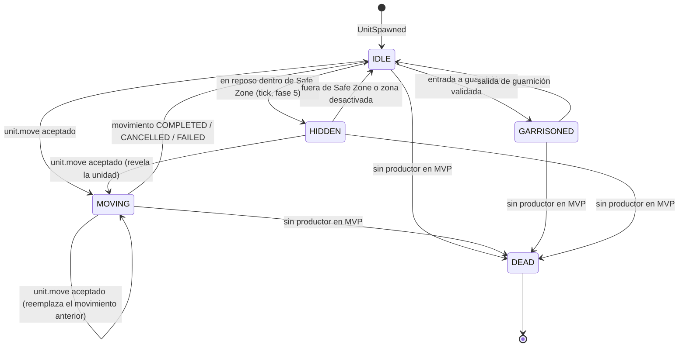

# Unit

Especificación funcional y técnica de la entidad `Unit`: modelo de datos, máquina de estados, catálogo de tipos, reglas de ownership, persistencia, eventos y contratos de red.

| Campo | Valor |
|---|---|
| Spec ID | `SPEC-UNIT` |
| Estado | Draft |
| Milestone | M2 Player & City / M4 Movement |
| Canon | §1, §10, §11, §12, §13, §16 |
| Depende de | [player.md](player.md), [city.md](city.md), [movement.md](movement.md) |
| Reemplaza a | — |
| Invariantes | cita `INV-UNIT-001..006` del registro; asigna `INV-UNIT-007..011` |

## 1. Objetivo

`Unit` es la entidad móvil controlable del mundo. Es el sujeto de las órdenes de movimiento
(`unit.move`, `unit.cancel_move`), el objeto de la guarnición (`GARRISONED`) y del ocultamiento en
Safe Zones (`HIDDEN`). Toda su verdad es autoritativa del servidor: el cliente jamás aporta posición,
HP, estado ni ownership (canon §1.1).

## 2. Scope

**Dentro de MVP**

- Persistencia de la entidad en la tabla `units`.
- Máquina de estados `IDLE`, `MOVING`, `GARRISONED`, `HIDDEN`, `DEAD`.
- Catálogo de tipos de unidad data-driven con `VILLAGER` como único tipo jugable.
- Validación de ownership para todo comando dirigido a una unidad.
- Spawn inicial: 3 `VILLAGER` junto al `TOWN_CENTER` de la ciudad inicial (canon §10).
- Emisión de `entity.spawn` / `entity.update` / `entity.despawn` por área de interés.

**Fuera de MVP**

- Combate, daño, curación y por tanto cualquier productor real del estado `DEAD`.
- Entrenamiento y coste de unidades (economía).
- Tipos de unidad militares, unidades navales, unidades de asedio.
- Transferencia de ownership entre jugadores.
- Comandos de red `unit.garrison` / `unit.ungarrison`: **TBD (fuera de MVP)**. El protocolo v1 solo
  define `unit.move` y `unit.cancel_move` como comandos sobre unidades (canon §13).

## 3. Actores

| Actor | Rol |
|---|---|
| Player propietario | Emite comandos sobre sus unidades; es el único autorizado. |
| Game Server (loop) | Único autor de mutaciones de estado; ejecuta las fases del tick (canon §6). |
| Observadores | Sesiones suscritas al chunk donde está la unidad; reciben deltas, nunca comandos. |

## 4. Modelo de datos

Campos canónicos de `units` (canon §10 y §11):

| Campo | Tipo | Null | Semántica |
|---|---|---|---|
| `id` | `bigint GENERATED ALWAYS AS IDENTITY` | no | Identidad de la unidad. |
| `player_id` | `uuid` | no | Propietario. FK a `players.id` `ON DELETE CASCADE`. Inmutable en MVP. |
| `city_id` | `bigint` | **sí** | Ciudad de origen y, si `status = GARRISONED`, ciudad anfitriona. FK a `cities.id` `ON DELETE SET NULL`. |
| `unit_type` | `text` | no | Clave del catálogo de tipos. MVP: `VILLAGER`. Sin `CHECK`: el dominio cerrado lo impone `unit.Lookup` (`INV-UNIT-009`), porque el catálogo vive en código y no en la base. |
| `x` | `integer` | no | Coordenada lógica de mapa (columna, hacia el este). |
| `y` | `integer` | no | Coordenada lógica de mapa (fila, hacia el sur). |
| `hp` | `integer` | no | Puntos de vida actuales. |
| `max_hp` | `integer` | no | Puntos de vida máximos, copiados del catálogo al crear. |
| `status` | `text` + `CHECK` | no | `IDLE` \| `MOVING` \| `GARRISONED` \| `HIDDEN` \| `DEAD`. |
| `chunk_x` | `integer` | no | Chunk desnormalizado de `x`. Clave del interest management. |
| `chunk_y` | `integer` | no | Chunk desnormalizado de `y`. Se reescribe en cada escritura de `x`/`y`. |
| `created_at` / `updated_at` | `timestamptz` | no | Auditoría; `updated_at` por trigger `units_set_updated_at`. |

El DDL canónico y sus índices viven en [../database/schema.md](../database/schema.md); esta spec fija
la semántica, no la sintaxis. Los `CHECK` reales de la tabla son `units_status_valid` (dominio cerrado
de `status`), `units_hp_within_max` (`hp <= max_hp`) y los de rango `hp >= 0` / `max_hp > 0`. Los índices
son `units_player_idx` y `units_chunk_idx`, ambos parciales sobre `status <> 'DEAD'`, y `units_city_idx`,
parcial sobre `city_id IS NOT NULL`.

Los límites del mundo **no** son un `CHECK` de la tabla: `EO_WORLD_WIDTH` y `EO_WORLD_HEIGHT` son
configuración de arranque y una constraint no puede depender de ellos. Esa mitad de
[`INV-UNIT-001`](../invariants/units.md#inv-unit-001) se garantiza en dominio y en la validación de
arranque, y así debe declararse: es un invariante sin respaldo `DB`, no un invariante con respaldo que
alguien olvidó escribir.

Dos columnas que **no** existen en `units`, y que ninguna spec debe citar como tales:

- **`version`.** `units` no lleva concurrencia optimista. La única tabla del MVP con `version` es `cities`.
  La unicidad que protege el movimiento no es una versión, sino el índice parcial único
  `unit_movements_one_active_per_unit` (ver [movement.md](./movement.md)).
- **`base_ms_per_tile`.** La velocidad no se materializa en la fila: se resuelve del catálogo por
  `unit_type` en el momento de construir la polilínea (§5). Copiarla en la fila obligaría a una migración
  de datos por cada ajuste de balance.

`max_hp`, en cambio, sí se **copia** del catálogo al crear la unidad, en lugar de resolverse por lookup en
cada lectura. Motivo: si mañana el catálogo sube `VILLAGER` de 40 a 45 HP, las unidades ya existentes no
deben mutar retroactivamente su techo de vida ni volverse inconsistentes con `hp`. La asimetría con
`base_ms_per_tile` es deliberada: `max_hp` acota un estado persistido (`hp`), mientras que la velocidad
solo alimenta un cálculo que se rehace entero en cada orden.

### 4.1 Las coordenadas son lógicas de mapa, nunca de pantalla

`x` e `y` son índices de tile en el grid 512 × 512 del mundo (canon §4), con origen (0,0) arriba a la
izquierda. El servidor **nunca** maneja píxeles y nunca almacena una posición isométrica. La
proyección `screenX = (x - y) * 32`, `screenY = (x + y) * 16` es responsabilidad exclusiva del
cliente PixiJS y no aparece en ninguna tabla, en ningún payload ni en ningún test del servidor.

Corolario operativo: cualquier campo de red llamado `x`/`y` en un mensaje de unidad es un tile. Un
cliente que envíe coordenadas de pantalla produce `TARGET_OUT_OF_BOUNDS` o `INVALID_TARGET`, no un
comportamiento degradado. La interpolación entre tiles durante un movimiento es puramente visual
(canon §7); la posición autoritativa siempre cae en un tile entero.

## 5. Catálogo de tipos de unidad

MVP define un único tipo (canon §10):

| `unit_type` | `MaxHP` | `BaseMsPerTile` | `PopulationCost` | Estado |
|---|---|---|---|---|
| `VILLAGER` | 40 | 600 | 1 | MVP |

`TOWN_CENTER` **no** es una unidad: es un *building* y no aparece nunca en `units` (canon §10).

El catálogo es una **tabla de definiciones inmutable** en `internal/domain/unit/unit.go`, con un único
punto de consulta:

```go
// Definition son las estadísticas inmutables de un tipo de unidad.
type Definition struct {
    Type           Type
    MaxHP          int32
    BaseMsPerTile  int64 // ms para cruzar un tile de coste base, sin diagonal
    PopulationCost int32
}

// Lookup devuelve la definición de un tipo de unidad, o ErrUnknownType.
func Lookup(t Type) (Definition, error)
```

No hay campo `garrisonable`: en MVP `VILLAGER` es el único tipo y la guarnición se decide por estado y
por tratado, no por una bandera del catálogo. Tampoco hay `version` de catálogo: la única versión que se
verifica es la del protocolo.

### 5.1 Por qué las estadísticas viven en un catálogo y no dispersas por el código

1. **Punto único de verdad.** `MaxHP = 40` y `BaseMsPerTile = 600` aparecen exactamente una vez. El canon
   §17 lo exige: ningún valor de gameplay se hardcodea en más de un lugar. `bootstrap.go` toma `MaxHP` de
   `unit.Lookup`; `handleMoveUnit` toma `BaseMsPerTile` del mismo sitio.
2. **Determinismo auditable.** Un test de simulación puede afirmar tiempos exactos de recorrido —600 ms
   por tile ortogonal de `GRASSLAND`, 849 ms en diagonal— porque la constante no está replicada.
3. **Extensión aditiva.** Añadir `ARCHER` o `SPEARMAN` es añadir una entrada al catálogo y las reglas que
   la consumen, sin tocar la máquina de estados ni el protocolo.
4. **Frontera limpia con Civilization.** Los rasgos de civilización (`civilizations.traits`, ver
   [player.md](player.md) §6.2) son multiplicadores sobre estos valores base, algo imposible de hacer
   limpiamente si la estadística vive en el cuerpo de una función.

**Estado real en MVP:** el catálogo vive en código Go, no en datos externos, porque solo hay un tipo de
unidad. Mover el catálogo a un fichero embebido con `go:embed` o a una tabla `unit_types` de PostgreSQL
está **fuera de MVP** (el canon §11 no incluye esa tabla); cuando llegue, la migración es puramente
aditiva y solo cambia la implementación de `Lookup`, sin afectar al dominio ni al protocolo.

## 6. Máquina de estados



### 6.1 Transiciones válidas

| # | Origen | Destino | Disparador | Autor |
|---|---|---|---|---|
| T1 | — | `IDLE` | Creación de la unidad (spawn inicial de ciudad) | Servicio de ciudad |
| T2 | `IDLE` | `MOVING` | `unit.move` validado y path calculado | Fase 2 del tick |
| T3 | `HIDDEN` | `MOVING` | `unit.move` validado; el ocultamiento se pierde al iniciar | Fase 2 del tick |
| T4 | `MOVING` | `IDLE` | Movimiento `COMPLETED`, `CANCELLED` o `FAILED` | Fase 3 del tick |
| T4b | `MOVING` | `MOVING` | `unit.move` validado sobre una unidad ya en marcha: el movimiento anterior se cancela con `REPLACED` y se registra el nuevo | Fase 2 del tick |
| T5 | `IDLE` | `GARRISONED` | Entrada a guarnición autorizada | Servicio de garrison |
| T6 | `GARRISONED` | `IDLE` | Salida de guarnición | Servicio de garrison |
| T7 | `IDLE` | `HIDDEN` | Reposo dentro de una Safe Zone activa | Fase 5 del tick |
| T8 | `HIDDEN` | `IDLE` | La unidad deja de pertenecer a la Safe Zone | Fase 5 del tick |
| T9 | cualquiera vivo | `DEAD` | Muerte. **Sin productor en MVP** (combate fuera de scope) | — |

T2, T3, T4 y T4b son propiedad de [movement.md](./movement.md); T5/T6 de [garrison.md](./garrison.md);
T7/T8 de [safe-zones.md](./safe-zones.md). Esta spec fija la máquina; cada spec fija la regla.

Sobre T4b: `MOVING → MOVING` es una transición **legal**, no un rechazo. `EnsureCanMove` admite `IDLE` y
`MOVING`, y el handler cancela el movimiento anterior antes de registrar el nuevo, de modo que en ningún
instante observable existen dos movimientos `ACTIVE` de la misma unidad
([INV-MOVE-001](../invariants/movement.md#inv-move-001)). La unidad **no** pasa por `IDLE` en el camino:
el estado permanece `MOVING` y el movimiento sustituido se cierra como `CANCELLED` con razón `REPLACED`.
El origen del nuevo path es la posición autoritativa derivada de la polilínea vigente en ese instante, no
la posición consolidada en `units.x/y`, que puede ir por detrás.

### 6.2 Matriz completa (`✔` válida · `✘` prohibida · `—` no-op)

| desde \ hacia | IDLE | MOVING | GARRISONED | HIDDEN | DEAD |
|---|---|---|---|---|---|
| **IDLE** | — | ✔ T2 | ✔ T5 | ✔ T7 | ✔ T9 |
| **MOVING** | ✔ T4 | ✔ T4b | ✘ P2 | ✘ P3 | ✔ T9 |
| **GARRISONED** | ✔ T6 | ✘ P4 | — | ✘ P5 | ✔ T9 |
| **HIDDEN** | ✔ T8 | ✔ T3 | ✘ P6 | — | ✔ T9 |
| **DEAD** | ✘ P7 | ✘ P7 | ✘ P7 | ✘ P7 | — |

### 6.3 Transiciones prohibidas y su razón

| # | Transición | Razón | Efecto observable |
|---|---|---|---|
| P2 | `MOVING → GARRISONED` | La guarnición exige una posición estable y una validación de adyacencia; una unidad en tránsito no tiene posición de reposo. | Rechazo `UNIT_NOT_MOVABLE`. |
| P3 | `MOVING → HIDDEN` | El ocultamiento se evalúa solo en reposo (fase 5). Ocultar en tránsito obligaría a recomputar pertenencia por waypoint y rompería la reconstrucción analítica de la posición. | La unidad atraviesa la Safe Zone visible y se oculta al llegar, si el destino pertenece a la zona. |
| P4 | `GARRISONED → MOVING` | La unidad está dentro de una ciudad y no ocupa tile del mundo; no hay origen válido para un path. | Rechazo `UNIT_GARRISONED`. |
| P5 | `GARRISONED → HIDDEN` | El interior de una ciudad no es una Safe Zone; son sistemas de ocultamiento distintos y no componibles. | Ninguno; la fase 5 ignora unidades guarnecidas. |
| P6 | `HIDDEN → GARRISONED` | Requiere adyacencia a la zona urbana. La unidad debe moverse primero, lo que la revela (T3). | La secuencia legal es `HIDDEN → MOVING → IDLE → GARRISONED`. |
| P7 | `DEAD → *` | `DEAD` es terminal. La resurrección no existe en el modelo. | Rechazo `UNIT_DEAD`. |

## 7. Acciones admitidas por estado

| Acción | IDLE | MOVING | GARRISONED | HIDDEN | DEAD |
|---|---|---|---|---|---|
| `unit.move` | ✔ | ✔ (cancela y reemplaza, T4b) | ✘ `UNIT_GARRISONED` | ✔ (revela) | ✘ `UNIT_DEAD` |
| `unit.cancel_move` | no-op (sin movimiento activo) | ✔ | no-op | no-op | no-op |
| Entrar a guarnición | ✔ | ✘ `UNIT_NOT_MOVABLE` | ✘ `UNIT_GARRISONED` | ✘ `UNIT_NOT_MOVABLE` | ✘ `UNIT_DEAD` |
| Salir de guarnición | ✘ | ✘ | ✔ | ✘ | ✘ `UNIT_DEAD` |
| Ocultamiento automático | ✔ (evaluado) | ✘ | ✘ | ✔ (reevaluado) | ✘ |
| Aparecer en `entity.spawn`/`entity.update` | ✔ | ✔ | ✘ (solo propietario y anfitrión) | solo propietario | ✘ (`entity.despawn`) |

`unit.cancel_move` valida **solo** existencia y ownership; después cancela el movimiento activo si lo hay.
Sobre una unidad sin movimiento `ACTIVE` —esté `IDLE`, `HIDDEN`, `GARRISONED` o `DEAD`— es un **no-op
idempotente y silencioso**: no muta nada y no emite `unit.movement.cancelled`, porque no hay ningún
movimiento cuyo final anunciar. Deliberadamente no devuelve error: el cliente puede haber enviado la
cancelación en la misma ventana en que el movimiento terminó por sí solo, y castigar esa carrera con un
código de error convertiría un cliente correcto en un cliente aparentemente roto.

Cuando sí hay movimiento que cancelar, la unidad queda sobre el **último waypoint alcanzado**
(`PositionAt(now)`), nunca entre dos tiles, pasa a `IDLE`, y se difunde `unit.movement.cancelled` con
`stoppedAt` y `reason: "CANCELLED_BY_PLAYER"` a los suscriptores del chunk.

## 8. Ownership y autorización

Regla base: **toda mutación dirigida a una unidad exige que `units.player_id` sea igual al
`playerId` autenticado de la sesión** (claim `sub` del game ticket, canon §14). No existe delegación,
control compartido ni control por tratado en MVP: un `Treaty ACTIVE` con `allows_garrison` autoriza a
*alojar* unidades ajenas, nunca a *ordenarlas* (ver [garrison.md](./garrison.md)).

Orden de resolución en la validación de un comando (fase 2 del tick). Los pasos 1 y 2 son comunes a
`unit.move` y `unit.cancel_move`; del 3 en adelante solo aplican a `unit.move`:

```
1. ¿Existe la unidad?                       no  -> UNIT_NOT_FOUND
2. u.EnsureOwnedBy(sessionPlayerID)         err -> UNIT_NOT_OWNED
3. u.EnsureCanMove()                        err -> UNIT_DEAD        (status == DEAD)
                                                -> UNIT_GARRISONED  (status == GARRISONED)
                                                -> UNIT_NOT_MOVABLE (cualquier otro estado no móvil)
4. Validaciones específicas del comando (destino, path, ...): ver movement.md §6.
```

`EnsureCanMove` es una única función del dominio, no una cadena de `if` repartida por el handler, y su
tabla es exactamente ésta: `IDLE` y `MOVING` pasan (una orden nueva reemplaza la anterior), `HIDDEN` pasa
—salir de una Safe Zone es legítimo y moverse revela la unidad—, `DEAD` devuelve `UNIT_DEAD` y
`GARRISONED` devuelve `UNIT_GARRISONED`.

`UNIT_NOT_OWNED` se emite solo cuando la unidad **existe** y pertenece a otro jugador. Se documenta
la contrapartida: distinguir `UNIT_NOT_FOUND` de `UNIT_NOT_OWNED` filtra la existencia de un id a
quien pueda enumerarlos. Se acepta en MVP porque los ids son `bigint` secuenciales y de bajo valor
informativo, y porque distinguirlos hace mucho más diagnosticable el cliente. Colapsar ambos en
`UNIT_NOT_FOUND` es una decisión revisable; queda registrada aquí para que el cambio sea consciente
y no accidental.

El ownership se valida **siempre en el servidor y en cada comando**, nunca al abrir la sesión y
nunca en caché del cliente. Confiar en un `playerId` enviado en el payload permitiría a un cliente
modificado mover unidades ajenas con solo cambiar un campo JSON.

## 9. Reglas de negocio

Dominio de reglas: `RN-UNIT` (convención de [README.md](README.md) §5.1).

- **RN-UNIT-001** Una unidad ocupa exactamente un tile lógico cuando su estado es `IDLE`, `MOVING` o
  `HIDDEN`. Cuando es `GARRISONED` no ocupa tile del mundo (ver [garrison.md](./garrison.md)).
- **RN-UNIT-002** El tile de reposo de una unidad debe ser transitable (`walkable`, canon §5). El
  servidor jamás deja una unidad sobre `MOUNTAIN` o `WATER`.
- **RN-UNIT-003** `hp` se crea igual a `max_hp` y en MVP no cambia: no hay productor de daño ni de
  curación. La columna existe y se persiste por flush para no requerir migración cuando llegue el
  combate.
- **RN-UNIT-004** `unit_type` es inmutable durante toda la vida de la unidad. No hay promoción ni
  transformación de unidades en MVP.
- **RN-UNIT-005** El número de unidades vivas de un jugador está acotado por `cities.population_limit`,
  que se toma de `eras.population_cap` (`STONE_AGE` = 20). Cada tipo declara su `PopulationCost`
  (`VILLAGER` = 1) y el dominio expone `city.HasPopulationRoom(n)` como punto único de comprobación.
  **Estado real:** el único punto de creación del MVP es el alta del jugador (3 `VILLAGER`, muy por
  debajo del cap), así que `HasPopulationRoom` todavía no tiene ningún llamador en un camino de comando.
  El código de error `POPULATION_LIMIT_REACHED` existe en el catálogo del protocolo y queda reservado
  para el primer productor de unidades, que está `Fuera de MVP`.
- **RN-UNIT-006** `city_id` es nullable por diseño: modela tanto "unidad sin ciudad de origen" (casos
  administrativos y futuros) como la ciudad anfitriona durante `GARRISONED`. La FK es
  `ON DELETE SET NULL`: borrar una ciudad no borra sus unidades.

## 10. Errores

Solo códigos del canon §16. La lógica de control usa `code`, jamás el texto.

| Código | Cuándo |
|---|---|
| `UNIT_NOT_FOUND` | El `unitId` no existe. |
| `UNIT_NOT_OWNED` | La unidad existe pero `player_id` no coincide con la sesión. |
| `UNIT_DEAD` | La unidad está en `DEAD`; ningún comando la afecta. |
| `UNIT_GARRISONED` | La unidad está guarnecida; debe salir antes de recibir órdenes. |
| `UNIT_NOT_MOVABLE` | El estado actual no admite la acción (p. ej. entrar a guarnición desde `MOVING`). Es el caso por defecto de `EnsureCanMove`. |
| `POPULATION_LIMIT_REACHED` | La creación excedería `cities.population_limit`. Reservado: sin productor en MVP (`RN-UNIT-005`). |
| `INVALID_MESSAGE` | El payload no valida contra el esquema Zod (`unitId` ausente, mal tipado o campo extra: los mensajes cliente→servidor son estrictos). |

Errores de destino y path (`TARGET_OUT_OF_BOUNDS`, `TARGET_NOT_WALKABLE`, `PATH_NOT_FOUND`,
`PATH_TOO_LONG`) pertenecen a [movement.md](./movement.md).

## 11. Invariantes

El registro **único** de invariantes es [../invariants/units.md](../invariants/units.md). Esta spec cita
`INV-UNIT-001..006` con el significado que allí tienen —no los redefine— y asigna los nuevos a partir de
`INV-UNIT-007`, que es el primer número libre de la familia.

### 11.1 Invariantes ya registrados que esta spec ejerce

| ID | Enunciado (según el registro) | Dónde aparece en esta spec |
|---|---|---|
| [`INV-UNIT-001`](../invariants/units.md#inv-unit-001) | La posición referencia un tile válido y transitable, para los estados con presencia en el mundo (`IDLE`, `MOVING`, `HIDDEN`). | `RN-UNIT-001`, `RN-UNIT-002` |
| [`INV-UNIT-002`](../invariants/units.md#inv-unit-002) | Una unidad `DEAD` no acepta órdenes; `DEAD` es terminal. | P7 de §6.3, `UNIT_DEAD` en §8 y §10 |
| [`INV-UNIT-003`](../invariants/units.md#inv-unit-003) | Una unidad `GARRISONED` no ocupa tile del mundo, no se emite en deltas de chunk y no es origen ni destino de pathfinding. | `RN-UNIT-001`, P4 de §6.3, regla de visibilidad 1 de §14 |
| [`INV-UNIT-004`](../invariants/units.md#inv-unit-004) | `hp` está en `[0, max_hp]`. | `RN-UNIT-003`; `CHECK` `units_hp_within_max` |
| [`INV-UNIT-005`](../invariants/units.md#inv-unit-005) | `status = MOVING` ⟺ existe exactamente un `unit_movements` con `status = ACTIVE` para esa unidad. | T2, T3, T4, T4b; §12 |
| [`INV-UNIT-006`](../invariants/units.md#inv-unit-006) | Una unidad pertenece a un único jugador: `player_id` no nulo y escalar. | §8, `RN-UNIT-004` |

Obsérvese que la bicondicional `MOVING ⟺ movimiento ACTIVE` es **`INV-UNIT-005`**, no `INV-UNIT-006`, y
que la propiedad de ownership es **`INV-UNIT-006`**, no `INV-UNIT-001`. Cualquier documento que use esos
números al revés está citando el registro incorrectamente.

### 11.2 Invariantes que esta spec asigna

Rango asignado: `INV-UNIT-007..011`. Antes de citarse desde tests o código deben tener ficha en
[../invariants/units.md](../invariants/units.md) con el formato obligatorio del catálogo.

| ID | Invariante | Dónde se verifica |
|---|---|---|
| `INV-UNIT-007` | `status = GARRISONED` ⟹ `city_id IS NOT NULL` y existe una fila de `garrisons` para esa unidad. | Test de integración |
| `INV-UNIT-008` | `status = HIDDEN` ⟹ la unidad pertenece a una Safe Zone activa. El ocultamiento se evalúa solo en reposo: una unidad `HIDDEN` que recibe una orden de movimiento pasa a `MOVING` y deja de estar oculta. | Test de simulación |
| `INV-UNIT-009` | `unit_type` existe en el catálogo: `unit.Lookup` resuelve para toda fila cargada. | Validación al arrancar + al crear |
| `INV-UNIT-010` | `player_id` y `unit_type` son inmutables tras la creación (MVP). | Test de integración |
| `INV-UNIT-011` | `chunk_x`/`chunk_y` son siempre el chunk de `(x, y)`: `chunk_x = x / EO_CHUNK_SIZE`, `chunk_y = y / EO_CHUNK_SIZE`. Una desnormalización desincronizada emite la unidad a los suscriptores equivocados. | Test de integración + aserción en la escritura de posición |

No se asigna ningún invariante para «`hp = 0` ⟺ `DEAD`» ni para «unidades vivas ≤ `population_limit`»:
la primera propiedad está cubierta por [`INV-UNIT-004`](../invariants/units.md#inv-unit-004) y la segunda
por [`INV-CITY-002`](../invariants/city.md#inv-city-002), que ya impone `population <= population_limit`
del lado de la ciudad.

`INV-UNIT-011` es también la razón operativa de que `chunk_x`/`chunk_y` sean columnas y no una expresión
calculada: `units_chunk_idx` es el índice de la consulta caliente del snapshot.

## 12. Persistencia

Respondiendo a las cuatro preguntas obligatorias del canon §12:

| Dato | Autoritativo en | Estrategia |
|---|---|---|
| Existencia de la unidad (`id`, `player_id`, `unit_type`, `max_hp`) | PostgreSQL | **Write-through transaccional** en la creación, dentro de la transacción de alta del jugador (`Bootstrapper.Create`). |
| Hecho «esta unidad se está moviendo» | PostgreSQL, tabla `unit_movements` | La fila se escribe **en su propia transacción**, encolada en la cola de persistencia. Cancelar el movimiento anterior y crear el nuevo van en la MISMA transacción, para que nunca coexistan dos `ACTIVE`. |
| `units.status` (los cinco valores) | RAM (loop) | **Dirty-flag + flush** cada `EO_PERSISTENCE_FLUSH_INTERVAL_TICKS` (50 ticks = 5 s), en el mismo lote que la posición. `units.status` es una **proyección**: ante discrepancia manda `unit_movements` ([`INV-UNIT-005`](../invariants/units.md#inv-unit-005)). |
| `city_id` durante `GARRISONED` | RAM (loop) | Junto con la fila de `garrisons`. Guarnición: `Fuera de MVP` salvo la tabla. |
| `x`, `y` en reposo | RAM (loop) | **Dirty-flag + flush** por lotes, junto con `chunk_x`/`chunk_y`, que se recalculan en la escritura. |
| `x`, `y` durante un movimiento activo | RAM (loop) | **No se persiste por tick.** Se deriva analíticamente de la polilínea con `PositionAt(elapsedMs)` (canon §7). |
| `hp` | RAM (loop) | **Dirty-flag + flush**. Constante en MVP: no hay productor de daño. |
| Conjuntos de interés / suscripciones | RAM + Redis | No durable; reconstruible al reconectar. |

Ningún camino de escritura ejecuta I/O de PostgreSQL dentro del tick: la fase 8 encola y unos workers
drenan la cola con hasta 3 intentos y backoff (canon §6, ver
[../architecture/game-loop.md](../architecture/game-loop.md)). Si el trabajo agota los reintentos, la
compensación `OnPermanentFailure` detiene la unidad: el mundo no se queda con un movimiento que la base de
datos nunca conoció.

Ventana de riesgo documentada y aceptada: si el proceso muere entre la aceptación del movimiento y el
`COMMIT` del worker —típicamente pocas decenas de milisegundos— ese movimiento se pierde y la unidad
queda en su última posición consolidada. Es un RPO declarado, no un descuido.

Recuperación tras reinicio (`simulation.Hydrate`): se cargan las unidades y los movimientos `ACTIVE`, y se
aplica la regla de [movement.md](./movement.md) —vencido durante la caída ⟹ la unidad aparece en el
destino y el movimiento se cierra como `COMPLETED`; en curso ⟹ se reanuda desde la polilínea; polilínea
inválida ⟹ `FAILED` y la unidad se queda donde estaba—. Nunca se teletransporta a nadie por un dato
dudoso. Después, la fase 5 recalcula `HIDDEN` desde la geometría, de modo que un flush perdido de
`HIDDEN` se autocorrige en el primer tick.

## 13. Eventos de dominio

Separación Command / Event / State (canon §15):

| Command | Event | Cambio de State |
|---|---|---|
| — (spawn de ciudad) | `UnitSpawned` | `∅ → IDLE` |
| `MoveUnit` | `UnitMovementStarted` | `IDLE`/`HIDDEN` `→ MOVING` |
| `MoveUnit` sobre unidad ya en marcha | `UnitMovementCancelled` (`reason: REPLACED`) + `UnitMovementStarted` | `MOVING → MOVING` (T4b) |
| — (fin de simulación) | `UnitMovementCompleted` | `MOVING → IDLE` |
| `CancelMovement` | `UnitMovementCancelled` (`reason: CANCELLED_BY_PLAYER`) | `MOVING → IDLE` |

Los eventos son hechos consumados en pasado, son la base de los deltas de red y alimentan
`world_events` cuando corresponda.

## 14. Contratos de red

Envelope servidor→cliente `{ v, type, seq, ts, requestId?, payload }` (canon §13). La fuente de
verdad de los payloads son los esquemas Zod de `packages/protocol/src/v1/`; el ejemplo siguiente es
ilustrativo y está subordinado a ellos.

`entity.spawn` transporta la vista completa de la unidad bajo la clave `unit`; no aplana los campos en el
payload:

```json
{
  "v": 1,
  "type": "entity.spawn",
  "seq": 412,
  "ts": 1757404800123,
  "payload": {
    "unit": {
      "id": 1042,
      "playerId": "6d2a1f8e-1c7b-4d1e-9a2f-0b6a5c3d4e5f",
      "cityId": 17,
      "unitType": "VILLAGER",
      "x": 261,
      "y": 258,
      "hp": 40,
      "maxHp": 40,
      "status": "IDLE",
      "movement": null
    }
  }
}
```

- `entity.spawn` — `{ unit }`. La unidad entra en el conjunto de interés del cliente (por conexión, por
  `session.view` o porque se movió a un chunk suscrito). `movement` es `null` si está en reposo, o el
  movimiento activo completo (`movementId`, `path`, `startTimeMs`, `arrivalTimeMs`, `target`) si va en
  marcha, para que el cliente pueda interpolar sin sondear.
- `entity.update` — delta parcial: `{ id }` obligatorio y `x`, `y`, `hp`, `status`, `cityId`, `movement`
  opcionales. Solo viaja lo que cambió.
- `entity.despawn` — `{ id, reason }`, con `reason` ∈ `OUT_OF_INTEREST | DEAD | GARRISONED | HIDDEN |
  REMOVED`. Cada motivo tiene su valor propio: el cliente no tiene que adivinar si una unidad que
  desaparece murió, se guarneció o simplemente salió de su área de interés.

Los identificadores durables (`id`, `cityId`, `movementId`) viajan como **número** JSON entero, no como
string: el esquema los declara `EntityId`, un entero de 1 a `Number.MAX_SAFE_INTEGER`. El `playerId`, en
cambio, es un `uuid` en texto.

Reglas de visibilidad, no negociables:

1. Una unidad `GARRISONED` **no** se emite a terceros bajo ninguna forma.
2. Una unidad `HIDDEN` se emite únicamente a su propietario. Enviarla "marcada como oculta" a los
   demás equivale a publicar su posición: cualquier cliente modificado la dibujaría.
3. El servidor nunca envía la polilínea completa a observadores que no puedan verla, ni predice
   posiciones fuera del área de interés (radio `EO_INTEREST_RADIUS_CHUNKS = 2`).

Detalle del protocolo en [websocket-protocol.md](./websocket-protocol.md).

## 15. Tests esperados

**Unit (dominio puro, `FakeClock`)**

- Matriz de transiciones completa: para cada par (estado, transición) se afirma aceptación o rechazo
  con el código exacto. Debe cubrir las 25 celdas de §6.2.
- `DEAD` terminal: ningún comando lo altera; siempre `UNIT_DEAD` ([`INV-UNIT-002`](../invariants/units.md#inv-unit-002)).
- `EnsureCanMove`, tabla completa de los cinco estados: `IDLE` y `MOVING` pasan, `HIDDEN` pasa,
  `DEAD` ⟹ `UNIT_DEAD`, `GARRISONED` ⟹ `UNIT_GARRISONED`.
- Ownership: comando sobre unidad ajena ⟹ `UNIT_NOT_OWNED`; sobre id inexistente ⟹ `UNIT_NOT_FOUND`.
  El orden importa: mover una unidad ajena que además está `DEAD` responde `UNIT_NOT_OWNED`, nunca
  `UNIT_DEAD` ([`INV-PLAYER-001`](../invariants/player.md#inv-player-001)).
- Catálogo: `unit.Lookup` de un tipo desconocido devuelve `ErrUnknownType`; `VILLAGER` resuelve
  `MaxHP = 40`, `BaseMsPerTile = 600` y `PopulationCost = 1`.
- Invariantes [`INV-UNIT-004`](../invariants/units.md#inv-unit-004) y `INV-UNIT-009` como propiedades
  verificadas tras cada transición.

**Integration (PostgreSQL + Redis reales, `EO_INTEGRATION=1`)**

- Alta de jugador ⟹ existen exactamente 3 `VILLAGER` con `hp = max_hp = 40` y `status = IDLE`.
- Tras `unit.move` aceptado y drenada la cola de persistencia, existe una fila de `unit_movements` con
  `status = 'ACTIVE'` para esa unidad, y solo una.
- Flush: tras un movimiento completado y ≥ 50 ticks, `units.x/y` y `units.chunk_x/chunk_y` coinciden con
  el tile final (`INV-UNIT-011`).
- Rechazo de `player_id` inexistente por FK ([`INV-UNIT-006`](../invariants/units.md#inv-unit-006)).

**Contract**

- `entity.spawn`, `entity.update` y `entity.despawn` validan contra el JSON Schema exportado por
  `packages/protocol`, incluidos los campos del envelope.

**Simulation (loop determinista)**

- Unidad en `IDLE` dentro de Safe Zone: tras un tick pasa a `HIDDEN` (`INV-UNIT-008`).
- Unidad `MOVING` que cruza una Safe Zone: permanece `MOVING` en todo momento (prohibición P3).

**Recovery**

- Reinicio con una unidad `MOVING`: al recargar, `status` sigue siendo `MOVING` y la posición se
  reconstruye desde la polilínea, no desde `units.x/y`.
- Reinicio con un movimiento cuya `arrival_time_ms` venció durante la caída: la unidad aparece en el
  destino y el movimiento queda `COMPLETED`.
- Reinicio con una polilínea inválida: el movimiento queda `FAILED` y la unidad conserva su posición
  consolidada; no se la teletransporta.

Estrategia y gating en [../testing/strategy.md](../testing/strategy.md). Los tests de integración
requieren Docker Desktop arrancado; mientras el daemon no arranque quedan **pendientes de ejecución**, no
en verde.

## 16. Documentos relacionados

- [movement.md](./movement.md) — órdenes, A\*, polilínea temporizada y recuperación.
- [garrison.md](./garrison.md) — entrada, permanencia y salida de guarnición.
- [safe-zones.md](./safe-zones.md) — geometría y ocultamiento.
- [territory.md](./territory.md) — pertenencia de tiles a territorios.
- [websocket-protocol.md](./websocket-protocol.md) — envelopes, límites e idempotencia del protocolo v1.
- [../invariants/units.md](../invariants/units.md) — registro de `INV-UNIT-*`.
- [../architecture/game-loop.md](../architecture/game-loop.md) — fases del tick y persistencia asíncrona.
- [../database/schema.md](../database/schema.md) — DDL canónico de `units`.
- [../decisions/ADR-011-movement-timed-polyline.md](../decisions/ADR-011-movement-timed-polyline.md) — por qué el movimiento es una polilínea temporizada.
